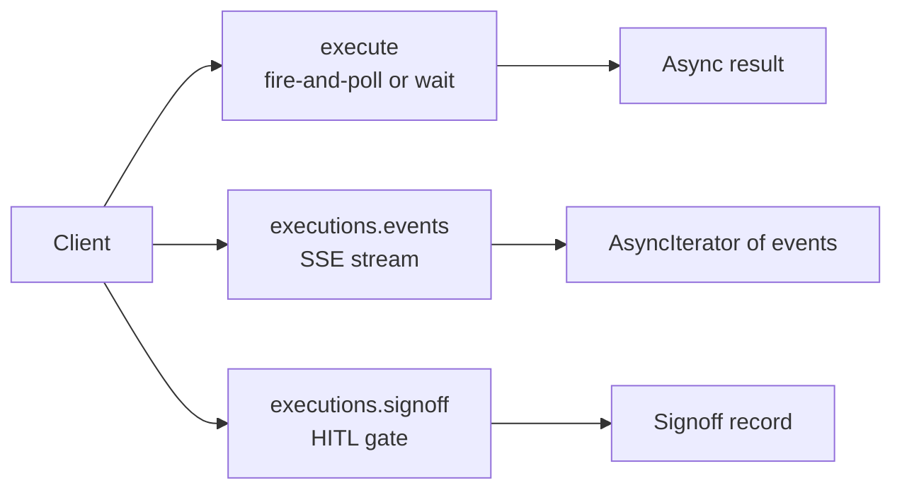

# SDK overview

> Three SDKs (Python, TypeScript, Java) all wrap the same REST surface. Same execution model, same error envelope, same streaming format. Pick whichever language your app speaks.

---

## Why three SDKs

The platform's clients are heterogeneous:
- **Standalone vertical apps** (Wingman, E&C-Copilot) — Python backends.
- **Customer integrations** — usually TypeScript or Java.
- **CI / scripts** — Python or shell.
- **Mobile/desktop apps** — TypeScript (via the JS SDK).

Maintaining three SDKs is annoying but worth it: developers don't have to write HTTP/SSE boilerplate, and the SDK enforces the correct way to do common things (actAs, retries, error handling).

The Python SDK is the reference implementation. TS + Java mirror its surface.

---

## The mental model

Three primary operations, mirrored across all three SDKs:



### `execute(slug, input, wait=…)`
The big one. Submits an execution and either returns immediately, streams, or waits for terminal.

| `wait` value | Returns |
|---|---|
| `"submitted"` (default) | `Execution` with `status='running'`, `execution_id` |
| `"stream"` | `AsyncIterator[ExecEvent]` — caller consumes events |
| `"complete"` | `Execution` with terminal status (blocks up to 5min) |
| `"approval_or_complete"` | Whichever lands first. if waiting_approval, includes `approval_ref` |

### `executions.events(execution_id)`
Subscribes to the SSE event stream of an existing execution. Useful when execution was kicked off by a different process (webhook, scheduler, etc.).

### `executions.signoff(approval_id, decision, reason)`
Records an approval signoff. Used by HITL workflow apps.

There are smaller surfaces for agents CRUD, knowledge-base upload, ML model invocation, file upload, audit-log search, etc. but the above three are 80% of usage.

---

## The actAs pattern

The single most important SDK feature. Lets a service-account client speak **on behalf of** an end user inside the platform's RBAC + audit.

```python
from abenix_sdk import Abenix, ActingSubject

client = Abenix(api_url, api_key=service_account_key)

trader = ActingSubject(
    subject_type="wingman",
    subject_id="trader-42",
    email="alice@yourcorp.com",
    display_name="Alice — Crude Desk",
)

# All actions in this block are attributed to trader-42
result = await client.with_subject(trader).execute(
    "wingman-mispricing-extractor",
    {"corridor": "USGC-NWE"},
)
```

The SDK sets `X-Abenix-Subject: wingman:trader-42` on every request. The platform's audit log, sharing checks, and notifications all use that subject string.

### Why this matters
Without actAs, the wingman service would show up in audit as "wingman service did X" — opaque to compliance. With actAs, every action carries the end-user identity even though the wire-level auth is the service's API key.

See [01-architecture/01-tenants-rbac](../01-architecture/01-tenants-rbac.md#the-actas-delegated-subject-pattern) for the platform side.

---

## HITL-aware `execute`

When an agent might pause on an approval gate, use the `approval_or_complete` wait mode:

```python
result = await client.execute(
    "contract-execute-flow",
    {"counterparty_id": cp.id, "amount_usd": 2_400_000},
    wait="approval_or_complete",
)

if result.status == "waiting_approval":
    print(f"Pending: {result.approval_ref.id}")
    print(f"Payload: {result.approval_ref.payload}")
    # ... go do something else, the user gets a notification ...
    # later, after signoffs land:
    final = await client.executions.wait(result.execution_id, until="terminal")
    print(final.output)
elif result.status == "completed":
    print(result.output)
else:
    print(f"Failed: {result.failure_code}")
```

The TS and Java SDKs have the same surface.

---

## Error envelope

All SDKs raise a single exception class on non-2xx, populated from the platform's structured error envelope:

```python
try:
    result = await client.execute(...)
except AbenixError as e:
    print(e.message)        # human message
    print(e.code)           # HTTP status (int)
    print(e.error_code)     # stable string code, e.g. "INVALID_REPLICAS"
    print(e.details)        # dict with extra context
    print(e.request_id)     # X-Request-ID for support
```

`error_code` is the field to branch on. Some common codes:

| `error_code` | Meaning |
|---|---|
| `VALIDATION_ERROR` | Request body failed schema validation |
| `NOT_FOUND` | Resource doesn't exist or no permission |
| `RATE_LIMITED` | Tenant rate limit hit. `Retry-After` header set |
| `SESSION_EXPIRED` | JWT expired (browser SDK only — auto-refreshes) |
| `INVALID_REPLICAS` / `INVALID_RESOURCE_PRESET` | ML model deploy validation |
| `APPROVAL_REQUIRED` | Tool call was gated. check `details.approval_id` |
| `TENANT_QUOTA_EXCEEDED` | Hit a per-tenant cap (executions/day, etc.) |

---

## Retries + idempotency

The SDKs auto-retry on:
- 429 (with `Retry-After` honored) — up to 3 retries with exp backoff
- 502 / 503 / 504 — up to 3 retries
- Network errors — up to 3 retries

**They do NOT auto-retry on 4xx** (except 429) — those are caller errors and retrying won't fix them.

For idempotency on retries, pass `client_token` on mutating calls. The server returns the same response for the same token (within 24h).

```python
result = await client.execute(
    "...",
    input_data,
    client_token=f"trade-{trade_id}",  # stable across retries
)
```

---

## Tracing propagation

The SDKs read OpenTelemetry trace context from the current `Span` and propagate it via the W3C `traceparent` header. That means:

- If your caller is already instrumented, the platform-side execution joins the same trace.
- The platform emits sub-spans that are children of your span.
- In Grafana Explore (or your own Tempo / Jaeger backend) you see one connected trace from your service through the platform through the agent loop through the LLM call.

No setup required if you've set up OTel on your service. The SDK does it automatically.

---

## Language-specific docs

- [01-python](01-python.md) — install, sync vs async, sample app
- [02-typescript](02-typescript.md) — install, fetch vs node-fetch, React hook integration
- [03-java](03-java.md) — install, blocking vs CompletableFuture, Spring integration

The wire format and behaviour are identical across languages — these docs cover only language-specific idioms.

---

## Picking a wait mode

| Scenario | Use |
|---|---|
| "Just run it and tell me the answer." | `wait="complete"` — but timeout is 5min. |
| "Run it. show the user updates in the UI." | `wait="stream"`, render each event. |
| "Long-running batch — fire and check on a job board." | `wait="submitted"` (default), poll `/executions/{id}` later. |
| "Compliance flow that might pause." | `wait="approval_or_complete"`. |

> **Trap** — never use `wait="complete"` inside a webhook handler. Webhook providers (Slack, Stripe, GitHub) timeout at 3-10s. the platform takes 2-30s on average. Always submit + return 200, then process async.

---

## See also

- [01-python](01-python.md) — Python SDK reference
- [02-typescript](02-typescript.md) — TS/JS SDK reference
- [03-java](03-java.md) — Java SDK reference
- [01-architecture/01-tenants-rbac](../01-architecture/01-tenants-rbac.md) — actAs on the server side
- [02-runtime/05-approvals-hitl](../02-runtime/05-approvals-hitl.md) — what happens when the agent pauses

---

## Source map

| What | Where |
|---|---|
| **Canonical Python SDK source** | [`packages/sdk/python/abenix_sdk/`](../../packages/sdk/python/abenix_sdk/) — copied into every standalone app's `api/sdk/` |
| **SDK sync verifier** | [`scripts/sync-sdks.sh`](../../scripts/sync-sdks.sh) — CI gate that every copy matches canonical |
| **Python SDK packaging** | [`packages/agent-sdk/`](../../packages/agent-sdk/) — the published distribution |
| **TypeScript SDK** | [`packages/sdk/typescript/`](../../packages/sdk/) (or `packages/abenix-sdk/`) |
| **Java SDK** | [`packages/sdk/java/`](../../packages/sdk/) |
| **REST surface the SDKs wrap** | [`09-reference/00-rest-api`](../09-reference/00-rest-api.md) |
| **Error envelope** | [`apps/api/app/core/responses.py`](../../apps/api/app/core/responses.py) — `success()` / `error()` |
| **OTel `traceparent` injection** | [`packages/agent-sdk/abenix_sdk/tracing.py`](../../packages/agent-sdk/abenix_sdk/) |
