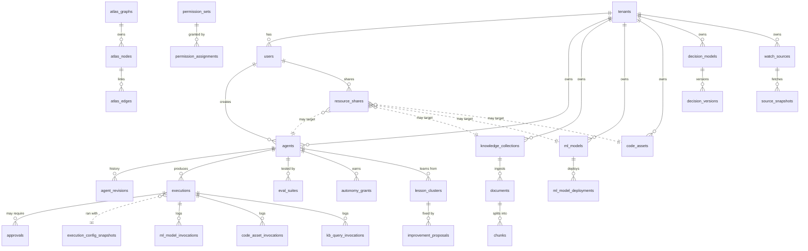

# Data model overview

> 119 platform tables in one Postgres database. 117 are SQLAlchemy models under [`packages/db/models/`](../../packages/db/models/), two more have no model (`chunks` and `model_availability_events`). This page covers the conventions, how tables get created, the top-level ERD and a list of every table.

---

## Conventions

1. **`id UUID PRIMARY KEY`**, mostly from `UUIDMixin`. The exceptions are `event_outbox` and `decision_evaluations` (autoincrement bigint, the evaluation also carries a unique `public_id` uuid), `execution_config_snapshots` (keyed by `config_hash`), `platform_settings` (`key`), `tenant_tool_credentials` (`tenant_id` + `key`), `cognify_configs` (`tenant_id`), `retention_policies` (`tenant_id` + `source_table`), `tool_runtime_config` (`slug`) and `model_availability` (`model`).
2. **`tenant_id`** from `TenantMixin`, a foreign key to `tenants.id`, indexed. Top-level tables carry it. Child tables such as `agent_revisions`, `documents`, `messages` and `atlas_nodes` reach the tenant through their parent. A few tables declare `tenant_id` by hand without the foreign key, for example `event_outbox` and `decision_evaluations`. `kill_switches.tenant_id` is nullable on purpose, NULL means every tenant. `tool_runtime_config`, `platform_settings`, `llm_model_pricing` and `model_availability` are platform-wide.
3. **`created_at` / `updated_at`** from `TimestampMixin`, both `TIMESTAMPTZ` with `server_default now()`. Not every table uses the mixin. Append-only tables such as `activity_logs`, `executions` and `eval_results` carry only `created_at`.
4. **JSONB for flexible fields.** `model_config` (mapped as `model_config_`), `payload`, `provenance`, `details`, `assertions`, `content`. Shape is validated at the API, not by the database.
5. **Soft references.** Many foreign keys are nullable with `ON DELETE SET NULL`, so history survives a deleted user or agent. Child rows that mean nothing alone (`decision_versions`, `eval_cases`, `source_snapshots`) use `ON DELETE CASCADE`.
6. **Immutability by trigger, not convention.** `activity_logs` refuses updates and deletes except the one write that links a row into the audit chain, and a session that sets `abenix.audit_maintenance = on`. `source_snapshots` refuses all updates. See [05-governance-decisions](05-governance-decisions.md) and [06-evals-sources-events](06-evals-sources-events.md).

---

## How a table comes to exist

There are three paths, and a table can be touched by more than one.

| Path | What it covers |
|---|---|
| Alembic migrations in [`packages/db/alembic/versions/`](../../packages/db/alembic/versions/) | 69 revision files. `scripts/deploy-azure.sh` runs `alembic upgrade heads`. [`scripts/verify-alembic-graph.sh`](../../scripts/verify-alembic-graph.sh) checks the graph |
| `Base.metadata.create_all` in the API startup hook ([`apps/api/app/main.py`](../../apps/api/app/main.py)) | Any model with no migration. About a third of the tables, for example `agent_triggers`, `activity_logs`, `tool_invocations`, `webhooks` |
| Raw SQL in the same startup hook | Idempotent `ALTER TABLE ... ADD COLUMN IF NOT EXISTS` statements for the agent scaling columns, `daily_budget_usd`, the per-provider cost columns and `executions.trace_id`, plus `CREATE TABLE IF NOT EXISTS platform_settings`. One pod runs them, under advisory lock `776601`. The `chunks` pgvector store is created after that in its own transaction |

Because `create_all` can build a new table before its migration runs, the migrations from 2.5 on check `has_table` and existing columns before every step.

---

## High-level ERD

Dotted lines have no foreign key. A share points at its target through `resource_shares.resource_type` + `resource_id`, and a run names its snapshot in `executions.provenance->>'config_hash'`. A pipeline is an `agents` row whose `model_config.mode` is `pipeline`, so it has no table of its own. Approval sign-offs are a JSONB array on `approvals`, not a child table.

---

## Every table

Grouped by area. The source column is the model file under `packages/db/models/`. The page column says where the table is covered in detail.

### Tenancy, users, access

| Table | Source | What it holds | Page |
|---|---|---|---|
| `tenants` | `tenant.py` | One row per organisation. Plan, settings, cost limits, encrypted `slack_webhook_url` (TEXT since `a3c4d5e6f7a8`) | this page |
| `users` | `user.py` | One row per user. Role, SSO `auth_provider` / `external_id`, token and cost quotas, voice clone consent | this page |
| `workspaces` | `workspace.py` | Sub-tenant grouping with `is_default` | this page |
| `team_invites` | `team_invite.py` | Pending invites with token, role and expiry | this page |
| `api_keys` | `api_key.py` | Hashed keys with prefix, scopes, monthly token and cost caps | this page |
| `subject_policies` | `subject_policy.py` | Rules for an acting subject under one API key, used by actAs | this page |
| `resource_shares` | `resource_share.py` | Polymorphic per-user share with `VIEW` / `EXECUTE` / `EDIT` | [04](04-resource-shares.md) |
| `agent_shares` | `agent_share.py` | Older agent-only share table. The agent share routes now write `resource_shares` | [04](04-resource-shares.md#the-older-agent_shares-table) |
| `permission_sets` | `governance.py` | Named bundle of capability keys | [05](05-governance-decisions.md) |
| `permission_assignments` | `governance.py` | Which user holds which permission set | [05](05-governance-decisions.md) |
| `activity_logs` | `activity_log.py` | Append-only audit log, hash-chained per tenant | [05](05-governance-decisions.md) |
| `notifications` | `notification.py` | In-app notifications per user | this page |

### Agents and pipelines

| Table | Source | What it holds | Page |
|---|---|---|---|
| `agents` | `agent.py` | Agent and pipeline definitions | [01](01-agents.md) |
| `agent_revisions` | `agent_revision.py` | One row per change with previous and new state | [01](01-agents.md) |
| `agent_comments` | `agent_comment.py` | Threaded comments, optionally pinned to a revision | [01](01-agents.md) |
| `agent_favorites` | `agent_favorite.py` | Starred agents grouped into named collections | [01](01-agents.md) |
| `agent_triggers` | `agent_trigger.py` | Webhook and cron triggers for an agent or pipeline | [01](01-agents.md) |
| `agent_memories` | `agent_memory.py` | Key/value memory per agent with importance and expiry | [03](03-knowledge.md) |
| `pipeline_states` | `pipeline_state.py` | Key/value store that survives across runs of one pipeline | [01](01-agents.md) |
| `pipeline_run_diffs` | `pipeline_healing.py` | Shape and sample of a failed pipeline node | [02](02-executions.md) |
| `pipeline_patch_proposals` | `pipeline_healing.py` | Drafted JSON Patch against a pipeline, with compare-and-swap columns | [02](02-executions.md) |
| `batch_jobs` | `batch_job.py` | Batch execute requests with per-input results | [02](02-executions.md) |
| `reviews` | `marketplace.py` | Marketplace ratings | [01](01-agents.md) |
| `subscriptions` | `marketplace.py` | Marketplace subscriptions with Stripe ids | this page |
| `payouts` | `payout.py` | Stripe Connect transfers to agent creators | this page |

### Runs

| Table | Source | What it holds | Page |
|---|---|---|---|
| `executions` | `execution.py` | One row per agent or pipeline run, with provenance | [02](02-executions.md) |
| `execution_config_snapshots` | `governance.py` | Prompt and model config a run used, keyed by hash | [02](02-executions.md) |
| `execution_idempotency` | `idempotency.py` | Cached execute response per `Idempotency-Key` | [02](02-executions.md) |
| `dead_letter_executions` | `dead_letter.py` | One row per failed run parked for replay, linked to the replay | [02](02-executions.md) |
| `drift_alerts` | `drift_alert.py` | Drift detector alerts per agent | [02](02-executions.md) |
| `tool_invocations` | `tool_invocation.py` | Direct tool execute calls from SDK or REST | [02](02-executions.md) |
| `ml_model_invocations` | `ml_model_invocation.py` | Predictions against a deployed model | [02](02-executions.md) |
| `code_asset_invocations` | `code_asset_invocation.py` | Code asset runs with stdout, stderr, exit code | [02](02-executions.md) |
| `kb_query_invocations` | `kb_query_invocation.py` | Knowledge searches with retrieval mode and hit count | [02](02-executions.md) |
| `approvals` | `approval.py` | Human approval gates with sign-offs, policy, escalation | [05](05-governance-decisions.md) |
| `conversations` | `conversation.py` | Chat threads scoped by app and subject | this page |
| `messages` | `conversation.py` | Chat messages with blocks, tool calls, tokens, cost | this page |
| `usage_records` | `usage.py` | Metered usage per user and agent per period | this page |

### Governance and decisions

| Table | Source | What it holds | Page |
|---|---|---|---|
| `risk_policies` | `governance.py` | One row per tenant and tier overriding the default tier policy | [05](05-governance-decisions.md) |
| `kill_switches` | `governance.py` | Active and cleared stops by scope and target | [05](05-governance-decisions.md) |
| `decision_models` | `decision.py` | A named decision with key, risk tier, log mode | [05](05-governance-decisions.md) |
| `decision_versions` | `decision.py` | Versioned, bitemporal rule content and its lifecycle state | [05](05-governance-decisions.md) |
| `decision_tests` | `decision.py` | Golden cases for a decision | [05](05-governance-decisions.md) |
| `reference_sets` | `decision.py` | Named value lists used by rules | [05](05-governance-decisions.md) |
| `reference_set_versions` | `decision.py` | Every past version of a reference set | [05](05-governance-decisions.md) |
| `decision_evaluations` | `decision.py` | Persisted, reproducible evaluations | [05](05-governance-decisions.md) |
| `moderation_policies` | `moderation_policy.py` | Per-tenant moderation rules and thresholds, `fail_closed` flag, hold timeout | [moderation gate](../02-runtime/13-moderation-gate.md#the-policy) |
| `moderation_events` | `moderation_policy.py` | One row per moderation verdict, content stored as SHA-256 plus preview | [moderation gate](../02-runtime/13-moderation-gate.md#what-we-keep-and-for-how-long) |
| `moderation_reviews` | `moderation_policy.py` | Content a hold policy stopped, waiting for or carrying a reviewer's decision | [moderation gate](../02-runtime/13-moderation-gate.md#hold-for-review) |

### Earned autonomy

| Table | Source | What it holds | Page |
|---|---|---|---|
| `action_types` | `autonomy.py` | A kind of action: tool, argument match, world model, outcome probe, limits key, ladder policy | [08](08-autonomy.md) |
| `autonomy_grants` | `autonomy.py` | One agent's level (0 to 4) for one action type, with scope, ceiling and state | [08](08-autonomy.md) |
| `autonomy_changes` | `autonomy.py` | Append-only level history with the evidence at the time | [08](08-autonomy.md) |
| `agent_actions` | `autonomy.py` | The action ledger. Every effect call or SDK proposal, its prediction, decision, outcome and score | [08](08-autonomy.md) |

### Self-improvement

| Table | Source | What it holds | Page |
|---|---|---|---|
| `feedback` | `improvement.py` | Thumbs up or down on a run or chat message, with an optional correction | [09](09-self-improvement.md) |
| `lessons` | `improvement.py` | One captured signal, such as a thumbs down, a failed run, drift or a failed eval case | [09](09-self-improvement.md) |
| `lesson_clusters` | `improvement.py` | Lessons grouped per agent, with severity, trend and state | [09](09-self-improvement.md) |
| `improvement_proposals` | `improvement.py` | One drafted change per group, with its proof, approval and watch period | [09](09-self-improvement.md) |

### Evals, sources, events

| Table | Source | What it holds | Page |
|---|---|---|---|
| `eval_suites` | `evals.py` | A suite of cases against one agent or pipeline | [06](06-evals-sources-events.md) |
| `eval_cases` | `evals.py` | Input, context and assertions for one case | [06](06-evals-sources-events.md) |
| `eval_runs` | `evals.py` | One scored run of a suite against a config hash | [06](06-evals-sources-events.md) |
| `eval_results` | `evals.py` | Per-case outcome inside a run | [06](06-evals-sources-events.md) |
| `watch_sources` | `source_watch.py` | A monitored URL with cadence, selector, credentials key | [06](06-evals-sources-events.md) |
| `source_snapshots` | `source_watch.py` | Immutable fetched content and normalised text | [06](06-evals-sources-events.md) |
| `source_changes` | `source_watch.py` | Diff between two snapshots | [06](06-evals-sources-events.md) |
| `event_outbox` | `governance.py` | Transactional outbox of platform events | [06](06-evals-sources-events.md) |
| `webhooks` | `webhook.py` | Event subscriptions with target, filter, auto-disable state | [06](06-evals-sources-events.md) |
| `webhook_deliveries` | `webhook_delivery.py` | One delivery per event and subscription, with retry state | [06](06-evals-sources-events.md) |

### Tools, code, models, integrations

| Table | Source | What it holds | Page |
|---|---|---|---|
| `tenant_tool_credentials` | `tenant_tool_credential.py` | Per-tenant tool credential, beats the platform value | [07](07-tools-and-operations.md) |
| `platform_settings` | `platform_settings.py` | Admin key/value settings, including `tool.credential.<KEY>` rows | [07](07-tools-and-operations.md) |
| `tool_runtime_config` | `tool_runtime_config.py` | Per-tool pool, rate limits, cache, circuit breaker | [07](07-tools-and-operations.md) |
| `tool_presets` | `tool_preset.py` | Labelled tool plus default arguments per tenant | [07](07-tools-and-operations.md) |
| `saved_tools` | `saved_tool.py` | AI-generated custom tools with approval status | [07](07-tools-and-operations.md) |
| `code_assets` | `code_asset.py` | Uploaded repo or zip, analysis, version and version history | [07](07-tools-and-operations.md) |
| `ml_models` | `ml_model.py` | Model registry | [07](07-tools-and-operations.md) |
| `ml_model_deployments` | `ml_model.py` | In-process or Kubernetes deployment of a model | [07](07-tools-and-operations.md) |
| `connectors` | `connector.py` | External system connectors with secret reference | [07](07-tools-and-operations.md) |
| `user_mcp_connections` | `mcp_connection.py` | A user's MCP server with auth and OAuth2 token columns | [07](07-tools-and-operations.md) |
| `agent_mcp_tools` | `mcp_connection.py` | MCP tools attached to an agent, with orphan flag | [07](07-tools-and-operations.md) |
| `mcp_registry_cache` | `mcp_connection.py` | Cached public MCP registry entries | [07](07-tools-and-operations.md) |
| `edge_gateways` | `edge_gateway.py` | Remote edge runtime pods and their deployed agents | [07](07-tools-and-operations.md) |
| `llm_model_pricing` | `llm_pricing.py` | Per-model price, capabilities, fallback chain, deprecation | [07](07-tools-and-operations.md) |
| `model_availability` | `llm_pricing.py` | Health status per model | [07](07-tools-and-operations.md) |
| `model_availability_events` | migration `a8b9c0d1e2f3` only | Status transitions per model, written with raw SQL, no ORM model | [07](07-tools-and-operations.md) |
| `portfolio_schemas` | `portfolio_schema.py` | Dynamic record schemas for the portfolio tool | [07](07-tools-and-operations.md) |
| `pf_<tenant>_<domain>` | none, made at runtime | Rows imported from a spreadsheet for one portfolio schema, scoped by `owner_id` | [07](07-tools-and-operations.md) |
| `archive_runs` | `archive.py` | One archive or restore run per table and tenant | [07](07-tools-and-operations.md) |
| `retention_policies` | `archive.py` | Retention days per tenant and table | [07](07-tools-and-operations.md) |

### Knowledge, Atlas, memory, meetings

| Table | Source | What it holds | Page |
|---|---|---|---|
| `knowledge_projects` | `knowledge_project.py` | Governance container for collections | [03](03-knowledge.md) |
| `project_members` | `project_member.py` | Per-project role | [03](03-knowledge.md) |
| `knowledge_collections` | `knowledge_base.py` | A knowledge base (renamed from `knowledge_bases` in `r8s9t0u1v2w3`) | [03](03-knowledge.md) |
| `agent_collection_grants` | `collection_grant.py` | Which agents can read or write a collection | [03](03-knowledge.md) |
| `user_collection_grants` | `collection_grant.py` | Which users can read or write a collection | [03](03-knowledge.md) |
| `documents` | `knowledge_base.py` | Uploaded documents with version chain | [03](03-knowledge.md) |
| `chunks` | raw SQL in `main.py` startup | pgvector chunk store, `embedding vector(1536)` | [03](03-knowledge.md) |
| `document_grants` | `document_grant.py` | Per-document ACL | [03](03-knowledge.md) |
| `cognify_jobs` | `knowledge_engine.py` | Graph extraction jobs | [03](03-knowledge.md) |
| `cognify_reports` | `knowledge_engine.py` | Per-job summary | [03](03-knowledge.md) |
| `cognify_configs` | `cognify_config.py` | Per-tenant Cognify settings | [03](03-knowledge.md) |
| `cognify_conflicts` | `cognify_config.py` | Disagreements between two source documents | [03](03-knowledge.md) |
| `graph_entities` | `knowledge_engine.py` | Extracted entities per collection | [03](03-knowledge.md) |
| `graph_relationships` | `knowledge_engine.py` | Extracted relationships per collection | [03](03-knowledge.md) |
| `retrieval_feedback` | `knowledge_engine.py` | Ratings on search results | [03](03-knowledge.md) |
| `retrieval_metrics` | `knowledge_engine.py` | Rolled-up retrieval stats per period | [03](03-knowledge.md) |
| `memify_logs` | `knowledge_engine.py` | Graph pruning and strengthening passes | [03](03-knowledge.md) |
| `ontology_schemas` | `ontology_schema.py` | Versioned entity and relationship types per project | [03](03-knowledge.md) |
| `atlas_graphs` | `atlas.py` | Atlas canvases | [03](03-knowledge.md) |
| `atlas_nodes` | `atlas.py` | Bi-temporal nodes | [03](03-knowledge.md) |
| `atlas_edges` | `atlas.py` | Bi-temporal edges | [03](03-knowledge.md) |
| `atlas_snapshots` | `atlas.py` | Point-in-time copies for the time slider | [03](03-knowledge.md) |
| `persona_items` | `meeting.py` | Persona-scoped data, soft delete and encryption columns | [03](03-knowledge.md) |
| `persona_chunks` | `persona_chunk.py` | Embedded chunks of persona items, searched only by their owner | [03](03-knowledge.md) |
| `gdpr_purge_log` | `gdpr_purge_log.py` | One row per store per erasure attempt | [03](03-knowledge.md) |
| `meetings` | `meeting.py` | Meeting sessions an agent joins | this page |
| `meeting_deferrals` | `meeting.py` | Questions the meeting bot deferred to its user | this page |
| `memory_wings` / `memory_halls` / `memory_rooms` / `memory_drawers` | `memory_palace.py` | Hierarchical agent memory, wing to hall to room to verbatim drawer | [03](03-knowledge.md) |
| `memory_entities` / `memory_relations` | `memory_palace.py` | Agent memory graph with `valid_from` / `valid_to` on relations | [03](03-knowledge.md) |

### Tables owned by ContractIQ

Early migrations (`i9d0e1f2g3h4`, `j0e1f2g3h4i5` and the tenant backfills) create `contractiq_*` tables in the same database. They have no model under `packages/db/models/` and belong to the ContractIQ app. See [07-standalone-apps/02-contractiq](../07-standalone-apps/02-contractiq.md).

---

## Migrations from 2.5 on

```mermaid
flowchart LR
  E[e1f2a3b4c5d6] --> F[f2a3b4c5d6e7<br/>dlq replay link]
  F --> A[a3c4d5e6f7a8<br/>archive tenant scope]
  D[1100_d_dead_letter] --> P[1100_f_patch_cas]
  A --> M1[c5d6e7f8a9b0<br/>merge]
  P --> M1
  M1 --> T[d6e7f8a9b0c1<br/>tenant tool credentials]
  M1 --> S[e7f8a9b0c1d2<br/>archive storage key]
  M1 --> O[f8a9b0c1d2e3<br/>mcp tool orphaned]
  T --> M2[a9b0c1d2e3f4<br/>merge]
  S --> M2
  O --> M2
  M2 --> CV[b1c2d3e4f5a6<br/>code asset versions]
  CV --> G[c1d2e3f4a5b6<br/>governance core]
  G --> DS[30c306d107f4<br/>decision service]
  DS --> EO[fe18a43f0be1<br/>event outbox]
  EO --> AR[20a44346bdda<br/>approval returns]
  AR --> SW[25f2dd065d53<br/>source watch]
  SW --> EV[9465d37a97f1<br/>eval suites]
  EV --> GP[6f7e442a4250<br/>gdpr affected count]
  GP --> QL[09519dee709f<br/>queue lease]
  QL --> PC[p3rs0na0vec1<br/>persona chunks]
  PC --> AU[auton0my0001<br/>earned autonomy]
  AU --> TP[trig0prov01<br/>trigger provenance]
  TP --> MR[modrev00001<br/>moderation review]
  MR --> SI[selfimp0001<br/>self-improvement]
```

`selfimp0001` is the single head. An older merge, `z9y8x7w6v5u4`, joins the pre-2.0 branches.

| Revision | Adds |
|---|---|
| `f2a3b4c5d6e7_dlq_replay_link` | `dead_letter_executions.replay_execution_id`, unique index on `execution_id` after collapsing duplicates |
| `a3c4d5e6f7a8_archive_tenant_scope` | `tenant_id` on `archive_runs` and `retention_policies`, retention primary key becomes `(tenant_id, source_table)`, `tenants.slack_webhook_url` to TEXT |
| `1100_f_patch_cas` | `pipeline_patch_proposals.dsl_before_sha256` and `applied_snapshot` |
| `c5d6e7f8a9b0_merge_heads_2_5` | Merge only |
| `d6e7f8a9b0c1_tenant_tool_credentials` | `tenant_tool_credentials` table |
| `e7f8a9b0c1d2_archive_storage_key` | `archive_runs.storage_key`, `storage_backend`, `restored_at`, `restored_rows`, `restore_error` |
| `f8a9b0c1d2e3_mcp_tool_orphaned` | `agent_mcp_tools.is_orphaned` and `orphaned_at` |
| `a9b0c1d2e3f4_merge_heads_2_5_1` | Merge only |
| `b1c2d3e4f5a6_code_asset_versions` | `code_assets.version` and `version_history`. There is no separate versions table |
| `c1d2e3f4a5b6_governance_core` | `permission_sets`, `permission_assignments`, `risk_policies`, `kill_switches`, `execution_config_snapshots`, provenance columns and trigger on `executions`, hash chain columns and append-only trigger on `activity_logs` |
| `30c306d107f4_decision_service` | The six decision tables and `approvals.policy` |
| `fe18a43f0be1_event_outbox` | `event_outbox`, subscription columns on `webhooks`, delivery state on `webhook_deliveries`, the `executions_emit_event` trigger |
| `20a44346bdda_approval_returns_escalation` | `returned` value on the `approval_status` enum, `approvals.escalated_at` |
| `25f2dd065d53_source_watch` | `watch_sources`, `source_snapshots`, `source_changes`, the snapshot immutability trigger |
| `9465d37a97f1_eval_suites` | `eval_suites`, `eval_cases`, `eval_runs`, `eval_results` |
| `6f7e442a4250_gdpr_purge_affected_count` | `gdpr_purge_log.affected_count` |
| `09519dee709f_execution_queue_lease` | `executions.runner_id`, `lease_expires_at`, `delivery_attempts` |
| `p3rs0na0vec1_persona_chunks_pgvector` | `persona_chunks`, and `content`, `last_error`, `embedding_model` on `persona_items` |
| `auton0my0001_earned_autonomy` | `action_types`, `autonomy_grants`, `autonomy_changes`, `agent_actions` |
| `trig0prov01_execution_trigger_provenance` | `executions.trigger_id` (foreign key to `agent_triggers`, `ON DELETE SET NULL`), `trigger_kind`, `trigger_name` |
| `modrev00001_moderation_review_inbox` | `moderation_reviews`, the `hold` action and `held` outcome enum values, `moderation_policies.hold_timeout_minutes` and `hold_timeout_action` |
| `selfimp0001_governed_self_improvement` | `feedback`, `lessons`, `lesson_clusters`, `improvement_proposals`, `eval_cases.state` and `source_lesson_id`, `agent_revisions.source` and `proposal_id`, time indexes the lesson harvest reads |

---

## Where to dig next

- [01-agents](01-agents.md): agents, revisions, the `model_config` blob
- [02-executions](02-executions.md): executions, provenance, invocations, DLQ
- [03-knowledge](03-knowledge.md): collections, documents, Cognify, Atlas, memory
- [04-resource-shares](04-resource-shares.md): the polymorphic share table
- [05-governance-decisions](05-governance-decisions.md): capabilities, risk tiers, kill switches, audit chain, approvals, decisions
- [06-evals-sources-events](06-evals-sources-events.md): eval suites, Source Watch, the outbox and webhooks
- [07-tools-and-operations](07-tools-and-operations.md): tool credentials and config, code assets, MCP, models, archives
- [08-autonomy](08-autonomy.md): action types, grants, level history and the action ledger
- [09-self-improvement](09-self-improvement.md): feedback, lessons, lesson groups and improvement proposals
