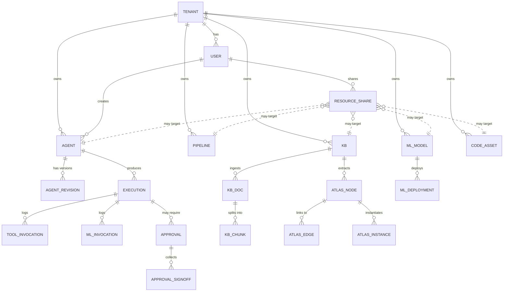

# Data model overview

> ~80 tables in one Postgres instance. This doc shows the top-level ERD and explains the conventions every table follows.

---

## Conventions every table follows

1. **`id UUID PRIMARY KEY`** — never an auto-increment int.
2. **`tenant_id UUID NOT NULL`** — every table that holds user data is tenant-scoped.
3. **`created_at TIMESTAMPTZ NOT NULL DEFAULT now()`** + **`updated_at TIMESTAMPTZ NOT NULL DEFAULT now()`** — automatic timestamps.
4. **Soft delete** via a `status` enum (`active`/`archived`/`deleted`) rather than `DELETE`. We rarely hard-delete. the archive job moves cold rows out instead.
5. **JSONB for flex fields** — `model_config_`, `payload`, `properties`, `metadata` are all JSONB. Schema validation happens at the API boundary.
6. **Soft references** — most FKs are nullable and use `ON DELETE SET NULL` rather than `CASCADE` (we want history to survive).

---

## High-level ERD

Polymorphic associations are dotted lines — `resource_share.resource_type` + `resource_id` rather than a hard FK.

---

## The "hot" tables (skim these source files)

| Table | Source | Notes |
|---|---|---|
| `tenants` | [models/tenant.py](../../packages/db/models/tenant.py) | One row per organisation |
| `users` | [models/user.py](../../packages/db/models/user.py) | One row per user-of-an-organisation |
| `api_keys` | [models/api_key.py](../../packages/db/models/api_key.py) | Long-lived tokens. one per app |
| `agents` | [models/agent.py](../../packages/db/models/agent.py) | The definition. `model_config_` is the JSONB everything else hangs off |
| `executions` | [models/execution.py](../../packages/db/models/execution.py) | Time-series (Timescale hypertable). The source of truth for any run |
| `tool_invocations` | [models/tool_invocation.py](../../packages/db/models/) | Per-tool-call audit row |
| `ml_models` | [models/ml_model.py](../../packages/db/models/ml_model.py) | Registry |
| `knowledge_bases` | [models/knowledge_base.py](../../packages/db/models/) | One row per KB. chunks are linked rows |
| `approvals` | [models/approval.py](../../packages/db/models/approval.py) | HITL gates |
| `resource_shares` | [models/resource_share.py](../../packages/db/models/resource_share.py) | The polymorphic sharing table |
| `audit_logs` | [models/audit_log.py](../../packages/db/models/) | Append-only. everything mutating writes here |

---

## Where to dig next

- [01-agents](01-agents.md) — agents, revisions, the model_config_ blob
- [02-executions](02-executions.md) — executions + tool_invocations + the time-series
- [03-knowledge](03-knowledge.md) — KB + Cognify + atlas graph
- [04-resource-shares](04-resource-shares.md) — the polymorphic table in detail
