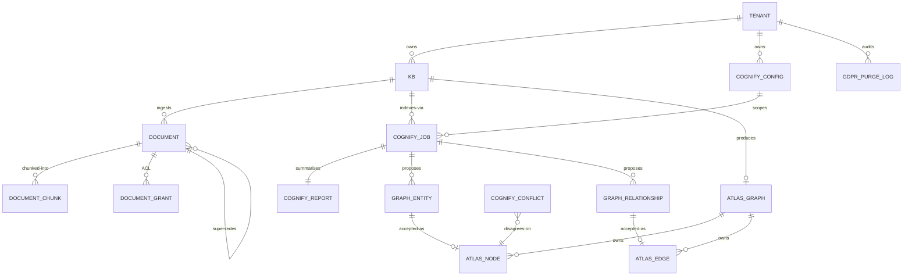
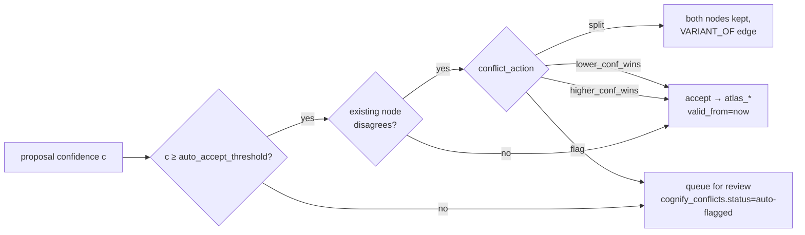

# Knowledge + Atlas + Cognify data model

The KB / Atlas / Cognify tables landed across two waves: a v1 set (knowledge bases, documents, chunks, atlas graphs/nodes/edges, cognify jobs/reports) and a v2.0 set (document ACL, versioning, cognify config / conflicts, bi-temporal Atlas, GDPR purge log, persona encryption). This page is the ERD reference.

## Tables at a glance



## Knowledge base + documents

| Table | Key columns | Notes |
|---|---|---|
| `knowledge_bases` | `id`, `tenant_id`, `name`, `embedding_model`, `pinecone_namespace`, `default_visibility` | `embedding_model` is read on every query — never assume OpenAI. Swap with [`/api/knowledge/{kb}/reembed`](../09-reference/00-rest-api.md#knowledge-v2) |
| `documents` | `id`, `kb_id`, `parent_document_id`, `version_number`, `is_current`, `superseded_by`, `cognified_at`, `last_cognify_job_id`, `extraction_method`, `extraction_quality` | v2.0 added the version + cognify + extractor columns. Search defaults to `is_current = true` |
| `document_chunks` | `id`, `document_id`, `text`, `page`, `chunk_index`, `char_offset_start`, `char_offset_end`, `embedding_vector_id` | `Citation` references these positions verbatim |
| `document_grants` *(v2.0)* | `document_id`, `subject_type` (`user` / `team` / `tenant`), `subject_id`, `permission`, `granted_at`, `granted_by` | Per-(subject, kb_id) Redis cache, 60s TTL. Invalidated on grant / revoke |

### Version chain in practice

```
documents
├─ doc-A v1 (is_current=false, superseded_by=doc-A-v2)
│     └─ chunks remain in Pinecone, returned only with include_superseded=true
└─ doc-A v2 (parent_document_id=doc-A-v1, is_current=true)
      ├─ Cognify next run includes this row (cognified_at IS NULL)
      └─ derived Atlas edges have valid_from=now, valid_to=NULL
```

The old version's Atlas edges get `valid_to = supersede_time` so they become historical facts queryable via `atlas_as_of`.

## Cognify

| Table | Key columns | Notes |
|---|---|---|
| `cognify_jobs` | `id`, `kb_id`, `mode` (`incremental`/`full`/`selective`), `document_ids`, `status`, `cost_usd_estimate`, `cost_usd_actual` | Default mode is `incremental` — only docs where `cognified_at IS NULL OR updated_at > cognified_at` |
| `cognify_reports` | `job_id`, `entities_by_type`, `top_entities`, `relationship_histogram`, `accepted_count`, `queued_for_review_count`, `conflict_count` | One per job |
| `graph_entities`, `graph_relationships` | `job_id`, `status` (`proposed` / `accepted` / `rejected`), `confidence`, `target_node_id` | Auto-accept above `cognify_configs.auto_accept_threshold` |
| `cognify_configs` *(v2.0)* | `tenant_id`, `auto_accept_threshold`, `conflict_action`, `max_parallel_docs`, `daily_budget_usd`, `is_default` | One row per tenant, surfaced at `/settings/cognify` |
| `cognify_conflicts` *(v2.0)* | `id`, `entity_id`, `property`, `source_a`, `source_b`, `status` (`open`/`resolved`/`split`/`auto-flagged`) | Triggered when an accepted proposal disagrees with an existing node |

### Auto-accept gate decision



## Atlas (bi-temporal)

| Table | Key columns | Notes |
|---|---|---|
| `atlas_graphs` | `id`, `tenant_id`, `kb_id`, `ontology_schema_id` | One per tenant-owned graph |
| `atlas_nodes` | `id`, `graph_id`, `node_type`, `properties`, `valid_from`, `valid_to`, `recorded_at`, `source_anchors` | Postgres is the audit and ACL surface, while Neo4j holds the actual graph properties |
| `atlas_edges` | `id`, `graph_id`, `from_node_id`, `to_node_id`, `edge_type`, `valid_from`, `valid_to`, `recorded_at`, `source_anchors` | Same bi-temporal columns as nodes |
| `ontology_schemas` | `id`, `name`, `entity_types`, `relationship_types`, `is_starter` | Five starters ship: FIBO Core, FIX Protocol, EMIR, ISDA, ETRM EOD |

### Bi-temporal columns

- `valid_from` — when the fact became true in the world (defaults to `recorded_at`)
- `valid_to` — when it stopped being true. `NULL` = still current
- `recorded_at` — when we learned the fact (defaults to `now()`)
- `source_anchors` — JSONB array of `{document_id, page, chunk_id, confidence}` per supporting citation. Built up across multiple Cognify runs as evidence accumulates

The default Cypher templates use `WHERE r.valid_to IS NULL` so routine traversal returns only the current state. `atlas_as_of(as_of=<ts>)` rewrites this to `r.valid_from <= ts AND (r.valid_to IS NULL OR r.valid_to > ts)` for snapshot queries.

## GDPR + persona encryption

| Table | Key columns | Notes |
|---|---|---|
| `persona_items` | `id`, `user_id`, `kb_id`, `persona_scope`, `kind`, `pinecone_ids`, `deleted_at`, `deleted_by`, `encrypted`, `key_version` | v2.0 added the soft-delete + encryption columns |
| `agent_memories` | `id`, `agent_id`, `user_id`, `key`, `value`, `deleted_at`, `deleted_by` | v2.0 added the soft-delete columns |
| `gdpr_purge_log` *(v2.0)* | `id`, `purge_request_id`, `user_id`, `store` (`postgres`/`pinecone`/`neo4j`/`blob`/`trajectory`), `result`, `attempt_at`, `details_jsonb` | One row per (store × attempt). Surfaced via `GET /api/gdpr/users/{id}/receipts` |

Encryption uses a per-tenant DEK derived as `HMAC-SHA256(KEK, tenant_id)`. `key_version` lets us rotate without rewriting old rows (versioned ciphertext).

## Source map

| Code | File |
|---|---|
| SQLAlchemy models | [`atlas.py`](../../packages/db/models/atlas.py), [`knowledge_base.py`](../../packages/db/models/knowledge_base.py), [`cognify_config.py`](../../packages/db/models/cognify_config.py), [`document_grant.py`](../../packages/db/models/document_grant.py), [`gdpr_purge_log.py`](../../packages/db/models/gdpr_purge_log.py), [`meeting.py`](../../packages/db/models/meeting.py) |
| Migration (v2.0) | [`b8c9d0e1f2g3_v2_knowledge_atlas_persona.py`](../../packages/db/alembic/versions/b8c9d0e1f2g3_v2_knowledge_atlas_persona.py) — backwards-compatible, with every new column nullable or server-defaulted |
| Services | [`document_access.py`](../../apps/api/app/services/document_access.py), [`gdpr_purge.py`](../../apps/api/app/services/gdpr_purge.py), [`reranker.py`](../../apps/api/app/services/reranker.py), [`crypto.py`](../../apps/api/app/core/crypto.py), [`extractors/`](../../apps/api/app/services/extractors/) |
| Routers | [`knowledge_v2.py`](../../apps/api/app/routers/knowledge_v2.py), [`document_grants.py`](../../apps/api/app/routers/document_grants.py), [`gdpr.py`](../../apps/api/app/routers/gdpr.py) |
| Workers | [`kb_reembed.py`](../../apps/worker/worker/tasks/kb_reembed.py), [`pinecone_vacuum.py`](../../apps/worker/worker/tasks/pinecone_vacuum.py) |

## Related

- [`01-architecture/06-atlas-knowledge-engine.md`](../01-architecture/06-atlas-knowledge-engine.md) — narrative + diagrams
- [`02-runtime/02-tools.md`](../02-runtime/02-tools.md#atlas-tool-cookbook) — how agents query this data
- [`02-runtime/15-v2-knowledge-enterprise.md`](../02-runtime/15-v2-knowledge-enterprise.md) — full v2.0 feature reference (16 capabilities)
- [`document-versioning.md`](../document-versioning.md) — replace lifecycle in depth
