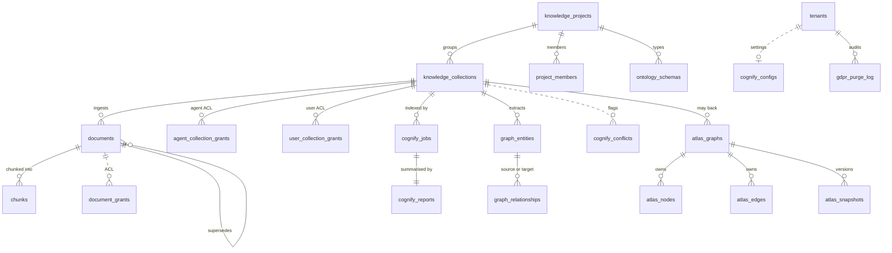

# Knowledge, Atlas and Cognify

Tables for knowledge collections, documents, Cognify graph extraction, Atlas canvases, agent memory and persona data. They landed in three waves: KB v2 (projects, collections, grants, ontology schemas, the pgvector `chunks` store), the Atlas canvas, and v2.0 (document ACL, versioning, Cognify config and conflicts, bi-temporal Atlas columns, GDPR purge log, persona encryption).

## Tables at a glance



Dotted lines have no foreign key in the model.

## Projects, collections, documents

| Table | Key columns | Notes |
|---|---|---|
| `knowledge_projects` | `id`, `tenant_id`, `name`, `slug`, `description`, `ontology_schema_id`, `created_by` | `slug` is unique per tenant (`uq_kproj_tenant_slug`) and is what integrations bootstrap against |
| `project_members` | `project_id`, `user_id`, `role` (`VIEW` / `EDIT` / `ADMIN`), `granted_by`, `granted_at` | Per-project ACL, added by `q7r8s9t0u1v2`. Both foreign keys cascade on delete |
| `knowledge_collections` | `id`, `tenant_id`, `project_id`, `agent_id`, `created_by`, `name`, `description`, `embedding_model`, `chunk_size`, `chunk_overlap`, `vector_backend`, `default_visibility`, `status`, `doc_count`, `graph_enabled`, `entity_count`, `relationship_count`, `last_cognified_at` | The knowledge base table. Renamed from `knowledge_bases` by `r8s9t0u1v2w3`, the model class is still `KnowledgeBase`. `embedding_model` defaults to `text-embedding-3-small` and is read on every ingest and query. Allowed values are in [`embedding_models.py`](../../packages/db/embedding_models.py), changed through the re-embed job. `vector_backend` is `pinecone` (default) or `pgvector`. `default_visibility` is `private`, `project` or `tenant`. `status` is `processing`, `ready`, `failed` or `degraded`, the last added by `c9d0e1f2g3h4`. `chunk_size` and `chunk_overlap` default to 512 and 50 |
| `agent_collection_grants` | `agent_id`, `collection_id`, `permission` (`READ` / `WRITE` / `ADMIN`), `granted_by`, `granted_at` | Unique on `(agent_id, collection_id)` since `y5z6a7b8c9d0`. An agent can only search a collection it holds a grant on |
| `user_collection_grants` | `user_id`, `collection_id`, `permission`, `granted_by`, `granted_at`, `expires_at` | User-level ACL, unique per user and collection |
| `documents` | `id`, `kb_id`, `filename`, `file_type`, `file_size`, `status`, `error_message`, `storage_url`, `chunk_count`, `parent_document_id`, `version_number`, `is_current`, `superseded_by`, `cognified_at`, `last_cognify_job_id`, `extraction_method`, `extraction_quality` | No `tenant_id`, the collection carries it. v2.0 (`b8c9d0e1f2g3`) added the version, Cognify and extractor columns. Search defaults to `is_current = true` |
| `chunks` | `id`, `collection_id`, `document_id`, `chunk_index`, `content`, `metadata`, `embedding vector(1536)` | Raw SQL, created in the API startup hook with `CREATE EXTENSION IF NOT EXISTS vector`. Unique on `(document_id, chunk_index)`. The `p6q7r8s9t0u1` revision also defines it, but it sits on a head older databases never reached, so the startup hook is what makes it exist |
| `document_grants` *(v2.0)* | `document_id`, `tenant_id`, `subject_type`, `subject_id`, `permission` (`read` / `write` / `admin`), `granted_by`, `granted_at`, `expires_at` | Plain varchar columns, no foreign keys. A document with no live grant is open to everyone who can read the collection. The first grant restricts it to its grantees, tenant admins, the collection creator and holders of WRITE or ADMIN on the collection. The model enum also lists `team` and `role`, but the API accepts only `user` and `agent` subjects |

### Version chain in practice

`POST /api/knowledge/{kb_id}/documents/{doc_id}/replace` in `knowledge_v2.py` only accepts the current head. It inserts a new row and flips the old one.

```
documents
├─ doc-A v1 (is_current=false, superseded_by=doc-A-v2)
├─ doc-A v2 (parent_document_id=doc-A-v1, version_number=2, is_current=false, superseded_by=doc-A-v3)
└─ doc-A v3 (parent_document_id=doc-A-v1, version_number=3, is_current=true)
```

`parent_document_id` always points at the first version, not the previous one. A `document.replaced` row goes to `activity_logs`. Source Watch uses the same chain when a watched source feeds a collection.

## Cognify

| Table | Key columns | Notes |
|---|---|---|
| `cognify_jobs` | `id`, `tenant_id`, `kb_id`, `status`, `documents_processed`, `entities_extracted`, `entities_merged`, `relationships_extracted`, `tokens_used`, `cost_usd`, per-provider cost columns, `duration_seconds`, `error_message`, `config`, `started_at`, `completed_at` | `status` runs `pending`, `extracting`, `resolving`, `graphing`, `embedding`, then `complete` or `failed` |
| `cognify_reports` | `job_id`, `kb_id`, `entities_by_type`, `top_entities`, `relationship_types`, `new_entities`, `merged_entities`, `new_relationships`, `strengthened_relationships`, `chunks_analyzed` | One per job |
| `graph_entities` | `kb_id`, `canonical_name`, `entity_type`, `aliases`, `properties`, `source_doc_ids`, `neo4j_node_id`, `mention_count`, `confidence` | Postgres mirror of what was written to Neo4j |
| `graph_relationships` | `kb_id`, `source_entity_id`, `target_entity_id`, `relationship_type`, `source_doc_ids`, `neo4j_rel_id`, `weight`, `confidence` | Same, for edges |
| `cognify_configs` *(v2.0)* | `tenant_id` (primary key, no foreign key), `auto_accept_threshold` (default 0.85), `conflict_action` (`flag` / `split` / `lower_conf_wins` / `higher_conf_wins`), `max_parallel_docs` (default 8), `daily_budget_usd`, `updated_at` | One row per tenant, surfaced at `/settings/cognify` |
| `cognify_conflicts` *(v2.0)* | `tenant_id`, `knowledge_base_id`, `entity_canonical_name`, `property_name`, `source_a_doc_id` / `source_a_value` / `source_a_confidence`, the same three for `source_b`, `status` (default `open`), `resolved_value`, `resolved_by`, `resolved_at` | Two documents disagree on an entity's type. Written by Cognify when `conflict_action` is `flag`. Resolving with one of the two values sets `status = resolved` and writes the type to the graph |
| `retrieval_feedback` | `kb_id`, `execution_id`, `query`, `search_mode`, `result_entity_ids`, `result_chunk_ids`, `rating`, `latency_ms` | User ratings on search results |
| `retrieval_metrics` | `kb_id`, `agent_id`, `period_start`, `period_end`, `search_mode`, `query_count`, `avg_rating`, `p95_latency_ms`, `graph_hops_used` | Rolled up per period |
| `memify_logs` | `kb_id`, `trigger`, `nodes_pruned`, `edges_pruned`, `edges_strengthened`, `edges_weakened`, `facts_derived`, `entities_merged` | One row per graph maintenance pass |

## Atlas (bi-temporal)

| Table | Key columns | Notes |
|---|---|---|
| `atlas_graphs` | `id`, `tenant_id`, `owner_user_id`, `name`, `kb_id`, `version`, `node_count`, `edge_count`, `settings` | One canvas. `kb_id` is optional |
| `atlas_nodes` | `id`, `graph_id`, `label`, `kind` (`concept` / `instance` / `document` / `property`), `properties`, `position_x`, `position_y`, `document_id`, `confidence`, `valid_from`, `valid_to`, `recorded_at`, `source_anchors` | Postgres is the audit and ACL surface, Neo4j holds the traversable graph |
| `atlas_edges` | `id`, `graph_id`, `from_node_id`, `to_node_id`, `label`, `cardinality_from`, `cardinality_to`, `inverse_edge_id`, `is_directed`, `valid_from`, `valid_to`, `recorded_at`, `source_anchors` | Same bi-temporal columns as nodes |
| `atlas_snapshots` | `graph_id`, `version`, `label`, `payload`, `created_by`, `auto` | Point-in-time copy for the time slider |
| `ontology_schemas` | `id`, `project_id`, `version`, `name`, `entity_types`, `relationship_types` | One row per version, a new version is a new row. The five starter ontologies (FIBO Core, FIX Protocol, EMIR Reporting, ISDA Master Agreement, ETRM EOD Workflow) are a code catalogue, `ATLAS_STARTERS` in `routers/atlas.py`, imported into a graph rather than stored here |

### Bi-temporal columns

- `valid_from`: when the fact became true in the world. Nullable, NULL is read as "always"
- `valid_to`: when it stopped being true. NULL means still current
- `recorded_at`: when we learned the fact, `server_default now()`
- `source_anchors`: JSONB array of `{document_id, page, chunk_id, confidence}`, one per supporting citation. Grows across Cognify runs as evidence accumulates

The `atlas_as_of` tool (`engine/tools/atlas_tools.py`) reads the newest `atlas_snapshots` row saved at or before `as_of`. When the graph has not changed since, it reads the live rows instead and keeps those inside `valid_from` and `valid_to`. With no `as_of` it uses now.

## Agent memory

| Table | Key columns | Notes |
|---|---|---|
| `agent_memories` | `id`, `tenant_id`, `agent_id`, `key`, `value`, `memory_type`, `importance`, `access_count`, `metadata`, `expires_at`, `deleted_at`, `deleted_by` | Flat memory per agent, added by `e5f6a7b8c9d0`. v2.0 added the soft-delete columns |
| `memory_wings` → `memory_halls` → `memory_rooms` → `memory_drawers` | `agent_id` on wings, then parent ids down the chain | Hierarchical memory. A room holds a summary and full content, a drawer holds the verbatim source |
| `memory_entities` / `memory_relations` | `agent_id`, `name`, `entity_type` / `from_entity_id`, `to_entity_id`, `relation_type`, `confidence`, `valid_from`, `valid_to` | Memory graph. The palace tables are added by `g7b8c9d0e1f2` |

## GDPR + persona encryption

| Table | Key columns | Notes |
|---|---|---|
| `persona_items` | `id`, `tenant_id`, `user_id`, `kb_id`, `persona_scope`, `kind`, `title`, `content`, `status`, `last_error`, `embedding_model`, `pinecone_ids`, `deleted_at`, `deleted_by`, `encrypted`, `key_version` | v2.0 added the soft-delete and encryption columns. `p3rs0na0vec1` added `content` (the indexed text, for view, edit and re-index), `last_error` and `embedding_model`. `pinecone_ids` is only set on items indexed before persona moved to Postgres |
| `persona_chunks` | `item_id`, `tenant_id`, `user_id`, `persona_scope`, `chunk_index`, `content`, `embedding` (`real[]`), `embedding_model` | Persona vectors, added by `p3rs0na0vec1`. `real[]` so `create_all` never needs the pgvector extension. Search casts to `vector` and uses pgvector's cosine distance, or cosine in Python when the extension is missing. Every query filters tenant, owner and scope on the chunk and on its item. `item_id` cascades on delete, so chunks go with their item |
| `gdpr_purge_log` *(v2.0)* | `id`, `tenant_id`, `subject_user_id`, `requested_by`, `store` (`postgres` / `pinecone` / `neo4j` / `blob` / `trajectory`), `status`, `error`, `retries`, `affected_count`, `attempted_at`, `completed_at` | One row per store per attempt. `affected_count` is how many rows or vectors the step removed, added by `6f7e442a4250`. Surfaced via `GET /api/gdpr/users/{id}/receipts` as `affected` and on `/settings/gdpr` as Removed |

Encryption in [`crypto.py`](../../apps/api/app/core/crypto.py) uses a per-tenant DEK derived as `HMAC-SHA256(KEK, tenant_id)`. `key_version` records which key wrote a row, so a rotation does not have to rewrite old rows.

## Source map

| Code | File |
|---|---|
| SQLAlchemy models | [`atlas.py`](../../packages/db/models/atlas.py), [`knowledge_base.py`](../../packages/db/models/knowledge_base.py), [`knowledge_engine.py`](../../packages/db/models/knowledge_engine.py), [`knowledge_project.py`](../../packages/db/models/knowledge_project.py), [`collection_grant.py`](../../packages/db/models/collection_grant.py), [`project_member.py`](../../packages/db/models/project_member.py), [`ontology_schema.py`](../../packages/db/models/ontology_schema.py), [`cognify_config.py`](../../packages/db/models/cognify_config.py), [`document_grant.py`](../../packages/db/models/document_grant.py), [`gdpr_purge_log.py`](../../packages/db/models/gdpr_purge_log.py), [`meeting.py`](../../packages/db/models/meeting.py), [`persona_chunk.py`](../../packages/db/models/persona_chunk.py), [`agent_memory.py`](../../packages/db/models/agent_memory.py), [`memory_palace.py`](../../packages/db/models/memory_palace.py) |
| Migrations | [`n4o5p6q7r8s9`](../../packages/db/alembic/versions/n4o5p6q7r8s9_add_kb_v2_projects_grants.py) projects and grants, [`u1v2w3x4y5z6`](../../packages/db/alembic/versions/u1v2w3x4y5z6_atlas_ontology_canvas.py) Atlas, [`b8c9d0e1f2g3`](../../packages/db/alembic/versions/b8c9d0e1f2g3_v2_knowledge_atlas_persona.py) v2.0, [`p3rs0na0vec1`](../../packages/db/alembic/versions/p3rs0na0vec1_persona_chunks_pgvector.py) persona chunks, [`6f7e442a4250`](../../packages/db/alembic/versions/6f7e442a4250_gdpr_purge_affected_count.py) purge counts |
| Services | [`document_access.py`](../../apps/api/app/services/document_access.py), [`gdpr_purge.py`](../../apps/api/app/services/gdpr_purge.py), [`document_acl.py`](../../apps/agent-runtime/engine/knowledge/document_acl.py), [`reranker.py`](../../apps/agent-runtime/engine/knowledge/reranker.py), [`crypto.py`](../../apps/api/app/core/crypto.py), [`extractors/`](../../apps/agent-runtime/engine/knowledge/extractors/), [`embedding_models.py`](../../packages/db/embedding_models.py), [`persona_vectors.py`](../../packages/db/persona_vectors.py) |
| Routers | [`knowledge_v2.py`](../../apps/api/app/routers/knowledge_v2.py), [`document_grants.py`](../../apps/api/app/routers/document_grants.py), [`gdpr.py`](../../apps/api/app/routers/gdpr.py), [`atlas.py`](../../apps/api/app/routers/atlas.py) |
| Workers | [`kb_reembed.py`](../../apps/worker/worker/tasks/kb_reembed.py), [`pinecone_vacuum.py`](../../apps/worker/worker/tasks/pinecone_vacuum.py) |

## Related

- [01-architecture/06-atlas-knowledge-engine](../01-architecture/06-atlas-knowledge-engine.md): how the pieces fit, with diagrams
- [02-runtime/02-tools](../02-runtime/02-tools.md#atlas-tool-cookbook): how agents query this data
- [02-runtime/15-v2-knowledge-enterprise](../02-runtime/15-v2-knowledge-enterprise.md): the v2.0 feature reference
- [document-versioning](../document-versioning.md): the replace lifecycle in depth
