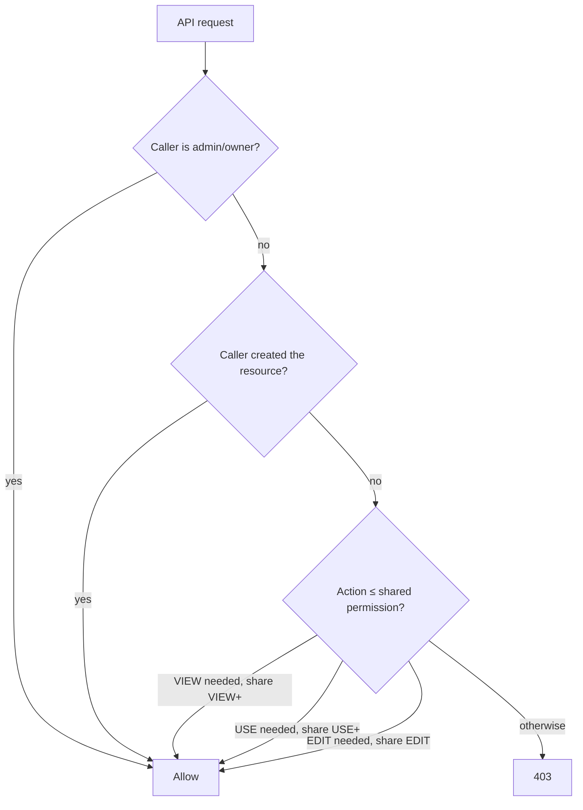

# `resource_shares` — the polymorphic sharing table

> One table for every kind of share. Five resource types, three permission levels, one unified RBAC predicate.

---

## Schema

```sql
CREATE TYPE resource_kind AS ENUM (
  'agent',
  'pipeline',
  'ml_model',
  'code_asset',
  'knowledge_base',
  'saved_tool'
);

CREATE TYPE share_permission AS ENUM (
  'VIEW',     -- see + read
  'EXECUTE',  -- run / call ("use" in the UI)
  'EDIT'      -- modify definition
);

CREATE TABLE resource_shares (
  id UUID PRIMARY KEY DEFAULT gen_random_uuid(),
  tenant_id UUID NOT NULL,
  resource_type resource_kind NOT NULL,
  resource_id UUID NOT NULL,
  shared_with_user_id UUID NOT NULL REFERENCES users(id) ON DELETE CASCADE,
  shared_with_email TEXT NOT NULL,
  permission share_permission NOT NULL,
  shared_by UUID NOT NULL REFERENCES users(id) ON DELETE SET NULL,
  expires_at TIMESTAMPTZ,
  created_at TIMESTAMPTZ NOT NULL DEFAULT now(),
  CONSTRAINT unique_share
    UNIQUE (tenant_id, resource_type, resource_id, shared_with_user_id)
);

CREATE INDEX resource_shares_user_lookup
  ON resource_shares (shared_with_user_id, resource_type, permission);
CREATE INDEX resource_shares_resource_lookup
  ON resource_shares (resource_type, resource_id);
```

The `UNIQUE` constraint makes a share row upsertable — calling POST on the same `(tenant, type, id, recipient)` updates the permission rather than 409-ing.

---

## How permissions read



Permission hierarchy: `EDIT > EXECUTE > VIEW`. Granting EDIT implies all three. granting EXECUTE implies VIEW.

The predicate lives in [`apps/api/app/core/permissions.py`](../../apps/api/app/core/permissions.py):

```python
async def user_can(user, db, *, action: Action, resource: tuple[ResourceKind, UUID]) -> bool:
    kind, rid = resource
    if user.role in (Role.OWNER, Role.ADMIN):
        return True
    if await _is_creator(db, user.id, kind, rid):
        return True
    required = _required_permission_for(action)   # action -> share_permission
    share = await db.scalar(
        select(ResourceShare).where(
            ResourceShare.tenant_id == user.tenant_id,
            ResourceShare.resource_type == kind,
            ResourceShare.resource_id == rid,
            ResourceShare.shared_with_user_id == user.id,
        )
    )
    if not share:
        return False
    if share.expires_at and share.expires_at < datetime.utcnow():
        return False
    return _permission_includes(share.permission, required)
```

Every endpoint that touches a per-resource entity calls this. Never bypass it — the linter (pre-commit hook) flags raw SELECTs that touch shared resources without going through the helper.

---

## REST surface

The polymorphic endpoints all live under `/api/me/shares`:

| Method | Path | Purpose |
|---|---|---|
| `POST` | `/api/me/shares` | Create / update a share (body has `resource_type`, `resource_id`, `shared_with_email`, `permission`) |
| `GET` | `/api/me/shares/of/{type}/{id}` | List current shares for a resource (creator + admins only) |
| `GET` | `/api/me/shares/received` | What's been shared WITH me |
| `GET` | `/api/me/shares/sent` | What I have shared |
| `DELETE` | `/api/me/shares/{share_id}` | Revoke |

Source: [`apps/api/app/routers/me.py`](../../apps/api/app/routers/me.py).

The legacy `/api/agents/{id}/shares` router still exists for backward-compat but new UI surfaces use the polymorphic endpoints.

---

## UI

`apps/web/src/components/share/ResourceShareDialog.tsx` is the single component used on ML Models, Code Runner, Knowledge Bases, and (soon) Pipelines. Props:

```ts
type Shareable = 'agent' | 'pipeline' | 'ml_model' | 'code_asset' | 'knowledge_base' | 'saved_tool';

<ResourceShareDialog
  open={...} onClose={...}
  resourceType="ml_model"
  resourceId={model.id}
  resourceName={`${model.name} v${model.version}`}
/>
```

---

## Audit

Every create + delete writes an `audit_logs` row:

```json
{
  "action": "share.create",
  "actor_id": "alice-user-id",
  "resource_type": "ml_model",
  "resource_id": "<model-id>",
  "metadata": {"recipient_email": "bob@…", "permission": "EXECUTE"}
}
```

Compliance can answer "who had access to model X on date Y" via:

```sql
SELECT * FROM audit_logs
WHERE resource_type = 'ml_model' AND resource_id = $1
  AND action LIKE 'share.%'
  AND created_at <= $2
ORDER BY created_at;
```

Combined with `resource_shares` history (we don't delete share rows on revoke. we mark them deleted via a `revoked_at` column on a join table — see [migration 0042](../../packages/db/alembic/versions/)).

---

## Trap — the recipient must already be in the tenant

A share can only be created for a user who is already a member of the same tenant. There's no implicit invite. If you want to share with someone external, invite them via Settings → Team first, then share.

This is enforced server-side (404 on unknown recipient) and visible in the share dialog ("No user with email … in your tenant. Invite them first via Settings → Team.").
