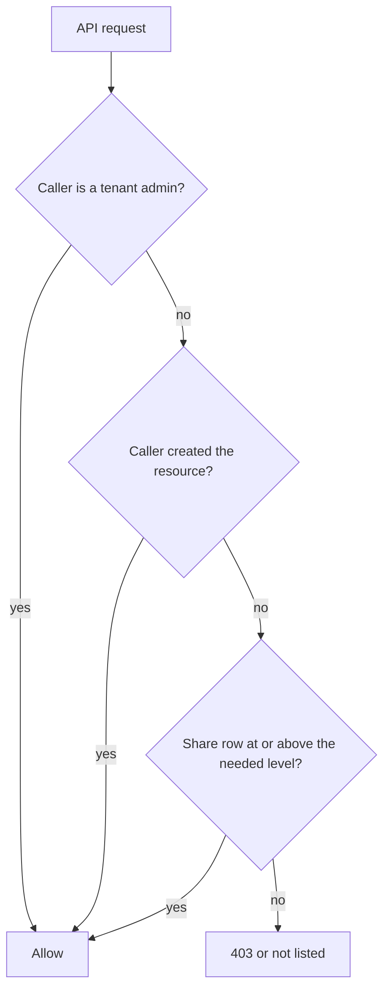

# Resource shares

> `resource_shares` is one table for every kind of share. Seven resource types, three permission levels.

Source: [`packages/db/models/resource_share.py`](../../packages/db/models/resource_share.py)

---

## Schema

| Column | Type | Notes |
|---|---|---|
| `id` | uuid | Primary key. |
| `tenant_id` | uuid | From `TenantMixin`. |
| `resource_type` | varchar(64) | Plain string, not a Postgres enum. The API accepts `agent`, `pipeline`, `ml_model`, `code_asset`, `knowledge_base`, `saved_tool`, `atlas_graph`. |
| `resource_id` | uuid | The shared row. No foreign key, the target table depends on `resource_type`. |
| `shared_with_user_id` | uuid | Recipient, foreign key to `users`. Nullable in the model, always set by the API. |
| `shared_with_email` | varchar(255) | Recipient email as typed. |
| `permission` | enum `share_permission` | `VIEW`, `EXECUTE` or `EDIT`. Default `VIEW`. |
| `shared_by` | uuid | Who created the share. Foreign key to `users`. |
| `expires_at` | timestamptz | Optional. Once it passes, the share grants nothing. Every access check filters on `ResourceShare.live()` |
| `created_at` / `updated_at` | timestamptz | From `TimestampMixin`. |

Constraints and indexes:

- `uq_resource_share_recipient` UNIQUE on `(resource_type, resource_id, shared_with_user_id)`
- `ix_resource_shares_recipient` on `shared_with_user_id`
- `ix_resource_shares_resource` on `(resource_type, resource_id)`

The unique constraint makes a share upsertable. POSTing the same resource and recipient again changes the permission rather than adding a row.

---

## How permissions read



Permission ranks are `VIEW` 0, `EXECUTE` 1, `EDIT` 2. A share at a level covers every level below it.

The helpers live in [`apps/api/app/core/permissions.py`](../../apps/api/app/core/permissions.py):

| Helper | What it does |
|---|---|
| `accessible_resource_ids(db, user, kind=, minimum_permission=)` | IDs of `kind` shared with the user at or above the level |
| `apply_resource_scope(query, model, user, kind=, scope=, accessible_ids=)` | Adds the WHERE clause for list endpoints. `scope` is `all`, `mine`, `shared` or `tenant`. For a non-admin `all` means mine, shared with me, or platform-seeded (creator NULL) |
| `assert_can_access` / `assert_can_edit` / `assert_can_delete` | Per-row checks. Delete is creator or admin only |
| `is_admin`, `sees_other_users_resources` | Role checks. Roles are `admin`, `creator` and `user`. Only `admin` has `see_other_users_resources`, so admins see every resource in the tenant |

Every query is filtered by `tenant_id` first, so a share never crosses tenants.

Expired shares are skipped everywhere a share is read: `accessible_resource_ids`, the agent edit check, Atlas, knowledge base access in [`kb_access.py`](../../apps/api/app/services/kb_access.py) and the shared-with-me lists. The row stays so the owner can see it lapsed. Collection grants (`user_collection_grants.expires_at`) follow the same rule.

Agents have their own wrapper, [`app/services/agent_share.py`](../../apps/api/app/services/agent_share.py), which uses the same table with `resource_type = 'agent'` and also accounts for marketplace subscriptions and platform agents.

---

## REST surface

The polymorphic endpoints live under `/api/me` in [`apps/api/app/routers/me.py`](../../apps/api/app/routers/me.py):

| Method | Path | Purpose |
|---|---|---|
| `POST` | `/api/me/shares` | Create or update a share. Body has `resource_type`, `resource_id`, `shared_with_email`, `permission` (`view`, `use`, `execute` or `edit`, where `use` and `execute` both store `EXECUTE`), and an optional future `expires_at`. Sharing again replaces the expiry |
| `GET` | `/api/me/shares/of/{type}/{id}` | Current shares for a resource |
| `GET` | `/api/me/shares/received` | What has been shared with me and has not expired |
| `GET` | `/api/me/shares/sent` | What I have shared |
| `DELETE` | `/api/me/shares/{share_id}` | Revoke. Allowed for the sharer, the resource owner or an admin |

Only the resource's creator (the Atlas graph owner for `atlas_graph`) or an admin can create a share. You cannot share with yourself. The recipient gets an in-app notification.

The agent routes `POST /api/agents/{id}/share`, `GET /api/agents/{id}/shares`, `DELETE /api/agents/{id}/shares/{share_id}` and `GET /api/agents/shared-with-me` in [`agent_sharing.py`](../../apps/api/app/routers/agent_sharing.py) use the same table.

---

## Revoke deletes the row

`DELETE /api/me/shares/{id}` hard-deletes the share. There is no `revoked_at` column and no history table, so "who had access on date Y" is not answerable from `resource_shares` alone.

---

## The older `agent_shares` table

`agent_shares` (`agent_id`, `shared_with_user_id`, `shared_with_email`, `permission`, `shared_by`) predates this table. The sharing routes used to write it. [`packages/db/seeds/seed_backfill_agent_shares.py`](../../packages/db/seeds/seed_backfill_agent_shares.py) copies its rows into `resource_shares`. Nothing in `apps/` reads it now.

---

## UI

[`ResourceShareDialog.tsx`](../../apps/web/src/components/share/ResourceShareDialog.tsx) is the shared dialog, used on the ML Models, Code Runner, Knowledge and Atlas pages. It offers `view`, `use` and `edit`, and an optional end date. Each row shows "expires on …" or "expired". Share responses carry `expires_at` and `expired`.

```ts
type Shareable = 'agent' | 'pipeline' | 'ml_model' | 'code_asset' | 'knowledge_base' | 'saved_tool' | 'atlas_graph';

<ResourceShareDialog
  open={...} onClose={...}
  resourceType="ml_model"
  resourceId={model.id}
  resourceName={`${model.name} v${model.version}`}
/>
```

---

## The recipient must already be in the tenant

A share can only be created for a user who is already a member of the same tenant. There is no implicit invite. To share with someone outside, invite them from Settings → Team first, then share.

The API returns 404 for an unknown recipient, and the dialog shows the message ("No user with email … in your tenant. Invite them first via Settings → Team.").
