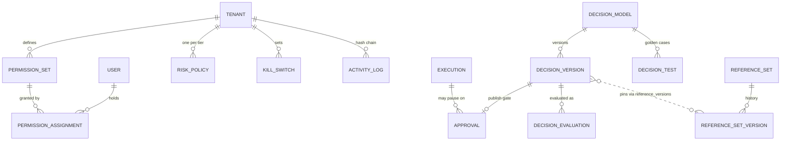

# Governance, approvals and decisions

Sources: [`packages/db/models/governance.py`](../../packages/db/models/governance.py), [`approval.py`](../../packages/db/models/approval.py), [`activity_log.py`](../../packages/db/models/activity_log.py), [`decision.py`](../../packages/db/models/decision.py)

Migrations: [`c1d2e3f4a5b6_governance_core`](../../packages/db/alembic/versions/c1d2e3f4a5b6_governance_core.py), [`30c306d107f4_decision_service`](../../packages/db/alembic/versions/30c306d107f4_decision_service.py), [`20a44346bdda_approval_returns_escalation`](../../packages/db/alembic/versions/20a44346bdda_approval_returns_escalation.py)

The behaviour behind these tables is in [01-architecture/07-governance](../01-architecture/07-governance.md) and [08-howto/09-decisions](../08-howto/09-decisions.md). This page is the schema.

---

## Capabilities

### `permission_sets`

| Column | Type | Notes |
|---|---|---|
| `id` / `tenant_id` | uuid | |
| `name` | varchar(120) | Unique per tenant (`uq_permission_set_name`). |
| `description` | text | |
| `capabilities` | jsonb | List of capability keys, for example `["decisions.author", "approvals.sign:legal"]`. |
| `created_by` | uuid | `ON DELETE SET NULL`. |
| `created_at` / `updated_at` | timestamptz | |

### `permission_assignments`

| Column | Notes |
|---|---|
| `permission_set_id` | `ON DELETE CASCADE`. |
| `user_id` | `ON DELETE CASCADE`. |
| `created_by` / `created_at` | Who granted it and when. |

Unique on `(permission_set_id, user_id)`. Index `ix_permission_assignment_user` on `(tenant_id, user_id)`.

A user's effective capabilities are the role defaults in `ROLE_DEFAULTS` ([`app/core/capabilities.py`](../../apps/api/app/core/capabilities.py)) plus every key from every set assigned to them. The catalogue is `decisions.view`, `decisions.evaluate`, `decisions.author`, `decisions.review`, `decisions.publish`, `approvals.sign`, `risk.view`, `risk.manage`, `killswitch.manage`, `audit.verify`, `sources.manage`, `evals.manage`, `evals.run`, `events.manage`, `permissions.manage`, `runs.replay`. A suffix such as `approvals.sign:legal` narrows `approvals.sign` to gates that ask for that group.

---

## Risk tiers

### `risk_policies`

| Column | Type | Notes |
|---|---|---|
| `tier` | varchar(16) | `low`, `medium`, `high` or `critical`. Unique per tenant (`uq_risk_policy_tier`). |
| `policy` | jsonb | Overrides merged over the default for that tier. |
| `updated_by` / `updated_at` | | |

No row means the tenant uses the defaults in [`engine/risk.py`](../../apps/agent-runtime/engine/risk.py). The policy keys:

| Key | Default low / medium | Default high | Default critical |
|---|---|---|---|
| `publish_approvals.min_approvers` | 0 | 1 | 2 |
| `publish_approvals.exclude_author` | false | true | true |
| `publish_approvals.capability` | `approvals.sign` | `approvals.sign` | `approvals.sign` |
| `publish_approvals.escalate_after_hours` | 0 | 24 | 4 |
| `tool_call_action` | `allow` | `approval` | `approval` |
| `allowed_models` | `[]` (any) | `[]` | `[]` |
| `require_output_schema` | false | true | true |
| `require_eval_pass` | false | true | true |

`tool_call_action` is one of `allow`, `approval`, `block`. The tier itself lives on the work: `agents.model_config.risk_tier`, `decision_models.risk_tier`, `watch_sources.risk_tier`, and on each run as `executions.risk_tier`.

---

## Kill switches

### `kill_switches`

| Column | Type | Notes |
|---|---|---|
| `tenant_id` | uuid | Nullable. NULL stops the thing for every tenant. `ON DELETE CASCADE`. |
| `scope` | varchar(32) | `all`, `agent`, `pipeline`, `tool`, `model`, `trigger`, `decision`, `source`. |
| `target` | varchar(255) | An id, slug or name within the scope, or `*` for the whole scope. Always `*` when scope is `all`. |
| `active` | bool | Cleared switches stay as rows with `active = false`. |
| `reason` | text | Shown to whoever hits the switch. |
| `set_by` / `set_at` / `cleared_by` / `cleared_at` | | Who stopped it and who resumed it. |

Index `ix_kill_switch_lookup` on `(tenant_id, scope, target, active)`. The runtime checks `(all, *)`, then `(scope, *)`, then `(scope, target)` against an in-memory snapshot refreshed every 5 seconds ([`engine/governance.py`](../../apps/agent-runtime/engine/governance.py)). Setting and clearing a switch emit `kill_switch.set` and `kill_switch.cleared`.

---

## Audit chain on `activity_logs`

`activity_logs` is the audit log. Routes write to it through `log_action` in `app/core/audit.py`. Base columns are `tenant_id`, `user_id`, `action`, `details` (jsonb), `ip_address`, `user_agent`, `created_at`. Governance core added the chain:

| Column | Type | Notes |
|---|---|---|
| `audit_seq` | bigint | `nextval('activity_logs_audit_seq')`. Global insert order. |
| `prev_hash` | varchar(64) | `row_hash` of the previous row in the same tenant's chain. |
| `row_hash` | varchar(64) | SHA-256 of `prev_hash | canonical JSON` of id, tenant, `pii_digest`, action, details, created_at, `audit_seq`. NULL until chained. |
| `chain_pos` | bigint | Position in the tenant's chain, starting at 1. |
| `pii_salt` | varchar(32) | Random salt per row. |
| `pii_digest` | varchar(64) | SHA-256 of `salt | user_id | ip | user_agent`. |

How it works:

- Inserts never compute hashes. The chainer ([`app/services/audit_chain.py`](../../apps/api/app/services/audit_chain.py)) runs on a schedule under advisory lock `0x41554449`, picks rows older than 15 seconds with `row_hash IS NULL` in `audit_seq` order, and links them per tenant. Partial index `ix_activity_logs_unchained` keeps that cheap.
- The `activity_logs_immutable` trigger refuses every DELETE and every UPDATE, except the one update that fills the hash columns on an unchained row without touching anything else. Setting `abenix.audit_maintenance = 'on'` for the transaction lifts the guard. Archiving and GDPR erasure use it.
- The hash covers `pii_digest`, not the raw actor fields. GDPR erasure sets `user_id` to the nil UUID and clears `ip_address`, `user_agent` and `pii_salt`, and the chain still verifies.
- Archiving removes only a contiguous chained prefix and writes an `audit.pruned` row recording the last hash and position, so verification starts after it.
- Indexes `ix_activity_logs_tenant_seq` and `ix_activity_logs_tenant_chain` serve verification. `GET /api/governance/audit/verify` needs `audit.verify`, and a nightly scheduler job checks every tenant.

---

## Approvals

### `approvals`

| Column | Type | Notes |
|---|---|---|
| `agent_id` / `agent_execution_id` | uuid | The agent and the paused run, when there is one. A decision publish gate has neither. |
| `title` / `payload` | text / jsonb | What is being approved. Decision gates put `kind`, `decision_key`, `version`, `risk_tier` and a link in `payload`. |
| `required_signoffs` | int | Raised to the tier's `min_approvers` when the run or request carries a tier above low. |
| `signoffs` | jsonb | List of `{user_id, user_email, decision, reason, at, self_approved, client_token?}`. `decision` is `approve`, `deny` or `return`. |
| `status` | enum `approval_status` | `pending`, `approved`, `denied`, `expired`, `returned`. `returned` added by `20a44346bdda`. |
| `requested_by` / `expires_at` / `decided_at` | | |
| `client_token` / `gate_kind` | varchar(120) | Idempotency token and gate type, added by `z6a7b8c9d0e1`. `gate_kind` is indexed. |
| `policy` | jsonb | Separation of duties, added by `30c306d107f4`. `{exclude_requester, capability, risk_tier, escalate_after_hours}`. |
| `escalated_at` | timestamptz | Added by `20a44346bdda`. Set once when admins are notified about an overdue tiered approval. |

Status is recomputed from `signoffs` on every sign-off. Any `deny` wins, then any `return`, then enough `approve` rows, then expiry. A return sends a decision version back to `draft` with the reviewer's note in `decision_versions.validation.returned`. Escalation runs from the scheduler: a pending row with a `policy`, no `escalated_at`, and `created_at + escalate_after_hours` in the past gets one notification per active tenant admin.

---

## Decisions

Decisions are versioned business rules evaluated by the ZEN engine. Every table is tenant-scoped.

### `decision_models`

| Column | Type | Notes |
|---|---|---|
| `key` | varchar(160) | Unique per tenant (`uq_decision_model_key`). What callers evaluate by. |
| `name` / `description` | | |
| `risk_tier` | varchar(16) | Drives how many approvers a publish needs. Default `low`. |
| `tags` | jsonb | |
| `log_mode` | varchar(16) | `none`, `sampled` or `all`. Controls automatic writes to `decision_evaluations`. |
| `created_by` / `archived_at` | | Archiving keeps the history. |

### `decision_versions`

Immutable once proposed. A correction is a new version.

| Column | Type | Notes |
|---|---|---|
| `model_id` | uuid | `ON DELETE CASCADE`. |
| `version` | int | Unique per model (`uq_decision_version`). |
| `state` | varchar(16) | `draft`, `proposed`, `approved`, `rejected`, `published`, `superseded`, `retired`. Index on `(model_id, state)`. |
| `authoring` | jsonb | The rule builder document. NULL when the version was written in the flow view. |
| `content` | jsonb | The compiled ZEN graph that runs. |
| `content_hash` | varchar(64) | Hash of `content`. Recorded on every evaluation. |
| `required_facts` / `fact_types` | jsonb | Inputs the version needs and their types, derived at compile time. |
| `reference_versions` | jsonb | Which version of each reference set was snapshotted in. |
| `valid_from` / `valid_to` | timestamptz | Valid time. When the rules apply to the activity being decided. |
| `valid_to_history` | jsonb | Each later change to `valid_to` as `{from, to, at}`, so an as-known query sees the old end date. |
| `recorded_at` / `published_at` / `superseded_at` | timestamptz | Recorded time. When the platform learned, published and replaced it. |
| `change_note` / `provenance` / `validation` | | Author note, source citation and the last validation result. |
| `approval_id` | uuid | The `approvals` row for the publish gate. |
| `base_version_id` | uuid | The version this draft was started from. |
| `lock_version` | int | Optimistic lock for draft saves, sent as an ETag. |
| `author_id` / `editing_by` / `proposed_by` / `proposed_at` / `published_by` | | `editing_by` is presence for the draft editor. |

Lifecycle. `POST /api/decisions/{key}/check` validates a draft document without saving. `.../versions/{n}/propose` validates the version, moves it to `proposed` and opens a `decision_publish` approval when the tier needs approvers, or goes straight to `approved` when it needs none. `.../versions/{n}/publish` requires `approved`, marks overlapping live versions `superseded` or closes their `valid_to` (with a `valid_to_history` entry), then sets `published`. `.../retire` ends a published version.

Picking a version for an evaluation at `as_of`, as known at `known_at`: published on or before `known_at`, not superseded by then, `valid_from <= as_of`, and `as_of` before `valid_to` as it was recorded at `known_at`. The most recently published match wins.

### `decision_tests`

Golden cases. These facts must give this result.

| Column | Notes |
|---|---|
| `model_id` | `ON DELETE CASCADE`, indexed. |
| `name` | |
| `facts` | jsonb input. |
| `expected_outcome` | Default `decided`. Can be `no_match`, `missing_facts` or `invalid_facts`. |
| `expected` | jsonb expected result, compared when the outcome is `decided`. |
| `as_of` | Optional date string, so a test can pin itself to one validity period. |

Proposing runs every test along with regression and overlap checks. A failing test blocks the proposal.

### `reference_sets` and `reference_set_versions`

| Table | Columns | Notes |
|---|---|---|
| `reference_sets` | `key` (unique per tenant), `name`, `description`, `version`, `values`, `content_hash`, `updated_by` | The current list, for example product codes or country lists. |
| `reference_set_versions` | `set_id`, `version`, `values`, `content_hash`, `created_by`, `created_at` | Every version. Unique on `(set_id, version)`. |

A rule that uses a set gets its values compiled in. Editing the set later does not change a published decision until a new version is compiled and published.

### `decision_evaluations`

Persisted, reproducible evaluations. Written when the caller passes `persist` or an `idempotency_key`, when `log_mode` is `all`, or for about one in ten evaluations when it is `sampled` (first byte of `trace_hash` below 26).

| Column | Type | Notes |
|---|---|---|
| `id` | bigint | Identity. |
| `public_id` | uuid | Unique. What the API returns as `evaluation_id`. |
| `tenant_id` / `model_id` / `version_id` | uuid | No foreign keys, the row outlives an archived model. |
| `content_hash` | varchar(64) | The exact rules that ran. |
| `outcome` | varchar(32) | `decided`, `no_match`, `missing_facts`, `invalid_facts`. |
| `facts` / `result` / `applied_rules` | jsonb | Input, output and which rules fired. |
| `trace_hash` | varchar(64) | SHA-256 of canonical JSON of facts, `content_hash`, result and applied rules. Two evaluations with the same trace hash made the same decision for the same reason. |
| `as_of` / `known_at` | | The valid time and recorded time the version was picked for. |
| `idempotency_key` | varchar(200) | Partial unique index `uq_decision_eval_idem` on `(tenant_id, idempotency_key)` where not NULL. |
| `caller` | jsonb | Who called. From an agent or pipeline it is `{execution_id, agent, user_id, tool, source}`. |
| `created_at` | timestamptz | Index `ix_decision_eval_model_time` on `(tenant_id, model_id, created_at)`. |

Decision lifecycle events are `decision.proposed`, `decision.published` and `decision.retired`. See [06-evals-sources-events](06-evals-sources-events.md).

---

## See also

- [02-executions](02-executions.md) — run provenance and `execution_config_snapshots`
- [06-evals-sources-events](06-evals-sources-events.md) — the eval gate behind `require_eval_pass`
- [01-architecture/07-governance](../01-architecture/07-governance.md) — how the controls fit together
