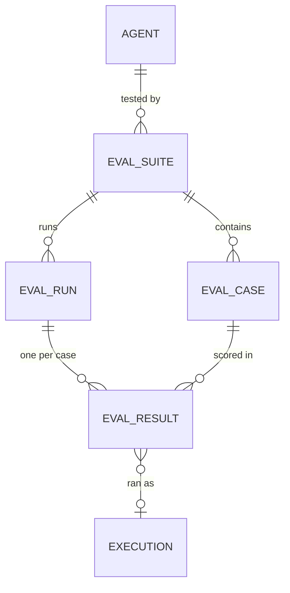
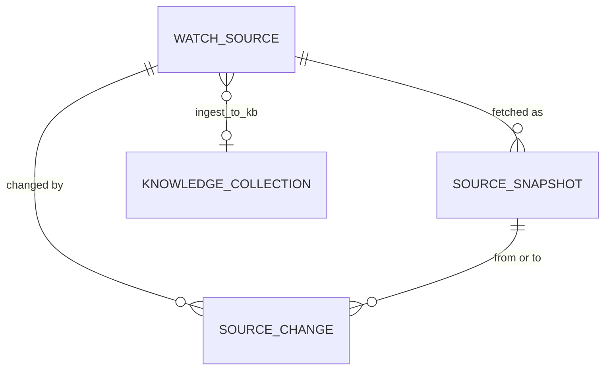

# Evals, sources and events

Sources: [`packages/db/models/evals.py`](../../packages/db/models/evals.py), [`source_watch.py`](../../packages/db/models/source_watch.py), [`governance.py`](../../packages/db/models/governance.py) (`EventOutbox`), [`webhook.py`](../../packages/db/models/webhook.py), [`webhook_delivery.py`](../../packages/db/models/webhook_delivery.py)

Migrations: [`9465d37a97f1_eval_suites`](../../packages/db/alembic/versions/9465d37a97f1_eval_suites.py), [`25f2dd065d53_source_watch`](../../packages/db/alembic/versions/25f2dd065d53_source_watch.py), [`fe18a43f0be1_event_outbox`](../../packages/db/alembic/versions/fe18a43f0be1_event_outbox.py)

Runtime behaviour is in [02-runtime/18-evaluation-suites](../02-runtime/18-evaluation-suites.md), [02-runtime/17-source-watch](../02-runtime/17-source-watch.md) and [02-runtime/19-outbound-events](../02-runtime/19-outbound-events.md).

---

## Evaluation suites

### `eval_suites`

| Column | Type | Notes |
|---|---|---|
| `agent_id` | uuid | An agent or a pipeline, both live in `agents`. `ON DELETE CASCADE`. Index on `(tenant_id, agent_id)`. |
| `name` / `description` | | |
| `gating` | bool | A gating suite must pass before the agent can be published when its tier policy has `require_eval_pass`. |
| `pass_threshold` | float | Default 0.9. |
| `schedule_cron` / `next_run_at` | | Optional schedule. |
| `rerun_on_model_change` | bool | Re-run when the agent's model changes. |
| `concurrency` | int | Cases run in parallel, default 4. |
| `judge_model` | varchar(100) | Model for `judge` assertions. NULL uses `claude-haiku-4-5-20251001`. |
| `created_by` | uuid | |

### `eval_cases`

| Column | Notes |
|---|---|
| `suite_id` | `ON DELETE CASCADE`, indexed. |
| `name` / `input_message` / `context` | What the agent is sent. |
| `assertions` | jsonb list. Each has a `type` and its fields. |
| `weight` | Share of the suite score, default 1.0. |
| `tags` | |
| `source_execution_id` / `reference_output` | The run a case was captured from and what it answered. |

Assertion types, from `TYPES` in [`app/services/eval_assertions.py`](../../apps/api/app/services/eval_assertions.py): `json_path_equals`, `json_path_contains`, `regex`, `contains`, `not_contains`, `schema_valid`, `required_tools_called`, `max_cost`, `max_duration_ms`, `cited_sources_present`, `judge`. All are deterministic except `judge`.

### `eval_runs`

| Column | Type | Notes |
|---|---|---|
| `suite_id` / `agent_id` | uuid | |
| `config_hash` | varchar(64) | The same hash the `executions_provenance` trigger writes. Index on `(agent_id, config_hash)`. |
| `agent_revision` / `model` / `model_override` | | What was tested. `model_override` is true when the run swapped the model. |
| `status` | varchar(16) | `queued`, `running`, `completed`, `failed`, `cancelled`. |
| `score` / `threshold` / `threshold_met` | | Weighted score against the suite threshold at run time. |
| `total` / `passed` / `failed` / `errored` | int | Case counts. |
| `triggered_by` | varchar(16) | `manual`, `schedule`, `model_change`, `publish_gate`. |
| `triggered_by_user` / `cost` / `error` | | |
| `created_at` / `started_at` / `completed_at` | | Index on `(suite_id, created_at)`. |

The eval gate takes the latest completed run of each gating suite whose `config_hash` matches the agent's current config and whose `model_override` is false, and needs `threshold_met` on it. A run on an older config or with a swapped model does not count.

### `eval_results`

| Column | Notes |
|---|---|
| `run_id` | `ON DELETE CASCADE`, indexed. |
| `case_id` / `case_name` | `case_id` is `ON DELETE SET NULL`, `case_name` keeps the label after the case is deleted. |
| `execution_id` | The run the case produced. |
| `status` / `passed` / `score` | |
| `assertion_results` | jsonb, one entry per assertion with its outcome. |
| `output_excerpt` / `duration_ms` / `cost` / `error` | |

A finished run emits `eval.completed`.

---

## Source Watch

### `watch_sources`

| Column | Type | Notes |
|---|---|---|
| `name` | varchar(255) | Unique per tenant (`uq_watch_source_name`). |
| `url` / `kind` | | `kind` is `html`, `pdf`, `xlsx`, `csv`, `json` or `rss`. |
| `cadence_minutes` | int | Default 1440. |
| `active` / `paused_reason` | | Partial index `ix_watch_sources_due` on `next_check_at` where `active`. |
| `credentials_key` | varchar(128) | A tenant tool credential key, sent as `Authorization` or as `Header: value`. |
| `headers` | jsonb | Extra request headers. |
| `selector` | text | CSS selector for html, JSON pointer for json, sheet name for xlsx. |
| `jurisdiction` / `tags` / `risk_tier` | | |
| `ingest_to_kb` / `kb_document_id` | uuid | Optional collection to feed. Each change becomes a new document version there. |
| `next_check_at` / `last_checked_at` / `last_changed_at` | | |
| `last_status` | varchar(32) | `changed`, `unchanged`, `not_modified`, `baseline`, `error` or `stopped`. |
| `last_error` / `consecutive_failures` | | |
| `etag` / `last_modified` | | Conditional GET headers from the last fetch. |
| `current_snapshot_id` / `check_count` | | |

### `source_snapshots`

Immutable. The `source_snapshots_immutable` trigger refuses every UPDATE.

| Column | Notes |
|---|---|
| `source_id` | `ON DELETE CASCADE`. |
| `url` / `kind` | As fetched. |
| `content_sha256` | Hash of the raw bytes. Unique per source (`uq_source_snapshot_sha`), so identical content is stored once. |
| `text_sha256` | Hash of the normalised text. |
| `storage_key` | Object key of the raw bytes, `sources/{tenant}/raw/{sha[:2]}/{sha}`. |
| `content_type` / `bytes` / `http_status` / `http_headers` / `fetched_at` | Index on `(source_id, fetched_at)`. |
| `parser_version` / `title` | |
| `normalized_text` / `normalized_text_key` / `text_truncated` | Text inline, with the full text in object storage and `text_truncated` set past 2,000,000 characters. |
| `tables` | jsonb rows for csv, xlsx and rss, so the next change diffs row by row. |
| `notes` | jsonb list of parser notes. |

### `source_changes`

| Column | Notes |
|---|---|
| `source_id` | `ON DELETE CASCADE`. |
| `from_snapshot_id` | The previous current snapshot. `ON DELETE SET NULL`. |
| `to_snapshot_id` | `ON DELETE CASCADE`. |
| `detected_at` | Indexes on `(source_id, detected_at)` and `(tenant_id, detected_at)`. |
| `summary` / `diff` / `stats` | Line or row diff and counts. |
| `materiality_hint` | `high`, `medium` or `low`. A rough sort for reviewers from [`engine/sources/diff.py`](../../apps/agent-runtime/engine/sources/diff.py), never a verdict. |

A detected change emits `source.changed`.

---

## Outbound events

### `event_outbox`

The transactional outbox. A change and its event commit together or not at all.

| Column | Type | Notes |
|---|---|---|
| `id` | bigint | Identity. Gives events a total order and the public id `evt_{id}`. |
| `tenant_id` | uuid | Indexed. No foreign key. |
| `event_type` | varchar(100) | One of the catalogue in [`app/services/events.py`](../../apps/api/app/services/events.py). |
| `payload` | jsonb | |
| `occurred_at` | timestamptz | |
| `dispatched_at` | timestamptz | NULL until fanned out. Partial index `ix_event_outbox_pending` on `id` where NULL. |

Rows come from `emit()` in the caller's transaction, and from the `executions_emit_event` trigger for run completion. The fan-out job reads pending rows with `FOR UPDATE SKIP LOCKED` and writes one `webhook_deliveries` row per matching subscription.

Event types: `execution.completed`, `execution.failed`, `approval.requested`, `approval.resolved`, `decision.proposed`, `decision.published`, `decision.retired`, `kill_switch.set`, `kill_switch.cleared`, `source.changed`, `eval.completed`.

### `webhooks`

A row is an event subscription. The table predates the outbox. `fe18a43f0be1` added the subscription columns and made `url` nullable.

| Column | Type | Notes |
|---|---|---|
| `name` | varchar(255) | Added by `fe18a43f0be1`. |
| `url` | varchar(1000) | Required for `webhook` targets only. |
| `target_type` | varchar(16) | `webhook`, `agent` or `pipeline`. Added by `fe18a43f0be1`. An agent or pipeline target starts a run with the event as input. |
| `target` | jsonb | Which agent or pipeline, for non-webhook targets. |
| `events` | jsonb | Event type patterns. `*` and shell globs such as `decision.*` match. |
| `filter` | jsonb | `{"payload.path": value}` or `{"path": [values]}`. Every entry must match. |
| `signing_secret` | varchar(255) | HMAC-SHA256 key for the `X-Abenix-Signature: sha256=...` header. |
| `is_active` / `failure_count` / `last_delivery_at` | | |
| `consecutive_failures` / `disabled_reason` | | After 25 failed deliveries in a row the subscription is switched off and the reason recorded. |
| `created_by` | uuid | |

### `webhook_deliveries`

| Column | Notes |
|---|---|
| `webhook_id` | `ON DELETE CASCADE`. |
| `event` / `event_id` | Event type and the `event_outbox.id`. `event_id` added by `fe18a43f0be1`. |
| `request_payload` | The envelope sent. |
| `status` | `pending`, `retrying`, `delivered` or `dead`. Added by `fe18a43f0be1`, default `delivered` for older rows. |
| `attempts` / `next_attempt_at` | Up to 8 attempts with backoff. Partial index `ix_webhook_deliveries_due` on `next_attempt_at` where status is `pending` or `retrying`. |
| `response_status_code` / `response_body` / `error_message` / `delivered` / `delivery_id` | First 500 characters of the response body. |
| `execution_id` | The run started by an agent or pipeline target. |

---

## See also

- [05-governance-decisions](05-governance-decisions.md) — tier policies, approvals, decisions
- [02-executions](02-executions.md) — provenance and `config_hash`
