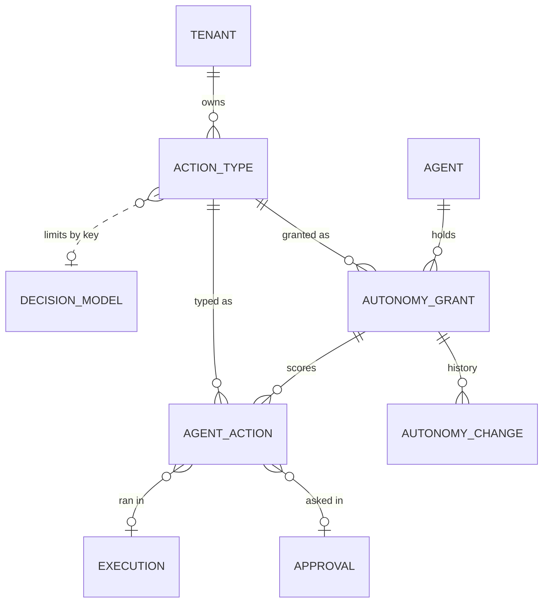

# Earned autonomy

Source: [`packages/db/models/autonomy.py`](../../packages/db/models/autonomy.py)

Migration: [`auton0my0001_earned_autonomy`](../../packages/db/alembic/versions/auton0my0001_earned_autonomy.py), down revision `p3rs0na0vec1`. Every step checks `has_table` and existing indexes first, because the API's `create_all` can build the tables before the migration runs.

Runtime behaviour is in [02-runtime/21-earned-autonomy](../02-runtime/21-earned-autonomy.md).

---

Dotted lines are soft. `limits_decision_key` names a decision by key, and the ledger's `execution_id`, `approval_id`, `agent_id`, `action_type_id` and `grant_id` carry no foreign key, so a row survives whatever it points at.

---

## `action_types`

One per kind of action per tenant. `UNIQUE (tenant_id, key)`.

| Column | Type | Notes |
|---|---|---|
| `key` | varchar(200) | For example `sample_plant.set_setpoint`. Defaults to the tool name, plus `:<match value>` when there is a match |
| `label` / `description` | | Shown to people. `label` reads as a verb phrase, "Change the plant pressure setpoint" |
| `tool_name` | varchar(160) | Indexed. The tool this type covers |
| `match` | jsonb | Which calls of the tool, `{"param": "topic", "glob": "controls.*"}`, `equals` or `in`. NULL means every call with an effect |
| `effect` | jsonb | Copy of the tool's `Effect` at enrol time |
| `world_model` | jsonb | `{kind, ref, metric, inputs, band, horizon_s, timeout_s}`. Kinds `agent_stated`, `decision`, `ml_model`, `none` |
| `outcome_probe` | jsonb | `{kind, after_s, tool, arguments, path, metric}`. Kinds `tool`, `manual`, `api`, `none` |
| `limits_decision_key` | varchar(160) | Decision model key, NULL for no limits |
| `max_band_width` | float | Widest honest band relative to the value. 0.5 means the band may be half the value |
| `reversible` | bool | |
| `ceiling` | int | Optional cap for every grant of this type |
| `policy` | jsonb | Ladder threshold overrides plus `approval_expires_s`. See the ladder defaults |
| `is_sample` | bool | True for the sample plant |
| `created_by` | uuid | `ON DELETE SET NULL` |

## `autonomy_grants`

One agent's level for one action type. `UNIQUE (tenant_id, agent_id, action_type_id, scope_hash)`.

| Column | Type | Notes |
|---|---|---|
| `agent_id` | uuid | `ON DELETE CASCADE`, indexed |
| `action_type_id` | uuid | `ON DELETE CASCADE`, indexed |
| `scope` | jsonb | `{"param": "site", "equals": "A"}`, `glob` or `in`. NULL means everywhere |
| `scope_hash` | varchar(64) | Hash of `scope`, empty for none. Lets one agent hold a scoped and an unscoped grant |
| `level` | int | 0 to 4 |
| `ceiling` | int | Default 4. Only ever lowered through the API |
| `state` | varchar(16) | `active`, `paused`, `removed`. Paused caps the level at 2. Removed is unenrolled with history kept |
| `level_since` | timestamptz | Reset on every level change |
| `approval_id` | uuid | The pending or last promotion approval |
| `granted_by` | uuid | Who approved the current level. Gets the owner notifications |
| `agent_config_hash` | varchar(64) | Agent config hash when the level was granted. A different hash at run time caps the level at 2 |
| `reason` | text | |
| `attention` | text | One sentence for the overview, for example "Ready to move to Asks first" |
| `recommended_level` | int | The level an `autonomy.recommended` event was last sent for, so it fires once |
| `review_notified_at` | timestamptz | Last pending-review notification, at most hourly |

## `autonomy_changes`

Append only. One row per level change and per world model change.

| Column | Type | Notes |
|---|---|---|
| `grant_id` | uuid | `ON DELETE CASCADE`. Index on `(grant_id, created_at)` |
| `tenant_id` | uuid | Indexed |
| `from_level` / `to_level` | int | Equal when the row only marks a world model change |
| `actor_type` | varchar(16) | `user` or `system` |
| `actor_id` | uuid | NULL for system |
| `reason` | text | Plain sentence |
| `evidence` | jsonb | The numbers at the time: scored, held, accuracy, agreement, executed, rejected, unknown, harm, days at level, config hash |

## `agent_actions`

The ledger. One row per effect tool call or SDK proposal. Server defaults on every column so the runtime can insert with plain SQL over asyncpg.

| Column | Type | Notes |
|---|---|---|
| `id` | uuid | `gen_random_uuid()` default |
| `execution_id` / `tool_call_id` | uuid / varchar(120) | Partial unique index `uq_agent_actions_call` when both are set, so a retried call writes once |
| `agent_id` / `agent_name` / `agent_config_hash` / `user_id` | | Who acted and on which revision |
| `action_type_id` / `grant_id` | uuid | NULL for unmanaged calls |
| `tool_name` | varchar(160) | |
| `level_at_time` | int | Level that applied to this call |
| `mode` | varchar(16) | `unmanaged`, `watching`, `proposed`, `auto`, `reported`, `external` |
| `target` | varchar(500) | From the effect's `target_param` or the SDK |
| `arguments` | jsonb | Without `_intent` and `_prediction`. After an edited approval, the edited values |
| `intent` | text | The agent's stated reason |
| `prediction` | jsonb | `{metric, value, low, high, horizon_s, source, source_ref, note}`. `value` is NULL with a `note` when the world model gave nothing |
| `limits_result` | jsonb | `{ok, decision_key, reasons}`, plus `fallback_reason` for SDK proposals that fell back to asking |
| `approval_id` | uuid | The `action:<key>` approval |
| `status` | varchar(16) | `recorded`, `watching`, `pending`, `approved`, `edited`, `rejected`, `executed`, `failed`, `blocked`, `expired` |
| `decided_by` / `decided_at` / `decision_note` | | Approver or reviewer, and their note |
| `executed_at` / `result_preview` | | First 500 characters of the result |
| `reviewer_answer` / `reviewer_alternative` | | `agree`, `different`, `unsure`, and what the reviewer did instead |
| `outcome` | jsonb | `{metric, value, source, observed_at, by, note}` |
| `outcome_due_at` | timestamptz | When the probe should run |
| `outcome_status` | varchar(16) | `none`, `pending`, `observed`, `unknown`, `manual` |
| `outcome_attempts` | int | Failed tool probe attempts, unknown after 3 |
| `score` | jsonb | `{within_band, band_ok, agreement, harm}` |
| `harm` / `harm_note` | bool / text | |
| `created_at` | timestamptz | |

Indexes: `(tenant_id, grant_id, created_at)` for the grant page and stats, `(tenant_id, status)` for reviews and counts, `(outcome_status, outcome_due_at)` for the scheduler.

### Status by path

| Path | Status sequence |
|---|---|
| Unmanaged | `recorded` then `executed` or `failed` |
| Watching | `watching`, then a review fills `reviewer_answer` |
| Asks first | `pending`, then `approved` or `edited`, then `executed` or `failed`. Or `rejected`, `expired` |
| Acts within limits, Acts and reports | `approved` then `executed` or `failed` |
| Off, limits breach, tier block | `blocked` |
| SDK proposal | `recorded`, then as above. `POST /actions/{id}/executed` moves `approved` or `edited` to `executed` or `failed` |
