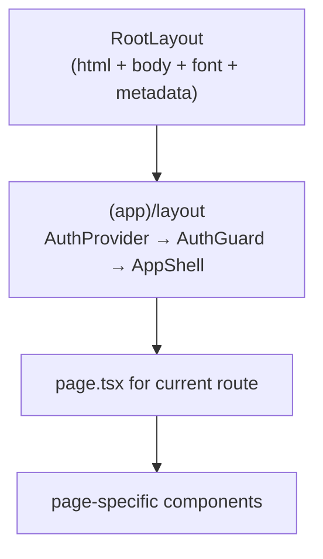

# App shell — Next.js layout, auth, routing

> The browser UI is a Next.js 15 App Router app (React 18). This doc covers the shell every authenticated page renders inside, and how the sidebar decides what to show.

---

## Directory layout

```
apps/web/src/
├── app/
│   ├── layout.tsx         ← RootLayout: html/body, Inter font, metadata
│   ├── page.tsx           ← public landing, sign-in lives in AuthCard
│   ├── not-found.tsx      ← 404
│   ├── error.tsx          ← root error boundary
│   ├── (app)/             ← authenticated app, sidebar + topbar
│   │   ├── layout.tsx     ← AuthProvider → AuthGuard → AppShell
│   │   ├── settings/
│   │   │   └── layout.tsx ← settings left nav
│   │   ├── admin/         ← one folder per admin page
│   │   ├── decisions/ evals/ sources/ approvals/ ...
│   │   └── ...
│   ├── auth/              ← /auth/callback (SSO), /auth/accept-invite
│   ├── docs/              ← public developer docs viewer (this site)
│   ├── oraclenet/         ← public OracleNet page
│   └── demo/              ← redirects to /dashboard
├── components/
│   ├── layout/            ← Sidebar, TopBar, StatusBar, CognifyIndicator
│   ├── builder/           ← agent + pipeline canvas
│   ├── decisions/ evals/ governance/ sources/
│   ├── share/ shared/ observability/ chat/
│   └── ui/                ← Toast, ConfirmModal, Skeleton, EmptyState, CommandPalette, ...
├── hooks/                 ← useApi, usePageTitle, useMediaQuery, ...
├── stores/                ← zustand stores
├── lib/                   ← api-client, capabilities, per-feature types
└── contexts/
    └── AuthContext.tsx
```

The `(app)/` group is the authenticated app. The folder name in parens is a route-group marker. It doesn't appear in the URL but scopes a shared layout (sidebar + topbar) to every page underneath. There is no `(auth)` group and no `/login` page. Sign-in and sign-up happen on `/`. Every route is listed in [03-page-catalogue](03-page-catalogue.md).

---

## The render tree



`RootLayout` ([`apps/web/src/app/layout.tsx`](../../apps/web/src/app/layout.tsx)) sets `<html lang="en" className="dark">`, loads the Inter font and global CSS, exports the site metadata and renders `OrganizationJsonLd`. It wraps every page in `ToastProvider`, which mounts `ToastContainer` and forwards `apiFetch` warnings into it, so toasts show app-wide, the sign-in page included.

`(app)/layout.tsx` ([`apps/web/src/app/(app)/layout.tsx`](../../apps/web/src/app/(app)/layout.tsx)) adds:
- `AuthProvider` (`AuthContext`)
- `AuthGuard`, which sends you to `/?return_to=<current path>` if there is no token or user
- `AppShell`, which is Sidebar + TopBar + StatusBar + CommandPalette + OfflineBanner

---

## AuthGuard

```tsx
function AuthGuard({ children }) {
  const { user, loading } = useAuth();
  const router = useRouter();
  const [checked, setChecked] = useState(false);

  useEffect(() => {
    if (loading) return;
    const token = localStorage.getItem('access_token');
    if (!token || !user) { router.replace('/'); return; }
    setChecked(true);
  }, [loading, user, router]);

  if (loading || !checked) return <FullPageSpinner />;
  return <>{children}</>;
}
```

`AuthContext` ([`apps/web/src/contexts/AuthContext.tsx`](../../apps/web/src/contexts/AuthContext.tsx)) exposes `useAuth()` with `user`, `loading` and `logout`. On mount it calls `GET /api/auth/me` with the stored token. `logout` calls `/api/auth/logout`, clears both tokens and the user. Token refresh lives in `apiFetch`, not here. The guard waits for the context, then checks `access_token` in `localStorage`. Missing either one redirects to `/`. A spinner shows until both pass.

---

## AppShell (sidebar + topbar)

```tsx
function AppShell({ children }) {
  const { collapsed } = useSidebar();
  const isMobile = useIsMobile();
  return (
    <div className="h-screen flex flex-col bg-[#0B0F19] overflow-hidden">
      <Sidebar />
      <motion.div
        animate={{ marginLeft: isMobile ? 0 : (collapsed ? 64 : 260) }}
        className="flex-1 flex flex-col min-h-0"
      >
        <TopBar />
        <main className="flex-1 overflow-y-auto p-3 md:p-6">
          {children}
        </main>
        {!isMobile && <StatusBar />}
      </motion.div>
      <CommandPalette />
      <OfflineBanner />
    </div>
  );
}
```

- **TopBar** shows a breadcrumb label for the current route (from the sidebar's exported `NAV_ROUTE_LABELS`, then a small `ROUTE_LABELS` map, then the longest known prefix, then the last path segment), a Use Cases menu fed by `GET /api/use-cases`, the Cognify indicator, notifications and the user menu.
- **StatusBar** is a thin footer on desktop. Its counters are static text today.
- **CommandPalette** opens with Cmd/Ctrl+K. It matches a fixed list of pages and actions and also queries `GET /api/search?q=` for agents, pipelines, KBs and the rest. Cmd/Ctrl+N goes to `/builder`.

`/settings/*` pages get a second layout ([`(app)/settings/layout.tsx`](../../apps/web/src/app/(app)/settings/layout.tsx)) with its own left nav. That nav is not gated.

---

## Sidebar and gating

[`Sidebar.tsx`](../../apps/web/src/components/layout/Sidebar.tsx) holds one `NAV_GROUPS` array. Each item is:

```ts
interface NavItem {
  label: string;
  icon: any;
  href: string;
  feature?: string;     // permissions.features key, hidden when false
  adminOnly?: boolean;  // admin role only
  capability?: string;  // permissions.capabilities must hold it
  badge?: string;
  external?: boolean;   // open in a new tab
}
```

The groups, in order:

| Group | Open by default | Items |
|---|---|---|
| PINNED | always, can't collapse | Dashboard, My Agents, AI Chat, Alerts |
| BUILD | yes | Agent Builder, Tools Catalogue, Decisions, Source Watch, Code Runner, ML Models, Knowledge Bases, Persona KB, Portfolio Schemas, BPM Analyzer, Atlas |
| RUN & TEST | yes | SDK Playground, Load Playground, Triggers, Evaluations, Meetings |
| MONITOR | yes | Observability, Executions, Live Debug, Analytics, Moderation |
| MONETIZE | no | Marketplace, Creator Hub. Dropped entirely when `NEXT_PUBLIC_ENABLE_MONETIZATION=false` |
| ADMIN | no | Cluster Health, Scaling, Tool Scaling, Pipeline Scaling, Archives, Dead Letter Queue, Model Selection, Tool Configuration, LLM Pricing, Connectors, Events, Review Queue, Risk & Controls, Team, Permissions |
| WORKSPACE | yes | Approvals, MCP Servers, Edge, API Keys, Cognify config, GDPR (right to erasure), Integrations, Settings, Help, Developer docs |

Each item's gate is listed in [03-page-catalogue](03-page-catalogue.md#sidebar-pages).

### Where the permissions come from

The sidebar calls `GET /api/me/permissions` ([`apps/api/app/routers/me.py`](../../apps/api/app/routers/me.py)) once through `useApi`. The response:

```json
{
  "user_id": "…", "tenant_id": "…", "email": "…", "name": "…",
  "role": "creator",
  "is_admin": false,
  "features": { "use_builder": true, "manage_settings": false, "…": true },
  "capabilities": ["decisions.author", "decisions.evaluate", "decisions.view", "…"]
}
```

- `features` comes from `features_for(user)` in `apps/api/app/core/permissions.py`. It starts from the `user` row of `ROLE_FEATURES` and overlays the role's row. Roles are `user`, `creator` and `admin`. `review_queue`, `manage_team`, `manage_settings`, `manage_ontology` and `publish_to_marketplace` are off for `user`.
- `capabilities` comes from `capabilities_for(db, user)` in `apps/api/app/core/capabilities.py`. It is the role's `ROLE_DEFAULTS` plus every permission set assigned to the user on `/admin/permissions`. Results are cached per user for ten seconds.
- `is_admin` is true when the role is `admin`.

### The filter

```ts
const ADMIN_DEFAULT_FEATURES = ['review_queue', 'manage_settings', 'manage_team'];
group.items.filter(item => {
  if (item.adminOnly && !isAdmin) return false;
  if (item.capability && !holds(perms?.capabilities, item.capability)) return false;
  if (item.feature && features[item.feature] === false) return false;
  if (item.feature && !perms && ADMIN_DEFAULT_FEATURES.includes(item.feature) && !isAdmin) return false;
  return true;
});
```

- `isAdmin` is true when `perms.is_admin` is true or the signed-in user's role is `admin`.
- A `feature` item is hidden only when the flag is explicitly `false`. An unknown flag shows.
- A `capability` item is hidden until the permissions land, then shown only if `holds()` says yes.
- The three admin-default features stay hidden for non-admins until the call lands, so a slow network never flashes admin items.
- A group with no visible items is dropped, header and all.

`holds()` lives in [`apps/web/src/lib/capabilities.ts`](../../apps/web/src/lib/capabilities.ts) and mirrors the server. A grant matches on `*`, the exact key, `group.*`, or the key without its `:qualifier` (`approvals.sign` covers `approvals.sign:legal`). The same file exports `useMyPermissions()` and `useCapability(cap)` for pages.

The sidebar is UX only. Route handlers enforce access, either with `require_role` or `require_capability(cap)`, which returns 403 with "This needs the X capability". Pages that guard themselves (Decisions, Evaluations, Risk and Controls, Permissions, the Events page and others in [2.5 pages](03-page-catalogue.md#abenix-25-pages)) call `useMyPermissions()` and swap the controls for a "needs X" note.

### Other sidebar behaviour

- Open and closed groups persist in `localStorage` under `abenix.sidebar.groups`.
- Links in a closed group stay in the DOM and are hidden with CSS, so keyboard nav, screen readers and tests still find them.
- An item is active on an exact path match. Settings is also active on any `/settings/*` path except `/settings/team` and `/settings/api-keys`, which have their own items.
- The four tiles at the top read `GET /api/analytics/live-stats`.
- Collapsed mode shows icons only. On mobile the sidebar is a drawer that closes on a left swipe.

---

## Routing conventions

- One file per route: `app/(app)/agents/page.tsx` → `/agents`
- Nested routes use folders: `app/(app)/agents/[id]/info/page.tsx` → `/agents/abc-123/info`
- Old URLs redirect from their own `page.tsx` (`/agents/new`, `/settings/api`, `/webhooks`, `/dev-docs`, `/demo`)
- No parallel routes (`@modal` etc.)
- No route-level `loading.tsx`. The only `error.tsx` and `not-found.tsx` are at the app root

Pages are client components (`'use client'`) that fetch through `useApi` or `apiFetch`. The landing page, `/docs` and most redirect-only pages are server components.

---

## State management

**zustand** for global UI state:

| Store | Purpose | Source |
|---|---|---|
| `useSidebar` | collapsed, mobile drawer open | `apps/web/src/stores/sidebar.ts` |
| `useToastStore` | toast queue + dismiss timers | `apps/web/src/stores/toastStore.ts` |
| `useNotificationStore` | top bar notifications | `apps/web/src/stores/notificationStore.ts` |
| `useChatStore` | chat page state | `apps/web/src/stores/chatStore.ts` |
| `usePipelineStore` | pipeline canvas state | `apps/web/src/components/builder/pipeline/usePipelineStore.ts` |

Agent-mode builder state is local React state inside the builder page.

Server state goes through **SWR** via `useApi` ([`apps/web/src/hooks/useApi.ts`](../../apps/web/src/hooks/useApi.ts)). See [02-api-client](02-api-client.md#useapi).

---

## Mobile fallback

`useIsMobile()` returns true under 768px. The sidebar becomes a drawer and the StatusBar is hidden. The builder swaps the canvas for a simple form ([`apps/web/src/app/(app)/builder/page.tsx`](../../apps/web/src/app/(app)/builder/page.tsx) mobile branch) with name, model, system prompt and tools.

---

## Loading states

- Components that fetch render a `<Skeleton />` or pulse blocks until data arrives.
- There is no route-level `loading.tsx`. `/docs`, `/agents/{id}/chat` and `/evals/compare` wrap their search-param readers in `<Suspense>`.

---

## See also

- [01-builder-canvas](01-builder-canvas.md) — the React Flow agent + pipeline builder
- [02-api-client](02-api-client.md) — apiFetch, useApi, error envelope, refresh
- [03-page-catalogue](03-page-catalogue.md) — every route + what it does

---

## Source map

| What | Where |
|---|---|
| **Root layout** | [`apps/web/src/app/layout.tsx`](../../apps/web/src/app/layout.tsx) |
| **Auth-gated `(app)/` layout** | [`apps/web/src/app/(app)/layout.tsx`](../../apps/web/src/app/(app)/layout.tsx) — contains `AuthGuard` and `AppShell` |
| **Settings layout** | [`apps/web/src/app/(app)/settings/layout.tsx`](../../apps/web/src/app/(app)/settings/layout.tsx) |
| **AuthContext** | [`apps/web/src/contexts/AuthContext.tsx`](../../apps/web/src/contexts/AuthContext.tsx) |
| **Sidebar** | [`apps/web/src/components/layout/Sidebar.tsx`](../../apps/web/src/components/layout/Sidebar.tsx) |
| **Capability helpers** | [`apps/web/src/lib/capabilities.ts`](../../apps/web/src/lib/capabilities.ts) |
| **Permissions endpoint** | [`apps/api/app/routers/me.py`](../../apps/api/app/routers/me.py), [`apps/api/app/core/permissions.py`](../../apps/api/app/core/permissions.py), [`apps/api/app/core/capabilities.py`](../../apps/api/app/core/capabilities.py) |
| **Topbar** | [`apps/web/src/components/layout/TopBar.tsx`](../../apps/web/src/components/layout/TopBar.tsx) |
| **Command palette** | [`apps/web/src/components/ui/CommandPalette.tsx`](../../apps/web/src/components/ui/CommandPalette.tsx) |
| **Public landing (no auth)** | [`apps/web/src/app/page.tsx`](../../apps/web/src/app/page.tsx) — `AuthCard` in the hero handles sign-in and sign-up |
| **Public docs (`/docs`)** | [`apps/web/src/app/docs/`](../../apps/web/src/app/docs/) — no auth wrapper, opens in a new tab from the sidebar |
| **SSO callback page** | [`apps/web/src/app/auth/callback/page.tsx`](../../apps/web/src/app/auth/callback/page.tsx) |
