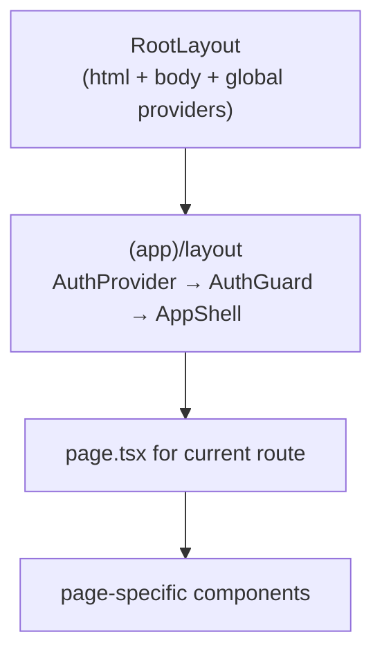

# App shell — Next.js layout, auth, routing

> The browser UI is a Next.js 15 App Router app. This doc covers the top-level shell every page renders inside.

---

## Directory layout

```
apps/web/src/
├── app/
│   ├── (app)/             ← authenticated app — sidebar + topbar
│   │   ├── layout.tsx     ← AuthGuard + AppShell
│   │   ├── agents/
│   │   ├── builder/
│   │   ├── pipelines/
│   │   ├── ml-models/
│   │   ├── code-runner/
│   │   ├── knowledge/
│   │   ├── atlas/
│   │   ├── approvals/
│   │   ├── help/
│   │   ├── admin/
│   │   │   ├── cluster/
│   │   │   ├── archives/
│   │   │   ├── ... (per-section)
│   │   └── ...
│   ├── (auth)/            ← unauthenticated — /login, /signup
│   ├── /                  ← marketing landing
│   ├── /docs/             ← public docs
│   └── /dev-docs/         ← in-app developer documentation viewer (this site)
├── components/
│   ├── builder/
│   ├── share/
│   ├── ui/                ← design-system primitives (Toaster, Modal, etc.)
│   └── observability/
├── hooks/
├── stores/                ← zustand stores
├── lib/
│   ├── api-client.ts      ← apiFetch + ApiError
│   └── ...
└── contexts/
    └── AuthContext.tsx
```

The `(app)/` group is the authenticated app. The folder name in parens is a route-group marker — it doesn't appear in the URL but lets us scope a shared layout (sidebar + topbar) to every page underneath.

---

## The render tree



`RootLayout` ([`apps/web/src/app/layout.tsx`](../../apps/web/src/app/layout.tsx)) installs:
- Tailwind CSS + global styles
- React Query provider
- Theme provider (dark by default)
- OTel browser SDK init (if `NEXT_PUBLIC_OTEL_EXPORTER_OTLP_ENDPOINT` set)

`(app)/layout.tsx` ([`apps/web/src/app/(app)/layout.tsx`](../../apps/web/src/app/(app)/layout.tsx)) adds:
- `AuthProvider` (`AuthContext`)
- `AuthGuard` — redirects to `/login` if no token
- `AppShell` — Sidebar + TopBar + ToastContainer + CommandPalette (⌘K)

---

## AuthGuard

```tsx
function AuthGuard({ children }) {
  const { user, loading } = useAuth();
  const router = useRouter();
  const [checked, setChecked] = useState(false);

  useEffect(() => {
    if (loading) return;
    const token = localStorage.getItem('access_token');
    if (!token || !user) { router.replace('/'); return; }
    setChecked(true);
  }, [loading, user, router]);

  if (loading || !checked) return <FullPageSpinner />;
  return <>{children}</>;
}
```

Reads token + user from localStorage on mount. If missing, redirects to `/`. If present, fetches `/api/auth/me` via the AuthContext to refresh the user object. Renders a spinner until both pass.

`AuthContext` ([`apps/web/src/contexts/AuthContext.tsx`](../../apps/web/src/contexts/AuthContext.tsx)) handles login, logout, refresh, and exposes `useAuth()` everywhere.

---

## AppShell (sidebar + topbar)

```tsx
function AppShell({ children }) {
  const { collapsed } = useSidebar();
  const isMobile = useIsMobile();
  return (
    <div className="h-screen flex flex-col bg-[#0B0F19] overflow-hidden">
      <Sidebar />
      <motion.div
        animate={{ marginLeft: isMobile ? 0 : (collapsed ? 64 : 260) }}
        className="flex-1 flex flex-col min-h-0"
      >
        <TopBar />
        <main className="flex-1 overflow-y-auto p-3 md:p-6">
          {children}
        </main>
        {!isMobile && <StatusBar />}
      </motion.div>
      <ToastContainer />
      <CommandPalette />
      <OfflineBanner />
    </div>
  );
}
```

Note the `<main>` landmark — accessibility-correct out of the box.

The sidebar's contents are derived from `/api/me/permissions` (RBAC-aware menu). Users with insufficient permissions don't see sidebar items they can't open.

---

## Routing conventions

- One file per route: `app/(app)/agents/page.tsx` → `/agents`
- Nested routes use folders: `app/(app)/agents/[id]/page.tsx` → `/agents/abc-123`
- Parallel routes (`@modal` etc.) — we don't use them
- Loading + error UI: every page can drop a `loading.tsx` + `error.tsx` next to its `page.tsx`. Next.js wires them automatically

Client/server boundary: every page that uses `useState` / `useEffect` declares `'use client'` at the top. Pages that fetch on the server are pure server components (rare — we mostly fetch via `apiFetch` in client components for streaming flexibility).

---

## State management

We use **zustand** for global UI state:

| Store | Purpose | Source |
|---|---|---|
| `useSidebar` | collapsed / open / mobile-drawer-open | `apps/web/src/stores/sidebar.ts` |
| `useToastStore` | toast queue + dismiss timers | `apps/web/src/stores/toastStore.ts` |
| `usePipelineStore` | builder pipeline canvas state | `apps/web/src/components/builder/pipeline/usePipelineStore.ts` |
| `useAgentBuilderStore` | builder agent canvas state | per-builder |

Server state goes through **SWR** (via `useApi` hook in `apps/web/src/hooks/useApi.ts`). React Query is loaded but mostly unused — SWR's revalidate-on-focus + per-key cache is good enough.

---

## Mobile fallback

`useIsMobile()` returns true under 768px. The sidebar becomes a drawer. the builder canvas degrades to a simplified form ([`apps/web/src/app/(app)/builder/page.tsx`](../../apps/web/src/app/(app)/builder/page.tsx) mobile branch).

The simplified mobile builder exposes: name, model, system prompt, tools list. The full canvas is desktop-only.

---

## Hydration + suspense

- Components that fetch data render a `<Skeleton />` until data arrives.
- React Suspense is on for the route-level loading boundary (`loading.tsx`).
- We avoid `useLayoutEffect` server-side to prevent hydration mismatch.
- `<motion.*>` from framer-motion is the one place SSR/CSR can disagree — we use `initial={false}` when SSR-rendered to avoid the mismatch.

---

## See also

- [01-builder-canvas](01-builder-canvas.md) — the React Flow agent + pipeline builder
- [02-api-client](02-api-client.md) — apiFetch, error envelope, retry/refresh
- [03-page-catalogue](03-page-catalogue.md) — every route + what it does

---

## Source map

| What | Where |
|---|---|
| **Root layout** | [`apps/web/src/app/layout.tsx`](../../apps/web/src/app/layout.tsx) |
| **Auth-gated `(app)/` layout** | [`apps/web/src/app/(app)/layout.tsx`](../../apps/web/src/app/(app)/layout.tsx) — contains `AuthGuard` |
| **AuthContext (Zustand-style provider)** | [`apps/web/src/contexts/AuthContext.tsx`](../../apps/web/src/contexts/AuthContext.tsx) |
| **Sidebar** | [`apps/web/src/components/layout/Sidebar.tsx`](../../apps/web/src/components/layout/Sidebar.tsx) |
| **Topbar** | [`apps/web/src/components/layout/TopBar.tsx`](../../apps/web/src/components/layout/TopBar.tsx) |
| **Command palette** | [`apps/web/src/components/ui/CommandPalette.tsx`](../../apps/web/src/components/ui/) |
| **Public landing (no auth)** | [`apps/web/src/app/page.tsx`](../../apps/web/src/app/page.tsx) — uses `AuthCard` for sign-in / sign-up |
| **Public docs (`/docs`)** | [`apps/web/src/app/docs/`](../../apps/web/src/app/docs/) — no auth wrapper, opens in new tab from sidebar |
| **SSO callback page** | [`apps/web/src/app/auth/callback/page.tsx`](../../apps/web/src/app/auth/callback/page.tsx) |
