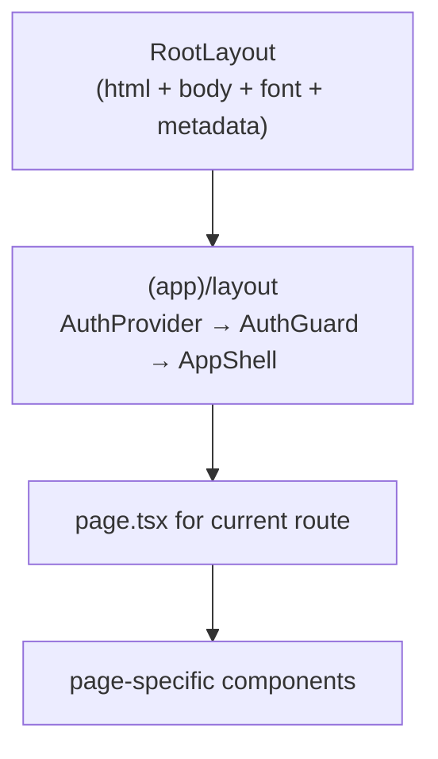

# App shell — Next.js layout, auth, routing

> The browser UI is a Next.js 15 App Router app (React 18). This doc covers the shell every authenticated page renders inside, and how the sidebar decides what to show.

---

## Directory layout

```
apps/web/src/
├── app/
│   ├── layout.tsx         ← RootLayout: html/body, Inter font, metadata
│   ├── page.tsx           ← public landing, sign-in lives in AuthCard
│   ├── not-found.tsx      ← 404
│   ├── error.tsx          ← root error boundary
│   ├── (app)/             ← authenticated app, sidebar + topbar
│   │   ├── layout.tsx     ← AuthProvider → AuthGuard → AppShell
│   │   ├── settings/
│   │   │   └── layout.tsx ← settings left nav
│   │   ├── admin/         ← one folder per admin page
│   │   ├── decisions/ evals/ sources/ approvals/ ...
│   │   └── ...
│   ├── auth/              ← /auth/callback (SSO), /auth/accept-invite
│   ├── docs/              ← public developer docs viewer (this site)
│   ├── oraclenet/         ← public OracleNet page
│   └── demo/              ← redirects to /dashboard
├── components/
│   ├── layout/            ← Sidebar, TopBar, StatusBar, CognifyIndicator, PageHeader
│   ├── builder/           ← agent + pipeline canvas
│   ├── decisions/ evals/ governance/ sources/
│   ├── share/ shared/ observability/ chat/   ← shared/ holds NextSteps and StartHere
│   └── ui/                ← Toast, ConfirmModal, Skeleton, EmptyState, CommandPalette, ...
├── hooks/                 ← useApi, usePageTitle, useMediaQuery, ...
├── stores/                ← zustand stores
├── lib/                   ← api-client, capabilities, per-feature types
└── contexts/
    └── AuthContext.tsx
```

The `(app)/` group is the authenticated app. The folder name in parens is a route-group marker. It doesn't appear in the URL but scopes a shared layout (sidebar + topbar) to every page underneath. There is no `(auth)` group and no `/login` page. Sign-in and sign-up happen on `/`. Every route is listed in [03-page-catalogue](03-page-catalogue.md).

---

## The render tree



`RootLayout` ([`apps/web/src/app/layout.tsx`](../../apps/web/src/app/layout.tsx)) sets `<html lang="en" className="dark">`, loads the Inter font and global CSS, exports the site metadata and renders `OrganizationJsonLd`. It wraps every page in `ToastProvider`, which mounts `ToastContainer` and forwards `apiFetch` warnings into it, so toasts show app-wide, the sign-in page included.

`(app)/layout.tsx` ([`apps/web/src/app/(app)/layout.tsx`](../../apps/web/src/app/(app)/layout.tsx)) adds:
- `AuthProvider` (`AuthContext`)
- `AuthGuard`, which sends you to `/?return_to=<current path>` if there is no token or user
- `AppShell`, which is Sidebar + TopBar + StatusBar + CommandPalette + OfflineBanner

---

## AuthGuard

```tsx
function AuthGuard({ children }) {
  const { user, loading } = useAuth();
  const router = useRouter();
  const [checked, setChecked] = useState(false);

  useEffect(() => {
    if (loading) return;
    const token = localStorage.getItem('access_token');
    if (!token || !user) { router.replace('/'); return; }
    setChecked(true);
  }, [loading, user, router]);

  if (loading || !checked) return <FullPageSpinner />;
  return <>{children}</>;
}
```

`AuthContext` ([`apps/web/src/contexts/AuthContext.tsx`](../../apps/web/src/contexts/AuthContext.tsx)) exposes `useAuth()` with `user`, `loading` and `logout`. On mount it calls `GET /api/auth/me` with the stored token. `logout` calls `/api/auth/logout`, clears both tokens and the user. Token refresh lives in `apiFetch`, not here. The guard waits for the context, then checks `access_token` in `localStorage`. Missing either one redirects to `/`. A spinner shows until both pass.

---

## AppShell (sidebar + topbar)

```tsx
function AppShell({ children }) {
  const { collapsed } = useSidebar();
  const isMobile = useIsMobile();
  return (
    <div className="h-screen flex flex-col bg-[#0B0F19] overflow-hidden">
      <Sidebar />
      <motion.div
        animate={{ marginLeft: isMobile ? 0 : (collapsed ? 64 : 260) }}
        className="flex-1 flex flex-col min-h-0"
      >
        <TopBar />
        <main className="flex-1 overflow-y-auto p-3 md:p-6">
          {children}
        </main>
        {!isMobile && <StatusBar />}
      </motion.div>
      <CommandPalette />
      <OfflineBanner />
    </div>
  );
}
```

- **TopBar** shows a breadcrumb label for the current route (from the sidebar's exported `NAV_ROUTE_LABELS`, then a small `ROUTE_LABELS` map, then the longest known prefix, then the last path segment), a Use Cases menu fed by `GET /api/use-cases`, the Cognify indicator, notifications and the user menu.
- **StatusBar** is a thin footer on desktop. Its counters are static text today.
- **CommandPalette** opens with Cmd/Ctrl+K. It matches a fixed list of pages and actions and also queries `GET /api/search?q=` for agents, pipelines, KBs and the rest. Cmd/Ctrl+N goes to `/builder`.

`/settings/*` pages get a second layout ([`(app)/settings/layout.tsx`](../../apps/web/src/app/(app)/settings/layout.tsx)) with its own left nav. That nav is not gated.

---

## Sidebar and gating

[`Sidebar.tsx`](../../apps/web/src/components/layout/Sidebar.tsx) holds one `NAV_GROUPS` array. Each item is:

```ts
interface NavItem {
  label: string;
  icon: any;
  href: string;
  feature?: string;     // permissions.features key, hidden when false
  adminOnly?: boolean;  // admin role only
  capability?: string;  // permissions.capabilities must hold it
  badge?: string;
  orCapability?: string; // shown without the feature when this capability is held
  liveCount?: 'reviews' | 'inbox'; // badge from a live count
  external?: boolean;   // open in a new tab
  requires?: 'marketplace' | 'monetization'; // runtime switch
}
```

The groups, in order:

| Group | Open by default | Items |
|---|---|---|
| PINNED | always, can't collapse | Needs you (with the live total), Dashboard, My Agents, AI Chat, Alerts |
| BUILD | yes | Agent Builder, Manage agents, Tools Catalogue, Decisions, Source Watch, Code Runner, ML Models, Knowledge Bases, Persona KB, Portfolio Schemas, BPM Analyzer, Atlas |
| RUN & TEST | yes | SDK Playground, Load Playground, Triggers, Evaluations, Meetings |
| MONITOR | yes | Observability, Executions, Live Debug, Analytics, Moderation, Autonomy |
| MARKETPLACE | no | Marketplace, Creator Hub. Both hidden while the marketplace switch is off. The sidebar reads it from `GET /api/platform/features` |
| ADMIN | no | Cluster Health, Scaling, Tool Scaling, Pipeline Scaling, Archives, Dead Letter Queue, Audit log, Models catalogue, Market data, Model Selection, Tool Configuration, LLM Pricing, Connectors, Marketplace & Billing, Events, Risk & Controls, Team, Roles, Permissions |
| WORKSPACE | yes | Approvals, Review inbox (with a live count of held content), MCP Servers, Edge, API Keys, Cognify config, GDPR (right to erasure), Integrations, Settings, Help, Developer docs |

Each item's gate is listed in [03-page-catalogue](03-page-catalogue.md#sidebar-pages).

### Essentials and all tools

The sidebar has two modes. **Essentials** is the default for every role. It shows a short flat list:

| Who | Items |
|---|---|
| everyone | Needs you, Home (`/dashboard`), Agents, AI Chat, Knowledge, Monitor (`/executions`) |
| creators and admins | Agent Builder, Autonomy |
| admins | an Admin entry that opens to the admin pages |

Each essential is the same `NavItem` as in the full list, so the same gates apply. When the current page is not in the short list it shows under "You are here", so a page opened from the palette or a link never leaves the person without a marker.

**Show all tools** at the bottom of the sidebar switches to the full grouped list above, with every entry, gate and live count. The choice is saved per user with `PUT /api/me/ui-prefs` (`{"sidebar_mode": "all"}` or `"essentials"`) and read back with `GET /api/me/ui-prefs`. It lives in the user's settings JSON under `ui`. `localStorage` key `abenix.sidebar.mode` only paints the first frame, and the server value wins once it lands. Every page stays reachable from the full list or the command palette.

### Where the permissions come from

The sidebar calls `GET /api/me/permissions` ([`apps/api/app/routers/me.py`](../../apps/api/app/routers/me.py)) once through `useApi`. The response:

```json
{
  "user_id": "…", "tenant_id": "…", "email": "…", "name": "…",
  "role": "creator",
  "is_admin": false,
  "features": { "use_builder": true, "manage_settings": false, "…": true },
  "capabilities": ["decisions.author", "decisions.evaluate", "decisions.view", "…"]
}
```

- `features` comes from `features_for(user)` in `apps/api/app/core/permissions.py`. It starts from the `user` row of `ROLE_FEATURES` and overlays the role's row. Roles are `user`, `creator` and `admin`. `review_queue`, `manage_team`, `manage_settings`, `manage_ontology` and `publish_to_marketplace` are off for `user`.
- `capabilities` comes from `capabilities_for(db, user)` in `apps/api/app/core/capabilities.py`. It is the role's `ROLE_DEFAULTS` plus every permission set assigned to the user on `/admin/permissions`. Results are cached per user for ten seconds.
- `is_admin` is true when the role is `admin`.

### The filter

```ts
const ADMIN_DEFAULT_FEATURES = ['review_queue', 'manage_settings', 'manage_team'];
export function itemVisible(item, { perms, isAdmin, switches }) {
  if (item.adminOnly && !isAdmin) return false;
  if (item.requires && !switches[item.requires]) return false;
  if (item.capability && !holds(perms?.capabilities, item.capability)) return false;
  const viaCapability = !!item.orCapability && holds(perms?.capabilities, item.orCapability);
  if (item.feature && features[item.feature] === false && !viaCapability) return false;
  if (item.feature && !perms && ADMIN_DEFAULT_FEATURES.includes(item.feature) && !isAdmin) return false;
  return true;
}
```

Both modes use `itemVisible`. `visibleNavGroups(ctx)` builds the full list and `essentialItems(ctx, role)` the short one.

- `isAdmin` is true when `perms.is_admin` is true or the signed-in user's role is `admin`.
- A `feature` item is hidden only when the flag is explicitly `false`. An unknown flag shows.
- A `capability` item is hidden until the permissions land, then shown only if `holds()` says yes.
- The three admin-default features stay hidden for non-admins until the call lands, so a slow network never flashes admin items.
- A group with no visible items is dropped, header and all.

`holds()` lives in [`apps/web/src/lib/capabilities.ts`](../../apps/web/src/lib/capabilities.ts) and mirrors the server. A grant matches on `*`, the exact key, `group.*`, or the key without its `:qualifier` (`approvals.sign` covers `approvals.sign:legal`). The same file exports `useMyPermissions()` and `useCapability(cap)` for pages.

The sidebar is UX only. Route handlers enforce access, either with `require_role` or `require_capability(cap)`, which returns 403 with "This needs the X capability". Pages that guard themselves (Decisions, Evaluations, Risk and Controls, Permissions, the Events page and others in [2.5 pages](03-page-catalogue.md#abenix-25-pages)) call `useMyPermissions()` and swap the controls for a "needs X" note.

### Other sidebar behaviour

- Open and closed groups persist in `localStorage` under `abenix.sidebar.groups`.
- The mode persists on the server, see above.
- Needs you carries the live total from `GET /api/me/inbox-counts`. Review inbox keeps its own count of held content.
- Links in a closed group stay in the DOM and are hidden with CSS, so keyboard nav, screen readers and tests still find them.
- An item is active on an exact path match. Settings is also active on any `/settings/*` path except `/settings/team` and `/settings/api-keys`, which have their own items.
- The four tiles at the top read `GET /api/analytics/live-stats`.
- Collapsed mode shows icons only. On mobile the sidebar is a drawer that closes on a left swipe.

---

## Needs you inbox

`/inbox` ([`(app)/inbox/page.tsx`](../../apps/web/src/app/(app)/inbox/page.tsx)) is one place for everything waiting on the signed-in person. Each tab shows a count and the items with their buttons inline. The full pages stay the detailed views, and each tab links to its own.

| Tab | Who sees it | What is in it | Reused from |
|---|---|---|---|
| Approvals | everyone, the count is what you can sign | agent action cards, autonomy promotions, decision publishes, agent gates | `ApprovalActionRow` and a compact approve or deny row |
| Watching reviews | `actions.review` | autonomy actions in Watching that nobody has answered | `ReviewQueue` |
| Held content | `moderation.review` | content a moderation policy held for review | `HeldInbox` |
| Marketplace submissions | admins, while the marketplace is on | agents waiting for approval | `MarketplaceSubmissions` |
| Alerts | `view_alerts` | failure causes that are new today or up on the day before | `/api/me/inbox/alerts` |

The busiest tab opens first. `?tab=` picks one. With nothing waiting the page says "Nothing needs you right now" and lists what will show up there.

Counts come from `GET /api/me/inbox-counts` ([`inbox.py`](../../apps/api/app/routers/inbox.py)). It runs one query per source, scoped to the caller's tenant and capabilities, and keeps the answer for 15 seconds per user. `?fresh=1` skips that cache. [`lib/inbox.ts`](../../apps/web/src/lib/inbox.ts) polls it every 60 seconds while the browser tab is visible, and fetches fresh when the notifications socket reports a moderation queue change or an approval, review or marketplace notification, and after every inline decision.

---

## Routing conventions

- One file per route: `app/(app)/agents/page.tsx` → `/agents`
- Nested routes use folders: `app/(app)/agents/[id]/info/page.tsx` → `/agents/abc-123/info`
- Old URLs redirect from their own `page.tsx` (`/agents/new`, `/settings/api`, `/webhooks`, `/dev-docs`, `/demo`)
- No parallel routes (`@modal` etc.)
- No route-level `loading.tsx`. The only `error.tsx` and `not-found.tsx` are at the app root

Pages are client components (`'use client'`) that fetch through `useApi` or `apiFetch`. The landing page, `/docs` and most redirect-only pages are server components.

---

## Page header, Start here and next steps

Every page under `(app)/` opens with the same block, [`PageHeader`](../../apps/web/src/components/layout/PageHeader.tsx). It holds:

- the title
- one plain sentence on what the page is for and who it is for (`data-testid="page-purpose"`)
- the primary action, always above the fold and full width on phones (`data-testid="page-primary-action"`), plus an optional secondary action
- a "How this works" panel with two to four short steps. It is open on the first visit and collapsed after that unless the person reopens it. The state lives in `localStorage` under `pageHeader.how.<storageKey>`, and a blocked storage just means the panel opens again
- a Docs link to `/docs?doc=<slug>`, where the slug comes from `docs/manifest.json`

The block carries `data-testid="page-header"`. A page that already had its own test ids passes them through `titleTestId`, `howTestId` and `howToggleTestId`, and a button keeps its id through the action's `testId`. The redirect pages (`/agents/new`, `/agents/{id}`, `/settings`, `/settings/api`, `/webhooks`, `/dev-docs`) have no header. Neither does `/builder`, a full-height canvas whose own top bar does the job.

The dashboard shows **Start here**, a short checklist picked by role ([`StartHere.tsx`](../../apps/web/src/components/shared/StartHere.tsx)). It reads `GET /api/me/journey` ([`journey.py`](../../apps/api/app/routers/journey.py)), and every tick comes from real data in the caller's tenant:

| Role | Steps |
|---|---|
| admin | connect a model, invite the team (more than one user), review risk policies (page visited or a policy changed), turn on moderation |
| creator | build an agent, run it, give it knowledge (a bound knowledge base), add tests (a suite with cases), enrol an action in Autonomy, list it in the marketplace (only while the marketplace is on) |
| user | try an agent in chat, give feedback or answer a review |

Each step has a plain title, one line on why it matters, a button to the exact place and a done check. A progress bar sits on top. Hiding the guide calls `PUT /api/me/journey` with `{"dismissed": true}`, and a small "Show the Start here guide" link brings it back. Both live in the user's settings JSON under `journey`. The risk page calls `POST /api/me/journey/seen` with `{"step": "risk"}` on load. When every step is done the card celebrates once and then steps aside.

After a success the page shows [`NextSteps`](../../apps/web/src/components/shared/NextSteps.tsx), two to four cards with an icon, a label and one line each. Examples are publishing an agent (try it in chat, add tests, give it knowledge, enrol its actions), creating a knowledge base, uploading an ML model, a code asset turning ready, a first good run, a new trigger, an enrolled action and a new decision.

---

## State management

**zustand** for global UI state:

| Store | Purpose | Source |
|---|---|---|
| `useSidebar` | collapsed, mobile drawer open | `apps/web/src/stores/sidebar.ts` |
| `useToastStore` | toast queue + dismiss timers | `apps/web/src/stores/toastStore.ts` |
| `useNotificationStore` | top bar notifications | `apps/web/src/stores/notificationStore.ts` |
| `useChatStore` | chat page state | `apps/web/src/stores/chatStore.ts` |
| `usePipelineStore` | pipeline canvas state | `apps/web/src/components/builder/pipeline/usePipelineStore.ts` |

Agent-mode builder state is local React state inside the builder page.

Server state goes through **SWR** via `useApi` ([`apps/web/src/hooks/useApi.ts`](../../apps/web/src/hooks/useApi.ts)). See [02-api-client](02-api-client.md#useapi).

---

## Mobile fallback

`useIsMobile()` returns true under 768px. The sidebar becomes a drawer and the StatusBar is hidden. The builder swaps the canvas for a simple form ([`apps/web/src/app/(app)/builder/page.tsx`](../../apps/web/src/app/(app)/builder/page.tsx) mobile branch) with name, model, system prompt and tools.

---

## Loading states

- Components that fetch render a `<Skeleton />` or pulse blocks until data arrives.
- There is no route-level `loading.tsx`. `/docs`, `/agents/{id}/chat` and `/evals/compare` wrap their search-param readers in `<Suspense>`.

---

## See also

- [01-builder-canvas](01-builder-canvas.md) — the React Flow agent + pipeline builder
- [02-api-client](02-api-client.md) — apiFetch, useApi, error envelope, refresh
- [03-page-catalogue](03-page-catalogue.md) — every route + what it does

---

## Source map

| What | Where |
|---|---|
| **Root layout** | [`apps/web/src/app/layout.tsx`](../../apps/web/src/app/layout.tsx) |
| **Auth-gated `(app)/` layout** | [`apps/web/src/app/(app)/layout.tsx`](../../apps/web/src/app/(app)/layout.tsx) — contains `AuthGuard` and `AppShell` |
| **Settings layout** | [`apps/web/src/app/(app)/settings/layout.tsx`](../../apps/web/src/app/(app)/settings/layout.tsx) |
| **AuthContext** | [`apps/web/src/contexts/AuthContext.tsx`](../../apps/web/src/contexts/AuthContext.tsx) |
| **Sidebar** | [`apps/web/src/components/layout/Sidebar.tsx`](../../apps/web/src/components/layout/Sidebar.tsx) |
| **Capability helpers** | [`apps/web/src/lib/capabilities.ts`](../../apps/web/src/lib/capabilities.ts) |
| **Permissions endpoint** | [`apps/api/app/routers/me.py`](../../apps/api/app/routers/me.py), [`apps/api/app/core/permissions.py`](../../apps/api/app/core/permissions.py), [`apps/api/app/core/capabilities.py`](../../apps/api/app/core/capabilities.py) |
| **Page header, Start here, next steps** | [`PageHeader.tsx`](../../apps/web/src/components/layout/PageHeader.tsx), [`StartHere.tsx`](../../apps/web/src/components/shared/StartHere.tsx), [`NextSteps.tsx`](../../apps/web/src/components/shared/NextSteps.tsx), [`journey.py`](../../apps/api/app/routers/journey.py) |
| **Needs you inbox** | [`apps/web/src/app/(app)/inbox/page.tsx`](../../apps/web/src/app/(app)/inbox/page.tsx), [`apps/web/src/components/inbox/`](../../apps/web/src/components/inbox/), [`apps/web/src/lib/inbox.ts`](../../apps/web/src/lib/inbox.ts), [`apps/api/app/routers/inbox.py`](../../apps/api/app/routers/inbox.py) |
| **Topbar** | [`apps/web/src/components/layout/TopBar.tsx`](../../apps/web/src/components/layout/TopBar.tsx) |
| **Command palette** | [`apps/web/src/components/ui/CommandPalette.tsx`](../../apps/web/src/components/ui/CommandPalette.tsx) |
| **Public landing (no auth)** | [`apps/web/src/app/page.tsx`](../../apps/web/src/app/page.tsx) — `AuthCard` in the hero handles sign-in and sign-up |
| **Public docs (`/docs`)** | [`apps/web/src/app/docs/`](../../apps/web/src/app/docs/) — no auth wrapper, opens in a new tab from the sidebar |
| **SSO callback page** | [`apps/web/src/app/auth/callback/page.tsx`](../../apps/web/src/app/auth/callback/page.tsx) |
