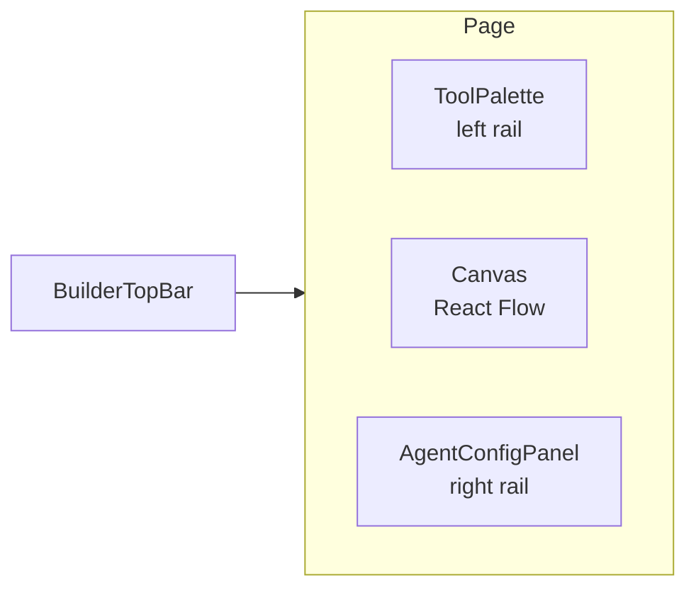
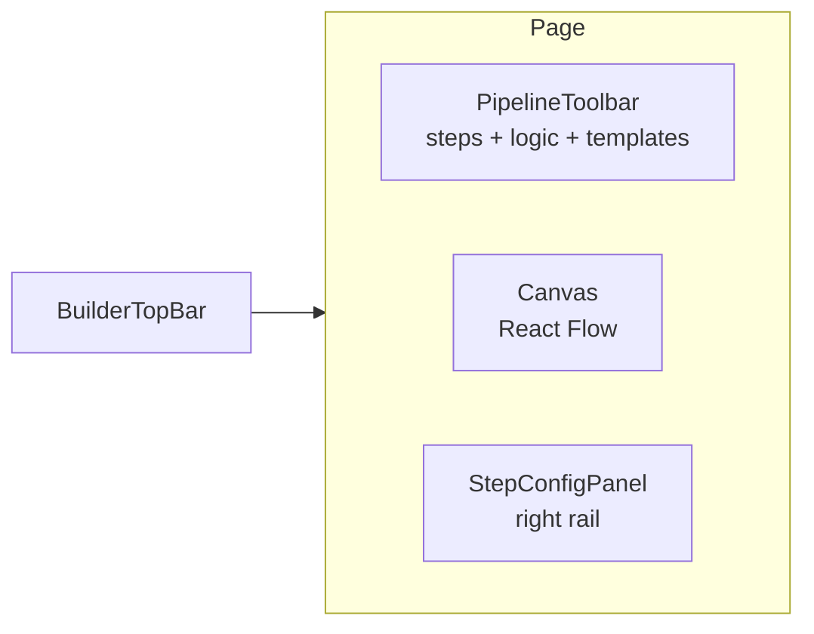
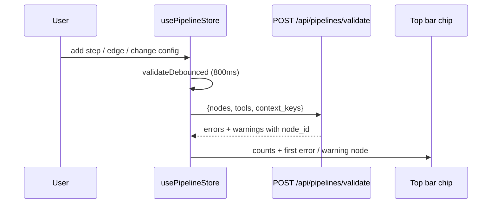

# Builder canvas

> The Agent Builder is two canvases in one page. Agent mode is a single LLM with tools, drawn as a star. Pipeline mode is a DAG of steps with branches, merges and for-each. Both ride on React Flow (`reactflow` 11).

---

## Two modes, one route

`/builder` and `/builder?agent={id}` both render [`apps/web/src/app/(app)/builder/page.tsx`](../../apps/web/src/app/(app)/builder/page.tsx). When it loads an agent it checks `model_config.mode`. `pipeline` with a `pipeline_config` opens Pipeline mode, anything else opens Agent mode.

| `mode` | Canvas | State |
|---|---|---|
| `agent` (default) | Star: the agent node in the centre, tool, knowledge and MCP nodes around it | local React state in the page |
| `pipeline` | DAG: typed step nodes and edges | `usePipelineStore` (zustand) |

The Agent / Pipeline toggle in `BuilderTopBar` swaps between them. The help icon next to it explains the difference.

If the API says `can_edit: false`, the page shows a read-only banner with a link to duplicate the agent from its info page.

---

## Top bar

[`BuilderTopBar.tsx`](../../apps/web/src/components/builder/BuilderTopBar.tsx) holds:

- agent name
- the mode toggle
- the validation chip (Validating, N errors, N warnings, or Valid). Clicking errors or warnings jumps to the first bad node
- Run Pipeline (Pipeline mode, saved agents only). When the pipeline declares input parameters, [`RunInputsDialog`](../../apps/web/src/components/builder/pipeline/RunInputsDialog.tsx) asks for them first
- Test, which opens `/agents/{id}/chat`
- the AI checks chip, the model AI Validate and Build with AI use. It is read only here and comes from the `builder_model` setting an admin sets
- AI Validate and Build with AI
- Save Draft and Publish. Publish needs a saved draft and opens [`PublishDialog`](../../apps/web/src/components/builder/PublishDialog.tsx), where you pick who sees the agent

Once the agent has an id, every change autosaves 500ms after it is made.

`/builder` has no `PageHeader`. The top bar stands in for it and carries the same test ids (`page-header`, `page-purpose`, and `page-primary-action` around Save Draft and Publish), so the lostness gate checks it like any other page, see [08-howto/03-add-a-page](../08-howto/03-add-a-page.md#passing-the-lostness-gate).

---

## Canvas anatomy (Agent mode)

- **ToolPalette** is a searchable list of registered tools by category. Drop a tool on the canvas to add a tool node, wired to the agent node.
- **Canvas** has the node types in [`components/builder/nodes.tsx`](../../apps/web/src/components/builder/nodes.tsx): `agent`, `tool`, `knowledge` and `mcp`. Background dots, zoom controls and a mini-map are always rendered.
- **AgentConfigPanel** shows the selected node. With the agent node selected it covers name, description, model, temperature, max tokens, max iterations, system prompt, input parameters, example prompts, risk tier, output schema, knowledge bases and Atlas graphs, MCP servers, runtime pool and replicas, and edge compatibility. With a tool node selected it covers that tool's `tool_config` (usage instructions, parameter defaults, max calls, require approval). Some tools have their own config form in [`components/builder/tool-configs/`](../../apps/web/src/components/builder/tool-configs/).

---

## Canvas anatomy (Pipeline mode)

- **PipelineToolbar** ([`PipelineToolbar.tsx`](../../apps/web/src/components/builder/pipeline/PipelineToolbar.tsx)) lists every tool from `GET /api/tools` grouped by category, with a short built-in list if that call fails. `agent_step` runs a whole agent as a step. Below the tools sit the logic nodes Condition, Switch, Merge, Output and For Each, and two Quick Templates, Parallel compare and Sequential chain. Click or drag to add.
- **Canvas** registers `pipelineNodeTypes` from [`PipelineNodes.tsx`](../../apps/web/src/components/builder/pipeline/PipelineNodes.tsx): `pipelineStep`, `agentStep`, `condition`, `switchNode`, `mergeNode`, `forEachStep` and `output`. Connecting two handles goes through `isValidConnection`, which refuses an edge that would make a cycle.
- **StepConfigPanel** ([`StepConfigPanel.tsx`](../../apps/web/src/components/builder/pipeline/StepConfigPanel.tsx)) edits the selected step in the tabs General, Arguments, Inputs, Condition and Retry. Arguments is a form built from the tool's parameter docs, with `{{node.field}}` and `{{context.x}}` templating. A number field takes a number or a reference such as `{{input.gas_price}}`, and says which when the text is neither. A list field takes values separated by commas, or one reference that passes a whole upstream list such as `{{curve.points}}`. Numeric lists are saved as numbers. `llm_call`, `agent_step` and `github_tool` get their own forms. A dependency editor mirrors dragging an edge. Inputs maps fields from upstream steps. Condition gates the step on an upstream field. Retry sets max retries with backoff. Switch steps get a cases editor.
- **Pipeline Settings** is what the right rail shows when no step is selected. It holds the pipeline's description, shown on its chat page and in the agent list, lists client-side validation problems and holds the pipeline's input parameters.
- **PipelineExecutionViewer** shows the result after Run pipeline.

### Declared inputs

Input parameters are edited with [`InputVariablesEditor`](../../apps/web/src/components/builder/InputVariablesEditor.tsx), in Agent mode on the agent node and in Pipeline mode under Pipeline Settings. Each one has a name, a type (`string`, `number`, `boolean`, `file`, `url`, `select` or `connection_string`), a description, a required flag and an optional default.

They save to `model_config.input_variables`, with blank names dropped. The page also pushes the names into the store as `agentContextKeys`, and the server validator gets them as `context_keys`, so `{{context.<name>}}` in a step is known and not flagged.

### Decisions in a pipeline

There is no decision node. A decision is called through the decision tools (`decision_evaluate`, `decision_explain`, `decision_compare`, `decision_test`, `decision_list`, `decision_propose`) as an ordinary tool step. For any `decision_*` tool, the `decision` argument is a picker fed by `GET /api/decisions`. It warns when the chosen decision has no published version yet, since the step fails until one is, and links to `/decisions`.

### Code assets in a pipeline

A `code_asset` step picks the asset from a list fed by `GET /api/code-assets`, the same assets the agent builder offers. Only ready assets can be picked, an asset still building or failed shows its status, and when the asset declares an input schema the picker lists the fields it reads, required ones marked `*`. The step saves the asset id. A reference in the field is kept as text, so a step can still take the asset from an upstream value.

### The store

[`usePipelineStore.ts`](../../apps/web/src/components/builder/pipeline/usePipelineStore.ts) holds:
- `steps` and `edges`
- `validation`: `{errors, warnings, isValidating, lastValidatedAt}`
- `execution`: live run state for Run pipeline
- `agentTools` and `agentContextKeys`
- `selectedStepId` and `dirty`

On save the page writes `model_config.mode = 'pipeline'`, `model_config.pipeline_config = serialize()` (`{nodes, edges, viewport}`, with each node in the engine's snake_case DSL) and `model_config.tools` derived from the steps. The rest of the agent config travels in the same `model_config`.

---

## Validation

- Server validation runs 800ms after the last pipeline change. It is the source of the chip count.
- `validatePipeline()` in [`pipelineUtils.ts`](../../apps/web/src/components/builder/pipeline/pipelineUtils.ts) runs in the browser for the Pipeline Settings list. It checks for cycles among other things.
- `isValidConnection` stops a cyclic edge before it exists.

Clicking the chip calls `onFocusErrorNode(nodeId)`, which:
1. Selects the node and opens its config panel
2. Calls `fitView({nodes: [node]})` to bring it into view

Agent mode has no DAG, so the chip only matters in Pipeline mode.

---

## Drag-drop semantics

- Agent mode: drop a tool from the palette and a tool node appears with an edge to the agent node.
- Pipeline mode: drop or click a tool or logic node to add a step. Drag between handles to add an edge, refused if it would make a cycle.
- Drag a node by its body to move it. Drag the background to pan. Scroll to zoom.

---

## Deep links

| URL | Effect |
|---|---|
| `/builder?agent={id}` | Open an existing agent or pipeline |
| `/builder?tool=ml_model&model_name=foo` | New agent with `ml_model` pre-added and `parameter_defaults` set to `model_name=foo`, `operation=predict` |
| `/builder?tool=code_asset&asset_id={uuid}` | New agent with `code_asset` pre-added and `parameter_defaults.code_asset_id` set to that id |
| `/builder?atlas={graphId}` | New agent with `atlas_search_grounded` and `atlas_describe`, bound to that graph |
| `/builder?kb={collectionId}` | New agent with `knowledge_search`, bound to that collection |
| `/builder?tool={slug}` | New agent with any other tool pre-added, for example `portfolio_<domain>` from Portfolio Schemas. `name` and `prompt` prefill the agent name and system prompt |
| `/builder?tool=persona_rag&persona_scope={scope}` | New persona agent with `persona_rag` pinned to that scope, default `self` |

`atlas` and `kb` can be combined. These power the "Use in an agent" buttons on ML Models, Code Runner, Atlas, Knowledge Bases, Portfolio Schemas, Persona KB, Decisions, Source Watch, Connectors and the Tools Catalogue.

---

## Mobile

Under 768px the canvas is replaced by a form with name, model, system prompt and tools. The top bar stays the same.

---

## Custom nodes

Every node type is a React component registered with React Flow:

- [`apps/web/src/components/builder/nodes.tsx`](../../apps/web/src/components/builder/nodes.tsx) — agent canvas nodes (Agent, Tool, Knowledge, MCP)
- [`apps/web/src/components/builder/pipeline/PipelineNodes.tsx`](../../apps/web/src/components/builder/pipeline/PipelineNodes.tsx) — pipeline nodes (Step, Agent step, Condition, Switch, Merge, For Each, Output)

To add a new pipeline node type:
1. Add a React component with handles for incoming and outgoing edges.
2. Register it in `pipelineNodeTypes`.
3. Add it to `LOGIC_NODES` in `PipelineToolbar.tsx` if it isn't a tool.
4. Teach `serializeConfig` and `deserializeConfig` in `pipelineUtils.ts` its fields, and add its config to `StepConfigPanel`.
5. Update `validatePipeline` and the server validator.
6. Update the runtime (`apps/agent-runtime/engine/pipeline.py`) to execute it.

A new tool needs none of this. It shows up in the toolbar from `/api/tools`.

---

## AI Validate and Build with AI

- **AI Validate** ([`AIValidateDialog.tsx`](../../apps/web/src/components/builder/AIValidateDialog.tsx)) posts to `/api/agents/{id}/validate-smart` for a saved agent, or `/api/pipelines/validate-smart` for an unsaved pipeline draft.
- **Build with AI** ([`AIBuilderDialog.tsx`](../../apps/web/src/components/builder/AIBuilderDialog.tsx)) posts a description to `/api/ai/build-iterative` or `/api/ai/build-agent` (`apps/api/app/routers/ai_builder.py`). The API calls the LLM router directly. The returned config goes through `applyAIConfig`, which switches mode if needed and fills the canvas without a reload.

---

## See also

- [02-runtime/01-pipelines](../02-runtime/01-pipelines.md) — what the canvas serialises into
- [02-api-client](02-api-client.md) — error envelope
