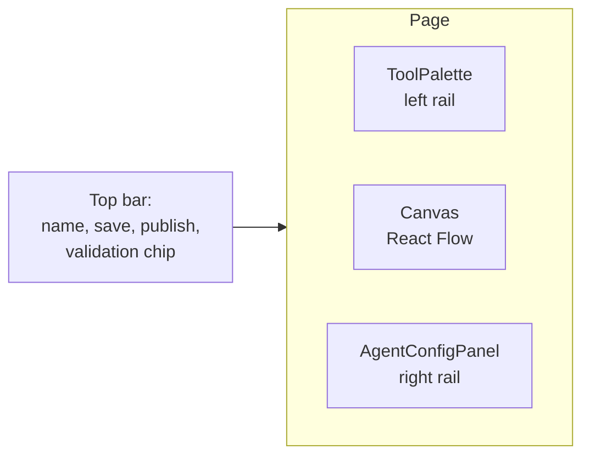
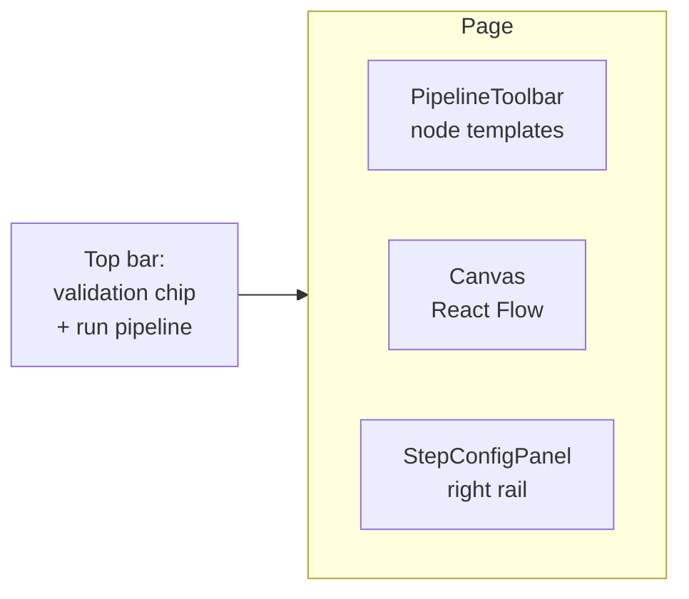
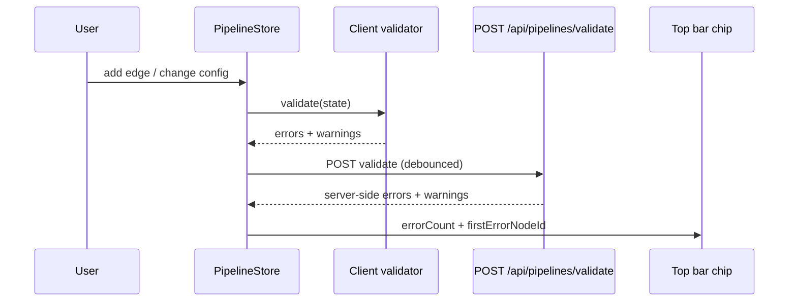

# Builder canvas

> The Agent Builder is two canvases in one page — Agent mode (single LLM + tools, like a star graph) and Pipeline mode (DAG with branches, loops, parallel fan-out). Both ride on React Flow.

---

## Two modes, one route

`/builder` and `/builder?agent={id}` both render [`apps/web/src/app/(app)/builder/page.tsx`](../../apps/web/src/app/(app)/builder/page.tsx). The page reads `model_config.mode` from the loaded agent and switches the canvas:

| `mode` | Canvas | Store |
|---|---|---|
| `agent` (default) | Star: an agent node in the centre, tool nodes orbiting | useAgentBuilder hooks (local state) |
| `pipeline` | DAG: typed nodes + edges, topo-sortable | `usePipelineStore` (zustand) |

The mode toggle in the topbar (`BuilderTopBar`) swaps between them.

---

## Canvas anatomy (Agent mode)

- **ToolPalette** — searchable list of registered tools + categories. Drag-drop a tool onto the canvas to add it as a node + wire it to the agent node.
- **Canvas** — React Flow instance. The agent node is fixed centre. tool nodes can be repositioned freely. Edges are auto-drawn.
- **AgentConfigPanel** — right-rail showing the currently-selected node's config. Agent node selected → name/model/temperature/system prompt. Tool node selected → tool_config block (usage_instructions, parameter_defaults, max_calls, require_approval).

---

## Canvas anatomy (Pipeline mode)

- **PipelineToolbar** — palette of node types (agent, tool, switch, for-each, parallel, human gate).
- **Canvas** — React Flow with bidirectional edge dragging.
- **StepConfigPanel** — selected-node config: agent_slug, inputs templating, etc.

The store ([`apps/web/src/components/builder/pipeline/usePipelineStore.ts`](../../apps/web/src/components/builder/pipeline/usePipelineStore.ts)) holds:
- `steps` — array of node definitions
- `edges` — array of edge tuples
- `validation` — `{errors, warnings, isValidating}` updated on every mutation
- `execution` — live run state when "Run pipeline" is active

Save serialises `{steps, edges, output}` to `agent.model_config_.pipeline_config`.

---

## Validation

Both modes validate on every change (debounced ~300ms). Validation runs both client- and server-side:

The **validation chip** in the top bar shows the count. Clicking it calls `onFocusErrorNode(firstErrorNodeId)` which:
1. Selects the offending node in the canvas
2. Opens its config panel
3. Calls `reactFlow.fitView({nodes: [that_node]})` to scroll the canvas to it

That's the audit-pass-1 fix — pipeline errors are now navigable.

---

## Drag-drop semantics

- Drag a tool from the palette → drops onto the canvas → instantiates a new tool node + auto-wires an edge to the agent node.
- Drag between two handles on the canvas → creates an edge if `isValidConnection()` permits (e.g. no cycles, no duplicate edges).
- Drag a node by its body → moves it.
- Drag the canvas background → pans.
- Scroll on the canvas → zooms.

The mini-map (bottom-right corner of the canvas) is always rendered.

---

## Deep-link from a model / asset

The audit-pass-1 work added URL-param presetting:

| URL | Effect |
|---|---|
| `/builder?tool=ml_model&model_name=foo` | New agent canvas with `ml_model` tool pre-added, `parameter_defaults.model_name=foo` pre-filled |
| `/builder?tool=code_asset&asset_id=<uuid>` | New agent canvas with `code_asset` tool pre-added, `parameter_defaults.asset_id=<uuid>` pre-filled |

This is what powers the "Use in Agent" buttons on the ML Models and Code Runner detail pages.

---

## Custom nodes

Every node type has a corresponding React component registered with React Flow via the `nodeTypes` map. They live in:

- [`apps/web/src/components/builder/`](../../apps/web/src/components/builder/) — agent canvas nodes (Agent, Tool, MCP)
- [`apps/web/src/components/builder/pipeline/PipelineNodes.tsx`](../../apps/web/src/components/builder/pipeline/PipelineNodes.tsx) — pipeline nodes (Agent, Tool, Switch, ForEach, Parallel, Human)

To add a new node type:
1. Add a React component (returns JSX with handles for incoming/outgoing edges).
2. Register in `nodeTypes`.
3. Add to the palette.
4. Update the validator.
5. Update the runtime (in `apps/agent-runtime/engine/pipeline.py`) to know how to execute the new type.

---

## AI Builder (sidekick)

The toolbar's `AI Validate` and `Build with AI` buttons open dialogs that submit the current draft to a meta-agent (`wingman-arb-analyzer` for finance, `creator-aibuilder` for general). The meta-agent returns suggestions or a complete config which is then applied to the canvas via `applyAIConfig`.

See [`apps/web/src/components/builder/AIBuilderDialog.tsx`](../../apps/web/src/components/builder/AIBuilderDialog.tsx) and `AIValidateDialog.tsx`.

---

## See also

- [02-runtime/01-pipelines](../02-runtime/01-pipelines.md) — what the canvas serialises into
- [02-api-client](02-api-client.md) — error envelope (validation errors flow through it)
