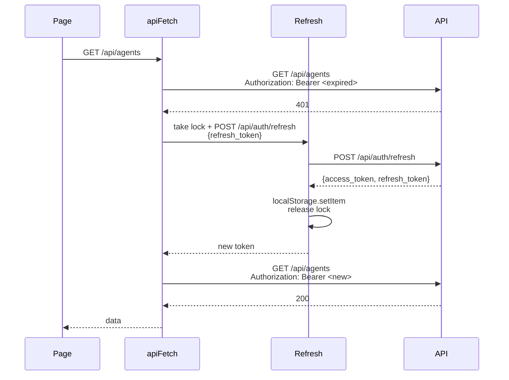

# API client + error envelope + toast layer

> Every fetch on the frontend goes through `apiFetch`. This doc covers what it does, why mutating calls throw, and how errors surface to the user.

---

## `apiFetch` — the single entry point

```ts
async function apiFetch<T>(path: string, options: FetchOptions = {}): Promise<ApiResponse<T>>
```

Source: [`apps/web/src/lib/api-client.ts`](../../apps/web/src/lib/api-client.ts).

Defaults to:
- `GET` if no method
- Bearer auth (reads `access_token` from `localStorage`)
- 401 auto-refresh via refresh-token
- Throws `ApiError` on **mutating** non-2xx (POST / PUT / PATCH / DELETE)
- Returns `{data:null, error, errorDetail}` silently on **read** non-2xx

The difference (throw vs silent) matters because the calling code is structurally different:

- Read paths (list pages, detail pages) want to render a "no data" empty state on 404. Throwing would crash the page.
- Write paths want try/catch + toastError. Silent returns lead to silent failures.

The default is set by the HTTP method but can be overridden with `throwOnError`.

---

## The structured error envelope

Every non-2xx response from the platform looks like:

```json
{
  "data": null,
  "error": {
    "message": "Replicas must be between 1 and 10",
    "code": 400,
    "error_code": "INVALID_REPLICAS",
    "details": {"received": 25}
  }
}
```

`apiFetch` parses this into an `ApiError`:

```ts
class ApiError extends Error {
  status: number;
  errorCode?: string;
  details?: Record<string, unknown>;
}
```

Frontend code branches on `errorCode`, not on the (translatable) `message`:

```ts
try {
  await apiFetch('/api/ml-models/.../deploy', { method: 'POST', body: ... });
} catch (e) {
  if (e instanceof ApiError && e.errorCode === 'INVALID_REPLICAS') {
    // Show field-level error on the replicas input
  } else {
    toastError('Deploy failed', (e as any).message);
  }
}
```

### Stable error codes catalogue

| `error_code` | When | Details payload |
|---|---|---|
| `NETWORK_ERROR` | fetch threw before getting a response | — |
| `SESSION_EXPIRED` | 401 after refresh attempt | — |
| `RATE_LIMITED` | 429 | `retry_after_seconds` |
| `VALIDATION_ERROR` | 422 (pydantic body validation) | `errors[]` per RFC 7807 |
| `NOT_FOUND` | 404 | — |
| `FORBIDDEN` | 403 — missing share or role | — |
| `INVALID_REPLICAS` | ML deploy with replicas outside 1-10 | `received` |
| `INVALID_RESOURCE_PRESET` | ML deploy with unknown preset | `received` |
| `TENANT_QUOTA_EXCEEDED` | hit a per-tenant cap | `quota_name`, `limit` |
| `APPROVAL_REQUIRED` | a tool call needs human signoff | `approval_id` |

New backend error sites should pass `error_code` + `details` to the [`error()` helper](../../apps/api/app/core/responses.py).

---

## The toast layer

The frontend's user-visible error/success feedback runs through `useToastStore` ([`apps/web/src/stores/toastStore.ts`](../../apps/web/src/stores/toastStore.ts)).

```ts
import { toastSuccess, toastError } from "@/stores/toastStore";

toastSuccess("Saved", "Model metadata updated");
toastError("Save failed", e?.message || "Unknown error");
```

Toast rendering uses framer-motion + the `ToastContainer` mounted in the app layout. Max 5 visible at a time. auto-dismiss in 5s. manual dismiss via the × button.

### Convention
Every mutation should call exactly one of:
- `toastSuccess` (on resolve)
- `toastError` (on reject)

Per the audit's #7 — no mutation should be silent. The pre-commit hook flags `await apiFetch('/api/.../method=POST'…` calls inside non-try/catch blocks.

---

## Authentication flow



The lock ensures concurrent calls don't all trigger refresh at once. Subsequent calls wait on the lock, then use the refreshed token.

If refresh fails: `localStorage` is cleared and the user is redirected to `/login`.

---

## SSE streaming

For event streams (`/api/executions/{id}/events`) `apiFetch` is bypassed — we use the native `EventSource` via the `useEventSource` hook ([`apps/web/src/hooks/useEventSource.ts`](../../apps/web/src/hooks/useEventSource.ts)).

```tsx
const { events, terminal, error } = useEventSource(
  `/api/executions/${execId}/events`,
);
```

The hook handles reconnect + last-event-id + cleanup on unmount.

---

## OTel + correlation

`apiFetch` adds the W3C `traceparent` header if `@opentelemetry/api` is loaded and a span is active. Otherwise no header.

The browser SDK auto-instruments fetch via `@opentelemetry/instrumentation-fetch`. With Tempo wired (see [06-deployment/04-observability](../06-deployment/04-observability.md)) you get end-to-end traces from a button click through to the agent loop.

---

## Mocking in tests

For Playwright/Vitest:

```ts
// vitest mock
import { vi } from 'vitest';
vi.mock('@/lib/api-client', () => ({
  apiFetch: vi.fn().mockResolvedValue({ data: [...] }),
}));
```

For Playwright e2e the convention is to **hit a real (dev) API** — the suite seeds + tears down its own fixtures (see [08-howto/05-testing](../08-howto/05-testing.md)). We don't intercept network in e2e because the fixture-creation paths are the same code paths users hit.

---

## See also

- [00-app-shell](00-app-shell.md) — where Toaster is mounted
- [09-reference/00-rest-api](../09-reference/00-rest-api.md) — every backend endpoint that the client calls
- [02-runtime/04-streaming-tracing](../02-runtime/04-streaming-tracing.md) — server side of OTel + SSE
