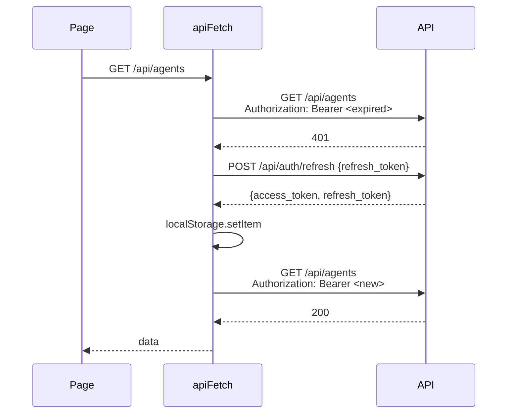

# API client + error envelope + toast layer

> Nearly every call from the console to the API goes through `apiFetch`, usually wrapped in the `useApi` SWR hook. This doc covers what they do, why mutating calls throw, and how errors reach the user.

---

## `apiFetch` — the single entry point

```ts
async function apiFetch<T = unknown>(path: string, options: FetchOptions = {}): Promise<ApiResponse<T>>

interface FetchOptions extends Omit<RequestInit, 'headers'> {
  headers?: Record<string, string>;
  silent?: boolean;        // no toast event on network, 429 or 5xx errors
  throwOnError?: boolean;  // override the method-based default
}

interface ApiResponse<T> {
  data: T | null;
  error: string | null;
  errorDetail?: ApiErrorDetail | null;
  meta: Record<string, unknown> | null;
}
```

Source: [`apps/web/src/lib/api-client.ts`](../../apps/web/src/lib/api-client.ts).

What it does:
- Prefixes `path` with `NEXT_PUBLIC_API_URL` (default `http://localhost:8000`). Pass a path like `/api/agents`, not a full URL.
- Adds `Authorization: Bearer <access_token>` from `localStorage`, and `Content-Type: application/json` when the body is a string.
- Skips the request with a `NO_TOKEN` error when there is no token, unless the path is `/api/auth/*`, `/api/health*` or `/api/public-settings`. This avoids a 401 race before login stores the token.
- Retries once after a 401 with a refreshed token (below).
- Unwraps the envelope and returns `data` and `meta` from the body.
- Throws `ApiError` on a failure when the method is POST, PUT, PATCH or DELETE. Returns `{data: null, error, errorDetail}` for a GET.

The throw vs return split matters because the calling code is shaped differently:

- Read paths (list and detail pages) want to render an empty or error state on 404. Throwing would crash the page.
- Write paths want try/catch and a toast. A silent return leads to a silent failure.

Many newer pages pass `throwOnError: false` on writes and branch on `r.error` and `r.errorDetail?.error_code` without try/catch. That is fine as long as the error is shown.

---

## The structured error envelope

Every non-2xx response from the platform looks like:

```json
{
  "data": null,
  "error": {
    "message": "Replicas must be between 1 and 10",
    "code": 400,
    "error_code": "INVALID_REPLICAS",
    "details": {"received": 25}
  }
}
```

The backend builds it with the [`error()` helper](../../apps/api/app/core/responses.py) or by raising `HTTPException`, which the handler in `apps/api/app/main.py` reshapes. An `HTTPException` with a dict `detail` can carry `error_code`, `details` and `message`. If the body has no envelope, `apiFetch` uses `Server error (<status>)`.

`apiFetch` turns it into `ApiErrorDetail` (`message`, `code`, `error_code`, `details`). A thrown error is an `ApiError`:

```ts
class ApiError extends Error {
  status: number;
  errorCode?: string;
  details?: Record<string, unknown>;
}
```

Branch on the code, not the message:

```ts
try {
  await apiFetch(`/api/ml-models/${id}/deploy`, { method: 'POST', body: JSON.stringify(body) });
} catch (e) {
  if (e instanceof ApiError && e.errorCode === 'INVALID_REPLICAS') {
    // field-level error on the replicas input
  } else {
    toastError('Deploy failed', (e as Error).message);
  }
}
```

Or without throwing:

```ts
const r = await apiFetch(url, { method: 'PUT', body, headers: { 'If-Match': etag }, throwOnError: false });
if (r.errorDetail?.error_code === 'STALE_DRAFT') openMergeDialog(r.errorDetail.details);
```

### Error codes

Set by `apiFetch` itself:

| `error_code` | When |
|---|---|
| `NO_TOKEN` | no `access_token` and the path is not public. Request not sent |
| `NETWORK_ERROR` | `fetch` threw before a response. `code` is 0 |
| `SESSION_EXPIRED` | 401 and the refresh failed |
| `RATE_LIMITED` | 429. The message includes the `Retry-After` seconds when the header is present |

Set by the API (only `error_code` is listed, read `details` in the route):

| `error_code` | Where |
|---|---|
| `VALIDATION_ERROR` | any 422 from request validation. `details.errors` is the pydantic error list |
| `BUSY` | 503 when the DB pool is exhausted. Comes with `Retry-After: 2` |
| `INVALID_REPLICAS`, `INVALID_RESOURCE_PRESET` | ML model deploy |
| `IN_USE` | deleting an agent, code asset or knowledge base something still uses |
| `CODE_FAILED` | code asset test run |
| `EVAL_GATE` | 409 when an agent is published or set active and the tier policy needs its gating suites to pass on this exact config |
| `AGENT_DELETED` | 410 when executing an archived agent |
| `INVALID_ASSERTION` | evals |
| `NO_SNAPSHOT` | run replay in `routers/governance.py` |
| `STALE_DRAFT`, `NOT_EDITABLE`, `VALIDATION_FAILED`, `AWAITING_APPROVAL`, `NOT_APPROVED`, `REJECTED`, `PUBLISH_CONFLICT`, `VALID_PERIOD_CONFLICT`, `BAD_RULES`, `BAD_FLOW`, `ENGINE_ERROR` | decisions |

A missing capability is a plain 403 with the message "This needs the X capability. An admin can grant it under Admin, Permissions." and no `error_code`.

New backend error sites should pass `error_code` and `details` to `error()`.

---

## `useApi`

[`apps/web/src/hooks/useApi.ts`](../../apps/web/src/hooks/useApi.ts) wraps SWR around `apiFetch`:

```ts
const { data, error, meta, isLoading, mutate } = useApi<Agent[]>('/api/agents');
const { data } = useApi<Suite>(id ? `/api/evals/suites/${id}` : null);          // null key skips the fetch
const { data } = useApi<Run>(`/api/evals/runs/${id}`, { refreshInterval: 3000 }); // any SWR option
```

- The URL is the SWR key. `revalidateOnFocus` is off and `dedupingInterval` is 5s unless you override them.
- `data` is already unwrapped from the envelope. `error` is the message string.
- `mutate()` refetches.

Use `useApi` for reads and `apiFetch` for writes.

---

## Other helpers in `lib/`

| File | What it holds |
|---|---|
| `capabilities.ts` | `MyPermissions`, `holds()`, `useMyPermissions()`, `useCapability()`. See [00-app-shell](00-app-shell.md#sidebar-and-gating) |
| `chat.ts` | `connectToAgentStream()`, which POSTs `/api/agents/{id}/execute` with `stream: true` and parses the SSE frames |
| `decisions.ts` | types and helpers for the decision screens, mirroring `engine/decisions/authoring.py`. Includes `mergeDocs` for draft conflicts |
| `evals.ts` | eval suite, case, run and comparison types plus `pct`, `runVerdict` and the schedule list |
| `sources.ts` | Source Watch types, labels and formatters, plus `downloadRaw` for a snapshot |
| `models.ts` | `useModels()` and `useSelectableModels()` for model pickers, with a fallback list |
| `fetch-all-agents.ts` | pages through `/api/agents` 100 at a time |
| `run-errors.ts` | `explainRunError()`, which turns a raw run error into a title and hint |
| `format-stats.ts` | count, rate, percent, ms and USD formatters that dim honest zeros |
| `curl-parser.ts` | `parseCurl()` for the cURL import |
| `schemas.ts` | zod schemas for agent, pipeline node, KB, login and register forms |
| `tool-docs.ts`, `blueprints.ts` | static tool docs and blueprint data |
| `use-event-source.ts` | an `EventSource` hook with backoff. Nothing imports it today |
| `utils.ts` | `cn()` for class names |

---

## The toast layer

User feedback runs through `useToastStore` ([`apps/web/src/stores/toastStore.ts`](../../apps/web/src/stores/toastStore.ts)), rendered by `ToastContainer`, which `ToastProvider` mounts in the root layout.

```ts
import { toastSuccess, toastError } from '@/stores/toastStore';

toastSuccess('Saved', 'Model metadata updated');
toastError('Save failed', e?.message || 'Unknown error');
```

Also `toastWarning`, `toastInfo` and `toast({type, title, message, duration})`. At most 5 toasts show, the oldest drops first, and each auto-dismisses after 5s unless `duration` says otherwise.

`apiFetch` also emits its own events for network failures, 429 and 5xx (unless `silent`) through `onApiToast()`. `ToastProvider` in `apps/web/src/components/ToastProvider.tsx` listens and adds them to the same toast stack for 6 seconds. It wraps the root layout, so these show on every page.

### Convention

Every mutation should end in visible feedback. A toast, an inline notice or a field error all count. No mutation should be silent.

---

## Authentication flow



Only one refresh runs at a time. Calls that hit a 401 while it is running queue up and retry with the new token when it lands.

If the refresh fails, both tokens are removed from `localStorage`, the browser is sent to `/?return_to=<current path>&session=expired` and the call returns `SESSION_EXPIRED`. The sign-in form on `/` shows "Your session expired" and, after sign-in (password or SSO), goes back to the page you were on. [`lib/auth-redirect.ts`](../../apps/web/src/lib/auth-redirect.ts) builds the URL and only accepts same-site paths, anything else falls back to `/dashboard`.

---

## Streaming

`apiFetch` reads the whole body, so streams bypass it.

| Stream | How |
|---|---|
| Agent chat | `connectToAgentStream()` in `lib/chat.ts`. `fetch` with a Bearer header and a body reader |
| Pipeline run in the builder | Not a stream. Run pipeline calls `executeAndTrack()` in `usePipelineStore`, which POSTs `/api/pipelines/{id}/execute` and shows the result. `executeWithStreaming()` (`execute-stream`) exists in the store but nothing calls it |
| Live DAG on a run | `LiveDagView` in `components/shared/`. `EventSource` on `/api/executions/{id}/watch` |
| Meetings | `EventSource` on `/api/meetings/{id}/stream?token=` |
| SDK and load playgrounds, AI Builder | `fetch` with a body reader |

`EventSource` can't send headers, so those streams pass the token as `?token=`.

The Flight Recorder polls `/api/executions/live/{id}` every 2s while a run is going.

---

## Mocking in tests

Unit tests run on Vitest (`npm test` in `apps/web`, also run in CI):

```ts
import { vi } from 'vitest';
vi.mock('@/lib/api-client', () => ({
  apiFetch: vi.fn().mockResolvedValue({ data: [], error: null, meta: null }),
}));
```

Playwright e2e specs hit a real dev API. The suite seeds and tears down its own fixtures (see [08-howto/05-testing](../08-howto/05-testing.md)). We don't intercept network in e2e because fixture creation runs through the same code paths users hit.

---

## See also

- [00-app-shell](00-app-shell.md) — where ToastProvider is mounted
- [09-reference/00-rest-api](../09-reference/00-rest-api.md) — every backend endpoint the client calls
- [02-runtime/04-streaming-tracing](../02-runtime/04-streaming-tracing.md) — server side of SSE and tracing
