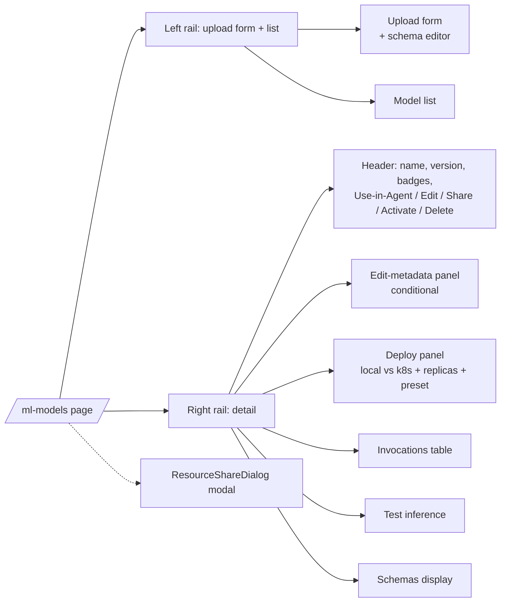

# Page catalogue

> Every authenticated route in `(app)/`, what it shows, what data it pulls, and where its source lives. Use this as a starting point when you're hunting for a feature.

---

## Top-level pages

| Route | Source | Primary data |
|---|---|---|
| `/dashboard` | `(app)/dashboard/` | exec counts (7d), recent activity, quick links |
| `/agents` | `(app)/agents/` | `GET /api/agents` (grouped by category) |
| `/builder` | `(app)/builder/` | new agent / pipeline canvas |
| `/builder?agent={id}` | `(app)/builder/` | edit existing agent |
| `/pipelines` | `(app)/pipelines/` | `GET /api/pipelines` |
| `/executions` | `(app)/executions/` | `GET /api/executions` (paginated) |
| `/executions/{id}` | `(app)/executions/[id]/` | full execution detail + waterfall + lineage |
| `/chat` | `(app)/chat/` | conversation list. pick an agent to chat with |
| `/chat/{conversationId}` | `(app)/chat/[id]/` | live chat surface |
| `/knowledge` | `(app)/knowledge/` | KB list + detail panel |
| `/atlas` | `(app)/atlas/` | knowledge-graph canvas |
| `/ml-models` | `(app)/ml-models/` | model registry + upload + deploy |
| `/code-runner` | `(app)/code-runner/` | code-asset list + upload (zip/git) + test |
| `/approvals` | `(app)/approvals/` | pending + recent approvals |
| `/marketplace` | `(app)/marketplace/` | public/template agents |
| `/observability` | `(app)/observability/` | OTel layers — log, live updates, alerts, traces |
| `/help` | `(app)/help/` | end-user docs |
| `/dev-docs` | `(app)/dev-docs/` | developer documentation (this site) |

---

## Admin pages

`/admin/*` — gated to `admin` and `owner` roles.

| Route | Source | Purpose |
|---|---|---|
| `/admin/cluster` | `admin/cluster/` | node CPU/mem, PVCs, pod counts, DB top tables |
| `/admin/scaling` | `admin/scaling/` | KEDA scaledobjects per pool. manual replica overrides |
| `/admin/llm-pricing` | `admin/llm-pricing/` | model pricing table — used for cost roll-ups |
| `/admin/llm-settings` | `admin/llm-settings/` | provider keys, default model, model whitelist |
| `/admin/dlq` | `admin/dlq/` | dead-letter queue inspection (replay or discard) |
| `/admin/archives` | `admin/archives/` | execution archive runs + retention policies |
| `/admin/connectors` | `admin/connectors/` | CMMS / HRIS / telematics integrations |
| `/admin/moderation` | `admin/moderation/` | per-tenant moderation policies (PII redact, content safety) |

---

## Settings

`/settings/*` — accessible to all users (some sub-pages role-gated).

| Route | Purpose |
|---|---|
| `/settings/team` | invite users, change roles |
| `/settings/api-keys` | create / revoke API keys |
| `/settings/billing` | invoices + plan |
| `/settings/notifications` | per-user notification preferences |
| `/settings/webhooks` | outbound webhook config |
| `/settings/profile` | display name, avatar, password |

---

## Anatomy of a typical CRUD page (ml-models example)

Most CRUD pages follow this two-column shape:
- Left rail: list + the create form.
- Right rail: the selected item's detail, broken into cards.
- Modal: share dialog.

The bigger pages (`/agents`, `/pipelines`) use a card grid instead of left-rail list — but the right-rail-detail-modal pattern repeats.

---

## What every detail page should expose

Audit-driven convention as of v1.5.3:
- An **Edit** button on the resource header that toggles an inline edit panel.
- A **Use in Agent** (or **Use in Pipeline**) button that deep-links to the builder pre-configured.
- A **Share** button that opens the ResourceShareDialog.
- An **Invocations / Executions** table for time-series context.
- A **Test** affordance to dry-run.
- Status badges with proper aria-labels.
- Toast feedback on every mutation.

New pages: copy from `/ml-models` or `/code-runner` as templates.

---

## Skeletons + empty states

Every list page renders a skeleton during fetch (`<Skeleton />` from `apps/web/src/components/ui/Skeleton.tsx`) and an `<EmptyState />` when the result is empty.

Empty states must include:
- An icon
- One-sentence explanation
- A call-to-action button (where applicable)

---

## See also

- [02-api-client](02-api-client.md) — `apiFetch` + toast wiring
- [00-app-shell](00-app-shell.md) — sidebar / topbar / shell
- [08-howto/03-add-a-page](../08-howto/03-add-a-page.md) — walkthrough for adding a new route
