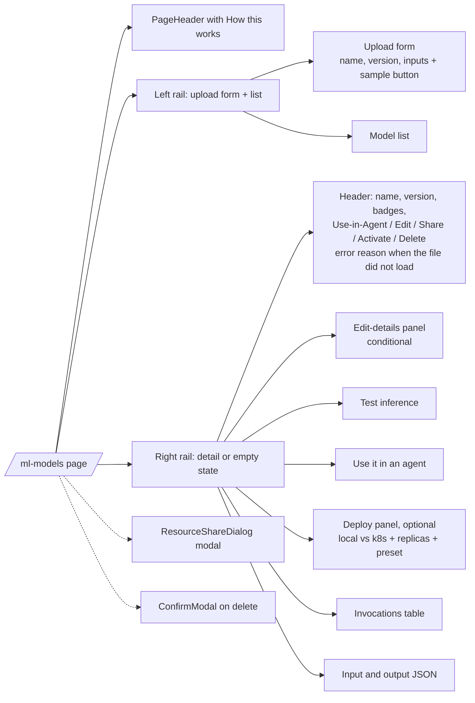

# Page catalogue

> Every route in `apps/web/src/app/`, where it sits in the sidebar, what gates it and what it is for. Use this as a starting point when you're hunting for a feature.

There are 102 `page.tsx` files. 96 live in the authenticated `(app)/` group and 6 are public. Sources below are relative to `apps/web/src/app/(app)/` unless they start with `app/`.

## Reading the Gate column

The sidebar ([`Sidebar.tsx`](../../apps/web/src/components/layout/Sidebar.tsx)) reads `GET /api/me/permissions` and hides what the caller can't use. See [00-app-shell](00-app-shell.md#sidebar-and-gating) for the full rules.

| Gate | Meaning |
|---|---|
| `feature:x` | hidden when `features.x` is `false`. Role defaults come from `ROLE_FEATURES` in `apps/api/app/core/permissions.py` |
| `cap:x` | shown only when `capabilities` holds `x`. Role defaults plus permission sets, see `apps/api/app/core/capabilities.py` |
| `admin` | shown only when `is_admin` is true or the signed-in user's role is `admin` |
| none | always shown |

The sidebar opens in Essentials mode, a short list of Needs you, Home, Agents, AI Chat, Knowledge and Monitor. Reviewers also get Review inbox, creators and admins get Agent Builder, Autonomy and Improvements, and admins get an Admin entry. Show all tools at the bottom reveals the full grouped list below. See [00-app-shell](00-app-shell.md#essentials-and-all-tools).

The sidebar gate is UX only. The API enforces access on every route. Most pages render for anyone who types the URL and show whatever the API returns. The pages that check a capability themselves are noted.

---

## Sidebar pages

### PINNED

Always open, can't be collapsed.

| Route | Sidebar | Gate | Purpose |
|---|---|---|---|
| `/inbox` | Needs you | none | Everything waiting on you, with a live count in the sidebar. Tabs for approvals you can sign, watching reviews (`cap:actions.review`), held content (`cap:moderation.review`), marketplace submissions (admins, marketplace on) and new or rising alerts (`feature:view_alerts`). Act inline or open the full page. `?tab=` picks a tab. See [00-app-shell](00-app-shell.md#needs-you-inbox) |
| `/dashboard` | Dashboard | `feature:view_dashboard` | Live stats from `/api/analytics/live-stats`, per-user usage, API health and the role-aware Start here checklist from `GET /api/me/journey` |
| `/agents` | My Agents | `feature:create_agents` | Agent and pipeline cards with My, Prebuilt and Marketplace tabs, search, category filter, sort and paging |
| `/chat` | AI Chat | `feature:use_chat` | Conversations with any agent, picked from a searchable list of every agent and defaulting to Code Assistant. Each turn sends the thread id so the agent remembers the conversation, also after a reload. The paperclip adds text files (up to 20,000 characters) to the message. `?id=` selects a conversation. Delete asks first. Below `md` the conversation list is a drawer. Conversations can be shared |
| `/alerts` | Alerts | `feature:view_alerts` | Failures grouped by structured failure code so bursts stand out, plus live stats |

### BUILD

| Route | Sidebar | Gate | Purpose |
|---|---|---|---|
| `/builder` | Agent Builder | `feature:use_builder` | Agent and pipeline canvas. See [01-builder-canvas](01-builder-canvas.md) |
| `/agents/manage` | Manage agents | `feature:create_agents` | Bulk operations on agents |
| `/tools` | Tools Catalogue | `feature:use_builder` | Every built-in tool from `/api/tools` with its argument schema and example usage |
| `/decisions` | Decisions | `cap:decisions.view` | Decision models (business rules). See [2.5 pages](#abenix-25-pages) |
| `/sources` | Source Watch | none | Watched pages, PDFs, data files and feeds. See [2.5 pages](#abenix-25-pages) |
| `/code-runner` | Code Runner | `feature:use_code_runner` | Upload a zip or git repo, analyse it and expose it as the `code_asset` tool. Test, version and restore |
| `/ml-models` | ML Models | `feature:use_ml_models` | Model registry. How-this-works panel, sample model, upload with load check and versions, test inference, use in agent, optional deploy (local or k8s), invocations |
| `/knowledge` | Knowledge Bases | `feature:use_kb` | Knowledge bases with document upload and a detail panel. Links to Knowledge Projects |
| `/persona` | Persona KB | `feature:use_persona` | Your own notes and files, which only your agents can retrieve. View, edit, re-index, the reason an item is not searchable, plus voice consent |
| `/portfolio-schemas` | Portfolio Schemas | `feature:create_pipelines` | Tables of records that agents query through `portfolio_<domain>`. Try with a sample, or create from a spreadsheet (preview, rename, untick and retype columns, then import). Each schema shows your own rows, example questions and Use in an agent, which opens the builder with the tool and a starter prompt. Add rows replaces or appends. Writing a schema by hand or from a template is the advanced path, checked on save with problems listed under the JSON editor |
| `/bpm-analyzer` | BPM Analyzer | `feature:use_builder` | Upload a process diagram or SOP (or try the bundled sample), discuss it in private threads, get suggested agents, build and test them, export a PDF. `?thread=<id>` opens a thread |
| `/atlas` | Atlas | `feature:use_kb` | Ontology canvas. Nodes, edges, extraction from documents, starter imports, KB binding and export |

### RUN & TEST

| Route | Sidebar | Gate | Purpose |
|---|---|---|---|
| `/sdk-playground` | SDK Playground | `feature:use_sdk_playground` | Generate SDK code for an agent in Python, TypeScript or Java from a pattern list. Python runs in the sandbox |
| `/load-playground` | Load Playground | `feature:use_load_playground` | Pick an agent, describe a load shape, get a generated Python script and run it with streamed output |
| `/triggers` | Triggers | `feature:use_triggers` | Webhook and cron triggers that run agents. Run one by hand. Each trigger lists its recent runs with status and links to its runs. `?focus={id}` shows one trigger |
| `/evals` | Evaluations | `cap:evals.run` | Evaluation suites. See [2.5 pages](#abenix-25-pages) |
| `/meetings` | Meetings | `feature:use_meetings` | Meeting sessions an agent can join |

### MONITOR

| Route | Sidebar | Gate | Purpose |
|---|---|---|---|
| `/observability` | Observability | `feature:view_executions` | The four observability layers with links to Executions, Analytics, Alerts and Grafana (`NEXT_PUBLIC_GRAFANA_URL`) |
| `/executions` | Executions | `feature:view_executions` | Execution history with a Started by line on each run and a Started by filter, plus executions waiting on an approval with an approve action. `?trigger={id}` and `?started_by={kind}` filter from links |
| `/executions/live` | Live Debug | `feature:view_executions` | Running executions from `/api/executions/live` |
| `/analytics` | Analytics | `feature:view_analytics` | Executions, tokens, cost and performance charts, plus drift alerts and their config. On a Claude subscription the cost card and cost charts say so |
| `/moderation` | Moderation | `feature:view_alerts` | Tenant moderation policies (pre-LLM, post-LLM, tool output), recent events and a vet sandbox |
| `/autonomy` | Autonomy | `cap:autonomy.view` | Earned autonomy. See [2.5 pages](#abenix-25-pages) |
| `/improvements` | Improvements | `cap:improvements.view` | Agents with open lessons worst first, four counts, the sample. Each agent opens its Improvements tab |

### MARKETPLACE

Only rendered while the marketplace switch is on (`GET /api/platform/features`). Collapsed by default.

| Route | Sidebar | Gate | Purpose |
|---|---|---|---|
| `/marketplace` | Marketplace | `feature:use_marketplace` | Reviewed agents to browse and install. Prices only while monetization is on |
| `/creator` | Creator Hub | `feature:publish_to_marketplace` | List an agent for free, track review state, installs and runs. Revenue, payouts and Stripe only while monetization is on |

### ADMIN

Collapsed by default.

| Route | Sidebar | Gate | Purpose |
|---|---|---|---|
| `/admin/cluster` | Cluster Health | `admin` | Health verdict with reasons, node cards with CPU, memory and pressure, services grouped as Core, Runtime pools, Data and Apps with ready counts, image, restarts and a scaling sparkline, a pod drawer with events and log tail, and a warnings timeline. Refreshes every 15 seconds with a pause. Says what is hidden and which helm value fixes it, and explains when the API runs outside Kubernetes |
| `/admin/scaling` | Scaling | `admin` | Per-agent pool routing, rate limits, budgets and dedicated mode. Replicas and concurrency are saved as a note and the page says they are not applied |
| `/admin/tool-scaling` | Tool Scaling | `admin` | Per-tool cache, concurrency, rate limit, circuit breaker, daily budget and pool routing |
| `/admin/pipeline-scaling` | Pipeline Scaling | `admin` | Which `runtime_pool` each pipeline lands on |
| `/admin/archives` | Archives | `admin` | Nightly archive runs of recording tables to `/data/archives/`, retention policies, manual trigger and download |
| `/admin/dlq` | Dead Letter Queue | `admin` | Executions that failed past the retry budget. Replay with the original input |
| `/admin/jobs` | Background jobs | `admin` | Every scheduled job with what it does, schedule, last and next run, outcome, duration, last error in plain words and run count. Run now runs one under its lock, jobs that change data ask first. `?job=<id>` opens on one job |
| `/admin/audit` | Audit log | `admin` | Recent admin actions from `/api/admin/audit-log`, or a stand-in built from settings and team changes |
| `/admin/models` | Models catalogue | `admin` | Tenant ML models plus the LLM catalogue |
| `/admin/market-sources` | Market data | `admin` | Connectors that feed price, fundamentals, regulatory and energy data |
| `/admin/llm-settings` | Model Selection | `feature:manage_settings` | Which LLM powers each built-in feature, across all tenants. Subscription token status |
| `/admin/tool-config` | Tool Configuration | `feature:manage_settings` | Values tools declare in `config_fields`. See [2.5 pages](#abenix-25-pages) |
| `/admin/llm-pricing` | LLM Pricing | `feature:manage_settings` | Per-model price per 1M tokens. The runtime reads it on every call, cached 60s |
| `/admin/connectors` | Connectors | `feature:manage_settings` | External systems agents can call (CMMS, HRIS, telematics, weather, cost data). Presets and a test call |
| `/admin/marketplace` | Marketplace & Billing | `feature:manage_settings` | The marketplace and monetization switches, with the deployment default for each |
| `/settings/webhooks` | Events | `cap:events.manage` | Event subscriptions. See [2.5 pages](#abenix-25-pages) |
| `/review-queue` | Review inbox | `feature:review_queue` or `moderation.review` | Held content tab to release, redact or reject what a hold policy stopped, and a Marketplace submissions tab for admins |
| `/admin/risk` | Risk & Controls | `cap:risk.view` | Tier policies, kill switches, tool tiers, audit integrity. See [2.5 pages](#abenix-25-pages) |
| `/settings/team` | Team | `feature:manage_team` | Invite members, change roles, remove members, revoke invites |
| `/admin/rbac` | Roles | `admin` | Static role to feature table. Non-admins are turned away |
| `/admin/permissions` | Permissions | `cap:permissions.manage` | Permission sets and their members. See [2.5 pages](#abenix-25-pages) |

### WORKSPACE

| Route | Sidebar | Gate | Purpose |
|---|---|---|---|
| `/approvals` | Approvals | none | Approval requests waiting on you. See [2.5 pages](#abenix-25-pages) |
| `/mcp` | MCP Servers | `feature:manage_mcp` | MCP connections, registry install and sync, tool discovery, health, prompts and resources, OAuth2 |
| `/edge` | Edge | none | Edge gateways that pull `.agent` bundles. Mint tokens, deploy, download the runtime |
| `/settings/api-keys` | API Keys | `feature:manage_api_keys` | Create and revoke API keys |
| `/settings/cognify` | Cognify config | none | Cognify acceptance and conflict policy (`auto_accept_threshold`, `conflict_action`, `max_parallel_docs`, `daily_budget_usd`) and open conflicts with Accept A or Accept B |
| `/settings/gdpr` | GDPR (right to erasure) | none | Five-store purge for a user in your tenant with the per-store receipts from `gdpr_purge_log`, including a Removed count per store |
| `/settings/integrations` | Integrations | `feature:manage_settings` | Status of each integration, its env vars, OIDC providers and MCP. Admins can configure |
| `/settings` | Settings | none | Redirects to `/settings/profile` |
| `/help` | Help | none | End-user guide |
| `/docs` | Developer docs | none | Opens the public developer docs in a new tab |

---

## Settings sub-pages

`(app)/settings/layout.tsx` adds its own left nav to every `/settings/*` page. It shows the same list to everyone (Billing only while the monetization switch is on). The API decides what each page can actually do.

| Route | Settings nav label | Purpose |
|---|---|---|
| `/settings/profile` | Profile | Name and password |
| `/settings/api-keys` | API Keys | Create and revoke API keys |
| `/settings/billing` | Billing | Usage and plan from `/api/billing/usage`. Shows $0 labelled Claude subscription while the subscription is active |
| `/settings/team` | Team | Members, roles and invites |
| `/settings/integrations` | Integrations | Integration status and setup |
| `/settings/notifications` | Notifications | Per-user notification preferences and tenant notification settings |
| `/settings/observability` | Observability | Health from `/api/health/ready`, metrics and SLOs |
| `/settings/security` | Security | Active sessions and account activity |
| `/settings/data` | Data & DLP | DLP mode for agent inputs and answers, and data retention |
| `/settings/privacy` | Privacy & GDPR | Export or delete your account data, privacy and retention settings |
| `/settings/webhooks` | Events | Event subscriptions. Shown only with `events.manage` |
| `/settings/quotas` | Token Quotas | Monthly token and cost limits per member |
| `/settings/sandbox` | Sandbox | Limits for the `sandboxed_job` tool |

`/settings/cognify` and `/settings/gdpr` are in the sidebar but not in this nav.

---

## Pages reached from other pages

| Route | Reached from | Purpose |
|---|---|---|
| `/agents/{id}` | | Redirects to `/agents/{id}/info` |
| `/agents/{id}/info` | agent cards, builder | Agent detail. Chat, edit, duplicate, versions, export, memories. An Actions panel lists the agent's effect tools with their autonomy level and Enrol or Open. Pipelines also get Healing and Shell |
| `/agents/{id}/chat` | agent cards, builder Test, run detail | Chat with one agent. `?prefill=` fills the input |
| `/agents/{id}/memories` | agent info | Stored memories for the agent, with delete |
| `/agents/{id}/healing` | agent info (pipelines) | Failure diffs and Pipeline Surgeon patch proposals to accept or reject |
| `/agents/{id}/shell` | agent info (pipelines) | Drive a pipeline with a typed command grammar and autocomplete |
| `/agents/new` | | Redirects to `/builder` |
| `/autonomy/{grantId}` | `/autonomy`, notifications, action cards | One agent's level for one action. See [2.5 pages](#abenix-25-pages) |
| `/agents/{id}/improvements` | agent info, `/improvements`, the See lessons link after feedback | Groups of lessons with examples, suggested test cases to accept, edit or drop one at a time or in bulk, an owner switch to require those tests before changes go live (off by default, asks first while tests fail), proposed fixes and releases |
| `/decisions/{key}` | `/decisions` | Decision workspace. See [2.5 pages](#abenix-25-pages) |
| `/decisions/reference-sets` | `/decisions` | Reference sets |
| `/evals/{id}` | `/evals` | Evaluation suite |
| `/evals/runs/{id}` | suite Runs tab | One evaluation run |
| `/evals/compare?a=&b=` | suite Runs tab | Two runs side by side |
| `/sources/{id}` | `/sources` | One watched source |
| `/executions/{id}` | Executions, Live Debug, DLQ, triggers, eval runs, event deliveries, chat | Execution Flight Recorder (below) |
| `/knowledge/{id}/engine` | `/knowledge` | Knowledge engine for one collection. Cognify jobs, graph stats, hybrid search, feedback, agent grants and the Embedding model panel, where admins switch the collection's model |
| `/knowledge/projects` | `/knowledge` | Projects that group collections, with per-agent and per-user access |
| `/knowledge/projects/{projectId}/ontology` | `/knowledge/projects` | Ontology schemas and correlations for a project |
| `/marketplace/{id}` | `/marketplace` | Marketplace agent detail, subscribe, reviews |
| `/meetings/{id}` | `/meetings` | One meeting. Scope, start, end, remove the bot, restart it, answer deferrals, room participants. Polls while live |
| `/meetings/{id}/rehearse` | `/meetings/{id}` | Rehearse the bot with typed or dictated turns. Scope decisions, citations, hand-backs and reply latency, no room |
| `/meetings/{id}/join` | `/meetings/{id}` | Join the LiveKit room from the browser with `livekit-client`. Participants, mic toggle, room chat |
| `/settings/api` | | Redirects to `/settings/api-keys` |
| `/webhooks` | | Redirects to `/settings/webhooks` |
| `/team` | command palette | Older team page with member list and invite. `/settings/team` is the current one |
| `/dev-docs` | old links | Redirects to `/docs`, keeping `?slug=` |

### Execution Flight Recorder (`/executions/{id}`)

Loads `GET /api/executions/{id}` and `GET /api/executions/{id}/children`. While the run is going it polls `/api/executions/live/{id}` every 2s.

- Header with status, failure code, model and a fallback badge when the model differs from the one requested. Links to the Grafana Tempo trace when there is a `trace_id`, re-runs the input in agent chat, and saves the run as an eval case.
- A Started by line naming the trigger, chat, API call or parent run that started it, linked to the trigger or parent run. A deleted trigger keeps its name with a note.
- Link to the parent run and a table of sub-agent runs.
- The cost reads Claude subscription when the platform bills on one.
- **What this run used**, the provenance panel. Needs `runs.replay`. Shows model, agent revision, prompt hash and config hash, and offers Replay exactly as it ran or Replay on the agent as it is now.
- Live DAG (SSE from `/api/executions/{id}/watch`), execution waterfall, tool call inspector, pipeline node results, step replay, input, output and error.
- Decision card on any tool call or pipeline step that evaluated a decision: outcome, outputs, rules that applied with citations, version link, trace hash, evaluation id, **Open in Try with these facts** and **All evaluations**. Built by `components/decisions/DecisionRunCard.tsx`.

### Pages nothing links to

None. Every page is in the sidebar's full list, the settings nav, the command palette or linked from another page. The lostness gate (`e2e/uat_lostness_gate.spec.ts`) reads the sidebar list and checks each page for every role.

---

## Public pages

Outside `(app)/`, so no AuthGuard, sidebar or top bar.

| Route | Source | Purpose |
|---|---|---|
| `/` | `app/page.tsx` | Landing page. Sign-in and sign-up live in `AuthCard` inside the hero |
| `/auth/callback` | `app/auth/callback/` | SSO return. Reads `access_token`, `refresh_token` and `return_to` from the URL hash into `localStorage` |
| `/auth/accept-invite?token=` | `app/auth/accept-invite/` | Join a workspace from an invite |
| `/docs` | `app/docs/` | Developer docs viewer (this site). `?slug=` picks the page |
| `/oraclenet` | `app/oraclenet/` | OracleNet decision brief from seven agents. Uses the signed-in token or `NEXT_PUBLIC_ORACLENET_API_KEY` |
| `/demo` | `app/demo/` | Redirects to `/dashboard` |

---

## Abenix 2.5 pages

Decisions, evals, Source Watch, governance and events. Sidebar items with a capability only show when `/api/me/permissions` holds it. These pages also check capabilities themselves and show a "needs X" note in place of the controls.

| Route | Source | Who sees it | Sidebar | Main API calls |
|---|---|---|---|---|
| `/decisions` | `decisions/` | `decisions.view`, else a "needs" note. New decision needs `decisions.author` | BUILD > Decisions | `GET /api/decisions`, `POST /api/decisions` |
| `/decisions/{key}` | `decisions/[key]/` | Whoever the API lets read it. Edit, import, check, propose and withdraw need `decisions.author`. Publish and changing the risk tier need `decisions.publish` | via `/decisions` | `GET/PATCH /api/decisions/{key}`, `POST .../versions`, `GET/PUT .../versions/{n}`, `POST .../check`, `.../versions/{n}/validate`, `propose`, `withdraw`, `GET publish-plan`, `publish`, `presence`, `try`, `.../tests`, `.../diff`, `.../export`, `.../import` |
| `/decisions/reference-sets` | `decisions/reference-sets/` | Anyone who reaches it can view. Create and edit need `decisions.author` | via `/decisions` | `GET/POST /api/decision-reference-sets`, `GET/PUT /api/decision-reference-sets/{key}` |
| `/evals` | `evals/` | `evals.run`, else a "needs" note. New suite needs `evals.manage` | RUN & TEST > Evaluations | `GET /api/evals/suites`, `POST /api/evals/suites` |
| `/evals/{id}` | `evals/[id]/` | No page guard. `evals.run` to run. `evals.manage` to edit cases and settings | via `/evals` | `GET/PATCH/DELETE /api/evals/suites/{id}`, `POST .../cases`, `PATCH/DELETE /api/evals/cases/{id}`, `POST .../run`, `POST /api/evals/runs/{id}/cancel`, `GET /api/evals/assertion-types`, `POST /api/evals/assertions/check` |
| `/evals/runs/{id}` | `evals/runs/[id]/` | No page guard | via `/evals/{id}` | `GET /api/evals/runs/{id}` |
| `/evals/compare?a=&b=` | `evals/compare/` | No page guard | via the Runs tab | `GET /api/evals/runs/{a}/compare/{b}` |
| `/sources` | `sources/` | Everyone. Add, check, pause and resume need `sources.manage`. Settings need `risk.manage` | BUILD > Source Watch | `GET/POST /api/sources`, `GET /api/sources/changes?limit=12`, `GET/PUT /api/sources/settings`, `POST /api/sources/{id}/check-now`, `pause`, `resume`, `POST /api/sources/preview`, `validate-url` |
| `/sources/{id}` | `sources/[id]/` | Everyone. Changes need `sources.manage` | via `/sources` | `GET/PATCH/DELETE /api/sources/{id}`, `.../changes`, `.../snapshots`, `GET /api/sources/changes/{id}`, `GET /api/sources/snapshots/{id}`, `check-now`, `pause`, `resume` |
| `/admin/risk` | `admin/risk/` | `risk.view`, else a "needs" note | ADMIN > Risk & Controls | `GET /api/governance/risk`, `PUT /api/governance/risk/{tier}`, `/api/governance/kill-switches` (+ `/{id}/clear`), `/api/governance/audit/verify`, `/api/governance/audit/export` |
| `/admin/permissions` | `admin/permissions/` | `permissions.manage`, else a "needs" note | ADMIN > Permissions | `GET /api/governance/capabilities`, `/api/governance/permission-sets` (CRUD and `/members`), `GET /api/team/members` |
| `/admin/tool-config` | `admin/tool-config/` | `manage_settings` in the sidebar. The API needs the `admin` role and the page shows "Admin role required" on a 403 | ADMIN > Tool Configuration | `GET /api/admin/tool-config?scope=`, `PUT/DELETE /api/admin/tool-config/{key}`, `POST .../{key}/test` |
| `/approvals` | `approvals/` | Everyone. The Watching reviews tab needs `actions.review` to answer | WORKSPACE > Approvals | `GET /api/approvals?mine=1&status=pending`, `GET /api/approvals?mine=1`, `POST /api/approvals/{id}/signoff`, `GET /api/autonomy/reviews`, `POST /api/autonomy/actions/{id}/review` |
| `/autonomy` | `autonomy/` | `autonomy.view`. Enrol and the sample need `autonomy.manage` | MONITOR > Autonomy | `GET /api/autonomy/overview`, `POST /api/autonomy/sample`, `GET /api/autonomy/enrol/options`, `POST /api/autonomy/enrol` |
| `/autonomy/{grantId}` | `autonomy/[grantId]/` | `autonomy.view`. Promote needs `autonomy.grant`, demote, turn off, settings and sample runs need `autonomy.manage` | via `/autonomy` | `GET /api/autonomy/grants/{id}`, `.../actions`, `POST .../promote`, `.../demote`, `PATCH /api/autonomy/action-types/{id}`, `POST .../test`, `POST /api/autonomy/sample/run`, `POST /api/autonomy/actions/{id}/outcome`, `.../harm` |
| `/settings/webhooks` | `settings/webhooks/` | `events.manage` in the sidebar and the Settings tabs. Without it the page says an admin can grant it under Admin, Permissions | ADMIN > Events | `GET/POST /api/webhooks`, `GET /api/webhooks/catalog`, `PUT/DELETE /api/webhooks/{id}`, `POST .../test`, `GET .../deliveries`, `POST /api/webhooks/deliveries/{id}/redeliver` |

Who holds what by default (`ROLE_DEFAULTS` in `apps/api/app/core/capabilities.py`). Permission sets on `/admin/permissions` add to these.

| Role | Capabilities |
|---|---|
| `user` (Member in the UI) | `decisions.view`, `decisions.evaluate`, `risk.view`, `evals.run`, `runs.replay`, `autonomy.view`, `actions.review`, `feedback.give` |
| `creator` | the user set plus `decisions.author`, `evals.manage`, `sources.manage`, `events.manage`, `autonomy.manage`, `improvements.view`, `improvements.propose` |
| `admin` | `*` |

What each one does:

- **Decisions** lists rule models with risk tier, the version in force and counts of drafts and versions awaiting sign-off. Search by name, key or tag. Create one blank, from a JSON import or from the surcharge example. Links to reference sets.
- **Decision workspace** has the tabs Rules, Table, Flow, Facts and outcomes, Golden tests, History and Evaluations. Evaluations lists the kept evaluations with links back to the runs that made them. Rules, Table and Facts only show for builder-authored versions. A Try it panel sits next to Rules, Table, Facts and Flow and can save a case as a test. A version picker switches versions. Drafts autosave, carry a valid-from and valid-to period and a change note, and show who else is editing. The lifecycle bar runs Import, Check, Propose for sign-off, Withdraw, Publish and Export, and creates a new draft from any version. Publish shows the publish plan first. A save that collides with someone else's opens a merge dialog.
- **Reference sets** are named value lists that rules can refer to. Paste one value per line.
- **Evaluations** lists suites with tier, last score and a sparkline. Search by suite or agent.
- **Suite** has the tabs Cases, Runs and Settings. Run now, stop a run, or try another model for one run only. A gate banner shows when a gating suite is stale or failing. Tick two runs on the Runs tab to compare them. Settings holds the pass threshold, judge model, schedule and whether the suite gates publishing.
- **Run** shows per-case results with filters All, Failed, Passed and Changed, plus regressed and fixed counts against the base run.
- **Compare runs** puts runs A and B side by side and flags regressed and fixed cases.
- **Source Watch** lists watched pages, PDFs, spreadsheets, CSV, JSON and RSS feeds with recent changes. Each version is kept as a snapshot and each change is diffed and raised as `source.changed`. Settings hold the host allowlist, fetch limits and the failure count that pauses a source.
- **Source** shows its changes with a diff view and its snapshots. Edit, check now, pause, resume or delete.
- **Risk and Controls** has the tabs Tier policies, Kill switches, Tool tiers and Audit integrity. A tier policy sets publish approvals (minimum approvers, exclude the author, the capability to sign, `escalate_after_hours`), what a tool call does (allow, ask a person, block), allowed models, whether an output schema is required and whether evals must pass. Kill switches stop everything or one agent, pipeline, tool, trigger, model, decision or watched source. Kill switches need `killswitch.manage`, tier edits need `risk.manage`, audit verify needs `audit.verify`.
- **Permissions** shows what each role already has and manages permission sets and their members. Changes apply within ten seconds.
- **Tool Configuration** lists every value a built-in tool declares in its `config_fields`, grouped, with Tenant and Platform scope. Tenant beats platform, which beats env and `tool_defaults.yaml`. Save, clear or test a value. `#KEY` in the URL scrolls to that row.
- **Autonomy** shows three counts for the week (actions, run without asking, harm flags), a grid of agents by action type with a five step level pill, an accuracy sparkline and an attention note, then Ready to promote, Recently demoted and Unmanaged actions with an Enrol button. An empty tenant gets one paragraph and **Try it with the sample plant**. **Enrol an action** opens a wizard: pick an agent, pick an action, How we judge success, How we predict, Hard limits, Start watching. A How this works panel is open on the first visit. Below `md` the grid becomes a list.
- **Autonomy grant** (`/autonomy/{grantId}`) draws the ladder with the current step filled and the next step's checklist, each line with progress and a fix link. Promote is enabled only when every line is met and the tooltip lists what is missing. The author sees "You built this agent, so someone else has to approve its promotion", or for the sample and a solo builder the self-approval reason with **Approve now**. Demote and Turn off are one click with a confirm and a reason. Then the track record chart (predicted band, actual dot, markers for agent and world model changes), settings cards for How we judge success, How we predict and Hard limits with Test buttons, the action timeline with status filters and action cards, and the level history. Sample grants get a banner with **Run the sample agent** (1, 3 or 5).
- **Approvals** has two tabs. Pending approvals renders `action:*` rows as action cards with Approve, Edit and approve (a form per argument) and Reject, and `autonomy.promote` rows with the evidence. **Watching reviews** (`?tab=reviews`) lists watching actions oldest first. Keys `A` agree, `D` I did something else (asks what), `N` not sure.
- **Approvals** shows a status badge per request (pending, approved, denied, expired, returned) and a gate kind badge (agent gate or rule change). Rule changes link to the diff and name the capability needed to sign. Approve, Deny and Return for changes. Return needs a reason and is hidden for agent gates (`hitl:` ids). Pending rows show time left before expiry.
- **Events** manages event subscriptions picked from the event catalog. Each one calls a URL, runs an agent or runs a pipeline, optionally only when an event field matches. Shows the signing secret once on create, sends a test event, pauses or resumes, and lists recent deliveries with redeliver and a link to the run a delivery started.

---

## The page header

Every page except the redirects and the builder canvas starts with `PageHeader`: title, a one-line purpose that says who the page is for, the primary action, an optional secondary action, a collapsible How this works panel and a Docs link. See [00-app-shell](00-app-shell.md#page-header-start-here-and-next-steps). A new page uses it from day one and writes its purpose and steps from what the page really does.

---

## Anatomy of a typical CRUD page (ml-models example)

Most CRUD pages follow this two-column shape, stacked to one column below `lg`:
- Left rail: list + the create form.
- Right rail: the selected item's detail broken into cards, or an empty state with a first step.
- Modal: share dialog.

`/agents` uses a card grid in place of the left-rail list, but the detail and share patterns repeat.

---

## What every detail page should expose

Audit-driven convention as of v1.5.3:
- An **Edit** button on the resource header that toggles an inline edit panel.
- A **Use in Agent** (or **Use in Pipeline**) button that deep-links to the builder pre-configured.
- A **Share** button that opens the ResourceShareDialog.
- An **Invocations / Executions** table for time-series context.
- A **Test** affordance to dry-run.
- Status badges with proper aria-labels.
- Toast feedback on every mutation.

New pages: copy from `/ml-models` or `/code-runner` as templates.

---

## Skeletons + empty states

List pages render a skeleton during fetch (`<Skeleton />` from `apps/web/src/components/ui/Skeleton.tsx`) and an `<EmptyState />` from `apps/web/src/components/ui/EmptyState.tsx` when the result is empty. Some newer pages use inline pulse blocks and their own empty cards.

Empty states must include:
- An icon
- One-sentence explanation
- A call-to-action button (where applicable)

When the first item lands, the page swaps the empty state for a `NextSteps` card with the two or three things people usually do next.

---

## See also

- [02-api-client](02-api-client.md) — `apiFetch`, `useApi` and toasts
- [00-app-shell](00-app-shell.md) — sidebar / topbar / shell
- [08-howto/03-add-a-page](../08-howto/03-add-a-page.md) — walkthrough for adding a new route
