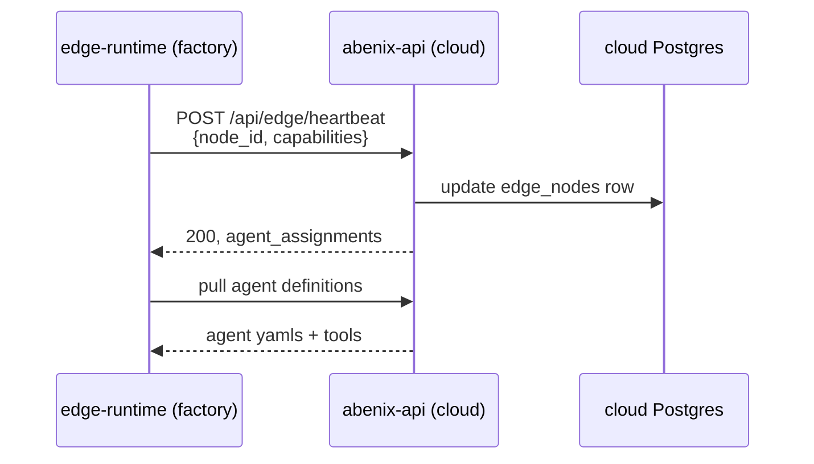

# Deployment overview

> From `git clone` to a production cluster. Two paths — local (minikube / k3d) and cloud (AKS today. GKE + EKS variants on the roadmap).

---

## Two deploy paths, one script entry

| Path | Use case | Script |
|---|---|---|
| **Local** | Developer laptop, CI integration tests, demos without internet | [`scripts/deploy.sh`](../../scripts/deploy.sh) |
| **AKS** | Production / staging on Azure Kubernetes Service | [`scripts/deploy-azure.sh`](../../scripts/deploy-azure.sh) |

Both scripts share the same helm chart at [`infra/helm/abenix/`](../../infra/helm/abenix/) and the same Dockerfiles under [`docker/`](../../docker/). The only differences are:
- where the cluster lives
- where images get pushed (local registry vs ACR)
- whether autoscalers + ingresses are wired

> **Why one chart for both** — keeping local and prod identical eliminates a class of "works on my machine" bugs. The helm `values-local.yaml` and `values-azure.yaml` files override only the bits that genuinely differ (replica counts, storage class, ingress hostname).

---

## High-level flow

```mermaid
flowchart LR
  G[git clone] --> P[Phase 1<br/>Provision infra<br/>(create AKS / start minikube)]
  P --> B[Phase 2<br/>Build + push images<br/>15 images per release]
  B --> H[Phase 3<br/>Helm upgrade<br/>main abenix chart]
  H --> S[Phase 4<br/>Deploy standalone apps<br/>(wingman, example_app, etc.)]
  S --> SD[Phase 5<br/>Seed agents + KBs + ML models]
  SD --> T[Phase 6<br/>Smoke tests + UAT]
```

Each phase is idempotent. Re-running the script after a partial failure picks up where it left off.

---

## Phase 1 — provision

### Local

```bash
bash scripts/deploy.sh local
```

What it does:
1. Starts a local Docker registry on `:5000` (or uses one already up).
2. Starts minikube (`--driver=docker`, 4 CPUs, 8GB RAM by default).
3. Enables the ingress addon.
4. Installs KEDA via helm into the `keda` namespace.

### AKS

```bash
source scripts/azure.env       # sets ACR_NAME, AZ_RESOURCE_GROUP, AKS_NAME
bash scripts/deploy-azure.sh provision
```

What it does:
1. Creates resource group (idempotent).
2. Creates Azure Container Registry (`abenixacr71a48.azurecr.io`).
3. Creates AKS cluster (3-5 nodes, B-series VMs by default).
4. Attaches ACR to AKS so pulls auth automatically.
5. Installs ingress-nginx, KEDA.

You only run this once per environment. `provision` is separate from `deploy` so you don't accidentally recreate the cluster.

---

## Phase 2 — build + push

```bash
bash scripts/deploy-azure.sh build
```

Builds 15 images in parallel:
- `api`, `web`, `worker` — platform core
- `agent-runtime` — runtime image (4 deployments share it)
- `edge-runtime`, `edge-runtime-rust`, `edge-runtime-c` — optional edge
- `wingman-api`, `wingman-web` — Wingman
- `example_app-api`, `example_app-web` — the example app
- `sauditourism-api`, `sauditourism-web` — Saudi Tourism
- `resolveai-api`, `resolveai-web` — ResolveAI
- `industrial-iot-api`, `industrial-iot-web` — Industrial-IoT
- `claimsiq-api`, `claimsiq-web` — ClaimsIQ

All tagged with `${IMAGE_TAG}` (default `$(git rev-parse --short HEAD)`).

`scripts/sync-sdks.sh` runs first to ensure the vendored SDK copies are in sync with the canonical at `packages/sdk/python/abenix_sdk/`.

Filter what gets built with `--only`:
```bash
bash scripts/deploy-azure.sh build --only=api,web,wingman-api
```

---

## Phase 3 — helm upgrade (main chart)

```bash
helm upgrade abenix infra/helm/abenix \
  --install -n abenix --create-namespace \
  --values infra/helm/abenix/values-azure.yaml \
  --set image.tag=${IMAGE_TAG}
```

Renders the chart and applies. Out: ~30 resources across Deployments, Services, ConfigMaps, Secrets, ScaledObjects, Ingress, ServiceMonitors.

Wait condition: every Deployment becomes Ready within 600s, or the script aborts.

Schema migration: a Job pod runs `alembic upgrade head` against the new schema before the apps switch over.

---

## Phase 4 — standalone apps (kubectl apply)

Each standalone app has its own manifest at `<app>/k8s/<app>.yaml` and is **not** part of the helm chart. The deploy script `sed`-substitutes the image tag and `kubectl apply`s.

Why not helm: standalone apps are independent products. Bundling them into the main chart would couple their release cadence. As-is, you can ship a wingman fix without touching the platform helm release.

> **Trap** — the helm-vs-kubectl split means `helm uninstall abenix` does NOT clean up standalone apps. Use `kubectl delete -f <app>/k8s/<app>.yaml` for those.

---

## Phase 5 — seed

```bash
# inside an api pod:
python /app/packages/db/seeds/seed_agents.py        # 70+ agents
python /app/packages/db/seeds/seed_users.py          # demo admin user
python /app/packages/db/seeds/seed_ml_models.py      # 8 sample models
python /app/packages/db/seeds/seed_code_assets.py    # 5 sample code assets
python /app/packages/db/seeds/seed_kb.py             # 2 sample KBs
python /app/packages/db/seeds/seed_atlas.py          # ontology seed
```

The deploy script runs all of them in order. Each seed script is idempotent (skip-if-exists).

---

## Phase 6 — smoke tests

```bash
bash scripts/uat.sh sanity      # 61 fast tests
bash scripts/uat.sh deep        # +31 slow tests
bash scripts/uat.sh industrial  # +19 industrial-iot specific
```

The deploy script blocks on `sanity` passing before exiting.

---

## Day-2 operations

### Rolling a single service

```bash
# build + push + roll just wingman-api
bash scripts/deploy-azure.sh redeploy --only=wingman-api
```

> **Trap** — `--only` rebuilds and re-applies the kubectl manifest for the targeted standalone app. **For the helm-managed services (api, web, agent-runtime, worker) it does NOT skip the helm upgrade** — helm re-renders all images at the new tag. If you want to roll *just* `abenix-api`, the safest is `kubectl set image deploy/abenix-api api=…<tag>` (direct image set) rather than `--only`.

### Rolling back

```bash
# Helm-managed services
helm rollback abenix -n abenix

# Standalone apps — re-apply the manifest with the prior tag
kubectl set image deploy/wingman-api api=abenixacr71a48.azurecr.io/wingman-api:<prior-tag>
```

### Migration safety

For schema migrations with risk:
1. Develop the migration as **expand-only** (no DROP, no NOT-NULL-add-without-default).
2. Deploy migration first, code second.
3. Roll out code that writes to the new column.
4. Verify backfill is complete.
5. Deploy the contract (drop old column / make new NOT NULL) — separate release.

See [packages/db/migrations/](../../packages/db/migrations/) for prior examples.

---

## Edge runtimes

For deployments where some agents need to run on-prem (low latency, data residency), the edge runtimes are deployed separately. They register with the cloud abenix-api on a heartbeat:



The edge node executes agents locally, then ships execution rows to the cloud asynchronously.

---

## See also

- [01-images](01-images.md) — Dockerfile structure + build optimisations
- [02-helm](02-helm.md) — chart values + templates
- [03-keda](03-keda.md) — autoscaling per runtime pool
- [04-observability](04-observability.md) — Prometheus + Grafana + Tempo setup
- [08-howto/00-local-setup](../08-howto/00-local-setup.md) — local dev (the simplest path)
