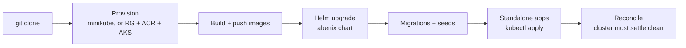

# Deployment overview

> From `git clone` to a running cluster. Two scripted paths, local minikube and Azure AKS. `deploy.sh cloud` also installs onto whatever cluster your kubectl context points at.

---

## Two deploy paths, one chart

| Path | Use case | Script |
|---|---|---|
| **Local** | Developer laptop, demos, the UAT gate | [`scripts/deploy.sh`](../../scripts/deploy.sh) |
| **AKS** | Shared staging on Azure Kubernetes Service | [`scripts/deploy-azure.sh`](../../scripts/deploy-azure.sh) |

Both install the Helm chart at [`infra/helm/abenix/`](../../infra/helm/abenix/)
and build the core images from the Dockerfiles under [`docker/`](../../docker/).
The differences are where the cluster lives, where images go (minikube's Docker
daemon or ACR), and which values overlay is used (`values-local.yaml` or
`values-azure.yaml`).

For working on the code without a cluster, `scripts/dev-local.sh` runs the
processes directly against docker compose. See
[08-howto/00-local-setup](../08-howto/00-local-setup.md).

---

## High-level flow



Each step is idempotent. Re-running after a partial failure picks up where it
left off.

---

## Local

```bash
bash scripts/deploy.sh local
```

| Command | What it does |
|---|---|
| `local` | Minikube with the platform, standalone apps, seeds and port forwards |
| `local-runtime` | Core platform only, with `values-local-runtime.yaml` layered on: pools `default`, `chat` and `heavy-reasoning`, KEDA off. Skips KEDA, mosquitto, timescaledb, the edge gateway, the standalone apps and the observability stack |
| `cloud` | Builds and pushes to `REGISTRY` (default `ghcr.io/abenix`), installs with `values-production.yaml` on the current context |
| `build` | Images only |
| `reload <svc>` | Rebuilds one image and restarts it. Core: `api`, `web`, `worker`, `agent-runtime`, `edge-runtime`. Apps: `<app>-api`, `<app>-web`, `claimsiq` |
| `forwards` | Re-establishes every port forward and reports which answer |
| `observability` | Installs Prometheus and Grafana only. Tempo is not part of the local stack |
| `status` / `destroy` | Health check, tear down |

What `local` does:

1. Starts minikube if needed, sized for the apps you picked (8 GB and 4 CPUs for the core platform, plus 0.75 GB per app, 6 CPUs from three apps), after checking Docker has the room. See [09-local-sizing](09-local-sizing.md). It enables the `ingress`, `metrics-server` and `storage-provisioner` addons. `FRESH=true` recreates it from scratch.
2. Points Docker at minikube's daemon and builds `api`, `web`, `worker`, `agent-runtime`, `edge-runtime`, the code runner images and the selected apps there, tagged `localhost:5000/abenix/<svc>`. The web image is built on the host daemon and loaded into minikube (`MINIKUBE_HOST_BUILD`). There is no registry container. The local values pull with `pullPolicy: Never`. The pgvector Postgres image is built the same way.
3. Installs KEDA into the `keda` namespace when the local values ask for it.
4. Installs mosquitto and timescaledb as their own releases, then the `abenix` chart with `values-local.yaml`.
5. Runs migrations and seeds, installs the edge gateway and LiveKit, applies the standalone apps you picked and mints their API keys, starts port forwards, then installs Prometheus and Grafana. `OBSERVABILITY=false` skips the last step.

`WEB_PORT` and `API_PORT` move the forwarded ports. `APPS` picks the standalone
apps without the prompt.

---

## AKS

```bash
source scripts/azure.env       # optional, pins AZ_RESOURCE_GROUP, ACR_NAME, AKS_NAME
bash scripts/deploy-azure.sh provision
bash scripts/deploy-azure.sh deploy
```

| Command | What it does |
|---|---|
| `provision` | Resource group, ACR, AKS, ACR attach, ingress-nginx, KEDA |
| `build` | `provision`, then build and push every image |
| `deploy` | Build and push, then deploy everything. `--skip-build` uses what ACR already has |
| `redeploy` | Build and push, then deploy everything. The day-to-day command after a code change |
| `seed` | Re-run the seeds and reconcile standalone API keys |
| `seed-keys` | Reconcile standalone API keys only |
| `test` | Playwright suites against the AKS endpoints. `E2E_PROJECT`, `E2E_ONLY` narrow it |
| `status` | Pods, services, ingress and health checks, with every URL |
| `destroy` | Remove the release and namespace, and the cluster and resource group unless `--keep-cluster` |
| `all` | `provision`, build, deploy, `status`, `test` |

Defaults: resource group `abenix-rg`, location `westeurope`, cluster
`abenix-aks` with 3 `Standard_D4s_v5` nodes, ACR name derived from the
subscription and resource group. All are environment overrides.

### Always redeploy in full

```bash
bash scripts/deploy-azure.sh redeploy
```

Do not use `--only` for platform changes. The Helm step rewrites the image tag
on every core Deployment to the current SHA, so any image `--only` skipped is
missing from ACR at that tag and its pods go to `ImagePullBackOff`. Recovery is
`helm rollback abenix -n abenix`. See [deploy-only-trap](deploy-only-trap.md).

### What a deploy runs

1. **Pre-flight.** `scripts/sync-sdks.sh --check` and `scripts/verify-alembic-graph.sh` must pass, or the script stops. `SKIP_SDK_SYNC_CHECK=1` and `SKIP_ALEMBIC_GRAPH_CHECK=1` bypass them. Before Helm runs, an `AZURE_OPENAI_API_BASE` that ends in `/openai` or `/openai/deployments` is trimmed.
2. **Images.** `api`, `web`, `worker`, `agent-runtime`, `code-runner-python`, `code-runner-node`, then each standalone app's images, built one after another with `docker buildx --platform=linux/amd64 --push`, tagged with the short SHA and `latest`. The cognify worker reuses the `worker` image. Edge runtime images are not rebuilt, they stay on the version pinned in their charts.
3. **KEDA, mosquitto, timescaledb.**
4. **Helm.** Roughly:

   ```bash
   helm upgrade --install abenix infra/helm/abenix -n abenix \
     --values infra/helm/abenix/values-azure.yaml \
     --set api.image.repository=<acr>/api --set api.image.tag=<sha> \
     ...                                   # same for web, worker, agent-runtime, cognifyWorker
     --set codeRunners.registry=<acr> --set codeRunners.imageTag=<sha> \
     <secrets from .env> --timeout 15m --wait=false
   ```

5. **Edge runtime** release `abenix-edge` on the tag pinned in its chart (or `EDGE_IMAGE_TAG`), then a wait of up to 600 seconds for pods.
6. **JWT keys.** Generates an RSA pair into `abenix-secrets` if none is there.
7. **Migrations.** The API pod's `db-migrate` init container already runs `python -m bootstrap`, `alembic upgrade heads` and `python -m bootstrap verify` from `/app/packages/db` on every rollout. The script also creates the database if missing and runs the same steps in a running API pod.
8. **Seeds**, once `scripts/lint-agent-seeds.py` passes, then checks that the subscription token works, that the runtime can read a model file the API stored, and which tool credentials are set.
9. **LiveKit and the standalone apps**, each with `kubectl apply`.
10. **Standalone API keys** reconciled by `scripts/seed-standalone-keys.sh`.
11. **Observability and ingress.** Prometheus, Grafana and Tempo, plus the `abenix-cluster-reader` role. `SKIP_OBSERVABILITY=true` skips them.
12. **Reconcile.** The script exits non-zero if any pod is still unhealthy after a settle window of `RECONCILE_WAIT_SECS` (default 300).

---

## Seeds

Both scripts run these from an API pod:

```
packages/db/seeds/seed_agents.py
packages/db/seeds/seed_users.py
packages/db/seeds/seed_portfolio_schemas.py
packages/db/seeds/seed_ml_models.py
packages/db/seeds/seed_code_assets.py
packages/db/seeds/seed_kb.py
packages/db/seeds/seed_atlas.py
packages/db/seeds/seed_kb_agent_grants.py
packages/db/seeds/seed_llm_pricing.py
packages/db/seeds/seed_backfill_agent_shares.py
```

They run in this order. `seed_kb.py` comes after `seed_agents.py` because it
grants collections to agents by slug. Each is idempotent. `seed_portfolio_schemas.py` reads its template from
`apps/api/app/core/portfolio_templates/energy_contracts.json` and exits non-zero
when that file is missing. `seed_kb.py` chunks and embeds the sample documents itself,
using the built-in local embedder when no OpenAI or Azure key is configured.

---

## UAT

```bash
bash scripts/uat.sh
```

Brings up the in-cluster MCP fixtures `uat-mcp` and `custom-mcp`, checks both
are on `MCP_ALLOWED_HOSTS` and seeds a low-privilege viewer user. Then it runs
13 Playwright specs in order and stops at the first failure: sanity (61 tests),
deep (31), industrial (about 18), HITL, SDK playground, apps, Wingman,
multi-user RBAC, ClaimsIQ, Grafana panels, PharmaVigil, help surfaces and
platform surfaces. It expects the web on 3000 and the API on 8000 (`BASE` and
`API` move them). `--seed-only` prepares the cluster and stops before the
specs. No deploy script runs it for you. `deploy-azure.sh test` and `all` run the
Playwright suites instead.

---

## Reaching it once it is up

### Local

No ingress. Everything is a port forward, and `deploy.sh` sets them all up.

```bash
bash scripts/deploy.sh forwards    # re-establish them all and report what answers
```

Forwards drop whenever a pod restarts, so this is the command to reach for when
a page stops loading. A port already taken by something else is named rather
than skipped, so a clash shows up here instead of as a page that will not load.
Full table of ports in [08-howto/00-local-setup](../08-howto/00-local-setup.md).

### AKS

The cluster web image is built with `NEXT_PUBLIC_API_URL` unset unless `.env`
sets it, so the browser calls `http://localhost:8000`. Use the port forward
script:

```bash
bash scripts/portforward-azure.sh            # start, also: stop, status, restart, urls, open, pods
```

It forwards web 3000 and API 8000, ContractIQ, Mideast Tourism, Industrial IoT
and ResolveAI on 3001 to 3004 and 8001 to 8004, ClaimsIQ on 3005, Wingman on
3006 and 8006, Grafana 3010, Prometheus 9090 and Tempo 3200. PharmaVigil is not
forwarded, reach it through its ingress host. `start` also opens the browser,
`--no-browser` skips that. Only use this script for forwards, so `stop` can
clean them all up.

The deploy also applies an `abenix-ingress` with hosts under the load balancer
IP through `nip.io`, so nothing has to go in DNS or `/etc/hosts`:

| Surface | Host |
|---|---|
| Abenix web | `http://<ip>.nip.io` |
| Abenix API | `http://api.<ip>.nip.io` |
| ContractIQ | `http://ciq.<ip>.nip.io` |
| ContractIQ API | `http://ciq-api.<ip>.nip.io` |
| Mideast Tourism | `http://tourism.<ip>.nip.io` |
| Mideast Tourism API | `http://tourism-api.<ip>.nip.io` |
| Industrial IoT | `http://iot.<ip>.nip.io` |
| ResolveAI | `http://care.<ip>.nip.io` |
| ClaimsIQ | `http://claims.<ip>.nip.io` |
| Grafana | `http://grafana.<ip>.nip.io` |
| Prometheus | `http://prom.<ip>.nip.io` |
| PharmaVigil | `http://safety.<ip>.nip.io` |
| PharmaVigil API | `http://safety-api.<ip>.nip.io` |
| Wingman | `http://wm.<ip>.nip.io` |
| Tempo | `http://tempo.<ip>.nip.io` |

```bash
bash scripts/deploy-azure.sh status   # prints every URL and health-checks them
```

The deploy writes the hostname to `.azure-endpoint` at the repo root, and
`status` falls back to reading the load balancer directly if that file is gone.

---

## Where uploaded code and models live

Code assets and ML models are written to the data volume first, under `/data/code-assets` and `/data/ml-models`. Every pod that reads them has to see the same files, and the platform does not rely on that alone.

- **Shared volumes.** On one node `/data` is a host path every pod mounts. With `sharedData.usePVC` (on in the Azure values) the API, worker, cognify worker and runtime pools mount the ReadWriteMany claim `abenix-shared-data` instead. Models also sit on `ml-models-storage`, mounted by the API and the runtime everywhere. The API's init container copies anything an older layout held into these claims, never overwriting.
- **Durable copy.** With `objectStorage.type` set to `s3` or `azure`, every upload, new version and seeded file is mirrored to object storage under `artifacts/<path under /data>`. Any API replica that lacks a file restores it before serving it, so replicas, restarts and rescheduling never lose one. With the local backend this step does nothing.
- **Pull on demand.** A runtime pod that cannot see a model fetches it from `GET /api/ml-models/{id}/fetch`, and a sandbox fetches a large code asset from `GET /api/code-assets/{id}/fetch`. Both take only a ten minute token signed for that one file and cache what they fetched.
- **Self-healing seeds.** The seeds restore a seeded model or code archive whose database row outlived its file. A code asset a user has replaced with their own version is never overwritten.
- **Deploy check.** After seeding, `deploy.sh` and `deploy-azure.sh` confirm the runtime reads a model file the API stored and warn when it cannot.

Running the processes directly on a workstation, they share one filesystem and all of this reduces to plain files.

---

## Day-2 operations

### Rolling out a change

Local: `bash scripts/deploy.sh reload <svc>` for one core service or app.
AKS: `bash scripts/deploy-azure.sh redeploy`, in full.

### Rolling back

```bash
# Helm-managed services
helm rollback abenix -n abenix

# A standalone app, back to its previous ReplicaSet
kubectl -n abenix rollout undo deploy/wingman-api
```

> **Trap** — `helm uninstall abenix` does not remove the standalone apps. Use `kubectl delete -f <app>/k8s/<app>.yaml` for those.

### Migration safety

For schema migrations with risk:
1. Develop the migration as **expand-only** (no DROP, no NOT-NULL-add-without-default).
2. Deploy migration first, code second.
3. Roll out code that writes to the new column.
4. Verify backfill is complete.
5. Deploy the contract (drop old column / make new NOT NULL) — separate release.

Prior examples are in [`packages/db/alembic/versions/`](../../packages/db/alembic/versions/).

---

## Edge runtimes

Gateways that run agents on site register with the API every 60 seconds and
receive signed bundles over MQTT or HTTP. Both deploy scripts install one
in-cluster gateway, `edge-cluster-default`. Gateways on site are installed
separately, see [05-edge-runtime](05-edge-runtime.md).

---

## See also

- [01-images](01-images.md) — which Dockerfiles are built and why there are two sets
- [02-helm](02-helm.md) — chart values + templates
- [03-keda](03-keda.md) — autoscaling per runtime pool
- [08-dev-catchers](08-dev-catchers.md) — Mailpit, a webhook catcher and mock OIDC on local clusters
- [09-local-sizing](09-local-sizing.md) — how much memory a local cluster needs for the apps you pick
- [04-observability](04-observability.md) — Prometheus + Grafana + Tempo setup
- [08-howto/00-local-setup](../08-howto/00-local-setup.md) — local dev (the simplest path)
