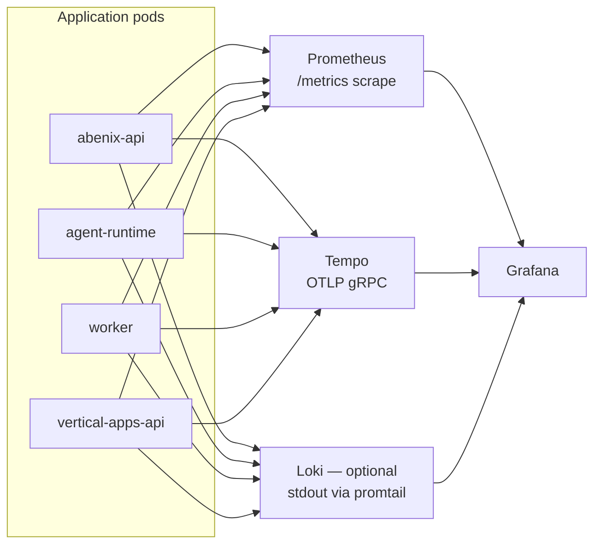

# Observability — Prometheus, Grafana, Tempo

> Three signals: **metrics** (Prom), **logs** (Loki — optional), **traces** (Tempo). Each platform service is instrumented out of the box.

---

## The deployed stack



Helm `values.observability.{prometheus,grafana,tempo}.enabled` — all default to `true`.

---

## Metrics

Every Python service exports a Prometheus endpoint at `/metrics` via [`prometheus_client`](https://github.com/prometheus/client_python). Multi-process compatible (Gunicorn + Uvicorn) via the multiproc dir env.

Built-in metrics:

| Metric | Type | Labels |
|---|---|---|
| `abenix_http_requests_total` | counter | `method`, `path`, `status` |
| `abenix_http_request_duration_seconds` | histogram | `method`, `path` |
| `abenix_executions_started_total` | counter | `agent_slug`, `runtime_pool` |
| `abenix_executions_completed_total` | counter | `agent_slug`, `failure_code` |
| `abenix_execution_duration_seconds` | histogram | `agent_slug` |
| `abenix_llm_tokens_total` | counter | `provider`, `model`, `direction` (prompt/completion) |
| `abenix_llm_cost_usd_total` | counter | `provider`, `model` |
| `abenix_tool_invocations_total` | counter | `tool_slug`, `is_error` |
| `abenix_tool_duration_seconds` | histogram | `tool_slug` |
| `abenix_queue_depth` | gauge | `subject` (NATS subject) |
| `abenix_active_executions` | gauge | `runtime_pool` |

Add a custom metric in a tool:
```python
from prometheus_client import Counter
my_counter = Counter('myapp_widgets_processed', 'Widgets processed', ['kind'])

class MyTool(BaseTool):
    async def execute(self, args):
        my_counter.labels(kind=args["kind"]).inc()
        ...
```

---

## Pre-built Grafana dashboards

Provisioned automatically via the helm chart from JSON in [`infra/observability/`](../../infra/observability/):

| Dashboard | Path | What it shows |
|---|---|---|
| **Overview** | `abenix/overview` | rps, exec/s, p50/p99, error rate, cost/h — start here |
| **Executions** | `abenix/executions` | per-agent throughput + duration + cost histograms |
| **Tools** | `abenix/tools` | per-tool call rate, error rate, latency p99 |
| **Runtimes** | `abenix/runtimes` | per-pool active executions, replica count, queue depth |
| **LLM costs** | `abenix/llm-costs` | tokens + USD by provider + model + tenant |
| **Cluster** | `abenix/cluster` | node CPU/memory, PVC fill, k8s pod restarts |

The `Open Grafana` button on `/admin/cluster` deep-links to the Overview dashboard.

---

## Traces (Tempo)

Tempo is the OTLP-receiving trace backend. Every service emits spans:

- FastAPI requests — auto-instrumented via `opentelemetry-instrumentation-fastapi`
- HTTPx calls — auto
- SQLAlchemy queries — opt-in (too noisy by default)
- Anthropic / OpenAI / Google SDKs — auto (via their respective `-instrumentation` packages)
- Tool calls — manual span per tool (in [`engine/tools/base.py`](../../apps/agent-runtime/engine/tools/base.py))
- Agent loop iterations — manual

All spans carry `tenant_id`, `agent_id`, `execution_id`, `tool_slug` (on tool spans).

### Finding a trace
1. Open `/executions/{id}`.
2. Click the "View Trace" chip in the header. Deep-links to Grafana Explore filtered to that `trace_id`.
3. In Tempo's panel, expand spans to see latency breakdown.

### Span attributes worth knowing
- `service.name` — `abenix-api`, `agent-runtime`, `wingman-api`, etc.
- `runtime.pool` — on agent-runtime spans
- `tool.slug` — on tool spans
- `llm.provider`, `llm.model`, `llm.prompt_tokens`, `llm.completion_tokens`, `llm.cost_usd` — on LLM spans
- `error.type`, `error.message` — on failed spans

---

## PII redaction in spans

[`packages/agent-sdk/abenix_sdk/tracing.py`](../../packages/agent-sdk/abenix_sdk/tracing.py) installs a `SpanProcessor` that hashes-and-truncates these attributes before export:

- `llm.prompt`
- `llm.response`
- `tool.args`
- `tool.result`
- `agent.system_prompt`

Each becomes `sha256:<8-hex>:len=<bytes>`. To temporarily disable for debugging: `OTEL_PII_REDACT=false` env var. Never in prod.

---

## Logs

Stdout from each pod is captured by Kubernetes log forwarder. The helm chart ships an optional **Loki + Promtail** stack (`observability.loki.enabled=true`). without it, logs go wherever your cluster's standard log pipeline sends them.

Log format is structured JSON in production (`LOG_FORMAT=json`). Each line:

```json
{
  "ts": "2026-05-20T15:42:11.123Z",
  "level": "INFO",
  "msg": "tool dispatch",
  "service": "agent-runtime",
  "tenant_id": "...",
  "execution_id": "...",
  "trace_id": "abc123...",
  "span_id": "def456...",
  "tool_slug": "eia_open_data",
  "latency_ms": 142
}
```

`trace_id` + `span_id` enable Loki ↔ Tempo correlation: from a log line click the trace_id to jump to the full trace.

---

## Alerts

The helm chart provisions a basic alert set in `infra/prometheus/alerts.yaml`:

| Alert | Fires when |
|---|---|
| `HighErrorRate` | 5xx rate on `abenix-api` > 5% for 5min |
| `ExecutionFailureSpike` | `executions_failed_total` rate doubles in 10min |
| `LLMSpendBurst` | `llm_cost_usd_total` rate > $10/hour |
| `QueueBacklog` | `queue_depth{subject=~"exec\\..*"}` > 100 for 10min |
| `PodCrashLooping` | container restart count > 5 in 15min |

Alerts route to whatever you've configured in Grafana / Alertmanager — Slack + email by default for the demo tenant.

---

## Dev shortcuts

Local development without the full stack:
- `export LOG_LEVEL=DEBUG` for verbose logs to stdout.
- Disable OTel: `OTEL_TRACES_EXPORTER=none`.
- Run Prom + Grafana locally: `docker compose -f infra/observability/local.docker-compose.yml up`.

---

## See also

- [02-runtime/04-streaming-tracing](../02-runtime/04-streaming-tracing.md) — what gets emitted from the runtime
- [08-howto/04-debugging](../08-howto/04-debugging.md) — using traces + logs to chase real bugs
