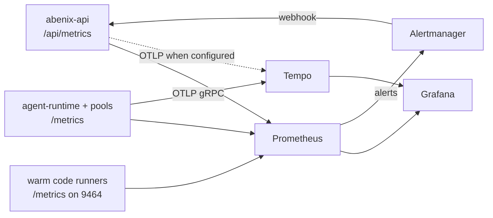

# Observability — Prometheus, Grafana, Tempo, Alertmanager

> Metrics go to Prometheus, traces to Tempo, both shown in Grafana. Alertmanager comes with the chart and hands alerts to the API. Logs stay on stdout for whatever log pipeline the cluster already has.

---

## The deployed stack



| Piece | Source | Installed by | Storage |
|---|---|---|---|
| Prometheus | `infra/observability/prometheus.yaml` | `deploy.sh local` (skip with `OBSERVABILITY=false`), `deploy.sh observability`, `deploy-azure.sh deploy` | `emptyDir`, 15 day retention. A restart loses history |
| Grafana | `infra/observability/grafana.yaml` | same | `emptyDir`. Admin password `abenix-admin` from `GF_SECURITY_ADMIN_PASSWORD` |
| Tempo | `infra/observability/tempo.yaml` | same | `emptyDir`, 168h block retention |
| Alertmanager | chart `templates/alertmanager-*.yaml` | Helm, on by default | none |

These are plain manifests, not chart values. There is no Loki.

---

## Metrics

### What Prometheus scrapes

| Job | Target | Path |
|---|---|---|
| `abenix-api` | `abenix-api.abenix.svc.cluster.local:8000`, one static target | `/api/metrics` |
| `abenix-agent-runtime` | every endpoint of a service named `abenix-agent-runtime` or `abenix-agent-runtime-<pool>`, port `http`, with a `pool` label | `/metrics` |
| `abenix-code-runners` | pods labelled `app=abenix-code-runner`, port `metrics` | `/metrics` |

The worker and the standalone apps are not scraped.

The API's static target hits one replica per scrape. Inside that replica,
`/api/metrics` sums all uvicorn workers, because the image sets
`PROMETHEUS_MULTIPROC_DIR`, see [01-images](01-images.md).

### Metric names

Defined in `apps/api/app/core/telemetry.py` unless noted.

| Metric | Type | Labels |
|---|---|---|
| `abenix_http_requests_total` | counter | `method`, `path`, `status` |
| `abenix_http_request_duration_seconds` | histogram | `method`, `path` |
| `abenix_executions_started_total` | counter | `agent_type` |
| `abenix_executions_completed_total` | counter | `status` |
| `abenix_executions_failed_total` | counter | `failure_code` |
| `abenix_execution_outcomes_total` | counter | `outcome`, `failure_code`, `agent_type` |
| `abenix_active_executions` | gauge | `tenant_id` |
| `abenix_executions_in_flight` | gauge | `pool` |
| `abenix_queue_depth` | gauge | `pool` |
| `abenix_llm_tokens_total` | counter | `provider`, `model`, `direction` (`input` or `output`) |
| `abenix_llm_cost_usd_total` | counter | `provider`, `model` |
| `abenix_llm_call_duration_seconds` | histogram | `provider`, `model` |
| `abenix_tool_calls_total` | counter | `tool_name`, `outcome` |
| `abenix_tool_execution_duration_seconds` | histogram | `tool_name` |
| `abenix_sandbox_runs_total` | counter | `backend`, `image_family`, `outcome` |
| `abenix_sandbox_run_duration_seconds` | histogram | `backend`, `image_family` |
| `abenix_stale_sweeps_total` | counter | `reason` |
| `abenix_notifications_sent_total` | counter | `channel`, `severity` |
| `abenix_cache_hits_total` / `abenix_cache_misses_total` | counter | `layer`, `tenant_id` / `tenant_id` |
| `abenix_agents_created_total` | counter | `type` |
| `abenix_knowledge_searches_total` | counter | `mode` |
| `abenix_health_check` | gauge | `component` (`postgres`, `redis`). 1 when the last probe reached it, 0 when not. In `app/core/dependency_health.py` |
| `moderation_provider_errors_total` | counter | `provider`, `model` |
| `abenix_rate_limit_hits_total`, `abenix_rate_limit_fail_open_total` | counter | rate limiter |
| `abenix_circuit_breaker_trips_total`, `abenix_circuit_breaker_failfast_total` | counter | circuit breaker |
| `abenix_coderunner_load`, `_inflight`, `_pending`, `_runs_total`, `_cache_total`, `_duration_seconds` | mixed | code runner gateway, `apps/code-runner/runner.py` |

Add a custom metric in a tool:

```python
from prometheus_client import Counter
my_counter = Counter('myapp_widgets_processed', 'Widgets processed', ['kind'])

class MyTool(BaseTool):
    async def execute(self, args):
        my_counter.labels(kind=args["kind"]).inc()
        ...
```

---

## Grafana dashboards

Loaded from [`infra/observability/dashboards/`](../../infra/observability/dashboards/)
through the `abenix-grafana-dashboards` ConfigMap:

| File | Title |
|---|---|
| `abenix-overview.json` | Abenix — Operations Overview: active runs, runs per hour, failure rate, LLM spend |
| `resource-invocations.json` | Abenix — Resource Invocations: code asset, ML model and KB query rates |
| `scaling-ops.json` | Abenix — Scaling Ops: runs and queue depth by pool |

Grafana is forwarded on 3030 locally (`deploy.sh`) and 3010 on AKS
(`portforward-azure.sh`). The web UI's Grafana links default to
`http://localhost:3010`.

---

## Traces

`engine/tracing.py` sets up OpenTelemetry in the API (`abenix-api`) and in each
consumer (`agent-runtime-<pool>`). Export happens only when
`OTEL_EXPORTER_OTLP_ENDPOINT` or `OTEL_TEMPO_ENDPOINT` is set. The pool
Deployments set it to Tempo on 4317 with `OTEL_TRACES_SAMPLER_ARG=1.0`. The
chart does not set it for the API, so API spans are not exported unless you add
it. The default sampler is parent-based at 0.1.

### Finding a trace

1. Open `/executions/{id}`. The row carries a `trace_id`.
2. Click "View Trace" to open Grafana Explore on that trace.

### Redaction

Before export these span attributes are replaced with
`<redacted len=N sha256=<12 hex>>`: `llm.prompt`, `llm.completion`,
`llm.messages`, `tool.args`, `tool.args_preview`, `tool.input`, `tool.output`,
`agent.system_prompt`, `agent.input_message`, `agent.output_message`,
`input.value`, `output.value`. There is no switch to turn it off.

---

## Logs

Pods log to stdout. The API uses structlog, JSON lines when `DEBUG=false` and
coloured console output when `DEBUG=true`. Every API response carries an
`X-Request-ID` header, taken from the request when the client sent one, so you
can grep for it.

---

## Alerts

Rule files ship as ConfigMaps from the chart and are mounted on the Prometheus
pod:

| Alert | Source | Fires when |
|---|---|---|
| `HighErrorRate` | `prometheus-rules.yaml` | API 5xx share above threshold for 5m |
| `AuditChainBroken` | `prometheus-rules.yaml` | `abenix_audit_chain_breaks_total` grew in the last day |
| `HighLatency` | `prometheus-rules.yaml` | API p95 above threshold for 10m |
| `ExecutionFailureRate` | `prometheus-rules.yaml` | failed share of runs above threshold for 10m |
| `PostgresDown` / `RedisDown` | `prometheus-rules.yaml` | `abenix_health_check{component="postgres"}` or `{component="redis"}` is 0 for 2m. Each API pod probes both every 30 s (`DEPENDENCY_PROBE_INTERVAL_SECONDS`) and on `/api/health/ready`, and sets the gauge to 1 or 0 |
| `Abenix_Http5xxRate`, `Abenix_P95LatencyHigh`, `Abenix_PoolNearMax`, `Abenix_TenantBudgetBreach` | `scaling-alerts.yaml`, when `scaling.enabled` and `scaling.alerts.enabled` | see the template |

### How an alert reaches you

```
Prometheus rule  ->  Alertmanager (chart)  ->  POST /api/admin/alerts/webhook  ->  in-app + Slack
```

1. Prometheus evaluates the rules and sends firing and resolved alerts to `abenix-alertmanager.abenix.svc.cluster.local:9093`.
2. Alertmanager groups by `alertname` and `severity`, waits 30s, repeats at most every 4h (`alerting.repeatInterval`) and resolves after 5m without data (`alerting.resolveTimeout`).
3. Every group goes to the `abenix-api` receiver, a webhook at `http://<release>-api:8000/api/admin/alerts/webhook` with `Authorization: Bearer <token>`. The token is `ALERT_WEBHOOK_TOKEN` in `abenix-secrets`, generated once per install and kept across upgrades.
4. The API validates the token, dedupes by alert fingerprint for `alerting.dedupeMinutes`, then writes one `system_alert` notification per active admin and posts once per distinct Slack webhook (per-tenant hook or `ABENIX_SLACK_WEBHOOK_URL`). Resolved alerts arrive the same way with a `[RESOLVED]` title.
5. When `alerting.slackWebhookUrl` is set, Alertmanager also posts the raw alert to that hook through a second receiver.

The `/alerts` page reads current alerts from Alertmanager `/api/v2/alerts` (so it can show silenced and inhibited ones) and falls back to the Prometheus `/api/v1/alerts` proxy when Alertmanager is unreachable. The badge next to the heading says which backend answered.

### Values

| Value | Default | Meaning |
|---|---|---|
| `alerting.alertmanager.enabled` | `true` | Ship the Alertmanager Deployment, Service and ConfigMap. Off means the page only has the Prometheus fallback and nothing pushes to the webhook |
| `alerting.prometheusUrl` / `alerting.alertmanagerUrl` | `""` | Override the in-cluster URLs the API uses |
| `alerting.slackWebhookUrl` / `slackChannel` | `""` | Optional second Slack receiver on Alertmanager itself |
| `alerting.repeatInterval` / `resolveTimeout` | `4h` / `5m` | Alertmanager timing |
| `alerting.dedupeMinutes` | `30` | Window in which the same fingerprint is not re-notified by the API |
| `secrets.alertWebhookToken` | `""` | Webhook bearer token. Empty means the chart generates one and keeps it on upgrade |

`infra/observability/prometheus.yaml` already carries the hand-off stanza:

```yaml
alerting:
  alertmanagers:
    - static_configs:
        - targets: ['abenix-alertmanager.abenix.svc.cluster.local:9093']
```

---

## Running without the cluster stack

- `LOG_LEVEL=DEBUG` for verbose logs.
- Leave `OTEL_EXPORTER_OTLP_ENDPOINT` unset and nothing is exported.
- `bash scripts/deploy.sh observability` installs just Prometheus, Grafana and Tempo into a running minikube.

---

## See also

- [02-runtime/04-streaming-tracing](../02-runtime/04-streaming-tracing.md) — what gets emitted from the runtime
- [08-howto/04-debugging](../08-howto/04-debugging.md) — using traces + logs to chase real bugs
