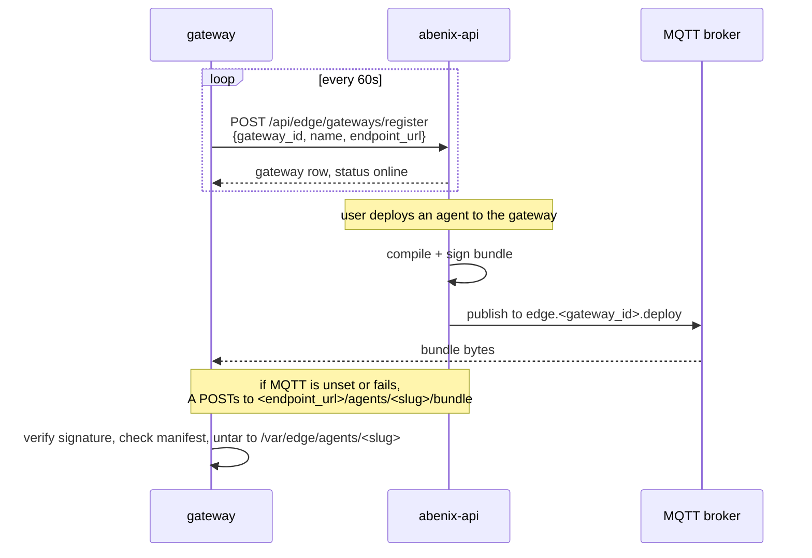

# Edge runtime deployment

> Gateways that run agents on site, next to the equipment. They register with the platform, receive signed `.agent` bundles over MQTT or HTTP, and answer execute calls locally.

---

## When to use the edge

Cloud-only is the default. Push to the edge when one of these holds:

| Reason | Example |
|---|---|
| **Latency** | Scoring a sensor reading next to the machine |
| **Data residency** | Raw data may not leave the site |
| **Connectivity** | The site is often offline |
| **Cost** | Egress for continuous telemetry dominates |

If none of those apply, run in the cloud. The edge adds real operational work.

---

## Three runtimes, one contract

| Runtime | Source | Image | Notes |
|---|---|---|---|
| `edge-runtime` | [`apps/edge-runtime/runtime.py`](../../apps/edge-runtime/runtime.py) | Python | The reference. The only one with `EDGE_ALLOW_UNSIGNED` and `TENANT_ID` |
| `edge-runtime-rust` | [`apps/edge-runtime-rust/`](../../apps/edge-runtime-rust/) | `rust:1.90-alpine` build, `alpine:3.20` runtime with `python3` for `code_executor` | Static musl binary for x86_64, ARM64 and ARMv7 |
| `edge-runtime-c` | [`apps/edge-runtime-c/`](../../apps/edge-runtime-c/) | alpine with libcurl, libmosquitto, openssl, json-c, libmicrohttpd and `python3`, about 60 MB | About 43 KB stripped binary. Reads `SIGNING_PUBKEY_PATH` only |

All three register the same way, accept the same bundle and serve the same
HTTP routes on port 8080:

| Route | Method | What it does |
|---|---|---|
| `/health` | GET | Status, loaded agents, gateway id |
| `/agents` | GET | Loaded agents with slug, digest and tools |
| `/agents/{slug}/bundle` | POST | Install a bundle from the request body |
| `/agents/{slug}/execute` | POST | Run the agent. Body `{"message": "...", "params": {}}` |

Each chart (`infra/helm/edge-runtime`, `-rust`, `-c`) is a StatefulSet with a
1Gi volume for `/var/edge/agents`, a Service on 8080 and a pinned image tag,
`1.1.0` today. `deploy.sh` builds the image for the variant it installs and
tags it with the git SHA. `deploy-azure.sh` never builds them and keeps the
pinned tag unless `EDGE_IMAGE_TAG` is set, so push the image to ACR first. See
[01-images](01-images.md#edge-runtime-images).

---

## How a gateway works



On execute, the Python runtime checks the payload against the bundle's
`max_payload_bytes`, then sends one Anthropic Messages request with the
bundle's system prompt, model, temperature and `max_tokens`, and returns the
text. There is no tool loop in that path. The C runtime also runs a `params.code` string through `code_executor` when one is sent. Without `ANTHROPIC_API_KEY` it
returns `{"ok": false, "stub": true, "echo": ...}`. A bundle that carries
`model_weights/` returns an error, local inference is not shipped.

Gateways keep no execution log and ship nothing back. The platform knows a
gateway through its register calls and the bundles it pushed, listed by
`GET /api/edge/gateways` and `GET /api/edge/gateways/{id}/agents`.

---

## Platform endpoints

All under `/api/edge`.

| Method | Path | Auth | What |
|---|---|---|---|
| `GET` | `/signing-key` | none | `{public_key_pem, algorithm, dev_key}` |
| `GET` | `/runtime/download` | none | The three variants with image, chart and install hints |
| `POST` | `/tokens/mint` | signed in | New `af_*` key with `edge.register` in its scopes, plus the signing public key. The raw key is shown once |
| `POST` | `/gateways/register` | gateway token | Idempotent on `gateway_id` |
| `GET` | `/gateways` | signed in | The tenant's gateways |
| `POST` | `/gateways/{id}/deploy` | signed in | Body `{"agent_id"}`. Compile, sign, push |
| `GET` | `/gateways/{id}/agents` | signed in | What was pushed |
| `DELETE` | `/gateways/{id}` | signed in | |
| `POST` | `/agents/{agent_id}/compile` | signed in | Compile and sign without pushing |

The UI for all of this is `/edge`.

---

## Bundle format and compilation

`apps/api/app/services/edge_compiler.py` builds a tar with:

- `agent.yaml` — name, slug, `tenant_id`, version, model, temperature, `max_iterations`, `max_tokens`, tools, `edge_constraints` (`max_payload_bytes` default 65536, `max_runtime_seconds` default 30, `mqtt_subscribe`, `mqtt_publish`), description
- `system_prompt.md`
- `signature.sig` — RSA-PSS with SHA-256, salt length 32, over the tar without the signature

Allowed tools are `mqtt_publish`, `mqtt_subscribe`, `current_time`,
`windowed_state`, `connector_call` and `code_executor`. Anything else fails
compilation, including `knowledge_search`, `kb_query`, `human_approval`,
`approval_gate`, `agent_step` and any `atlas_*`, `mcp_*` or `pipeline_*` tool.
The gateway runs the same check again before it loads a bundle.

---

## What a gateway needs

| Env var | What it is | Where it comes from | Without it |
|---|---|---|---|
| `PLATFORM_URL` | API base | your platform | Defaults to `http://host.docker.internal:8000` |
| `PLATFORM_TOKEN` | `af_*` key sent as `Authorization: Bearer` | `/edge` -> mint, or `POST /api/edge/tokens/mint` | Registration is skipped with `skip_register`. Bundles can still arrive over MQTT or HTTP |
| `SIGNING_PUBKEY_PEM` or `SIGNING_PUBKEY_PATH` | RSA public key | `GET /api/edge/signing-key`, or the mint response | The Python runtime refuses to start with `edge-runtime: no signing public key`, unless `EDGE_ALLOW_UNSIGNED=true` |
| `GATEWAY_ID` / `GATEWAY_NAME` | identity | you | `edge-local` |
| `MQTT_URL` | broker for `edge.<gateway_id>.deploy` | your broker | Bundles only arrive over HTTP to `ENDPOINT_URL` |
| `ENDPOINT_URL` | URL the platform can reach this gateway on | your network | HTTP push has nowhere to go |
| `TENANT_ID` | pin to one tenant (Python only) | a tenant UUID | Any tenant's bundle loads. With it, a foreign bundle is refused with `bundle_tenant_mismatch` |
| `ANTHROPIC_API_KEY` / `ANTHROPIC_BASE_URL` | LLM | your key | Execute returns the stub |

Full list in [09-reference/01-env-vars](../09-reference/01-env-vars.md#edge-runtimes).

### Token lifecycle

1. **Mint.** `/edge` -> mint, or `POST /api/edge/tokens/mint`. The raw token comes back once, the platform keeps only its SHA-256.
2. **Install.** Helm `--set platform_token=<af_...>`, or the env file on a bare gateway.
3. **Rotate.** Mint a new one, upgrade the gateway, revoke the old key from the API keys page. The gateway keeps its `gateway_id`, so it re-registers as the same row.
4. **Revoke.** Deactivate or delete the key. The next register call fails.

### Signing key lifecycle

Signing fails closed. Outside dev the API never mints a key, and a gateway never loads a bundle it cannot verify.

1. **Generate.** RSA-2048, PKCS8, unencrypted. Keep the private half out of git.
   ```bash
   openssl genpkey -algorithm RSA -pkeyopt rsa_keygen_bits:2048 -out edge_signing_priv.pem
   openssl pkey -in edge_signing_priv.pem -pubout -out edge_signing_pub.pem
   ```
2. **Install on the API.** The deploy scripts read two file paths and pass them with `--set-file`, so the multi-line PEM survives the shell.
   ```bash
   EDGE_SIGNING_KEY_FILE=./edge_signing_priv.pem \
   EDGE_SIGNING_PUBKEY_FILE=./edge_signing_pub.pem \
   bash scripts/deploy-azure.sh redeploy
   ```
   That lands as `secrets.edgeSigningKeyPem` and `secrets.edgeSigningPubkeyPem` in `abenix-secrets`, which the api pod reads as `EDGE_SIGNING_KEY_PEM` and `EDGE_SIGNING_PUBKEY_PEM`. A mounted file via `EDGE_SIGNING_KEY_PATH` works too.
3. **Distribute the pubkey.** `deploy-azure.sh` reads it from the API and passes the chart's `signing_pubkey` value, which lands at `/etc/edge/signing_pub.pem` in the gateway pod. Bare gateways can `curl` `GET /api/edge/signing-key` into that path.
4. **Rotate.** Replace the key files, redeploy, then upgrade every gateway with the new `signing_pubkey`. A bundle signed with the old key fails verification, the gateway logs `bundle_rejected` and keeps serving what it had.
5. **Verify.** `agent_loaded slug=... digest=...` on success. `bundle_rejected reason=bundle_signature_invalid` on tamper, `bundle_tenant_mismatch` on a foreign tenant.

What fails closed means in practice:

| Situation | API (`ENVIRONMENT` not a dev value) | Gateway |
|---|---|---|
| No signing key configured | `503` on compile, deploy and token mint, naming `EDGE_SIGNING_KEY_PEM` | Refuses to start without a pubkey, message names `SIGNING_PUBKEY_PEM` and the fetch endpoint |
| Unsigned bundle pushed | n/a, the API always signs | Rejected unless `EDGE_ALLOW_UNSIGNED=true`, which is logged at startup and on every load |
| Bad or foreign signature | n/a | Rejected, logged, previous bundle keeps running |
| `tenant_id` mismatch | n/a | Rejected when `TENANT_ID` is set, both ids logged |

Dev is the one exception. With `ENVIRONMENT` set to `dev`, `development`, `local`, `test` or `testing`, or `DEBUG=true` and no `ENVIRONMENT`, the API generates a key once, stores it under the shared data dir (`<UPLOAD_DIR>/../edge/signing_priv.pem`, `/data/edge` on k8s, override with `EDGE_SIGNING_KEY_DIR`) so replicas and restarts agree, and logs one `edge_dev_signing_key` warning. `values-local.yaml` sets `edge.allowUnsigned: true` and `deploy.sh` passes `allow_unsigned=true` to the local gateway. The Azure values use `environment: staging`, which is not a dev value, so the Azure API needs a real key.

---

## Installing a gateway

### In a cluster

`deploy.sh local` and `deploy-azure.sh deploy` install one gateway named
`edge-cluster-default` (`EDGE_GATEWAY_ID`) as the release `abenix-edge`, with
`abenix-edge-rust` and `abenix-edge-c` for the other variants and `-rust` or
`-c` added to the gateway id. `EDGE_RUNTIME_VARIANT=python|rust|c` picks the
runtime, `EDGE_RUNTIME_ALL_VARIANTS=true` installs all three, and
`EDGE_RUNTIME_ENABLED=false` skips it. Both scripts mint a platform token, pass
the signing public key and point `mqtt_url` at `abenix-mosquitto` on 1883.

For a k3s box on site:

```bash
helm upgrade --install edge-plant-13 infra/helm/edge-runtime \
  --set gateway_id=plant-13-line-2 \
  --set platform_url=https://api.example.com \
  --set platform_token=af_... \
  --set-file signing_pubkey=./edge_signing_pub.pem \
  --set mqtt_url=mqtt://broker.plant:1883 \
  --set anthropic_api_key=sk-ant-...
```

### Docker or bare metal

```bash
cat > /etc/abenix-edge.env <<EOF
PLATFORM_URL=https://api.example.com
PLATFORM_TOKEN=af_***
GATEWAY_ID=plant-13-line-2
GATEWAY_NAME=Plant 13 Line 2
MQTT_URL=mqtt://localhost:1883
ANTHROPIC_API_KEY=sk-ant-...
SIGNING_PUBKEY_PATH=/etc/edge/signing_pub.pem
EOF
curl -s https://api.example.com/api/edge/signing-key   # copy public_key_pem into /etc/edge/signing_pub.pem

docker run -d --name abenix-edge --env-file /etc/abenix-edge.env \
  -v /etc/edge:/etc/edge:ro -p 8080:8080 <registry>/edge-runtime:1.1.0
```

The Rust and C binaries read the same variables from the environment. Run
them under systemd if you want restarts.

Check the gateway on `/edge`. Its status turns online after the first register
call.

---

## Failure modes

| Failure | Behaviour |
|---|---|
| Platform unreachable | Register retries every 60 seconds. Loaded agents keep answering, they are reloaded from `/var/edge/agents` on restart |
| Bad bundle | Rejected and logged, the previous version keeps serving |
| No LLM key | Execute returns the stub answer |
| Payload too large | Execute returns `payload exceeds <n> bytes` |

---

## See also

- [00-overview](00-overview.md) — the deploy flow
- [09-reference/01-env-vars](../09-reference/01-env-vars.md) — gateway and API variables
