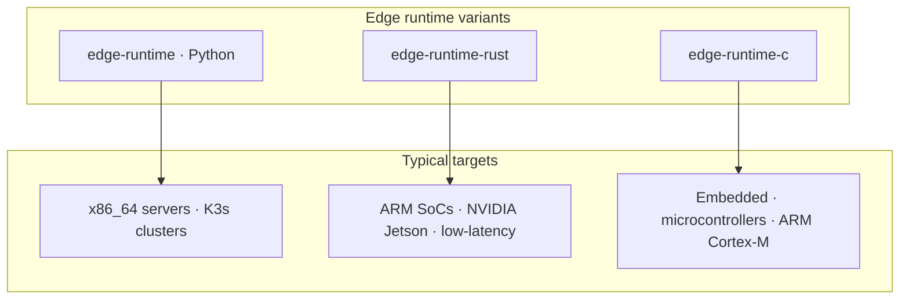
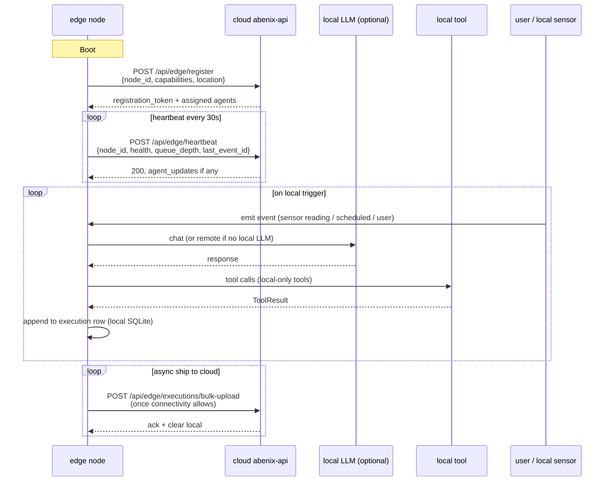

# Edge runtime deployment

> When the cloud is too far away. Edge runtimes execute agents locally on factory floors, branch offices, vehicles, gateways. They register with the cloud and ship audit asynchronously.

---

## When to use the edge

Cloud-only is the default. Push to the edge when one of these holds:

| Reason | Example |
|---|---|
| **Latency** — sub-100ms required | On-device sensor anomaly scoring in industrial IoT |
| **Data residency** — local laws forbid sending raw data out | EU healthcare claims processing |
| **Connectivity** — intermittent or no internet | Ships, rigs, mines, vehicles |
| **Air-gap** — security perimeter forbids outbound | Defense, critical infra |
| **Cost** — egress bandwidth dominates | Camera / lidar / continuous-telemetry pipelines |

If none of those apply, run in the cloud — edge brings real operational complexity.

---

## Three edge runtimes



| Runtime | Language | Footprint | Use |
|---|---|---|---|
| `edge-runtime` | Python 3.12 | ~300MB image | Default — same agent loop code as cloud, runs on K3s / k0s |
| `edge-runtime-rust` | Rust | ~12MB static binary | Low-latency streaming inference (AIS scoring, telemetry alerts) |
| `edge-runtime-c` | C | ~600KB binary | Embedded gateways with no Docker (raw ELF on the SoC) |

Source: [`apps/edge-runtime/`](../../apps/edge-runtime/), [`apps/edge-runtime-rust/`](../../apps/edge-runtime-rust/), [`apps/edge-runtime-c/`](../../apps/edge-runtime-c/).

### Picking a runtime — decision matrix

| Aspect | Python | Rust | C |
|---|---|---|---|
| **Build time** (clean) | <1s if image cached, ~2min cold | ~5min (cargo + linker) | ~10min (cross-compile + embedded toolchain) |
| **Cold-start latency** (pod ready → first event) | ~8s | <100ms | <10ms |
| **Steady-state RAM** | 150MB baseline + ~10MB per cached agent | ~25MB total + ~1MB per agent | ~3MB total + ~10KB per agent |
| **Bundle overhead** (per agent in cache) | ~50KB | ~10KB | ~10KB inline |
| **Max concurrent agents** | 1-10 (Python GIL + per-agent state) | 1-20 (Tokio async) | 1 (single-threaded by design) |
| **Hardware floor** | x86_64 or ARM64 with ≥256MB RAM, Docker | ARMv7+ with ≥64MB RAM, no Docker needed | Cortex-M4+ with ≥32MB RAM, bare metal |
| **Best for** | Dev cycle speed, typical IoT gateways, K3s-managed fleets | Low-latency telemetry, edge inference under 50ms p99, large fleets where image-pull cost matters | Bare-metal industrial controllers, where Docker isn't available, or where size below 1MB is required |
| **Worst for** | Cortex-M class chips, ultra-low latency | Rapid iteration without a build pipeline | Anything that needs multi-agent concurrency |

The Python edition is the default choice. Move to Rust when cold-start latency or pod-pull bandwidth bites. Move to C only when the device cannot run Docker at all.

---

## How an edge node works



The edge node holds its own SQLite database for the in-flight execution log. it ships completed executions to the cloud Postgres in batches.

---

## Three secrets every edge gateway needs

Every edge runtime pod (Python, Rust, or C) consumes three credentials. None of them are optional in production — every fresh Azure environment should provision all three:

| Env var | What it is | Where it comes from | What breaks without it |
|---|---|---|---|
| `PLATFORM_TOKEN` | An `af_*` API key the runtime sends as `Authorization: Bearer …` to the cloud | UI: `/edge` → **Mint edge token + pubkey**. CLI: `POST /api/edge/tokens/mint`. Auto-mint in `deploy-azure.sh` via `_generate_abenix_api_key`. | Runtime logs `register_failed status=401`. Heartbeats fail. UI shows gateway offline. Bundles can still be pushed via direct HTTP fallback. |
| `SIGNING_PUBKEY_PEM` (PEM) or `SIGNING_PUBKEY_PATH=/etc/edge/signing_pub.pem` | RSA-PSS-2048 public key. Cloud signs `.agent` bundles with the matching private key. | `GET /api/edge/signing-key` (no auth, public half only), or the mint button next to the token. The private key is `EDGE_SIGNING_KEY_PEM` on the api pod. | The Python runtime refuses to start: `edge-runtime: no signing public key`. Signed bundles cannot be verified so nothing loads. Only `EDGE_ALLOW_UNSIGNED=true` bypasses this, and it logs a warning at startup and on every load. C runtime hard-fails too. |
| `TENANT_ID` (optional) | Platform tenant this gateway belongs to | Any tenant UUID visible in the platform | Without it the gateway loads any tenant's bundle. With it, a bundle whose signed `tenant_id` differs is refused and `bundle_tenant_mismatch` is logged with both ids. |
| `ANTHROPIC_API_KEY` (or `LOCAL_LLM_URL`) | Cloud LLM credential, or a local LLM endpoint URL | Set the `anthropic_api_key` helm value at install. For local-only edge use a local Ollama URL via `LOCAL_LLM_URL=http://ollama:11434/v1`. | Execute returns `{"stub": true, "error": "ANTHROPIC_API_KEY not configured on edge runtime"}`. Tools that don't need an LLM (code_executor, mqtt_publish, current_time, windowed_state) still work. |

### Token lifecycle

1. **Mint.** UI `/edge` → button. Or `POST /api/edge/tokens/mint` with admin auth. Returns the raw `af_*` token + signing pubkey PEM in one response. The raw key is shown ONCE — store it immediately. The cloud stores only `key_hash` (SHA-256) so the raw is unrecoverable.
2. **Plumb into the runtime.** Helm: `--set platform_token=<af_…>`. Or set the env var directly on a k8s secret. Or use the cloud-init shell on a bare-metal gateway.
3. **Rotate.** Mint a new token, helm-upgrade with the new value, then revoke the old key at `/admin/api-keys`. Edge re-registers automatically because `gateway_id` is the same.
4. **Revoke.** Set `is_active=false` on the ApiKey row, or DELETE via `/api/api-keys/{id}`. The runtime starts failing `register` within seconds. Bundles still in flight finish.

### Signing key lifecycle

Signing fails closed. Outside dev the API never mints a key, and a gateway never loads a bundle it cannot verify.

1. **Generate.** RSA-2048, PKCS8, unencrypted. Keep the private half out of git.
   ```bash
   openssl genpkey -algorithm RSA -pkeyopt rsa_keygen_bits:2048 -out edge_signing_priv.pem
   openssl pkey -in edge_signing_priv.pem -pubout -out edge_signing_pub.pem
   ```
2. **Install on the API.** The deploy scripts read two file paths and pass them with `--set-file`, so the multi-line PEM survives the shell.
   ```bash
   EDGE_SIGNING_KEY_FILE=./edge_signing_priv.pem \
   EDGE_SIGNING_PUBKEY_FILE=./edge_signing_pub.pem \
   bash scripts/deploy-azure.sh redeploy
   ```
   That lands as `secrets.edgeSigningKeyPem` and `secrets.edgeSigningPubkeyPem` in `abenix-secrets`, which the api pod reads as `EDGE_SIGNING_KEY_PEM` and `EDGE_SIGNING_PUBKEY_PEM`. A mounted file via `EDGE_SIGNING_KEY_PATH` works too.
3. **Distribute the pubkey.** `GET /api/edge/signing-key` returns `{public_key_pem, algorithm, dev_key}` with no auth. `deploy-azure.sh` fetches it and passes the chart's `signing_pubkey` value, which lands at `/etc/edge/signing_pub.pem` inside the runtime pod. Bare gateways can `curl` it into that path.
4. **Rotate.** Replace the key files, redeploy, then helm-upgrade every gateway with the new `signing_pubkey`. A bundle signed with the old key fails verification, the gateway logs `bundle_rejected` and keeps serving the previous bundle.
5. **Verify.** `agent_loaded slug=… digest=…` on success. `bundle_rejected reason=bundle_signature_invalid` on tamper, `bundle_tenant_mismatch` on a foreign tenant.

What fails closed means in practice:

| Situation | API (`ENVIRONMENT` not dev/local/test) | Gateway |
|---|---|---|
| No signing key configured | `503` on compile, deploy and token mint, naming `EDGE_SIGNING_KEY_PEM`. Nothing is written to `/tmp`. | Refuses to start without a pubkey, message names `SIGNING_PUBKEY_PEM` and the fetch endpoint |
| Unsigned bundle pushed | n/a, the API always signs | Rejected unless `EDGE_ALLOW_UNSIGNED=true`, which is logged at startup and on every load |
| Bad or foreign signature | n/a | Rejected, logged, previous bundle keeps running |
| `tenant_id` mismatch | n/a | Rejected when `TENANT_ID` is set, both ids logged |

Dev is the one exception. With `ENVIRONMENT=local|dev|test` (or `DEBUG=true` and no `ENVIRONMENT`) the API generates a key once, stores it under the shared data dir (`<UPLOAD_DIR>/../edge/signing_priv.pem`, `/data/edge` on k8s, override with `EDGE_SIGNING_KEY_DIR`) so replicas and restarts agree, and logs one `edge_dev_signing_key` warning. `values-local.yaml` sets `edge.allowUnsigned: true` and `deploy.sh` passes `allow_unsigned=true` to the local gateway. `values-azure.yaml` keeps it false and the Azure API requires a real key because `ENVIRONMENT=staging` is not dev.

### Local LLM vs cloud LLM at the edge

- **`ANTHROPIC_API_KEY`** — when set, the edge runtime calls the public Anthropic endpoint over the gateway's outbound internet. Use for plants with reliable connectivity and no data-residency restrictions.
- **`LOCAL_LLM_URL`** — when set (e.g. `http://ollama:11434/v1`), the runtime routes LLM calls to that endpoint. Use for air-gapped sites, regulated jurisdictions, or where bandwidth makes cloud LLM impractical. Models pinned per-agent via `model_config.model: ollama/qwen2.5:7b` in the agent YAML.
- **Tool-only agents** — if the agent's pipeline only uses `code_executor`, `mqtt_publish`, `windowed_state`, etc. (no LLM step), neither key is required. The Rust runtime's IoT pump classifier is a good example.

## Gateway prerequisites — what to install on the plant box

Pick a tier by hardware class. All three end up registered with the platform identically.

### Tier 1 — Kubernetes-managed (production default)

| | Minimum |
|---|---|
| OS | Ubuntu 22.04+, Debian 12+, RHEL 9+, or Talos |
| RAM | 1 GB free |
| Disk | 4 GB free |
| Kubernetes | k3s (recommended), k0s, microk8s, or upstream k8s |
| Helm | v3.12+ |
| Outbound network | TCP 443/8000 to the platform. TCP 1883 to platform MQTT optional (falls back to HTTP push). |

Install:
```bash
curl -sfL https://get.k3s.io | sh -
curl -fsSL https://raw.githubusercontent.com/helm/helm/main/scripts/get-helm-3 | bash
```

### Tier 2 — Docker-managed (single-box gateways)

| | Minimum |
|---|---|
| OS | Same as Tier 1 |
| RAM | 512 MB free |
| Disk | 1 GB free |
| Docker | 20.10+ (or Podman 4.x — the runtime image is OCI-standard) |

Install:
```bash
curl -fsSL https://get.docker.com | sh
```

### Tier 3 — Bare metal / static binary (constrained gateways)

Rust or C variant only. No container engine needed.

| | Minimum |
|---|---|
| OS | musl-libc Linux (Alpine, Buildroot, OpenWRT) or glibc Linux |
| RAM | 64 MB (Rust) / 32 MB (C) |
| Disk | 50 MB (Rust) / 5 MB (C) |
| systemd | optional, for auto-restart |

### What is NOT needed on the gateway

- No Python on the box if you use Rust or C (both are fully static).
- No Neo4j or Postgres on the gateway — those live in the cloud. The runtime uses local SQLite only.
- No GPU drivers unless an agent pins a GPU-bound local model.

### Optional add-ons (any tier)

| Add-on | When | Install |
|---|---|---|
| Mosquitto MQTT broker | The agent uses mqtt_publish/subscribe to talk to PLCs on a plant MQTT bus | `apt install mosquitto mosquitto-clients` |
| Ollama (local LLM) | Air-gapped sites or data-residency regs | `curl -fsSL https://ollama.com/install.sh \| sh` then `ollama pull qwen2.5:7b`. Set `LOCAL_LLM_URL=http://localhost:11434/v1`. |
| Chrony / NTP | Bundle signature verification has a 1h issued_at skew tolerance — clock drift beyond that rejects bundles | `apt install chrony` |

## Bootstrapping a new edge node

1. **Provision the node** — install Docker / K3s / native binary depending on variant.
2. **Mint the platform token + signing pubkey** in the cloud UI: `/edge` → **Mint edge token + pubkey**. Copy both into the gateway config below.
3. **Drop the config** at the node:
   ```bash
   cat > /etc/abenix-edge.env <<EOF
   PLATFORM_URL=https://api.example.com
   PLATFORM_TOKEN=af_***                            # from the mint dialog
   GATEWAY_ID=factory-13-line-2
   GATEWAY_NAME="Plant 13, Line 2, Munich"
   MQTT_URL=mqtt://localhost:1883                   # optional, falls back to HTTP push
   ANTHROPIC_API_KEY=sk-ant-...                     # or LOCAL_LLM_URL=http://ollama:11434/v1
   SIGNING_PUBKEY_PATH=/etc/edge/signing_pub.pem    # PEM written below
   EOF
   sudo install -m 0644 /dev/stdin /etc/edge/signing_pub.pem <<EOF
   -----BEGIN PUBLIC KEY-----
   ... (paste from the mint dialog) ...
   -----END PUBLIC KEY-----
   EOF
   ```
4. **Start the runtime**:
   ```bash
   # Python (Docker)
   docker run -d --name abenix-edge --env-file /etc/abenix-edge.env \
     your-acr.azurecr.io/edge-runtime:1.5.5

   # Rust (static binary)
   /usr/local/bin/abenix-edge-rust --config /etc/abenix-edge.env

   # C (embedded)
   /opt/abenix/edge --config /etc/abenix-edge.env
   ```
5. **Verify** — the cloud UI's `/admin/edge` shows the node with a heartbeat timestamp.

---

## Agent bundle compilation, signing, and OTA delivery

This is the path a cloud-authored agent takes to land on an edge node and start running.

### Compilation

Compilation runs in `apps/api/app/services/edge_bundle.py` whenever an agent is marked `edge_compatible: true` and assigned to one or more edge nodes:

1. **Validate tool allow-list.** The agent's `model_config.tools` must be a subset of `{mqtt_publish, mqtt_subscribe, current_time, windowed_state, connector_call, code_executor, opcua_read, opcua_write}`. Any tool outside this list — `knowledge_search`, `atlas_query`, `database_query`, etc. — fails compilation with `EDGE_TOOL_NOT_PERMITTED`.
2. **Inline KB / Atlas references.** If the agent references a knowledge base, the relevant chunks are flattened into the bundle as static lookup tables. Atlas refs become inlined node lists. This is why `knowledge_search` is forbidden — the edge has no network path back to cloud KB.
3. **Serialize.** The agent + system prompt + tool config + model name go into a Protobuf message (schema in `proto/edge_agent.proto`). Output is roughly 5-50KB depending on prompt size and inlined KB volume.
4. **Sign.** The compile service computes `SHA-256(bundle_bytes)` and signs the digest with the tenant's private RSA-2048 key (stored in the `tenant_secrets` table, AES-256 encrypted at rest with the platform's KEK). The signature is appended to the bundle as a separate `.sig` blob.

### Delivery via MQTT

The cloud uses MQTT (Mosquitto in-cluster, broker URL `mosquitto:1883`) for fan-out to edge nodes because plants typically already have a broker on-prem the edge nodes can also subscribe to during disconnected operation.

```
abenix/edge/{node_id}/register                  ← (response to POST /api/edge/register)
abenix/edge/{node_id}/heartbeat                 ← edge → cloud, every 30s
abenix/edge/{node_id}/agent/{agent_slug}        ← cloud → edge, agent bundle + sig (OTA push)
abenix/edge/{node_id}/agent/{agent_slug}/ack    ← edge → cloud, ack of load
abenix/edge/{node_id}/event/{event_type}        ← edge → cloud, decision logs, alerts
abenix/edge/{node_id}/command/{command}         ← cloud → edge, ad-hoc commands (kill, reload)
```

Payload schema for the agent topic:

```json
{
  "agent_slug": "iiot-rul-estimator",
  "version": "1.4.2",
  "bundle_b64": "<base64 of the protobuf bundle>",
  "signature_b64": "<base64 of the RSA-2048 signature>",
  "tenant_public_key_fingerprint": "sha256:...",
  "issued_at": "2026-05-23T08:14:00Z"
}
```

### Verification on the edge

When the edge runtime receives an agent message:

1. Look up the tenant's public key by fingerprint (cached on first registration, refreshed daily).
2. Compute `SHA-256(bundle_b64_decoded)`.
3. Verify with the tenant's public key: `openssl dgst -sha256 -verify pub.pem -signature sig.bin bundle.bin`.
4. On failure: drop the message, log `EDGE_AGENT_SIGNATURE_INVALID`, keep the previous version running.
5. On success: replace the agent in the local registry, ack via `/ack` topic, drain the previous version's in-flight executions.

### Crypto details

- **Algorithm:** RSA-PSS-2048 with SHA-256. Compatible with most hardware security modules (HSMs) for tenants that want private keys held outside Postgres.
- **Key rotation:** swap a tenant's RSA key in `tenant_secrets`. Edge nodes detect mismatch on the next agent push (signature verification fails), pull the new fingerprint, refresh, retry.
- **Replay attacks:** prevented by the `issued_at` field. Bundles older than 1h from the edge's local clock are rejected.

---

## Local LLM support

The Python + Rust edge runtimes support **local LLM endpoints** via the OpenAI-compatible API (Ollama, llama.cpp server, vLLM). Set `LOCAL_LLM_URL`.

```yaml
# in an agent yaml — pin to a local model
model_config:
  model: ollama/qwen2.5:7b
  llm_endpoint: http://ollama:11434/v1
```

When `model` starts with `ollama/`, `local/`, or `vllm/`, the runtime routes to `LOCAL_LLM_URL` instead of the cloud LLM. The C runtime doesn't support LLMs — it's for tool-only agents (deterministic computations on sensor data).

---

## Tool subset

Not all cloud tools work at the edge. The edge runtime ships a curated subset:

| Tool | Cloud | Edge (Python) | Edge (Rust) | Edge (C) |
|---|---|---|---|---|
| `eia_open_data` | yes | yes (needs internet) | yes | no |
| `yahoo_finance` | yes | yes | yes | no |
| `tavily_search` | yes | yes | no | no |
| `ml_model` | yes | yes (local pkl) | yes (onnx only) | yes (onnx only) |
| `kb_search` | yes | no (no Neo4j on edge) | no | no |
| `code_executor` | yes | yes (gVisor sandbox) | no | no |
| `opcua_read` / `opcua_write` | no | **edge-only** | **edge-only** | yes |
| `mqtt_publish` / `mqtt_subscribe` | no | **edge-only** | **edge-only** | yes |
| `serial_read` (RS485, Modbus) | no | yes | yes | yes |

Edge-only tools (`opcua_*`, `mqtt_*`, `serial_*`) speak directly to industrial PLCs / sensors that have no cloud equivalent.

---

## Security model

- **TLS mutual auth** between edge and cloud (registration token signs a CSR. cloud issues a per-node cert).
- **No inbound internet** required — edge polls cloud, never the reverse.
- **Per-node allow-list** of agents — even if an edge token leaks, the attacker can only invoke whitelisted agents.
- **Audit shipping** is at-least-once + deduped via execution_id. Loss of connectivity means audit catches up later, never gets lost.

---

## Failure modes + recovery

| Failure | Behaviour |
|---|---|
| Cloud unreachable | Edge keeps running — uses last-known agent definitions cached locally. Executions queued in SQLite. |
| Node crash | systemd restarts. in-flight executions resume from SQLite. |
| Disk full | New executions rejected with `EDGE_STORAGE_FULL`. Sweeper purges old completed executions once shipped. |
| LLM endpoint down | Executions that need the LLM fail with `LLM_UNAVAILABLE`. Tool-only agents continue. |
| Bad agent update | If an updated agent yaml fails validation, edge keeps the prior version + reports back. |

---

## Observability at the edge

- `/metrics` on each runtime (Prometheus scrape — useful if you run a local Prom on the edge cluster).
- Heartbeats include health stats. cloud `/admin/edge` shows a map of edge nodes + their latencies.
- Traces are buffered locally and shipped to Tempo with the execution batch. Span timestamps preserved.

---

## Cost

- **Compute**: typically <0.5 cores + 512MB per node for the runtime itself.
- **Storage**: SQLite + local cache grows with traffic. default cap 10GB.
- **Bandwidth**: heartbeat is <1KB/req. Audit ship is the bulk — averages 50-500KB/exec.

For an industrial IoT deployment with 100 plants, 5 nodes each, 100 executions/node/day, expect ~2GB/day total egress to cloud Postgres.

---

## See also

- [03-services](../01-architecture/03-services.md) — service inventory
- [01-architecture/00-overview](../01-architecture/00-overview.md) — where edge fits
- [07-standalone-apps/03-others](../07-standalone-apps/03-others.md#industrial-iot) — Industrial-IoT uses edge most heavily
