# Kubernetes specifics

> Every K8s resource the platform creates, how they're wired, and the gotchas. Read after [02-helm](02-helm.md).

---

## Resource inventory (per namespace, abenix)

After a full helm install + standalone-apps apply, you have:

```mermaid
flowchart LR
  subgraph WORKLOADS["Deployments + Statefulsets"]
    AAPI[abenix-api]
    AW[abenix-web]
    W[worker]
    AR1[agent-runtime-default]
    AR2[agent-runtime-chat]
    AR3[agent-runtime-heavy-reasoning]
    AR4[agent-runtime-long-running]
    WAPI[wingman-api]
    WW[wingman-web]
    CAPI[contractiq-api]
    CW[contractiq-web]
    SAPI[sauditourism-api]
    SW[sauditourism-web]
    RAPI[resolveai-api]
    RW[resolveai-web]
    IAPI[industrial-iot-api]
    IW[industrial-iot-web]
    PG[(postgres StatefulSet)]
    NEO[(neo4j StatefulSet)]
    NA[(nats StatefulSet)]
    R[(redis StatefulSet)]
    P[(prometheus StatefulSet)]
    G[grafana]
    T[(tempo StatefulSet)]
  end

  subgraph SERVICES["Services"]
    SAAPI[svc/abenix-api]
    SAW[svc/abenix-web]
    SPG[svc/postgres]
    SR[svc/redis]
    SN[svc/nats]
  end

  subgraph KEDA["ScaledObjects"]
    KAR1[default]
    KAR2[chat]
    KAR3[heavy-reasoning]
    KAR4[long-running]
    KW[worker]
  end

  subgraph RBAC["ServiceAccounts + ClusterRoles"]
    SA[sa/abenix]
    CR[clusterrole/abenix-cluster-reader]
  end

  subgraph INGRESS["Ingress + TLS"]
    ING[ingress-nginx]
    TLS[cert-manager + Letsencrypt]
  end

  WORKLOADS -.- SERVICES
  WORKLOADS -.- KEDA
  WORKLOADS -.- RBAC
  SERVICES -.- INGRESS
```



Roughly:
- **20-30 Deployments**, 1-20 replicas each
- **6 StatefulSets** (Postgres, Neo4j, NATS, Redis, Prometheus, Tempo)
- **30+ Services** (one per Deployment, plus per-StatefulSet)
- **5 ScaledObjects** (KEDA — 4 runtime pools + worker)
- **8 ConfigMaps** + **10 Secrets**
- **5-8 Ingress routes** (api, web, grafana, tempo, prometheus, per-app)
- **1 ServiceAccount** with **1 ClusterRole** (read-only access to nodes/pods/PVCs for the cluster-health page)
- **6 PVCs** (postgres, neo4j, nats, tempo, prometheus, shared-data)

---

## Pod-to-pod networking

In-cluster traffic uses DNS:
```
<service>.<namespace>.svc.cluster.local
```

Wingman-api hits abenix-api via:
```
ABENIX_API_URL=http://abenix-api.abenix.svc.cluster.local:8000
```

The deploy script wires this into every standalone app's ConfigMap.

No service mesh by default. We pondered Istio + Linkerd. concluded plain k8s networking is sufficient given the OTel trace coverage. If you need mTLS between services, add Istio sidecars — the platform doesn't care.

---

## Probes

Every Deployment has:

```yaml
livenessProbe:
  httpGet: {path: /health, port: 8000}
  initialDelaySeconds: 30
  periodSeconds: 30
  timeoutSeconds: 5
  failureThreshold: 3

readinessProbe:
  httpGet: {path: /health, port: 8000}
  initialDelaySeconds: 10
  periodSeconds: 10
  timeoutSeconds: 3
  failureThreshold: 3
```

Source paths:
- abenix-api: `GET /api/health` — DB ping + Redis ping + NATS ping
- abenix-web: `GET /api/health` — proxies to api
- agent-runtime: `GET /health` — NATS connection check
- worker: HTTP `/health` on `:9000` — celery worker heartbeat
- standalone apps' api: `GET /health` — SDK connectivity check

> **Trap** — `initialDelaySeconds: 30` is generous on purpose. Python apps with FastAPI + asyncpg + Anthropic SDK take 8-15s to boot cold. A tighter probe causes CrashLoopBackOff on slow nodes.

---

## Resource requests + limits

Per service defaults (overridable via helm values):

| Service | CPU req | CPU lim | Mem req | Mem lim |
|---|---|---|---|---|
| abenix-api | 200m | 1000m | 512Mi | 2Gi |
| abenix-web | 100m | 500m | 256Mi | 1Gi |
| worker | 250m | 1000m | 512Mi | 2Gi |
| agent-runtime-default | 500m | 2000m | 1Gi | 4Gi |
| agent-runtime-chat | 250m | 1000m | 512Mi | 2Gi |
| agent-runtime-heavy | 1000m | 4000m | 4Gi | 8Gi |
| agent-runtime-long-running | 500m | 2000m | 2Gi | 4Gi |
| postgres | 500m | 2000m | 2Gi | 8Gi |
| neo4j | 500m | 1000m | 1Gi | 4Gi |
| nats | 100m | 500m | 256Mi | 1Gi |

Limits matter because:
- HPA / KEDA scaling is based on requests, not limits.
- Without limits, a runaway pod can starve the node.
- LLM clients can hold connections open + buffer responses — memory limit prevents that from sinking the cluster.

---

## Persistent volumes

```yaml
# postgres
volumeClaimTemplates:
- metadata: {name: postgres-data}
  spec:
    accessModes: [ReadWriteOnce]
    storageClassName: managed-premium      # AKS
    resources: {requests: {storage: 100Gi}}
```

| StatefulSet | PVC | Default storageClass | Default size |
|---|---|---|---|
| postgres | `postgres-data-postgres-0` | managed-premium (AKS) / gp2 (EKS) / standard (local) | 100Gi |
| neo4j | `neo4j-data-neo4j-0` | same | 50Gi |
| tempo | `tempo-data-tempo-0` | same | 50Gi |
| prometheus | `prometheus-data-prometheus-0` | same | 50Gi |
| nats | `nats-data-nats-0,1,2` | same | 20Gi |
| redis | `redis-data-redis-0` | same | 10Gi |

The standalone apps share a single PVC (`shared-data`) via `hostPath` for the file-backed cache. In AKS this becomes an Azure-Files SMB mount — see [04-data-stores](../01-architecture/04-data-stores.md#azure-files-smb-trap).

---

## RBAC (in-cluster)

The platform's `abenix` ServiceAccount has a ClusterRole `abenix-cluster-reader`:

```yaml
apiVersion: rbac.authorization.k8s.io/v1
kind: ClusterRole
metadata: {name: abenix-cluster-reader}
rules:
- apiGroups: [""]
  resources: [nodes, pods, persistentvolumeclaims, services]
  verbs: [get, list, watch]
```

Used by the `/admin/cluster` page to render the cluster-health widgets without leaking secrets.

Applied idempotently by `deploy-azure.sh`. Most pods do **not** have cluster-level RBAC.

---

## Ingress

```yaml
apiVersion: networking.k8s.io/v1
kind: Ingress
metadata:
  name: abenix
  annotations:
    cert-manager.io/cluster-issuer: letsencrypt
    nginx.ingress.kubernetes.io/proxy-buffering: "off"      # for SSE
    nginx.ingress.kubernetes.io/proxy-read-timeout: "3600"  # for long execs
spec:
  ingressClassName: nginx
  tls:
  - hosts: [api.example.com, example.com]
    secretName: abenix-tls
  rules:
  - host: example.com
    http:
      paths:
      - {path: /, pathType: Prefix, backend: {service: {name: abenix-web, port: {number: 3000}}}}
  - host: api.example.com
    http:
      paths:
      - {path: /, pathType: Prefix, backend: {service: {name: abenix-api, port: {number: 8000}}}}
```

> **Trap** — SSE breaks without `proxy-buffering: off`. The nginx default buffers responses. events sit in the buffer for 30s before being flushed. Always include that annotation.

---

## Network policies (optional)

The default install does **not** apply NetworkPolicies. For locked-down environments, the helm chart can render a default-deny + per-service allow set:

```bash
helm upgrade abenix infra/helm/abenix --set networkPolicies.enabled=true
```

Policies allow:
- web → api
- api → postgres, redis, nats, neo4j
- worker → postgres, redis, nats
- agent-runtime → postgres, redis, nats, S3
- Anything → DNS (`kube-dns`)
- Anything → external HTTPS (LLM providers)

---

## Image pull configuration

On AKS we **attach the ACR** at provision time:
```bash
az aks update -n abenix-aks -g abenix-rg --attach-acr your-acr
```

This adds an `imagePullSecret` to every namespace automatically. No per-pod pull secret needed.

If `--attach-acr` fails (no Owner role on the subscription), the script falls back to creating a docker-registry Secret named `acr-pull-secret` and patches the default ServiceAccount with `imagePullSecrets: [acr-pull-secret]`.

> **Trap** — if you ever swap ACRs (e.g. test → prod), the attach step must re-run. existing tokens don't propagate to the new registry.

---

## Common kubectl recipes

```bash
# What's in the abenix namespace?
kubectl -n abenix get all

# Stream logs from all api replicas
kubectl -n abenix logs -l app=abenix-api -f --tail=100

# Exec into a pod to run a one-off command
kubectl -n abenix exec -it deploy/abenix-api -- python -c "from app.core.db import engine; print(engine.url)"

# Watch a rolling deploy
kubectl -n abenix rollout status deploy/abenix-web

# Force a restart (e.g. picking up a new ConfigMap)
kubectl -n abenix rollout restart deploy/agent-runtime-default

# Scale manually (KEDA must be paused first if you want it to stick)
kubectl -n abenix annotate scaledobject runtime-default autoscaling.keda.sh/paused=true
kubectl -n abenix scale deploy agent-runtime-default --replicas=10

# Port-forward locally
kubectl -n abenix port-forward svc/abenix-api 8000:8000
kubectl -n abenix port-forward svc/abenix-web 3000:3000

# Inspect a stuck pod
kubectl -n abenix describe pod <pod-name>
kubectl -n abenix logs <pod-name> --previous       # before last crash
```

---

## Failure-domain isolation

- Postgres + Neo4j run on a separate node pool (`nodepool=data`) — they're stateful and we don't want them rescheduled on every drain.
- Agent-runtimes are on the `nodepool=compute` pool with cluster-autoscaler enabled so KEDA's max replicas can actually materialise.
- Edge runtimes are usually outside K8s entirely — see [05-edge-runtime](05-edge-runtime.md).

The helm chart sets `nodeSelector` + `tolerations` accordingly. defaults are no-op on minikube where you have one pool.

---

## See also

- [00-overview](00-overview.md) — overall deploy flow
- [02-helm](02-helm.md) — chart structure
- [03-keda](03-keda.md) — autoscaling
- [05-edge-runtime](05-edge-runtime.md) — edge deployment
