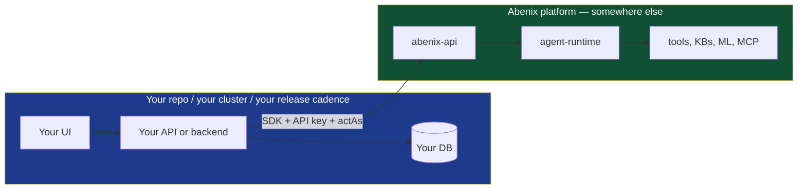

# Building an app on top of Abenix

> Abenix is a platform you call from the outside. The seven vertical apps in this monorepo (Wingman, E&C-Copilot, Mideast Tourism, ResolveAI, Industrial-IoT, ClaimsIQ, PharmaVigil) are example consumers. They live in the same repo so we can demo end to end, but the contract they use is the one a third party would use from a separate repo, a separate cluster, a separate company.

This page is for the third party. It explains how to build a new vertical that talks to a running Abenix deployment without joining Abenix's own build, deploy or release process.

---

## The mental model



Two things to keep separate.

1. **Your app** — owns the user, the UI, the per-app database, the local cache, the webhook intake, the billing model, the release cadence, the brand. Your release pipeline. Your scaling. Your incident response.
2. **The platform** — provides agents, pipelines, tools, knowledge bases, ML inference, MCP integration, approvals, observability. Hosted by someone (could be you, could be us, could be a customer).

The platform is a remote dependency, like Stripe or Twilio. You consume it over HTTP. You authenticate with an API key. Your app should stay up, with less to offer, when the platform has an incident, and the other way round.

---

## The contract — what you implement on your side

A new vertical app:

1. **Owns its UI.** Whatever framework you like — Next.js, React, Vue, Vaadin, plain HTML.
2. **Owns its data plane.** Your own backend, your own database. The platform never touches your data store directly.
3. **Authenticates its own users.** The platform does not see your users as platform users. It sees them as *acting subjects* on top of your service-account API key.
4. **Calls platform agents for every interesting computation.** This is the thin-app contract. The platform owns the LLM-and-tool side. You own the UX and the per-user state.
5. **Uses actAs on every call** so the platform's audit log records *which of your users* triggered each agent run.
6. **Caches platform responses** in your own layer if you need low-latency UI. Cached values must always have come from a real platform call at some point.

Step 4 is the load-bearing rule. The moment you copy agent logic into your own code, you have a second copy of the prompt, the model choice, the tool list and the cost ledger, and that copy will drift. The point of the platform is one place for those.

---

## What you need from the platform

To start building, get four things from whoever runs the Abenix deployment you will call.

| Item | What it looks like | Where it comes from |
|---|---|---|
| Platform URL | `https://abenix.example.com` | The cluster's ingress. |
| API key | `af_` followed by a 43-character random string | `POST /api/api-keys` with the `can_delegate` scope. |
| Subject-policy access | a SubjectPolicy row for your subject type, usually with `subject_id = "*"` | The platform admin creates it (`POST /api/access-control/policies`). |
| Agent slugs | `wingman-mispricing-extractor`, `contractiq-extractor`, etc. | List via `GET /api/agents` with your key. |

For agents that don't exist yet, you build them in the platform's Agent Builder UI, as seed YAML, or via `POST /api/agents`. That work lands on the platform side, not in your repo. The platform admin gates publication.

---

## Minimum viable vertical — 30 lines

In Python with FastAPI:

```python
import json
import os

from fastapi import Depends, FastAPI
from abenix_sdk import Abenix, ActingSubject

app = FastAPI()

@app.post("/api/myapp/score-customer/{customer_id}")
async def score_customer(customer_id: str, current_user = Depends(auth)):
    subject = ActingSubject(
        subject_type="myapp",
        subject_id=str(current_user.id),
        email=current_user.email,
        display_name=current_user.display_name,
    )
    async with Abenix(
        api_key=os.environ["MYAPP_ABENIX_API_KEY"],
        base_url=os.environ["ABENIX_API_URL"],
    ) as client:
        result = await client.execute(
            "myapp-customer-scorer",
            json.dumps({"customer_id": customer_id}),
            act_as=subject,
            context={"customer_id": customer_id},
        )
    return {"output": result.output, "execution_id": result.execution_id}
```

Same pattern in TypeScript / Node:

```typescript
import { Abenix } from "@abenix/sdk"

const platform = new Abenix({
  apiKey: process.env.MYAPP_ABENIX_API_KEY!,
  baseUrl: process.env.ABENIX_API_URL,
})

export async function scoreCustomer(customerId: string, user: User) {
  const result = await platform.execute(
    "myapp-customer-scorer",
    JSON.stringify({ customer_id: customerId }),
    {
      actAs: {
        subjectType: "myapp",
        subjectId: user.id,
        email: user.email,
        displayName: user.displayName,
      },
      context: { customer_id: customerId },
    },
  )
  return { output: result.output, executionId: result.executionId }
}
```

Same in Java (sketch):

```java
import com.abenix.sdk.Abenix;
import com.abenix.sdk.Abenix.ExecuteOptions;
import com.abenix.sdk.ActingSubject;
import com.abenix.sdk.ExecutionResult;

public String scoreCustomer(String customerId, User user) {
    ActingSubject subject = ActingSubject.builder()
        .subjectType("myapp")
        .subjectId(user.getId())
        .email(user.getEmail())
        .displayName(user.getDisplayName())
        .build();

    ExecutionResult r = abenix.execute(
        "myapp-customer-scorer",
        "{\"customer_id\": \"" + customerId + "\"}",
        ExecuteOptions.withContext(Map.of("customer_id", customerId)).actingAs(subject));
    return r.output();
}
```

What all three share.

- **One platform call per endpoint.** No business logic on the way in or out.
- **actAs on every call.** The platform records the action against your user, not your service account.
- **Keep the `execution_id`.** Return it with the output so the UI can link to the trace.

`execute` blocks until the run ends by default. Pass `wait="submitted"` to get an `execution_id` back at once and poll or watch it. The REST endpoint also dedupes on an `Idempotency-Key` header, but the SDK `execute` does not set that header today. See [03-sdk/00-overview](../03-sdk/00-overview.md) for the full signature.

---

## Architecture choices that are yours to make

The platform doesn't care how your side is built. Some shapes that work.

### Single backend, server-rendered UI

Cheapest. Server-side Python / Node / Java. UI either server-rendered or a thin SPA that talks only to your backend. Your backend calls the platform.

```
[Browser] → [Your backend] → [Platform]
```

Use this when you have a small team and want one place to debug. ClaimsIQ is this shape: one Spring Boot + Vaadin process on port 3005.

### SPA + backend

Your SPA talks to your backend, your backend talks to the platform. The browser never sees the platform directly.

```
[SPA] → [Your backend / BFF] → [Platform]
```

This is the shape the other six apps in this monorepo use (Next.js web + FastAPI api). It is the recommended shape for any app of moderate size. The BFF (backend-for-frontend) is where actAs is set and where per-app caching lives.

### SPA calls platform directly (rare, careful)

Possible but rare. You would need a per-user platform API key (each user holds their own), or to issue short-lived tokens from your backend. CORS, key rotation and offline access get tricky. Not recommended unless you have a very specific reason.

### Mobile app

Native iOS / Android via the platform's HTTP API directly. Same caveats as "SPA calls platform directly". Usually better to put your own backend in the middle.

---

## Deployment — keep it separate

This repo uses `scripts/deploy.sh` (minikube) and `scripts/deploy-azure.sh` (AKS) to deploy the example verticals next to the platform on the same cluster. **That is a convenience for the example deployment, not a requirement of the architecture.**

A real third-party vertical should:

1. Have **its own repo**, its own CI, its own release pipeline.
2. Have **its own deployment target** — a separate Kubernetes cluster, a Vercel project, an EC2 instance, a Heroku dyno. Whatever fits.
3. Use **its own observability stack** if it wants. The Python SDK ships `abenix_sdk.tracing.init_tracing` so your spans can join the platform's OTel traces.
4. **Never import platform internals.** Use the SDK and nothing else. The SDKs are not on PyPI, npm or Maven yet. Build them from `packages/sdk/python`, `packages/sdk/js` and `claimsiq/sdk` as [03-sdk](../03-sdk/00-overview.md) describes, or vendor a copy the way the apps here do.

You do not need to fork this repo. You do not need access to `scripts/deploy-azure.sh`. You do not need helm values. You need the SDK and an API key.

### What about needing new tools / agents on the platform?

If your domain needs a tool that doesn't exist on the platform, it is built into the platform itself, not added locally by a third party. Same for new agents. Once an agent is on the platform, every app on the platform can call it.

The platform improves once and every consumer gets the change.

---

## Caching — your responsibility

The platform does not cache agent results for you. Every call is a fresh agent run. For your UI to feel fast, you cache on your side.

A common pattern:

```python
class PlatformCache:
    async def get_or_run(self, key: str, ttl_seconds: int, runner):
        cached = await self.redis.get(key)
        if cached:
            return json.loads(cached)
        result = await runner()
        await self.redis.setex(key, ttl_seconds, json.dumps(result))
        return result

# Usage
result = await cache.get_or_run(
    key=f"customer-score:{customer_id}",
    ttl_seconds=1800,
    runner=lambda: score(customer_id, subject),  # wraps client.execute(...)
)
```

Two rules.

1. **The cache only holds values the platform produced.** Never poke a hand-crafted value in. Audit and trust depend on every cached value having a real `execution_id` it can be traced to.
2. **The cache is for performance.** It is not where the user-visible freshness claim comes from. If your UI says "Last updated 3 minutes ago", that should come from when the execution finished, not from the cache TTL.

A common bug: caching the agent's output but not its `execution_id`. Then when a user clicks "explain this number" the UI cannot link to the trace. Store the whole envelope (output, execution_id, cost, finish time) and surface the link.

---

## Streaming events to your UI

If you want live progress on your UI, two options.

### Server-side proxy of SSE

Your backend opens the platform SSE stream and proxies events to your SPA. The SPA sees one connection. Your backend can merge several platform executions into one UI panel and filter per app.

```python
@app.get("/api/myapp/executions/{execution_id}/watch")
async def proxy_watch(execution_id: str):
    async def gen():
        async with Abenix(api_key=KEY, base_url=URL) as client:
            async for chunk in client.executions.watch_raw_sse(execution_id):
                yield chunk  # filter or enrich here
    return StreamingResponse(gen(), media_type="text/event-stream")
```

This is the recommended shape. It hides the platform from the browser, lets you apply your own auth on the SSE endpoint, and gives you a hook for per-app event types. Wingman's `/api/wingman/executions/{id}/watch` works this way.

### Direct SPA → platform SSE

Doable if your SPA holds a delegated platform API key. CORS must be allowed at the platform side. Token refresh becomes the SPA's problem.

---

## What lives where — a checklist

| Concern | Your side | Platform side |
|---|---|---|
| Login / session | yes | no |
| User database | yes | no |
| Webhook intake (Slack, Stripe, etc.) | yes | no |
| Branding, theming, copy | yes | no |
| Per-user cache | yes | no |
| Domain computation | no | agent + tools |
| External data fetching (EIA, Yahoo, AIS, …) | no | tool used by agent |
| ML model inference | no | `ml_model` tool inside agent |
| Knowledge retrieval | no | `knowledge_search` tool inside agent |
| Approvals UI | both — you wrap the platform's `/api/approvals` | platform |
| Observability of the agent side | no | platform OTel + Grafana |
| Observability of your side | yes | no |

The test for "does this go in my app or in an agent?": if the function reads from an external API, transforms the data and writes a result, that's an agent. If it serves a page or routes a webhook, that's your app.

---

## What you can build without writing any agents

A lot. The platform ships with well over a hundred tools plus seeded knowledge bases, ML models and out-of-box agents. You can build a useful vertical by calling existing agents with your own UX on top.

The right approach for v1:

1. List the platform's agents that fit your domain (`GET /api/agents`).
2. Wire your endpoints to call those agents.
3. Ship.
4. Find *one* gap — a step the existing agents don't cover. Write that agent.
5. Repeat.

Wingman grew this way. Its domain agents (`wingman-mispricing-extractor`, `wingman-scenario-forecaster` and the rest) were added one at a time as gaps showed up.

---

## Versioning and SDK upgrades

The SDKs carry their own version (`abenix-sdk` 1.0.0 in `packages/sdk/python/pyproject.toml`, `@abenix/sdk` 1.0.0 in `packages/sdk/js`, the Java SDK 0.1.0), separate from the platform version in `VERSION`. They are not on a package registry, so you pin by keeping a known-good build or a git ref.

The Python apps in this repo vendor the SDK under `<app>/api/sdk/abenix_sdk/`. `bash scripts/sync-sdks.sh` copies the canonical source in `packages/sdk/python/abenix_sdk/` into each app, and `--check` fails CI when a copy drifts. Never edit a vendored copy by hand.

---

## Where to go next

- [01-wingman](01-wingman.md) — a real worked example. Read this even if you build outside this repo. The architecture decisions transfer.
- [02-contractiq](02-contractiq.md) — E&C-Copilot, the largest app: contract extraction, KB + knowledge graph, many agents.
- [03-others](03-others.md) — short tours of Mideast Tourism, ResolveAI, Industrial-IoT and ClaimsIQ.
- [05-pharmavigil](05-pharmavigil.md) — a nine-node pipeline with code assets and one ML model, and why each piece sits where it does.
- [03-sdk/00-overview](../03-sdk/00-overview.md) — the SDK reference proper.
- [01-architecture/01-tenants-rbac](../01-architecture/01-tenants-rbac.md) — the actAs pattern from the platform side.
- [02-runtime/06-agent-to-agent](../02-runtime/06-agent-to-agent.md) — how to compose multiple platform agents in one feature.

---

## A note on the example apps in this repo

The seven verticals live in `/contractiq`, `/mideasttourism`, `/industrial-iot`, `/resolveai`, `/claimsiq`, `/wingman` and `/pharmavigil`. Each has a `start.sh` for local dev, which `scripts/dev-local.sh` calls, and a `k8s/<app>.yaml` that `scripts/deploy.sh` and `scripts/deploy-azure.sh` apply. `APPS=wingman,pharmavigil` picks which ones. They share the platform's release pipeline because that is the simplest way to keep the demo healthy.

| App | Local web | Local API | In-cluster services |
|---|---|---|---|
| ContractIQ (E&C-Copilot) | 3001 | 8001 | `contractiq-web:3001`, `contractiq-api:8001` |
| Mideast Tourism | 3002 | 8002 | `mideasttourism-web:3002`, `mideasttourism-api:8002` |
| Industrial-IoT | 3003 | 8003 | `industrial-iot-web:3003`, `industrial-iot-api:8003` |
| ResolveAI | 3004 | 8004 | `resolveai-web:3004`, `resolveai-api:8004` |
| ClaimsIQ | 3005 (one process) | — | `claimsiq:3005` |
| Wingman | 3006 | 8006 | `wingman-web:3006`, `wingman-api:8006` |
| PharmaVigil | 3007 | 8007 | `pharmavigil-web:3007`, `pharmavigil-api:8007` |

In cluster every app reaches the platform at `http://abenix-api:8000` and reads its key from `<APP>_ABENIX_API_KEY` (`CONTRACTIQ_`, `MIDEASTTOURISM_`, `INDUSTRIALIOT_`, `RESOLVEAI_`, `CLAIMSIQ_`, `WINGMAN_`, `PHARMAVIGIL_`). `bash scripts/seed-standalone-keys.sh <app>` mints or repairs that key.

If you build a vertical, **do not** add it to `deploy-azure.sh`. Your release cadence and blast radius are not the platform's. Keep them separate.

The example apps are reference implementations, not infrastructure templates. Use them for "how should the API talk to the platform?" and "how should the React side render the executions list?". Those answers transfer. Do not use them for "how should I lay out my k8s manifests?". That depends on your stack.
