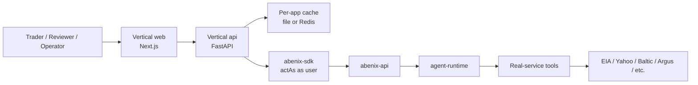

# The thin-app pattern

> Every vertical app (Wingman, the example app, Saudi Tourism, ResolveAI, Industrial-IoT, ClaimsIQ) follows the same shape. Read this and you can build a new one in a week.

---

## The contract

A thin app:
1. **Owns its UI** — its own Next.js pages, branding, navigation.
2. **Owns its data plane** — its own FastAPI + local DB if needed (often Postgres in the same instance, just different tables).
3. **Owns NO business logic** — every interesting computation goes through a platform agent via the SDK.
4. **Uses actAs** — every platform call carries `X-Abenix-Subject: <app>:<user>`.
5. **Caches agent outputs** — the agent runs are often cached for 30min-1hr in the app's own file/Redis cache so repeated views are fast.



---

## File layout

```
<app>/
├── api/
│   ├── main.py                 ← FastAPI entrypoint
│   ├── data/                   ← per-app static config (corridors, schemas, demo data)
│   ├── cache.py                ← file-backed result cache
│   ├── trajectories.py         ← lineage / explain views (optional)
│   ├── narration.py            ← per-page user-facing copy (optional)
│   └── sdk/abenix_sdk/         ← vendored copy of the platform SDK
│   ├── Dockerfile
│   └── requirements.txt
├── web/
│   ├── src/app/                ← Next.js App Router
│   ├── public/
│   ├── package.json
│   └── Dockerfile
├── ml-models/                  ← optional per-app sklearn pkls + meta.json
│   ├── build_*.py              ← training scripts
│   ├── *.pkl                   ← serialised models
│   └── *.meta.json
├── aimodels/                   ← legacy name; same purpose
└── k8s/
    └── <app>.yaml              ← Deployment + Service + Secrets stub
```

The vendored SDK copy under `<app>/api/sdk/abenix_sdk/` is auto-synced from `packages/sdk/python/abenix_sdk/` by `scripts/sync-sdks.sh` (CI catches drift).

---

## A minimal `main.py`

```python
from fastapi import FastAPI, Depends, HTTPException
from abenix_sdk import Abenix, ActingSubject
import os

app = FastAPI()

@app.post("/api/myapp/score-customer/{customer_id}")
async def score_customer(customer_id: str, current_user = Depends(auth)):
    async with Abenix(
        api_url=os.environ["ABENIX_API_URL"],
        api_key=os.environ["MYAPP_ABENIX_API_KEY"],
    ) as client:
        subject = ActingSubject(
            subject_type="myapp",
            subject_id=current_user.id,
            email=current_user.email,
            display_name=current_user.display_name,
        )
        result = await client.with_subject(subject).execute(
            "myapp-customer-scorer",
            {"customer_id": customer_id},
            wait="complete",
            client_token=f"score-{customer_id}",
        )
        return result.output
```

That's 30 lines for a full feature: auth, delegated identity, idempotent retry, agent call, scoring result. The agent — defined in the agent yaml — owns the actual model invocation, tool calls, error handling.

---

## What goes where

| Concern | App | Platform agent |
|---|---|---|
| Login + session | App (auth library or hand-rolled) | n/a |
| UI rendering | App | n/a |
| Caching of recent results | App (file/Redis) | n/a |
| Webhook intake (Slack callbacks etc.) | App | n/a |
| Domain calculation (anything non-trivial) | n/a | Agent |
| Calls to external data (EIA, Yahoo, etc.) | n/a | Tool used by agent |
| ML model inference | n/a | `ml_model` tool inside agent |
| Knowledge retrieval | n/a | `kb_search` tool inside agent |

**Litmus test**: if the function reads from an external API + transforms + writes a result, it's an agent. If it serves an HTML page or routes a webhook, it's app code.

---

## Caching

The standard pattern uses a file-backed cache at `<app>/api/cache.py`:

```python
# Read-or-warm
async def warm_mispricing(corridor_id):
    entry = cache.read("mispricing", corridor_id)
    if entry and entry["fresh"]:
        return entry["payload"]
    # Otherwise fire the agent
    async with Abenix(...) as client:
        result = await client.execute("wingman-mispricing-extractor", {"corridor_id": corridor_id})
    cache.write("mispricing", corridor_id, result.output)
    return result.output
```

Default TTL: 1800s (30min). Per-page overrides allowed. Cache lives in `/data/<app>-cache/` on a host-path or PVC volume.

> **Trap** — caching is for performance only. Cached values must always have arrived via the agent at some point. Manual cache pokes (writing values you didn't get from the agent) violate the thin-app contract and corrupt audit.

---

## How to add a new vertical app

1. **Pick a slug** — `myapp`. Avoid collisions.
2. **`cp -r wingman myapp`** as a starting point.
3. **Rebrand**:
   - Find/replace `wingman` → `myapp` in source.
   - Update package.json names.
   - Update Dockerfile paths.
4. **Strip the wingman-specific routes** in `api/main.py` and start with the minimum.
5. **Write 1-2 agent yamls** in `packages/db/seeds/agents/myapp_*.yaml`.
6. **Add a k8s manifest** at `myapp/k8s/myapp.yaml` (copy from wingman's).
7. **Hook into the deploy script** — `scripts/deploy-azure.sh`'s `_expand_only` and `deploy_<app>()` function. Add an entry.
8. **Add a route on the platform's marketplace** if the app should be publicly listed.
9. **Test locally** with `bash scripts/deploy.sh local` then visit the app's ingress.

The whole bootstrap takes 1-2 days for the API + first agent. Adding more agents + pages takes hours each.

---

## Reference implementations

- [01-wingman](01-wingman.md) — energy trading. ~5 agents, 10 pages, fairly complex caching.
- [02-example_app](02-example_app.md) — contract intelligence. Heavy KB usage, OCR pipelines, atlas graph.
- [03-others](03-others.md) — Saudi Tourism, ResolveAI, Industrial-IoT, ClaimsIQ snapshots.

Each lives in its own directory in the repo. the docs above are short overviews.

---

## See also

- [03-sdk/01-python](../03-sdk/01-python.md) — SDK usage in the thin app
- [01-architecture/01-tenants-rbac](../01-architecture/01-tenants-rbac.md) — actAs server side
- [08-howto/02-add-an-agent](../08-howto/02-add-an-agent.md) — write the agent yaml
