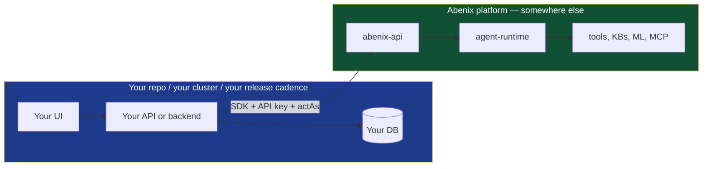

# Building an app on top of Abenix

> Abenix is a platform you call from the outside. The six vertical apps in this monorepo (Wingman, the example app, Saudi Tourism, ResolveAI, Industrial-IoT, ClaimsIQ) are example consumers — they happen to live in the same repo so we can demo end-to-end, but the contract they use is the same one a third party would use from a separate repo, a separate cluster, a separate company.

This page is for the third party. It explains how to build a new vertical that talks to a running Abenix deployment without integrating into Abenix's own build, deploy, or release process.

---

## The mental model



Two things to keep separate.

1. **Your app** — owns the user, the UI, the per-app database, the local cache, the webhook intake, the billing model, the release cadence, the brand. Your release pipeline. Your scaling. Your incident response.
2. **The platform** — provides agents, pipelines, tools, knowledge bases, ML inference, MCP integration, approvals, observability. Hosted by someone (could be you, could be us, could be a customer).

The platform is a remote dependency, like Stripe or Twilio. You consume it over HTTP. You authenticate with an API key. You stay alive when it has incidents (with degraded functionality) and vice versa.

---

## The contract — what you implement on your side

A new vertical app:

1. **Owns its UI.** Whatever framework you like — Next.js, React, Vue, plain HTML. The vertical's UI is yours.
2. **Owns its data plane.** Your own backend, your own database. The platform never touches your data store directly.
3. **Authenticates its own users.** The platform does not see your users as platform users. It sees them as *acting subjects* on top of your service-account API key.
4. **Calls platform agents for every interesting computation.** This is the thin-app contract. The platform owns the LLM-and-tool side. You own the UX and the per-user state.
5. **Uses actAs on every call** so the platform's audit log records *which of your users* triggered each agent run.
6. **Caches platform responses** in your own layer if you need low-latency UI. Cached values must always have come from a real platform call at some point.

Step 4 is the load-bearing rule. The moment you start replicating agent logic in your own code, you have a second copy of the prompt, the model choice, the tool list, and the cost ledger — that copy will drift. The whole point of using a platform is one canonical place for those.

---

## What you need from the platform

To start building, get four things from whoever runs the Abenix deployment you will call.

| Item | What it looks like | Where it comes from |
|---|---|---|
| Platform URL | `https://abenix.example.com` | The cluster's ingress. |
| API key | `af_xxxx…` (40+ chars after the prefix) | `POST /api/api-keys` with the `can_delegate` scope. |
| Subject-policy access | a SubjectPolicy row for your subject type, ideally with wildcard | The platform admin issues this. |
| Agent slugs | `wingman-mispricing-extractor`, `example_app-clause-extractor`, etc. | List via `GET /api/agents` with your key. |

For agents that don't yet exist (i.e. you need new ones for your domain), you write them as YAML files using the platform's Agent Builder UI, or via `POST /api/agents`. That work lands on the platform side, not in your repo. The platform admin gates publication.

---

## Minimum viable vertical — 30 lines

In Python with FastAPI:

```python
from fastapi import FastAPI, Depends, HTTPException
from abenix_sdk import Abenix, ActingSubject
import os

app = FastAPI()

@app.post("/api/myapp/score-customer/{customer_id}")
async def score_customer(customer_id: str, current_user = Depends(auth)):
    async with Abenix(
        api_url=os.environ["ABENIX_API_URL"],
        api_key=os.environ["MYAPP_ABENIX_API_KEY"],
    ) as client:
        subject = ActingSubject(
            subject_type="myapp",
            subject_id=current_user.id,
            email=current_user.email,
            display_name=current_user.display_name,
        )
        result = await client.with_subject(subject).execute(
            "myapp-customer-scorer",
            {"customer_id": customer_id},
            wait="complete",
            client_token=f"score-{customer_id}",
        )
        return result.output
```

Same pattern in TypeScript / Node:

```typescript
import { Abenix } from "@abenix/sdk"

const platform = new Abenix({
  apiUrl: process.env.ABENIX_API_URL!,
  apiKey: process.env.MYAPP_ABENIX_API_KEY!,
})

export async function scoreCustomer(customerId: string, user: User) {
  const result = await platform
    .withSubject({
      subject_type: "myapp",
      subject_id: user.id,
      email: user.email,
      display_name: user.displayName,
    })
    .execute("myapp-customer-scorer", { customer_id: customerId }, {
      wait: "complete",
      client_token: `score-${customerId}`,
    })
  return result.output
}
```

Same in Java / Spring (sketch):

```java
@Autowired
private AbenixClient abenix;

public Map<String, Object> scoreCustomer(String customerId, User user) {
    ActingSubject subject = ActingSubject.builder()
        .subjectType("myapp")
        .subjectId(user.getId())
        .email(user.getEmail())
        .displayName(user.getDisplayName())
        .build();

    return abenix.withSubject(subject)
        .execute("myapp-customer-scorer",
                 Map.of("customer_id", customerId),
                 ExecuteOptions.complete().clientToken("score-" + customerId))
        .getOutput();
}
```

Three things all three examples share.

- **One platform call per endpoint.** No business logic on the way in or out.
- **actAs on every call.** The platform records the action against your user, not your service account.
- **`client_token` for idempotency.** Network blip or browser retry collapses to one platform execution.

---

## Architecture choices that are yours to make

The platform doesn't care how your side is built. Your call. Some shapes that work.

### Single backend, server-rendered UI

Cheapest. Server-side Python / Node / Java. UI either server-rendered or a thin SPA that talks only to your backend. Your backend calls the platform.

```
[Browser] → [Your backend] → [Platform]
```

Use this when you have a small team and want one place to debug.

### SPA + backend

Your SPA talks to your backend, your backend talks to the platform. The browser never sees the platform directly.

```
[SPA] → [Your backend / BFF] → [Platform]
```

This is the shape every vertical app in this monorepo uses. It is the recommended shape for any application of moderate complexity. The BFF (backend-for-frontend) is the place where actAs is set, idempotency keys are managed, and per-app caching lives.

### SPA calls platform directly (rare, careful)

Possible but rare. You would need a per-user platform API key (each user holds their own), or to issue short-lived tokens from your backend. CORS, key rotation, and offline access become tricky. Not recommended unless you have a very specific reason.

### Mobile app

Native iOS / Android via the platform's HTTP API directly. Same caveats as "SPA calls platform directly". Usually better to put your own backend in the middle.

---

## Deployment — keep it separate

The vertical-app monorepo in this repo uses `scripts/deploy-azure.sh` to deploy six verticals alongside the platform on the same cluster. **That is a convenience for the example deployment, not a requirement of the architecture.**

A real third-party vertical should:

1. Have **its own repo**, its own CI, its own release pipeline.
2. Have **its own deployment target** — a separate Kubernetes cluster, a Vercel project, an EC2 instance, a Heroku dyno. Whatever fits.
3. Use **its own observability stack** if it wants — or surface its calls into the platform's OTel traces via the SDK's trace propagation (which works without further effort).
4. **Never import from this monorepo.** Use the published SDK (`pip install abenix-sdk`, `npm install @abenix/sdk`, Maven coordinate `dev.abenix:abenix-sdk`). The SDK is the public boundary.

You do not need to fork this repo. You do not need access to `scripts/deploy-azure.sh`. You do not need helm values. You need the SDK and an API key.

### What about needing new tools / agents on the platform?

If your domain needs a tool that doesn't exist on the platform, that goes through the platform's roadmap and is built into the platform itself. It's not something a third party adds locally. Same for new agents — once an agent is on the platform, every standalone-app on the platform can call it.

This is what keeps the value proposition honest. The platform improves once, and every consumer benefits.

---

## Caching — your responsibility

The platform does not have a public cache. Every call goes to a fresh agent run. For your UI to feel snappy, you cache on your side.

A common pattern:

```python
class PlatformCache:
    async def get_or_run(self, key: str, ttl_seconds: int, runner):
        cached = await self.redis.get(key)
        if cached:
            return json.loads(cached)
        result = await runner()
        await self.redis.setex(key, ttl_seconds, json.dumps(result))
        return result

# Usage
result = await cache.get_or_run(
    key=f"customer-score:{customer_id}",
    ttl_seconds=1800,
    runner=lambda: platform.with_subject(subj).execute("myapp-customer-scorer", {...})
)
```

Two rules.

1. **The cache only holds values the platform produced.** Never poke a hand-crafted value in. Audit and trust depend on every cached value having a real `execution_id` it can be traced to.
2. **The cache is for performance.** It is not where the user-visible "freshness" claim is enforced. If your UI says "Last updated 3 minutes ago", that should come from the execution's `completed_at`, not from the cache TTL.

A common bug: caching the agent's output but not its `execution_id`. Then when a user clicks "explain this number" the UI cannot link to the actual trace. Store the whole envelope (output + execution_id + cost + completed_at) and surface the link.

---

## Streaming events to your UI

If you want live progress bars on your UI, two options.

### Server-side proxy of SSE

Your backend opens the platform SSE stream and proxies events to your SPA. The SPA sees one connection. Your backend can do per-app fan-in (multiple platform executions feeding one UI panel) and per-app filtering.

```python
@app.get("/api/myapp/executions/{execution_id}/events")
async def proxy_events(execution_id: str, request: Request):
    async def gen():
        async for event in platform.stream_events(execution_id):
            # filter / enrich here
            yield f"data: {json.dumps(event)}\n\n"
    return StreamingResponse(gen(), media_type="text/event-stream")
```

This is the recommended shape. It hides the platform from the browser, lets you apply your own auth on the SSE endpoint, and gives you a hook for per-app event types.

### Direct SPA → platform SSE

Doable if your SPA holds a delegated platform API key. CORS must be allowed at the platform side. Token refresh becomes the SPA's problem.

---

## What lives where — a checklist

| Concern | Your side | Platform side |
|---|---|---|
| Login / session | yes | no |
| User database | yes | no |
| Webhook intake (Slack, Stripe, etc.) | yes | no |
| Branding, theming, copy | yes | no |
| Per-user cache | yes | no |
| Domain computation | no | agent + tools |
| External data fetching (EIA, Yahoo, Bloomberg, …) | no | tool used by agent |
| ML model inference | no | `ml_model` tool inside agent |
| Knowledge retrieval | no | `kb_search` tool inside agent |
| Approvals UI | both — you wrap the platform's `/api/approvals` | platform |
| Observability of the agent side | no | platform OTel + Grafana |
| Observability of your side | yes | no |

The litmus test for "does this go in my app or in an agent?" — if the function reads from an external API, transforms the data, and writes a result, that's an agent. If it serves a page or routes a webhook, that's your app.

---

## What you can build without writing any agents

Surprisingly, a lot. The platform ships with ~120 first-party tools, four heavy KBs, several ML models, and a dozen out-of-box agents. You can build a competent vertical by calling existing agents with your own UX on top.

The right approach for v1:

1. List the platform's agents that fit your domain (`GET /api/agents`).
2. Wire your endpoints to call those agents.
3. Ship.
4. Identify *one* gap — a step the existing agents don't cover. Write that agent.
5. Repeat.

This is the pattern Wingman followed. The first version called three existing agents (`market-research`, `data-extract`, `report-builder`) with a wingman-specific wrapper. The Wingman-specific agents (`wingman-mispricing-extractor`, `wingman-scenario-forecaster`, etc.) came later as gaps were identified.

---

## Versioning and SDK upgrades

The SDK is semver. Major bumps are rare and announced. Minor bumps add features without breaking existing calls. Patch bumps are bug fixes.

Pin the SDK in your manifest:

```
abenix-sdk>=2.4,<3.0
```

The platform itself is versioned separately. Compatibility is "SDK N works with platform M.x for any x". Major platform bumps may require an SDK bump but never the other way.

The SDK has a `client.version()` check that confirms compatibility on first call. Misalignment surfaces a clear error.

---

## Where to go next

- [01-wingman](01-wingman.md) — a real worked example. Read this even if you build outside this repo — the architecture decisions transfer.
- [02-example_app](02-example_app.md) — heavier KB + OCR usage.
- [03-others](03-others.md) — short tours of the other four verticals.
- [03-sdk/00-overview](../03-sdk/00-overview.md) — the SDK reference proper.
- [01-architecture/01-tenants-rbac](../01-architecture/01-tenants-rbac.md) — the actAs pattern from the platform side.
- [02-runtime/06-agent-to-agent](../02-runtime/06-agent-to-agent.md) — how to compose multiple platform agents in one feature.

---

## A note on the example apps in this repo

The six verticals in `/wingman`, `/example_app`, `/sauditourism`, `/resolveai`, `/industrial-iot`, `/claimsiq` are deployed via `scripts/deploy-azure.sh` for the platform's own demo cluster. They share the platform's release pipeline because that is the simplest way to keep the demo healthy.

If you build a vertical, **do not** add it to `deploy-azure.sh`. Your release cadence and the platform's are different. Your blast radius and the platform's are different. Keep them separated. Your deploy is your deploy.

The example apps are reference implementations, not infrastructure templates. Use them for "how should the API talk to the platform?" and "how should the React side render the executions list?" — those answers transfer. Do not use them for "how should I lay out my k8s manifests?" — that is your call and depends on your stack.
