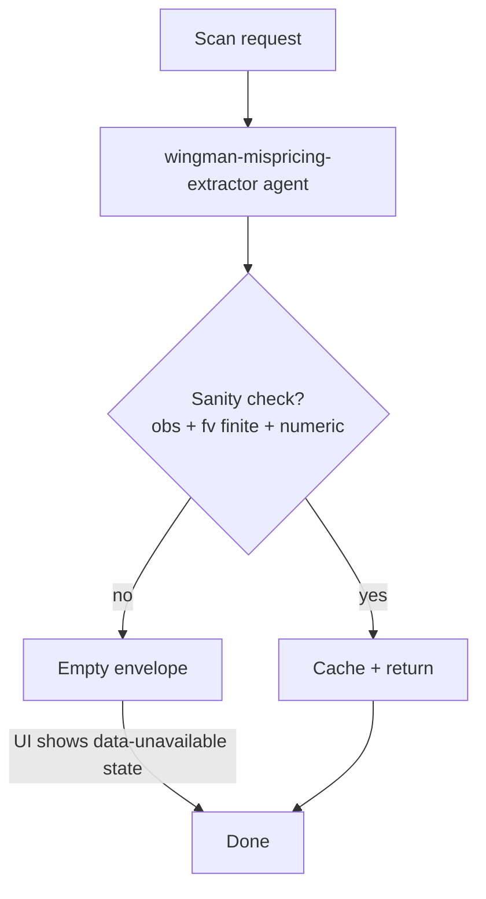

# Wingman — energy commodity trading

> The reference standalone app. 11 pages, 14 agents, 4 active corridors, 5 ML models, 1 code asset. The most evolved example of the thin-app pattern. Ports 3006 (web) and 8006 (api).

---

## Domain

Wingman is a trader workbench for LPG / refined-product commodity desks. The core question: **is this corridor's spread mispriced relative to fundamentals + freight + options?**

[`wingman/api/data/corridors.json`](../../wingman/api/data/corridors.json) lists ten corridors. Four are active:
- `USGC-NWE` — US Gulf Coast to North West Europe
- `USGC-FE` — US Gulf Coast to Far East
- `MEG-FE` — Middle East Gulf to Far East
- `USGC-LATAM` — US Gulf Coast to Latam

For each corridor + day the platform computes:
- **Observed spread** — destination spot − origin spot − freight (real-world arb residual, $/MT).
- **Fair-value spread** — BayesianRidge model prediction with credibility interval.
- **Verdict** — aligned / stretched / dislocated based on the residual z-score.
- **Drivers** — top 3 news headlines explaining the mispricing.

---

## Layout

```
wingman/
  api/          FastAPI on :8006. main.py (every endpoint), cache.py, narration.py,
                trajectories.py, data/ (corridors, broker emails), sdk/ (vendored abenix_sdk)
  web/          Next.js on :3006. Pages under src/app/, nav in components/Sidebar.tsx
  ml-models/    5 sklearn pkls + meta.json + build_*.py training scripts
  code-assets/  var-simulator (Go Monte Carlo)
  k8s/          wingman.yaml (wingman-api + wingman-web, both ClusterIP)
  start.sh      local dev launcher
```

Wingman has no user database. Every call goes out under one delegated key (`WINGMAN_ABENIX_API_KEY`) with `ActingSubject(subject_type="wingman", subject_id="demo-trader")`. Offers and strategies live in process memory. Everything that matters lives on the platform.

---

## Pages

From [`Sidebar.tsx`](../../wingman/web/src/app/components/Sidebar.tsx). `/` redirects to `/home`.

| Route | Sidebar label | Backing agent |
|---|---|---|
| `/home` | Home | `wingman-market-brief` (signals strip from `wingman-mispricing-extractor` cache) |
| `/desk` | Wingman Copilot | `wingman-desk-copilot`, `wingman-brief-repair` when the brief is malformed |
| `/workbench` | Arbitrage Workbench | `wingman-arb-analyzer` |
| `/mispricing` | Price at Risk Lens | `wingman-mispricing-extractor`, `wingman-compliance-validator` before a trade card |
| `/lab` | Market & Freight Lab | `wingman-market-brief` |
| `/scenarios` | Forward Scenarios | `wingman-scenario-forecaster` |
| `/inbox` | Broker Inbox | `wingman-broker-classifier` + `wingman-broker-parser` |
| `/ops` | Operations Watch | `wingman-ops-monitor` |
| `/strategy` | Strategy Lab | `wingman-strategy-encoder`, `wingman-backtester`, `wingman-var-simulator` |
| `/graph` | Knowledge Graph | `wingman-graph-query` |
| `/approvals` | Approvals | platform approvals via `/api/wingman/approvals` |

---

## Agents catalogue

All in `packages/db/seeds/agents/wingman_*.yaml`:

| Slug | Purpose | Model |
|---|---|---|
| `wingman-market-brief` | Today's spot/forward/freight + news headlines for the home page | Haiku 4.5 |
| `wingman-mispricing-extractor` | Corridor scan with 15-feature vector + BayesianRidge fair-value call | Haiku 4.5 |
| `wingman-scenario-forecaster` | 5 probability-weighted scenarios with cited drivers | Haiku 4.5 |
| `wingman-arb-analyzer` | Deep arb math, hedge legs, vessel-class economics | Haiku 4.5 |
| `wingman-ops-monitor` | AIS-density alerts, weather, port outages | Haiku 4.5 |
| `wingman-broker-classifier` | Intent classification on broker emails via the sklearn classifier | Haiku 4.5 + `ml_model` |
| `wingman-broker-parser` | Structured offer from a broker email | Haiku 4.5 |
| `wingman-desk-copilot` | Meta-agent that fans out to specialists | Sonnet 4.5 + `invoke_agent` |
| `wingman-brief-repair` | Repairs a copilot brief that is not valid JSON | Haiku 4.5 |
| `wingman-backtester` | Back-test a strategy spec over history | Haiku 4.5 |
| `wingman-var-simulator` | Monte Carlo VaR on a position via the `wingman-var-simulator` code asset | Haiku 4.5 + `code_asset` |
| `wingman-compliance-validator` | Pre-trade compliance gate | Sonnet 4.5 |
| `wingman-graph-query` | Atlas questions via `knowledge_search` in graph mode | Haiku 4.5 |
| `wingman-strategy-encoder` | Natural language → backtest spec | Haiku 4.5 |

[`packages/db/seeds/kb/wingman-knowledge.yaml`](../../packages/db/seeds/kb/wingman-knowledge.yaml) seeds two collections, `wingman-knowledge` and `wingman-compliance`. The compliance validator searches the second and cross-checks the Atlas graph from [`packages/db/seeds/atlas/wingman-compliance.yaml`](../../packages/db/seeds/atlas/wingman-compliance.yaml).

---

## ML models

5 pkls in `wingman/ml-models/`, picked up by `seed_ml_models.py`:

| Model | Type | Purpose |
|---|---|---|
| `wingman-mispricing-fairvalue` v1.3.0 | BayesianRidge | Corridor spread fair-value (15 features) |
| `wingman-mispricing-anomaly` v1.0.0 | IsolationForest | Anomaly score (9 features) |
| `wingman-scenario-prior` v1.0.0 | GaussianNB | Scenario probability prior (8 features) |
| `wingman-broker-intent-classifier` v1.0.0 | sklearn pipeline | Broker email intent classification |
| `wingman-freight-forecast` v1.0.0 | GradientBoosting | Next-week BLPG mid forecast (8 features) |

Training scripts (`build_*.py`) live next to the pkls. Each model has a `meta.json` with input_schema, output_schema, training metrics and feature names.

---

## Caching

[`wingman/api/cache.py`](../../wingman/api/cache.py) — file-backed, one directory per page:

| Page dir | Key | TTL | Written by |
|---|---|---|---|
| `market-brief` | `snapshot` | 300s | `/api/wingman/market-brief` |
| `mispricing` | corridor id | 1800s | `/api/wingman/mispricing/{id}/scan` result |
| `scenarios` | corridor id | 1800s | `/api/wingman/scenarios/{id}/forecast` result |
| `analyze` | corridor id | 1800s | `/api/wingman/corridors/{id}/analyze` result |
| `ops` | `snapshot` | 3600s | `/api/wingman/ops/snapshot` |
| `compliance` | request fingerprint | 1800s | `/api/wingman/compliance/validate` |

Entries live at `/data/wingman-cache/<page>/<key>.json` (`WINGMAN_CACHE_DIR` overrides the root, `WINGMAN_CACHE_TTL_SECONDS` the default TTL). In cluster `/data` is a hostPath volume on the node, so the cache does not survive a move to another node. Only agent-produced payloads are written. A failed run leaves the old entry or nothing.

---

## No synthesis tier for mispricing scans



wingman-api carries no anchors, no hardcoded levels and no direct HTTP shortcuts. Every number on screen came from the agent, which sourced it from real tools (`eia_open_data`, `yahoo_finance`, `freight_baltic_blpg`, `freight_worldscale`, `options_data`, `ais_stream`, `tavily_search`) plus the deployed sklearn fair-value model through `ml_model`.

If the agent fails, the UI shows a data-unavailable state rather than a made-up value. A closed or negative arb (for example -$95/MT on USGC-NWE) is a real market signal. The validator accepts any finite float, not just positives.

---

## Operations notes

- **Freight refresh** — `freight_baltic_blpg` curated mids live in [`apps/agent-runtime/engine/tools/freight_baltic_blpg.py`](../../apps/agent-runtime/engine/tools/freight_baltic_blpg.py) under `_BLPG_CURATED_DEFAULTS`. Refresh monthly from OPEC MOMR + Clarksons. Operator override via a JSON file at `BLPG_CURATED_PATH`.
- **Live Baltic** — set `BALTIC_API_URL` + `BALTIC_API_KEY` on the agent-runtime pods to switch to a live subscription feed.
- **EIA** — `EIA_API_KEY` (free signup). Tool: `eia_open_data`.
- **Tavily** — `TAVILY_API_KEY` (paid, news search for drivers).
- **AIS** — `AISSTREAM_API_KEY` (free tier is fine for a demo). Also in `wingman-secrets`.
- **Model retrain** — quarterly. Run `python wingman/ml-models/build_mispricing_fairvalue.py`, commit, redeploy. The seed picks up the new version and deactivates the prior one.

---

## Common debug paths

- "Scan returned obs=null fv=null" → the agent failed the sanity check. Open the execution from the trace link or `/executions` on the platform. Look at the LLM response. Usually a JSON parse failure or a tool returned nothing.
- "Freight is way too low" → check the curated values in `freight_baltic_blpg.py` are current. A live feed via env vars beats curation.
- "Cards show stale data" → `kubectl exec deploy/wingman-api -- rm -rf /data/wingman-cache/mispricing` then re-open the page.
- "Wrong sign on the arb" → the fair-value model may predate the current regime. Retrain with current examples.

---

## See also

- [00-pattern](00-pattern.md) — the generic thin-app shape
- [02-runtime/02-tools](../02-runtime/02-tools.md) — the tools the agents call (eia_open_data, freight_baltic_blpg, options_data, ml_model)
- [02-runtime/12-ml-models](../02-runtime/12-ml-models.md) — how the pkls are registered and served
- [08-howto/04-debugging](../08-howto/04-debugging.md) — broader debug techniques
