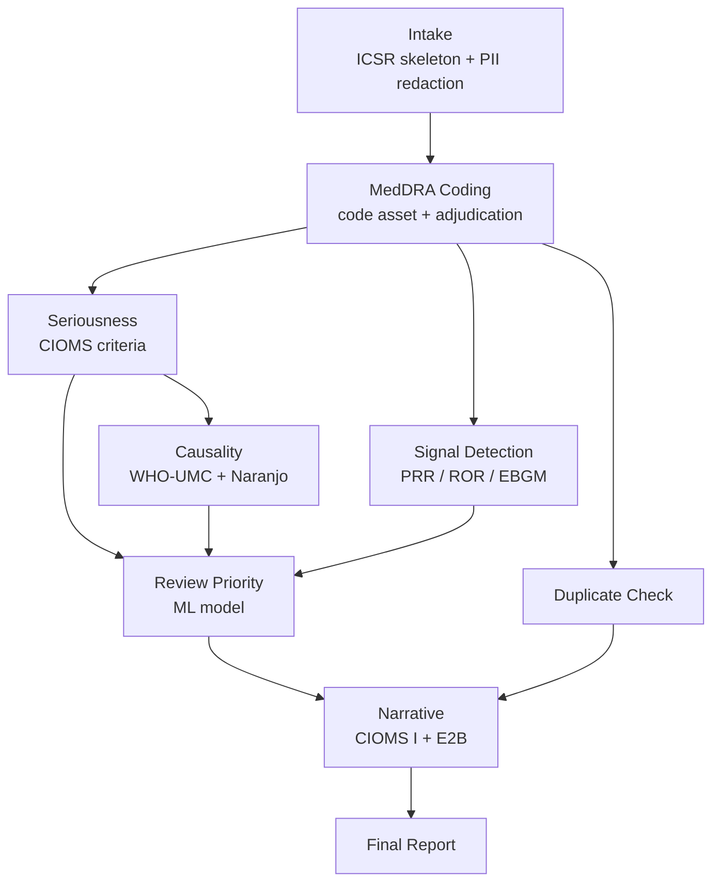

# PharmaVigil — drug-safety intelligence

> Adverse-event intake, MedDRA coding, seriousness and causality assessment,
> disproportionality signal detection and regulatory narrative generation.
> Nine nodes, seven agents, one code asset pair and one ML model.
> Ports 3007 (web) and 8007 (api).

---

## Why this one exists

Pharmacovigilance is a good test of the platform because the work splits three
ways and each part wants a different tool:

| The work | What it needs | Where it lives |
|---|---|---|
| Reading a narrative, judging causality, writing a CIOMS report | a model | agents |
| Dictionary lookup, edit distance, PRR arithmetic | code | code assets |
| Predicting which cases a reviewer escalates | a trained model | `aimodels/` |

Getting that split wrong is the interesting failure. A first cut of the signal
detector trained a classifier to predict the disproportionality threshold and
scored 0.984 against the plain formula's 0.984 — exactly level, because the
formula's own inputs were in the feature vector. The model was dropped and the
arithmetic moved to a code asset, where it belongs. What survived as a model is
the part that genuinely is not a formula.

---

## The pipeline

`pharmavigil-assess` — nine nodes.



| Node | Agent | What it decides |
|---|---|---|
| `intake` | `pharmavigil-case-intake` | Structured ICSR from free text, direct identifiers removed |
| `code_meddra` | `pharmavigil-meddra-coder` | LLT/PT/HLT/SOC per verbatim term, with the match confidence |
| `duplicate` | `pharmavigil-duplicate-check` | Whether this report is already on file |
| `seriousness` | `pharmavigil-seriousness` | CIOMS criteria, expedited or not, the reporting clock |
| `causality` | `pharmavigil-causality` | WHO-UMC category and all ten Naranjo items |
| `signal` | `pharmavigil-signal-detector` | Disproportionality for the drug-event pair |
| `triage` | `pharmavigil-triage` | Queue position and SLA |
| `narrative` | `pharmavigil-narrative` | CIOMS I narrative and the E2B fields |
| `final_report` | structured | Flattens the 33 fields the app stores |

---

## The code assets

### `meddra-coder`

Maps the reporter's own words onto MedDRA. Exact match, then a synonym table of
reporter phrasings ("heart attack", "throat closing up", "yellow eyes"), then
fuzzy token overlap and edit distance.

A term is flagged `needs_review` when the best score is under 0.80 **or when
two candidates sit within 0.05 of each other**. The second rule matters more:
a high score means nothing if a second term scored just as well, and that is
precisely what a dictionary cannot settle. The coder agent adjudicates those
and may override an unflagged one. Anything it still cannot code lands in
`uncoded` with a reason rather than being forced onto a near miss.

The shipped dictionary is about 45 LLTs — the common reactions plus the
Important Medical Event terms that change a seriousness assessment. MedDRA is
licensed and cannot ship here. Point `MEDDRA_DICT_PATH` at a real export to use
one; the matching logic does not change.

### `disproportionality`

PRR, ROR and EBGM for one drug-event pair from its 2×2 counts, each with the
lower bound that a committee actually acts on. Closed form, so it is exact,
free, and a reviewer can check it by hand.

It refuses to call a signal on fewer than three reports however large the
ratio, and says so in `rule` rather than leaving a caller wondering why a PRR
of 156 returned `crosses_threshold: false`. Every response carries a `caveat`
field stating that disproportionality measures reporting, not risk.

---

## The ML model

`pharmavigil-triage-prioritiser` predicts the probability that a medical
reviewer escalates a case, so the queue is ordered by what needs a human first.

| | Accuracy | AUC |
|---|---|---|
| Model | 0.840 | 0.899 |
| Hand-written rule over the same features | 0.764 | 0.703 |
| Majority baseline | 0.706 | — |

The rule baseline is in the training script and reported in the model metadata,
so the margin is measurable rather than asserted. The model earns its place
because reviewer behaviour turns on interactions a threshold cannot express:

- an unlisted reaction in a toddler escalates where a listed one in an adult
  at the same seriousness does not
- five concomitant medications make an alternative cause likely, which pulls a
  mild case down and leaves a fatal one untouched
- a positive dechallenge counts for more on a thin report than a complete one
- a high Naranjo on a well-known listed reaction is routine; the same score on
  an unlisted one is not

Accuracy is not near 1.0 by construction — the label is drawn from a latent
probability, because real reviewers disagree. A model that scored 0.99 here
would mean the simulation was too easy, not that the model was good.

---

## Where the counts come from

Disproportionality needs a denominator. The app owns the case history, so the
app supplies it: `frequency_snapshot()` builds `by_drug`, `by_pt` and `by_pair`
and passes them into the pipeline as context. The signal agent builds the 2×2
from those and calls the code asset.

The alternative — letting the agent work out its own contingency table — is
how a ratio ends up with nothing behind it. When the counts were missing the
agent correctly refused to invent them and returned prose instead, which is the
right behaviour and also a broken node.

A fresh install has one or two cases, which would make every ratio meaningless,
so `test-data/background_counts.json` ships a reference frequency table that is
added in. It is labelled as reference data in the payload the agent receives
and in the API response. Replace it with counts from a real safety database
before reading anything into the numbers.

---

## Talking to Abenix

Through the SDK, always. There is no direct HTTP to the platform anywhere in
this codebase — `get_sdk()` in [`_deps.py`](../../pharmavigil/api/app/routers/_deps.py)
is the only construction site, and `sync-sdks.sh --check` keeps this app's
vendored copy byte-identical to the six others.

Two timeouts matter and they are not the same number:

| | Value | Why |
|---|---|---|
| Assessment | `PV_WAIT_TIMEOUT_SECONDS`, default 900 | A nine-node run takes two to four minutes |
| Health probe | `PV_PROBE_TIMEOUT_SECONDS`, default 8 | A probe that inherits the assessment timeout hangs for sixteen minutes instead of reporting the platform unreachable |

Runs are stamped with the PharmaVigil user who triggered them via
`ActingSubject`, so a case assessed by a named scientist is attributable to
them rather than to a shared service account.

---

## Screens

| Route | What it shows |
|---|---|
| `/` | Case queue ordered by predicted escalation, KPI strip, sample reports to file |
| `/cases/{id}` | Coded terms with codes and confidence, seriousness, causality, disproportionality, priority, narrative, and the review gate |
| `/signals` | Drug-event pairs across the case history, strongest first |

<p align="center">
  
  <br/><em>Case detail — coded terms with their MedDRA codes and whether the dictionary or the agent settled them, seriousness with its criteria, disproportionality from the code asset, priority from the model, and the gaps that keep ready_to_submit false</em>
</p>

<p align="center">
  
  <br/><em>Case queue, ordered by predicted reviewer escalation rather than arrival</em>
</p>

---

## Honest about gaps

A run can complete and still be short of what a submission needs. The app
computes `assessment_gaps` — uncoded terms, missing mandatory E2B fields, no
narrative — and shows them on both the queue row and the case page. A case that
finished is not the same as a case that is ready, and the UI does not blur the
two.

`ready_to_submit` comes from the narrative node and is false whenever a
mandatory field is null, any reaction is uncoded, or a reviewer question would
change the seriousness assessment.

---

## Running it

```bash
APPS=pharmavigil bash scripts/deploy.sh local      # this app only
bash scripts/seed-standalone-keys.sh pharmavigil   # mint its Abenix API key
```

Then open http://localhost:3007 and file one of the six sample reports. They
are chosen to exercise different paths: a serious hepatic injury, a fatal
anaphylaxis, a mild listed rash, a confounded drug interaction, a paediatric
case with an age-extreme escalation, and one deliberately vague consumer report
that should come back mostly empty with the gaps named.

```bash
npx playwright test e2e/uat_pharmavigil.spec.ts
```

The spec skips rather than fails when an LLM provider is rate-limited or its
credential is dead, because that is an environment problem and failing the gate
on it trains people to ignore the gate. Anything else fails loudly.

---

## See also

- [02-runtime/01-pipelines](../02-runtime/01-pipelines.md) — how the DAG runs
- [02-runtime/11-sandboxed-code-execution](../02-runtime/11-sandboxed-code-execution.md) — how a code asset executes
- [09-reference/04-platform-settings](../09-reference/04-platform-settings.md) — the pipeline timeout this app inherits
