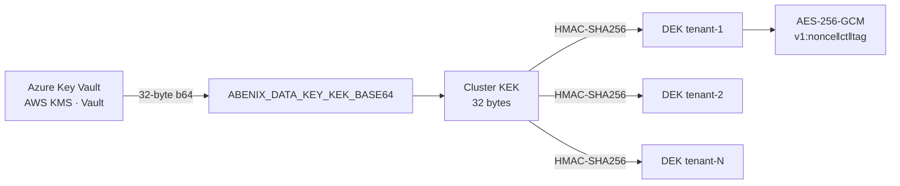

# Set up at-rest encryption (KEK)

> Five commands, ~2 min. Turns the AES-256-GCM wrapping of sensitive PersonaItem + AgentMemory fields from a no-op into actual ciphertext on disk.

## What you're enabling

The v2.0 encryption layer at [`apps/api/app/core/crypto.py`](../../apps/api/app/core/crypto.py) wraps sensitive PersonaItem + AgentMemory values with AES-256-GCM. Without a KEK, `encrypt()` short-circuits and stores plaintext. The platform still works, but the at-rest threat model isn't covered. See [`01-architecture/06-atlas-knowledge-engine.md#persona-encryption-v20`](../01-architecture/06-atlas-knowledge-engine.md) for the design.

Key derivation chain:



Same KEK + same `tenant_id` → same DEK, every time, on every pod. No shared cache, no database table, no per-row coordination.

## Prerequisites

- `kubectl` pointed at the cluster (`kubectl config current-context` shows the right one)
- `openssl` for generating the key
- Read+patch on the `abenix-secrets` Secret in the `abenix` namespace
- A secret-manager backend you trust (Azure Key Vault, AWS KMS, or Vault). The raw KEK should land in the cluster Secret via your normal CSI / external-secrets pipeline — these commands show the manual fallback.

## Step 1 — Generate a 32-byte KEK

```bash
KEK=$(openssl rand -base64 32)
echo "$KEK"   # sanity check — must decode to exactly 32 bytes
echo "$KEK" | base64 -d | wc -c   # → 32
```

**Do not check this string in.** Treat it like a root password. Stash it in your KMS of choice immediately.

## Step 2 — Store the KEK in your secret manager

Pick one (the platform doesn't care which — only the env var matters at runtime):

```bash
# Azure Key Vault
az keyvault secret set --vault-name myvault --name abenix-data-kek --value "$KEK"

# AWS Secrets Manager
aws secretsmanager create-secret --name abenix/data-kek --secret-string "$KEK"

# HashiCorp Vault
vault kv put secret/abenix/data-kek value="$KEK"
```

Production deploys should wire the secret in via external-secrets-operator (Azure Key Vault Provider for Secrets Store CSI Driver, AWS Secrets and Configuration Provider, etc.) so rotation in the KMS auto-propagates without a manual kubectl patch.

## Step 3 — Inject into the cluster Secret

The manual path (skip if you're using external-secrets):

```bash
kubectl patch secret abenix-secrets -n abenix \
  --type='json' \
  -p="[{\"op\":\"add\",\"path\":\"/data/ABENIX_DATA_KEY_KEK_BASE64\",\"value\":\"$(echo -n "$KEK" | base64 -w0)\"}]"
```

Note the double base64: Kubernetes Secrets b64-encode the value, and our env var content is *already* b64 (so when the pod reads `$ABENIX_DATA_KEY_KEK_BASE64` it gets back the 32-byte-encoded-b64 string the crypto module expects).

Verify the key landed:

```bash
kubectl get secret abenix-secrets -n abenix -o jsonpath='{.data.ABENIX_DATA_KEY_KEK_BASE64}' | base64 -d | base64 -d | wc -c
# → 32
```

## Step 4 — Roll the api pod

The env var is read at process start, so a fresh pod is required:

```bash
kubectl rollout restart deploy/abenix-api -n abenix
kubectl rollout status  deploy/abenix-api -n abenix --timeout=120s
```

Worker + agent-runtime pods also encrypt/decrypt on writes — roll them if they're long-lived:

```bash
kubectl rollout restart deploy/abenix-worker -n abenix
kubectl rollout restart deploy -n abenix -l app.kubernetes.io/name=agent-runtime
```

## Step 5 — Verify encryption is live

```bash
# Should see the KEK injected, no "encryption disabled" warning on first persona write
kubectl logs -n abenix deploy/abenix-api -c api --tail=200 | grep -E "ABENIX_DATA_KEY|encryption disabled|invalid ABENIX_DATA_KEY"
# (empty output = good — the warning logs once only when KEK is missing)

# Smoke: write a persona note via the API, confirm the column on disk is b64 not plaintext
kubectl exec -n abenix deploy/abenix-postgresql -- \
  psql -U abenix -d abenix -c "select substr(value, 1, 4) as prefix from persona_items where encrypted=true limit 1;"
# Expected prefix: "v1:" (the versioned-ciphertext envelope)
```

If the prefix is the start of your real plaintext, encryption didn't load — most likely the env var didn't propagate to the pod. Check:

```bash
kubectl exec -n abenix deploy/abenix-api -c api -- printenv ABENIX_DATA_KEY_KEK_BASE64 | head -c 8
# Should print 8 b64 characters, not empty.
```

## Backfill (optional)

New writes are encrypted automatically. To encrypt rows written *before* the KEK was set, run the one-shot backfill:

```bash
kubectl exec -n abenix deploy/abenix-api -c api -- \
  python -m app.scripts.backfill_persona_encryption
```

Idempotent — re-runs skip already-encrypted rows. Touches `persona_items` and `agent_memories` only. Expect ~5 min per 100k rows.

## Rotation

When you rotate the KEK (annually, or after an incident):

1. Bump `KEY_VERSION` in [`crypto.py`](../../apps/api/app/core/crypto.py) from `1` to `2`.
2. Stash both the old and new KEKs in your KMS, named `abenix-data-kek-v1` and `abenix-data-kek-v2`.
3. Inject the new key as `ABENIX_DATA_KEY_KEK_BASE64`, and the old one as `ABENIX_DATA_KEY_KEK_V1_BASE64` (reader will dispatch by ciphertext prefix).
4. Roll the api pod.
5. New writes use v2. Old `v1:...` ciphertext still decrypts because the reader sees the `v1:` prefix and grabs the v1 derivation.
6. Optional: run the backfill again — it rewrites v1 rows as v2.

## Troubleshooting

| Symptom | Cause | Fix |
|---|---|---|
| "encryption disabled" warning on every startup | KEK env var missing | Step 3 again, checking namespace and secret name |
| "invalid ABENIX_DATA_KEY_KEK_BASE64" + traceback | KEK is b64 but not 32 bytes once decoded | Regenerate with `openssl rand -base64 32` — `head -c 32 /dev/urandom | base64` will produce a 44-char output that decodes to exactly 32 |
| persona_items rows still look plaintext | Old rows from before KEK was set | Run the backfill (above) |
| Decrypt fails after rotation with "decrypt failed for v=v1" | Old KEK not present, ciphertext is v1 | Inject `ABENIX_DATA_KEY_KEK_V1_BASE64` alongside the new key, or restore from backup |
| All pod encryption traces missing in logs | Encrypted columns not yet written this session | Trigger a persona note save in the UI, then check again |

## Related

- [`01-architecture/06-atlas-knowledge-engine.md`](../01-architecture/06-atlas-knowledge-engine.md#persona-encryption-v20) — design narrative
- [`02-runtime/15-v2-knowledge-enterprise.md`](../02-runtime/15-v2-knowledge-enterprise.md#persona-encryption) — feature reference
- [`04-data-model/03-knowledge.md`](../04-data-model/03-knowledge.md#gdpr--persona-encryption) — schema (`encrypted`, `key_version` columns)
- [`09-reference/01-env-vars.md`](../09-reference/01-env-vars.md) — env-var reference entry
