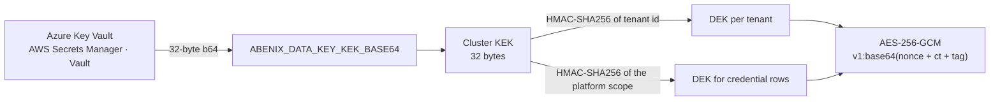

# Set up at-rest encryption (KEK)

> A few commands, about two minutes. Turns the AES-256-GCM wrapping of stored secrets from a pass-through into real ciphertext.

## What you're enabling

[`apps/api/app/core/crypto.py`](../../apps/api/app/core/crypto.py) encrypts
these values before they are written:

| Value | Where it is stored | Key scope |
|---|---|---|
| Tool credentials saved from **Admin -> Tool Configuration**, platform scope | `platform_settings`, keys `tool.credential.<KEY>` | platform |
| Tool credentials saved for one tenant | `tenant_tool_credentials` | platform |
| Connector secrets | `tenant_tool_credentials` | platform |
| Tenant Slack webhook URL | `tenants.slack_webhook_url` | tenant |
| Approval webhook secret | `tenants.settings.approval_webhook_secret` | tenant |
| MCP connection secrets and OAuth access tokens | MCP connection rows | tenant |
| Content held by moderation for review | `moderation_reviews.held_content` | tenant |

Tool credentials and connector secrets all use one fixed platform scope, even
when the row belongs to one tenant, so the runtime decodes every credential row
the same way ([`tool_secrets.py`](../../apps/api/app/core/tool_secrets.py) and
`decode_stored()` in
[`engine/credentials.py`](../../apps/agent-runtime/engine/credentials.py)). The
other values use a key derived from their tenant id.

Without a KEK, `encrypt()` returns the value unchanged, so these are stored as
entered. The platform works the same either way, but it says so:

- The API logs `Secrets are stored unencrypted. Set ABENIX_DATA_KEY_KEK_BASE64 to encrypt them.` at startup.
- **Admin -> Tool Configuration** and **Admin -> Connectors** show an amber banner with the same text and a link here. It reads `GET /api/admin/secret-storage`, which admins can call.
- With `ENVIRONMENT=production` the API refuses to start without a valid KEK. Set `ABENIX_ALLOW_PLAINTEXT_SECRETS=true` to start anyway. Local (`development`) and Azure (`staging`) only warn.

A value that is not base64 or not 32 bytes once decoded counts as no KEK.
`encrypted_at_rest` in `GET /api/admin/tool-config` reports the same mode.

`persona_items` has `encrypted` and `key_version` columns, but nothing writes
encrypted persona content today.

Key derivation:



Same KEK and same scope give the same DEK on every pod. No shared cache, no
key table.

## Prerequisites

- `kubectl` pointed at the cluster
- `openssl` to generate the key
- Read and patch on the `abenix-secrets` Secret in the `abenix` namespace
- A secret manager you trust for the master copy

## Step 1 — Generate a 32-byte KEK

```bash
KEK=$(openssl rand -base64 32)
echo "$KEK" | base64 -d | wc -c   # → 32
```

**Do not check this string in.** Treat it like a root password and store it in
your secret manager straight away.

## Step 2 — Store the KEK in your secret manager

```bash
# Azure Key Vault
az keyvault secret set --vault-name myvault --name abenix-data-kek --value "$KEK"

# AWS Secrets Manager
aws secretsmanager create-secret --name abenix/data-kek --secret-string "$KEK"

# HashiCorp Vault
vault kv put secret/abenix/data-kek value="$KEK"
```

## Step 3 — Get it into `abenix-secrets`

The supported path is the deploy script. Both `deploy.sh` and
`deploy-azure.sh` read `ABENIX_DATA_KEY_KEK_BASE64` from the environment or
`.env` and pass it as `secrets.dataKeyKekBase64`, which the chart writes into
`abenix-secrets`:

```bash
ABENIX_DATA_KEY_KEK_BASE64="$KEK" bash scripts/deploy-azure.sh redeploy
```

Keep it in `.env` afterwards. A later deploy without it renders the Secret
without the key, and every encrypted value becomes unreadable.

If you manage the Secret yourself, for example with external-secrets, patch it
directly:

```bash
kubectl patch secret abenix-secrets -n abenix --type='json' \
  -p="[{\"op\":\"add\",\"path\":\"/data/ABENIX_DATA_KEY_KEK_BASE64\",\"value\":\"$(echo -n "$KEK" | base64 -w0)\"}]"

kubectl get secret abenix-secrets -n abenix -o jsonpath='{.data.ABENIX_DATA_KEY_KEK_BASE64}' | base64 -d | base64 -d | wc -c
# → 32
```

The value is base64 twice, once for the Secret and once because the variable
itself holds base64.

## Step 4 — Restart what reads it

The variable is read at process start. Both the API and the agent-runtime use
it, the runtime to decrypt tool credentials:

```bash
kubectl rollout restart deploy/abenix-api -n abenix
kubectl rollout restart deploy -n abenix -l app.kubernetes.io/name=agent-runtime
kubectl rollout status deploy/abenix-api -n abenix --timeout=120s
```

The chart has no checksum annotation on the Secret, so a deploy rolls these pods only when the image tag changes. `deploy-azure.sh` tags images with the git commit, so a redeploy from the same commit leaves the old pods running without the key. Restart them anyway.

## Step 5 — Verify

```bash
# the screen's mode, needs an admin token and the API forward from
# scripts/portforward-azure.sh (AKS) or scripts/deploy.sh forwards (minikube)
curl -s -H "Authorization: Bearer <admin token>" http://localhost:8000/api/admin/tool-config | grep -o '"encrypted_at_rest":[a-z]*'
# → "encrypted_at_rest":true

# a key saved from the screen after the restart is stored as ciphertext
kubectl exec -n abenix abenix-postgresql-0 -- bash -c \
  'PGPASSWORD=$POSTGRES_PASSWORD psql -U postgres -d abenix -tc "SELECT key, left(value, 3) FROM platform_settings WHERE key LIKE '"'"'tool.credential.%'"'"' LIMIT 5;"'
# → prefix v1:
```

If `encrypted_at_rest` is false, the variable did not reach the API pod:

```bash
kubectl exec -n abenix deploy/abenix-api -- sh -c 'printenv ABENIX_DATA_KEY_KEK_BASE64 | head -c 8'
```

## Values saved before the KEK

Rows written while no KEK was set stay as plaintext. There is no backfill job.
Save each one again from its screen (Tool Configuration, Connectors, MCP
Servers, tenant settings or approval webhooks) and it is written encrypted.

The reverse also holds. A `v1:` value read without the KEK is returned as the
raw ciphertext string, so tools see a broken credential rather than an error.

## Rotation

There is no rotation support. `KEY_VERSION` is 1 and the reader does not keep
an older key. Changing the KEK makes every encrypted value unreadable, and each
has to be entered again. If you must rotate, note which values are set, deploy
the new KEK, then save each one again.

## Troubleshooting

| Symptom | Cause | Fix |
|---|---|---|
| `encrypted_at_rest` is false | Variable missing on the pod | Steps 3 and 4, check namespace and Secret name |
| API log line starting `invalid ABENIX_DATA_KEY_KEK_BASE64` | The value is not base64 or not 32 bytes once decoded. The runtime treats such a value as no KEK, without a log line | Generate again with `openssl rand -base64 32` |
| API log line `decrypt failed for v=v1` | The KEK changed since the value was written | Put the old KEK back, or save the value again |
| Runtime log line `tool configuration: stored value could not be decrypted`, and the tool says its key is not configured | Same, for a tool credential. The runtime reads it as empty | Put the old KEK back, or save the value again |
| Tool says its key is invalid after a redeploy | The deploy ran without the KEK, values are still ciphertext | Put the KEK back in `.env` and redeploy |

## Related

- [`09-reference/01-env-vars.md`](../09-reference/01-env-vars.md) — env-var reference entry
- [`09-reference/04-platform-settings.md`](../09-reference/04-platform-settings.md#tool-credentials) — how tool credentials are stored
- [`08-howto/08-tool-configuration.md`](08-tool-configuration.md) — the Tool Configuration screen
