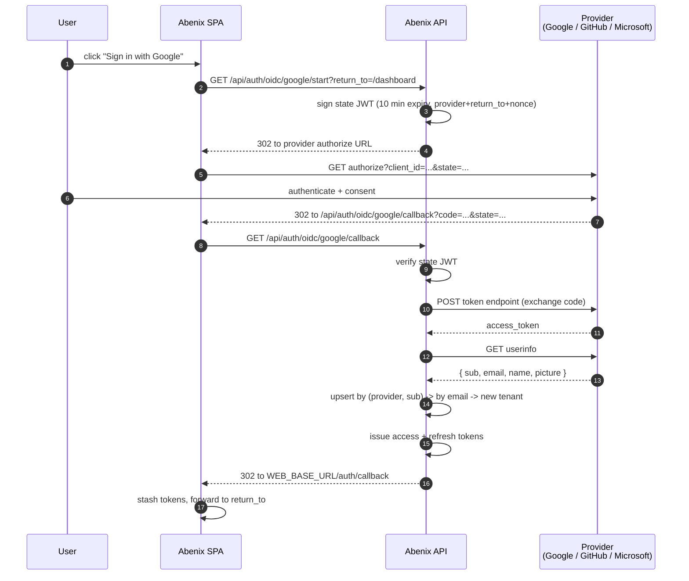

# SSO / OIDC sign-in

Abenix ships three OIDC sign-in paths out of the box — **Google**, **GitHub**, **Microsoft (Azure AD)** — alongside the email + password flow. Each provider is opt-in, configured by env var, and disabled gracefully when its creds are absent.

## What you ship as a developer

When you set the creds, three things happen automatically:

1. `/api/auth/oidc/providers` starts listing the newly-configured provider.
2. The login page picks that up on render and shows the matching "Sign in with X" button.
3. End users completing the OAuth handshake get a fresh Abenix tenant (if their email is new) or get linked to their existing password account (if the email already exists).

No code change is needed to enable a provider. No code change is needed if you turn one off either — the button just stops rendering.

## The wire flow



State is a signed JWT (HS256, reuses `JWT_SECRET_KEY`) — no Redis needed, the state is self-contained. The state carries `provider`, `return_to`, a 16-byte `nonce`, and a 10-minute `exp`. On callback the API rejects any state where the provider field doesn't match the callback path or the JWT signature is wrong.

## The data model

Two columns on `users` (added in migration `a7b8c9d0e1f2_sso_external_auth.py`):

| Column | Type | Notes |
|---|---|---|
| `auth_provider` | `varchar(32)` | NULL for password-auth users. Otherwise `google` / `github` / `microsoft` (extensible — anything < 32 chars works). |
| `external_id` | `varchar(255)` | The provider's stable subject. Google's `sub`, GitHub's numeric `id`, Microsoft's `oid`. |

Unique index `ix_users_provider_external` on `(auth_provider, external_id)` so the callback resolves in one query without scanning.

`password_hash` is now nullable. SSO-provisioned users have `password_hash = NULL`. Local users keep their hash. If a local user signs in via SSO with the same email later, we **link the SSO** to their existing account — both flows continue to work afterwards.

## Adding a new OIDC provider

The router pattern is small enough that adding a fourth provider (Okta, Auth0, Keycloak, your in-house IdP) is mostly copy-paste. The contract:

1. Add the slug to the `PROVIDERS` tuple in `apps/api/app/routers/sso.py`.
2. Add a `_provider_configured(...)` branch that returns `True` when the relevant env vars are set.
3. Add a branch in `start()` that builds the authorize URL with the provider's params.
4. Add an `_exchange_<provider>(code)` helper that returns `{ external_id, email, full_name, avatar_url }`.
5. Add a branch in `callback()` that calls your helper.

For a fully spec-compliant OIDC provider, steps 3 and 4 are nearly identical to the existing Google branch. Look at `apps/api/app/routers/sso.py` for the cleanest reference.

## Required env vars on the API pod

Independent of which providers you enable, two URLs MUST be set:

```
PUBLIC_API_BASE_URL=https://api.your-host.com    # where the provider redirects back
WEB_BASE_URL=https://app.your-host.com           # SPA root for the final hop
```

These are the URLs end users hit — not in-cluster service names. Get them wrong and the OAuth handshake fails with `redirect_uri_mismatch`.

## Per-provider env vars

### Google

| Env var | Required |
|---|---|
| `GOOGLE_OIDC_CLIENT_ID` | yes |
| `GOOGLE_OIDC_CLIENT_SECRET` | yes |

Redirect URI to register with Google: `${PUBLIC_API_BASE_URL}/api/auth/oidc/google/callback`. Get the client ID at <https://console.cloud.google.com/apis/credentials> as an "OAuth 2.0 Client ID" of type "Web application".

### GitHub

| Env var | Required |
|---|---|
| `GITHUB_OAUTH_CLIENT_ID` | yes |
| `GITHUB_OAUTH_CLIENT_SECRET` | yes |

Redirect URI: `${PUBLIC_API_BASE_URL}/api/auth/oidc/github/callback`. Register at <https://github.com/settings/developers> → "New OAuth App".

The user must have a **verified primary email** on GitHub for sign-in to succeed, because the API needs the email to provision or link the account.

### Microsoft (Azure AD)

| Env var | Required |
|---|---|
| `MICROSOFT_OIDC_CLIENT_ID` | yes |
| `MICROSOFT_OIDC_CLIENT_SECRET` | yes |
| `MICROSOFT_OIDC_TENANT` | no (default `common`) |

Redirect URI: `${PUBLIC_API_BASE_URL}/api/auth/oidc/microsoft/callback`. Register at <https://portal.azure.com> → App registrations.

`MICROSOFT_OIDC_TENANT=common` accepts personal + work accounts. Set it to your tenant GUID (e.g. `9188040d-6c67-...`) to restrict sign-in to a single org.

## kubectl one-liner (AKS / GKE / EKS)

To enable Google + Microsoft on an existing deployment:

```bash
kubectl create secret generic abenix-sso \
  --from-literal=GOOGLE_OIDC_CLIENT_ID=... \
  --from-literal=GOOGLE_OIDC_CLIENT_SECRET=... \
  --from-literal=MICROSOFT_OIDC_CLIENT_ID=... \
  --from-literal=MICROSOFT_OIDC_CLIENT_SECRET=... \
  --from-literal=PUBLIC_API_BASE_URL=https://api.your-host.com \
  --from-literal=WEB_BASE_URL=https://app.your-host.com \
  -n abenix --dry-run=client -o yaml | kubectl apply -f -

kubectl set env deploy/abenix-api --from=secret/abenix-sso -n abenix
kubectl rollout restart deploy/abenix-api -n abenix
```

## Helm one-liner

```bash
helm upgrade abenix infra/helm/abenix \
  --set secrets.google_oidc_client_id=... \
  --set secrets.google_oidc_client_secret=... \
  --set secrets.microsoft_oidc_client_id=... \
  --set secrets.microsoft_oidc_client_secret=... \
  --set secrets.public_api_base_url=https://api.your-host.com \
  --set secrets.web_base_url=https://app.your-host.com \
  --reuse-values
```

## Local dev recipe

The minimum loop to test Google sign-in against your laptop:

1. Create an OAuth client at <https://console.cloud.google.com/apis/credentials>. Authorized redirect URI: `http://localhost:8000/api/auth/oidc/google/callback`.
2. Export and restart the API:
   ```bash
   export GOOGLE_OIDC_CLIENT_ID=...
   export GOOGLE_OIDC_CLIENT_SECRET=...
   export PUBLIC_API_BASE_URL=http://localhost:8000
   export WEB_BASE_URL=http://localhost:3000
   ```
3. Reload the login page at <http://localhost:3000>. The Google button appears.

GitHub and Microsoft work the same way — register a callback URL pointing at `localhost:8000`, export the matching env vars, restart the API.

## Failure modes (and how the code handles them)

| Failure | What happens |
|---|---|
| Caller hits `/start` for a provider with no env config | 503 `<provider> SSO is not configured on this deployment` |
| State JWT expired or signature invalid | 400 `Invalid or expired OIDC state` |
| Code exchange call to provider 5xx's | 502 `Token exchange with <provider> failed: <reason>` |
| Provider returns no email (e.g. GitHub user has no verified email) | 400 `<provider> account has no verified email` |
| Account is disabled (`users.is_active = false`) | 403 `Account is disabled` |
| `return_to` is not a relative path | quietly rewritten to `/dashboard` — open-redirect attempt blocked |

All five paths log to `activity_log`, so a `user.sso_link_failed` audit row exists for forensics.

## Security notes

- **State is self-contained, not stored.** A leaked state token from a man-in-the-middle still can't be replayed because (a) it expires in 10 minutes and (b) the provider's `code` is single-use.
- **The `code → token` exchange** runs on the API server, never in the browser. The provider's client secret never reaches the SPA.
- **No PKCE yet.** State JWT does the equivalent of PKCE for our threat model (server-side IdP, no public client). For a public-client variant (mobile, native), add a PKCE branch on `start()` and verify in `callback()`.
- **The Abenix JWT issued after sign-in** is the same shape as the password-auth JWT. Downstream code can't tell — and doesn't need to tell — which path the user came in through.

## What's NOT shipped yet (roadmap)

- **SAML** — OIDC covers Okta / Azure AD / Google Workspace / GitHub Enterprise. SAML is on the roadmap for the enterprise tier. File an issue if your IdP only speaks SAML.
- **Just-in-time provisioning rules** — currently a fresh SSO user always gets their own tenant. Adding "if email is `@acme.com`, join the acme tenant as a `user` role" requires extending `_upsert_user()` in `sso.py` with a tenant-mapping table.
- **Logout federation (RP-initiated logout)** — the Abenix logout clears local tokens but does NOT call the provider's end-session endpoint. Most users want this; happy to land if anyone files the issue.

## Related

- End-user-facing setup guide: [`docs/sso.md`](../sso.md) — same content, indexed for non-developers
- Settings page that surfaces SSO config status to admins: `/settings/integrations` → "Identity provider (SSO)"
- Migration: [`packages/db/alembic/versions/a7b8c9d0e1f2_sso_external_auth.py`](../../packages/db/alembic/versions/a7b8c9d0e1f2_sso_external_auth.py)
- Router: [`apps/api/app/routers/sso.py`](../../apps/api/app/routers/sso.py)
- SPA callback: [`apps/web/src/app/auth/callback/page.tsx`](../../apps/web/src/app/auth/callback/page.tsx)
