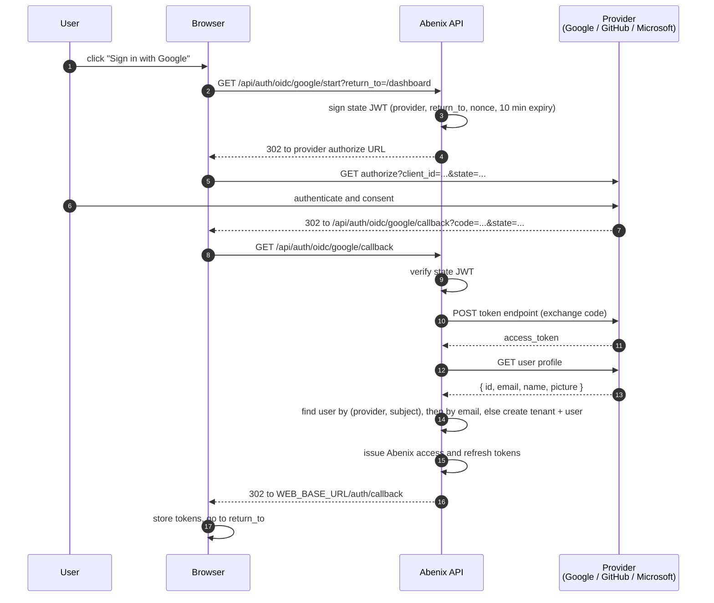

# SSO / OIDC sign-in

There are two kinds. **Workspace SSO** is set up by a workspace admin in the UI and works with any OpenID Connect provider. **Platform providers** (Google, GitHub, Microsoft) are turned on by an operator with env vars and anyone can use them.

## Workspace SSO

An admin opens Settings, Single sign-on and fills in the provider's issuer URL, a client ID and secret, the company's email domains and the role new people get. The page shows the redirect address to register with the provider. Test connection fetches the provider's discovery document so a typo shows up before anyone tries to sign in.

On the sign-in page people choose Sign in with your company (SSO) and type their work email. `POST /api/auth/sso/discover` finds the workspace that owns the domain and sends the browser to `/api/auth/sso/<workspace>/start`, which redirects to the provider. The callback exchanges the code on the back channel, checks the ID token's audience, issuer, expiry and nonce, and then:

- finds the member by provider subject, or by email inside the same workspace,
- refuses an email that already belongs to another workspace, so a provider cannot claim someone else's account,
- refuses an email outside the configured domains,
- creates the member with the configured role when Create an account is on, or asks them to get an invite when it is off.

Errors come back to the sign-in page as a plain message. The issuer must be public `https://`. A dev cluster maps a localhost issuer to a service name with `OIDC_INTERNAL_URL_MAP`, see [08-dev-catchers](../06-deployment/08-dev-catchers.md).

Every sign-in, SSO included, starts a session that shows up under Settings, Security, where it can be signed out.

## Platform providers

Abenix has three sign-in providers besides email and password: **Google**, **GitHub** and **Microsoft (Azure AD / Entra ID)**. Each one is opt-in and turned on by env vars on the API. With none configured the login page shows only email and password.

## What users see

The login page asks `GET /api/auth/oidc/providers` which providers are configured and renders one "Sign in with X" button for each. The user signs in at the provider and lands back on Abenix signed in.

- **New email.** A first-time SSO user gets a new tenant named `<full name>'s Workspace`, the `admin` role and the default moderation policy, the same as a password sign-up.
- **Known email.** If the email already belongs to a password account, the SSO identity is linked to that account. The password keeps working and SSO resolves to the same user.
- **Returning SSO user.** Matched by provider and provider subject. Name and avatar are refreshed on each sign-in.

No code change or web rebuild is needed to turn a provider on or off. Set or remove its env vars and restart the API.

## The flow



The state is a signed JWT (HS256, signed with `JWT_SECRET_KEY`), so nothing is stored in Redis or the database. It carries `provider`, `return_to`, a random `nonce`, `type: oidc_state` and a 10-minute `exp`. On callback the API rejects a state with a bad signature, an expired `exp`, the wrong `type`, or a `provider` that does not match the callback path.

Tokens go back in the URL fragment, so they never reach a server log. The web page at `/auth/callback` reads them and forwards to `return_to`.

## Required env vars on the API

Whichever providers you turn on, the API needs two public URLs:

```bash
PUBLIC_API_BASE_URL=https://api.your-host.com   # where the provider redirects back
WEB_BASE_URL=https://app.your-host.com           # web root for the final redirect
```

They default to `http://localhost:8000` and `http://localhost:3000`. Use the URLs users reach, not in-cluster service names. A wrong value fails the handshake with `redirect_uri_mismatch` at the provider.

The redirect URI to register with every provider is:

```
${PUBLIC_API_BASE_URL}/api/auth/oidc/<provider>/callback
```

## Per-provider setup

A provider counts as configured when both its client ID and client secret are set.

### Google

| Env var | Required |
|---|---|
| `GOOGLE_OIDC_CLIENT_ID` | yes |
| `GOOGLE_OIDC_CLIENT_SECRET` | yes |

1. Open [Google Cloud Console, Credentials](https://console.cloud.google.com/apis/credentials).
2. Create an **OAuth 2.0 Client ID** of type **Web application**.
3. Add the authorized redirect URI `https://api.your-host.com/api/auth/oidc/google/callback`.

Scopes requested: `openid email profile`. The subject stored is Google's `sub`.

### GitHub

| Env var | Required |
|---|---|
| `GITHUB_OAUTH_CLIENT_ID` | yes |
| `GITHUB_OAUTH_CLIENT_SECRET` | yes |

1. Open [Developer settings, OAuth Apps](https://github.com/settings/developers) and click **New OAuth App**.
2. Set the authorization callback URL to `https://api.your-host.com/api/auth/oidc/github/callback`.

Scopes requested: `read:user user:email`. The subject stored is GitHub's numeric user `id`. The user needs a **verified email** on GitHub. If the profile email is hidden, the API reads `/user/emails` and takes the verified primary one, or any verified one.

### Microsoft (Azure AD / Entra ID)

| Env var | Required |
|---|---|
| `MICROSOFT_OIDC_CLIENT_ID` | yes |
| `MICROSOFT_OIDC_CLIENT_SECRET` | yes |
| `MICROSOFT_OIDC_TENANT` | no, default `common` |

1. Open [Azure portal, App registrations](https://portal.azure.com/#blade/Microsoft_AAD_RegisteredApps/ApplicationsListBlade) and register an app with platform **Web**.
2. Set the redirect URI to `https://api.your-host.com/api/auth/oidc/microsoft/callback`.
3. Create a client secret under **Certificates & secrets**.

`common` accepts personal and work accounts. Set `MICROSOFT_OIDC_TENANT` to your directory (tenant) ID to allow only your organization. The API reads the profile from Microsoft Graph `/me`. The subject stored is the Graph object `id`, and the email is `mail`, or `userPrincipalName` when `mail` is empty.

## Turning it on

### Local dev

1. Create an OAuth client with redirect URI `http://localhost:8000/api/auth/oidc/google/callback`.
2. Add to `.env`:
   ```bash
   GOOGLE_OIDC_CLIENT_ID=...
   GOOGLE_OIDC_CLIENT_SECRET=...
   PUBLIC_API_BASE_URL=http://localhost:8000
   WEB_BASE_URL=http://localhost:3000
   ```
3. Run `bash scripts/dev-local.sh --restart` and reload <http://localhost:3000>. The Google button appears.

GitHub and Microsoft work the same way with their own env vars. See also [ONBOARDING.md, Optional: SSO local test](../../ONBOARDING.md#optional-sso-local-test).

### Kubernetes

The chart has SSO keys under `secrets.sso`. Each one that is set lands in `abenix-secrets`, which the API already reads:

```yaml
publicApiUrl: https://api.your-host.com     # PUBLIC_API_BASE_URL, the callback base
frontendUrl: https://app.your-host.com      # where the browser lands after sign-in
secrets:
  sso:
    googleClientId: ...
    googleClientSecret: ...
    githubClientId: ""
    githubClientSecret: ""
    microsoftClientId: ""
    microsoftClientSecret: ""
    microsoftTenant: ""                     # empty means common
```

`deploy.sh` and `deploy-azure.sh` fill these from `GOOGLE_OIDC_CLIENT_ID`, `GOOGLE_OIDC_CLIENT_SECRET`, `GITHUB_OAUTH_CLIENT_ID`, `GITHUB_OAUTH_CLIENT_SECRET`, `MICROSOFT_OIDC_CLIENT_ID`, `MICROSOFT_OIDC_CLIENT_SECRET` and `MICROSOFT_OIDC_TENANT` when they are in your `.env`. An empty key is left out of the Secret, so a provider never shows as half configured.

Admins can check which providers are live at **Settings > Integrations**, under "Identity provider (SSO)".

## Data model

Migration [`a7b8c9d0e1f2_sso_external_auth.py`](../../packages/db/alembic/versions/a7b8c9d0e1f2_sso_external_auth.py) adds two columns to `users`:

| Column | Type | Notes |
|---|---|---|
| `auth_provider` | `varchar(32)` | NULL for password users, else `google`, `github` or `microsoft` |
| `external_id` | `varchar(255)` | The provider's stable subject for the user |

The unique index `ix_users_provider_external` on `(auth_provider, external_id)` makes the callback lookup a single query. `password_hash` is nullable, and SSO-created users have none. A linked password user keeps their hash, so both sign-in paths work.

## Errors

| Case | Response |
|---|---|
| Unknown provider slug | 404 `Unknown provider: <provider>` |
| Provider has no client ID or secret | 503 `<provider> SSO is not configured on this deployment` |
| User denied consent at the provider | 400 `<provider> authorization denied: <error>` |
| `code` or `state` missing on callback | 400 `Missing code or state` |
| State expired, tampered with or for another provider | 400 `Invalid or expired OIDC state` |
| Token or profile call to the provider failed | 502 `Token exchange with <provider> failed: <reason>` |
| GitHub or Microsoft account has no usable email | 400 with the reason |
| Profile has no email or subject | 502 `<provider> returned an incomplete profile (missing email or subject)` |
| User is disabled (`users.is_active = false`) | 403 `Account is disabled` |
| `return_to` is not a relative path | replaced with `/dashboard`, which blocks open redirects |

A provider that is half configured only loses its own button. Sign-in for everyone else keeps working.

Successful paths write audit rows to `activity_log`: `user.registered_via_sso` for a new account, `user.sso_linked` when an existing password account is linked, and `user.login_sso` on every SSO sign-in. Failed attempts are not audited.

## Security notes

- **State is self-contained.** It expires in 10 minutes and the provider's `code` is single use, so a leaked state cannot be replayed.
- **The code exchange runs on the API.** The client secret never reaches the browser.
- **No PKCE.** The signed state covers the same risk for a server-side confidential client. A public client (mobile, native) would need a PKCE branch in `start()` and a check in `callback()`.
- **Same tokens as password sign-in.** Downstream code cannot tell which way the user signed in, and does not need to.

## Adding a provider

Okta, Auth0, Keycloak or an in-house IdP follow the Google pattern in [`apps/api/app/routers/sso.py`](../../apps/api/app/routers/sso.py):

1. Add the slug to the `PROVIDERS` tuple.
2. Add a branch to `_provider_configured()` that checks its env vars.
3. Add a branch to `start()` that builds the authorize URL.
4. Add an `_exchange_<provider>(code)` helper that returns `{external_id, email, full_name, avatar_url}`.
5. Call it from `callback()`.

The login buttons live in [`AuthCard.tsx`](../../apps/web/src/components/landing/AuthCard.tsx), so a new provider also needs a button there.

## Not built yet

- **SAML.** OIDC covers Okta, Azure AD, Google Workspace and GitHub Enterprise. File an issue if your IdP only speaks SAML.
- **Tenant mapping.** A new SSO user always gets their own tenant. Rules like "`@acme.com` joins the acme tenant as `user`" would need a mapping table and a change to `_upsert_user()`.
- **Federated logout.** Abenix logout clears local tokens but does not call the provider's end-session endpoint.

## Related

- Router: [`apps/api/app/routers/sso.py`](../../apps/api/app/routers/sso.py)
- Web callback: [`apps/web/src/app/auth/callback/page.tsx`](../../apps/web/src/app/auth/callback/page.tsx)
- Env vars: [01-env-vars.md](01-env-vars.md)
