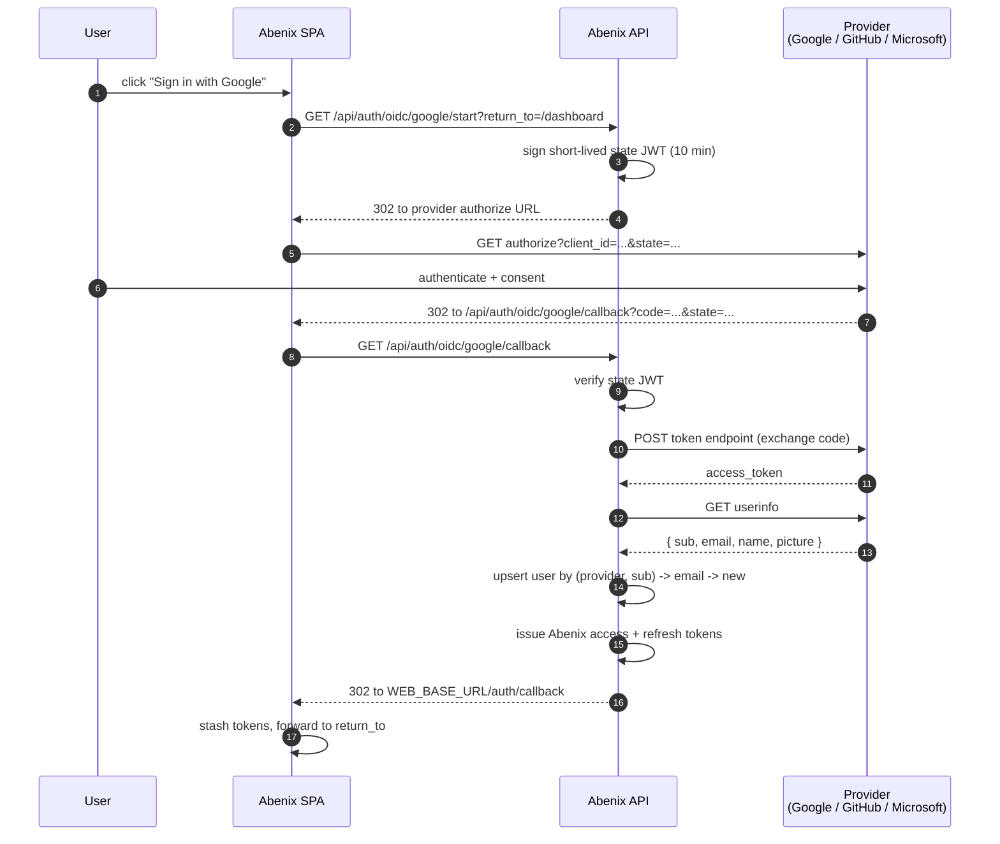

# SSO sign-in

Abenix supports three SSO providers out of the box: Google, GitHub, Microsoft. Each is opt-in via env vars. With none configured the login page falls back to email + password.

## How it works for end users

On the login page, an "Or continue with" section renders one button per configured provider. Clicking a button kicks off the standard OAuth/OIDC dance — the provider authenticates the user, the user lands back on Abenix signed in.

First-time SSO users get a fresh tenant ("`<full name>'s Workspace`") with `admin` role and a seeded default moderation policy. If an email is already on Abenix as a password account, the SSO link gets added to that account — the password keeps working, and SSO sign-in resolves to the same user.



## Per-provider setup (admins)

Each provider needs a client ID and client secret. The redirect URI to register with the provider is always:

```
${PUBLIC_API_BASE_URL}/api/auth/oidc/<provider>/callback
```

After setting the env vars, restart the API pod. The `/api/auth/oidc/providers` endpoint reflects which buttons the login page should render — no rebuild needed.

### Google

1. Open the [Google Cloud Console — Credentials](https://console.cloud.google.com/apis/credentials).
2. Create an **OAuth 2.0 Client ID** of type **Web application**.
3. Authorized redirect URI:
   ```
   https://api.your-host.com/api/auth/oidc/google/callback
   ```
4. Export:
   ```bash
   GOOGLE_OIDC_CLIENT_ID=...
   GOOGLE_OIDC_CLIENT_SECRET=...
   ```

### GitHub

1. Open [Developer Settings → OAuth Apps](https://github.com/settings/developers).
2. Click **New OAuth App**.
3. Authorization callback URL:
   ```
   https://api.your-host.com/api/auth/oidc/github/callback
   ```
4. Export:
   ```bash
   GITHUB_OAUTH_CLIENT_ID=...
   GITHUB_OAUTH_CLIENT_SECRET=...
   ```

Note: the user must have a **verified primary email** on GitHub for sign-in to succeed (Abenix needs the email to provision or link the account).

### Microsoft (Azure AD)

1. Open the [Azure portal → App registrations](https://portal.azure.com/#blade/Microsoft_AAD_RegisteredApps/ApplicationsListBlade).
2. Register an app. Pick **Web** as the platform.
3. Redirect URI:
   ```
   https://api.your-host.com/api/auth/oidc/microsoft/callback
   ```
4. Generate a client secret under **Certificates & secrets**.
5. Export:
   ```bash
   MICROSOFT_OIDC_CLIENT_ID=...
   MICROSOFT_OIDC_CLIENT_SECRET=...
   MICROSOFT_OIDC_TENANT=common   # or your specific tenant GUID
   ```

`MICROSOFT_OIDC_TENANT` defaults to `common`, which accepts any personal or work Microsoft account. Set it to a specific tenant GUID to restrict sign-in to your organization.

## Required env vars on the API pod

Independent of which providers are enabled, the API needs to know:

```bash
PUBLIC_API_BASE_URL=https://api.your-host.com   # where the provider redirects back
WEB_BASE_URL=https://app.your-host.com           # the SPA root for the final hop
```

These are the URLs end users hit, not in-cluster service names. Get them wrong and the OAuth handshake will fail with `redirect_uri_mismatch`.

## kubectl one-liner

To enable Google SSO on an existing AKS deployment:

```bash
kubectl create secret generic abenix-sso \
  --from-literal=GOOGLE_OIDC_CLIENT_ID=... \
  --from-literal=GOOGLE_OIDC_CLIENT_SECRET=... \
  --from-literal=PUBLIC_API_BASE_URL=https://api.your-host.com \
  --from-literal=WEB_BASE_URL=https://app.your-host.com \
  -n abenix --dry-run=client -o yaml | kubectl apply -f -

kubectl set env deploy/abenix-api --from=secret/abenix-sso -n abenix
kubectl rollout restart deploy/abenix-api -n abenix
```

## Helm one-liner

```bash
helm upgrade abenix infra/helm/abenix \
  --set secrets.google_oidc_client_id=... \
  --set secrets.google_oidc_client_secret=... \
  --set secrets.public_api_base_url=https://api.your-host.com \
  --set secrets.web_base_url=https://app.your-host.com \
  --reuse-values
```

## What if the provider is misconfigured

`/api/auth/oidc/<provider>/start` returns `503` with a clear message. The login page silently won't render a button for a provider that's not in `/api/auth/oidc/providers`. So a half-configured provider does not break sign-in for everyone else.

## Local dev

See [ONBOARDING.md — Optional: SSO local test](../ONBOARDING.md#optional-sso-local-test).

## What about SAML?

SAML is on the roadmap for the enterprise tier. OIDC covers the vast majority of corporate IdPs (Okta, Azure AD, Google Workspace, GitHub Enterprise) via the providers above. File an issue if your IdP only speaks SAML and we'll prioritize.
