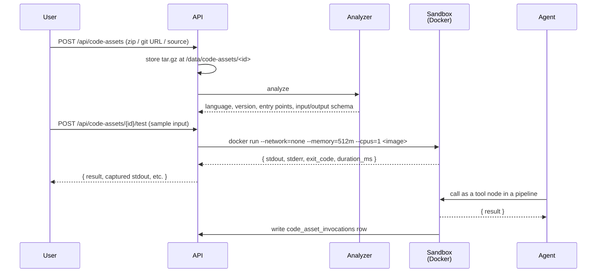

# Sandboxed code execution + Code Assets

A user uploads a zip of Python (or Node, Go, Rust, Ruby, Java), Abenix analyzes it, and an agent can call it as a tool. The execution runs in a tenant-scoped Docker sandbox with no network by default and a strict resource budget. The same plumbing powers the AI Builder's "write me code" flow.

## What ships in the box

| Surface | Where it lives |
|---|---|
| Upload UI | `/code-runner` |
| REST API | [`apps/api/app/routers/code_assets.py`](../../apps/api/app/routers/code_assets.py) |
| Analyzer | `apps/api/app/services/code_analyzer.py` — extracts entry points, input/output schemas, language version |
| Runtime sandbox | `sandboxed_job` tool in `apps/agent-runtime/engine/tools/sandboxed_job.py` |
| Storage | `code_assets` table, with the binary at `/data/code-assets/<id>.tar.gz` |
| Audit | `code_asset_invocations` — one row per call |

Five languages ship: **Python**, **Node.js**, **Go**, **Rust**, **Ruby**, **Java**. Adding a sixth is one Dockerfile.

## The lifecycle



## The sandbox jail

`sandboxed_job` runs every invocation under these defaults:

| Constraint | Default | Tenant-configurable | Where set |
|---|---|---|---|
| Network | `--network=none` | yes — `allow_network: true` per asset, off by default | `/settings/sandbox` |
| Memory | 512 MB | yes | per-asset override |
| CPU | 1 vCPU | yes | per-asset override |
| Wall-clock timeout | 30s | yes — capped at tenant max | per-asset override |
| Filesystem | tmpfs at `/work`, no other writable mounts | no | hard-coded |
| User | non-root | no | hard-coded |
| Allowed images | tenant-configurable allow-list | yes | `/settings/sandbox` |

The allow-list at `/settings/sandbox` is the right knob to tighten an enterprise deployment — restrict to your own internal registry images, drop the public-image option entirely.

## Input/output contract

The analyzer infers a JSON Schema for each entry point's input + output. If the schema can't be inferred (dynamic typing, complex closures), the tool falls back to `string` in / `string` out and the asset is marked `analysis_notes: ["fallback schema"]`.

Agents call the asset through the standard tool node — no special wrapper:

```yaml
nodes:
  - id: extract
    type: code_asset
    code_asset_id: <uuid>
    inputs:
      raw_text: "{previous_node.output}"
```

The runtime maps node inputs into the asset's expected schema, runs the sandboxed job, captures stdout/stderr, and surfaces `result` to the next node.

## Multi-file projects

For projects with internal imports (Go modules, Java packages, Python with `setup.py`), the runtime uploads the tar.gz via stdin to a builder layer that does `pip install -e .` / `go mod tidy` / `mvn package` before running. The build step's output is captured in `analysis_notes` so a maintainer can see what happened.

The three reference multi-file projects in `tests/code-assets/` exercise this path: Go HTTP fetcher, Java JSON transformer, Perl text munger.

## Versions

Upload new version on an asset replaces the code behind it. Agents and pipelines keep the same asset id and pick up the new code on their next call. The new archive is analysed first and only goes live if analysis succeeds. If it fails, the current version stays live and the reason comes back.

Each upload bumps `version` and keeps the replaced archive in `version_history`, so any earlier version can be restored from the asset page. Restoring makes it live as a new version number. History keeps `CODE_ASSET_MAX_VERSIONS` entries (20 by default) and deletes archives that fall off the end. Uploads to one asset are serialised with a row lock and every upload and restore is audited.

Endpoints: `POST /api/code-assets/{id}/versions` with a file or a git URL, and `POST /api/code-assets/{id}/versions/{n}/restore`. Both need ownership, an edit share or admin.

## How the sandbox gets the code

Small assets travel inline on stdin. An asset larger than `CODE_ASSET_MAX_INLINE_BYTES` is fetched by the sandbox pod from `GET /api/code-assets/{id}/fetch`, authorised by a ten minute token the runtime signs for that one asset. The token is not a user token, so an agent shared with someone works for them without sharing the asset itself.

## Deleting an asset

Delete first lists the agents and pipelines that call the asset (`GET /api/code-assets/{id}/dependents`). The API refuses with `409 IN_USE` unless the caller confirms with `force=true`.

## Bring-your-own-repo from git

`POST /api/code-assets` accepts `{ source_url: "https://github.com/..." }` instead of an uploaded zip. The API clones, packages as tar.gz, and runs the same analyzer. Authentication via tenant-configured deploy key (`GITHUB_DEPLOY_KEY` env var) for private repos.

## The AI Builder loop

The "describe it, the platform builds it" surface in `/builder` uses code assets for the heavy lifting. Workflow:

1. User describes the task in natural language.
2. AI Builder agent drafts a code asset (Python by default — pick another language in the prompt).
3. The asset goes through the analyzer.
4. The Builder runs the asset in the sandbox against a synthesized sample input.
5. If the run fails or output is wrong, the Builder iterates (Surgeon-style — JSON-Patch on the source, re-run).
6. On success, the Builder wires the new asset into the pipeline as a `code_asset` node.

The Builder never auto-applies — every iteration is a PipelinePatchProposal a human reviews.

## Adding a sixth language

Three steps:

1. Add a Dockerfile for the language base image: `docker/sandbox/<lang>.Dockerfile`. Must end as non-root, must expose `/work` as the only writable mount.
2. Add a detector branch in `code_analyzer.py` that recognizes the language (by file extensions, manifest files, shebangs).
3. Add the entry-point schema inferer for that language. Python uses AST, Node uses `tsc --showConfig`, Go uses `go vet -json`. Adopt whatever the language gives you.

A walkthrough for Crystal landed in commit `bcb8076` (deleted later because nobody used it, but the diff shows the exact contract).

## Where to look

- REST API: [`apps/api/app/routers/code_assets.py`](../../apps/api/app/routers/code_assets.py)
- Sandbox tool: [`apps/agent-runtime/engine/tools/sandboxed_job.py`](../../apps/agent-runtime/engine/tools/sandboxed_job.py)
- Analyzer: `apps/api/app/services/code_analyzer.py`
- AI Builder loop: [`apps/api/app/routers/ai_builder.py`](../../apps/api/app/routers/ai_builder.py)
- Models: `packages/db/models/code_asset.py`, `code_asset_invocation.py`

## Related

- [`02-runtime/02-tools.md`](02-tools.md) — how a `code_asset` node fits the tool framework
- [`/settings/sandbox`](../05-ui/03-page-catalogue.md) — the admin UI for the sandbox allow-list
