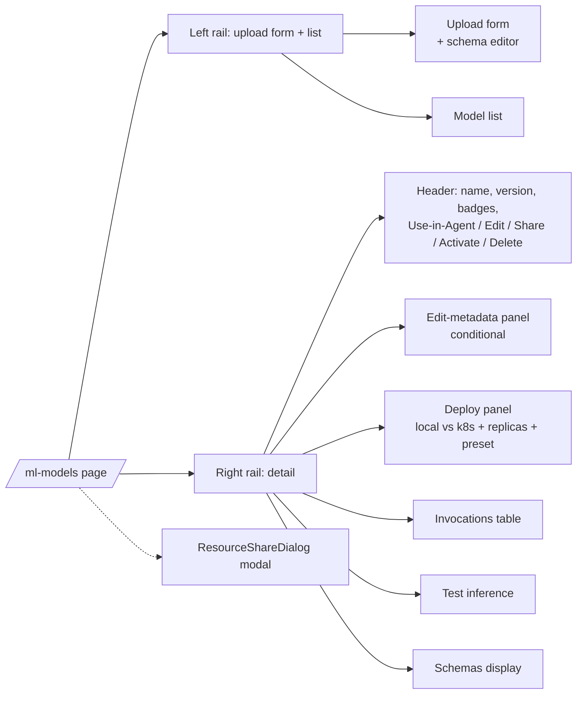

# Page catalogue

> Every authenticated route in `(app)/`, what it shows, what data it pulls, and where its source lives. Use this as a starting point when you're hunting for a feature.

---

## Top-level pages

| Route | Source | Primary data |
|---|---|---|
| `/dashboard` | `(app)/dashboard/` | exec counts (7d), recent activity, quick links |
| `/agents` | `(app)/agents/` | `GET /api/agents` (grouped by category) |
| `/builder` | `(app)/builder/` | new agent / pipeline canvas |
| `/builder?agent={id}` | `(app)/builder/` | edit existing agent |
| `/pipelines` | `(app)/pipelines/` | `GET /api/pipelines` |
| `/executions` | `(app)/executions/` | `GET /api/executions` (paginated) |
| `/executions/{id}` | `(app)/executions/[id]/` | full execution detail + waterfall + lineage |
| `/chat` | `(app)/chat/` | conversation list. pick an agent to chat with |
| `/chat/{conversationId}` | `(app)/chat/[id]/` | live chat surface |
| `/knowledge` | `(app)/knowledge/` | KB list + detail panel |
| `/atlas` | `(app)/atlas/` | knowledge-graph canvas |
| `/ml-models` | `(app)/ml-models/` | model registry + upload + deploy |
| `/code-runner` | `(app)/code-runner/` | code-asset list + upload (zip/git) + test |
| `/approvals` | `(app)/approvals/` | pending + recent approvals. See [2.5 pages](#abenix-25-pages) |
| `/marketplace` | `(app)/marketplace/` | public/template agents |
| `/observability` | `(app)/observability/` | OTel layers — log, live updates, alerts, traces |
| `/help` | `(app)/help/` | end-user docs |
| `/dev-docs` | `(app)/dev-docs/` | developer documentation (this site) |

---

## Admin pages

`/admin/*` — gated to `admin` and `owner` roles.

| Route | Source | Purpose |
|---|---|---|
| `/admin/cluster` | `admin/cluster/` | node CPU/mem, PVCs, pod counts, DB top tables |
| `/admin/scaling` | `admin/scaling/` | KEDA scaledobjects per pool. manual replica overrides |
| `/admin/llm-pricing` | `admin/llm-pricing/` | model pricing table — used for cost roll-ups |
| `/admin/llm-settings` | `admin/llm-settings/` | provider keys, default model, model whitelist |
| `/admin/dlq` | `admin/dlq/` | dead-letter queue inspection (replay or discard) |
| `/admin/archives` | `admin/archives/` | execution archive runs + retention policies |
| `/admin/connectors` | `admin/connectors/` | CMMS / HRIS / telematics integrations |
| `/admin/moderation` | `admin/moderation/` | per-tenant moderation policies (PII redact, content safety) |

---

## Settings

`/settings/*` — accessible to all users (some sub-pages role-gated).

| Route | Purpose |
|---|---|
| `/settings/team` | invite users, change roles |
| `/settings/api-keys` | create / revoke API keys |
| `/settings/billing` | invoices + plan |
| `/settings/notifications` | per-user notification preferences |
| `/settings/webhooks` | Events page (2.5). See [2.5 pages](#abenix-25-pages) |
| `/settings/profile` | display name, avatar, password |
| `/settings/cognify` *(v2.0)* | Cognify acceptance + conflict policy: `auto_accept_threshold`, `conflict_action`, `max_parallel_docs`, `daily_budget_usd`. Lists open conflicts with per-row Accept-A / Accept-B resolution |
| `/settings/gdpr` *(v2.0)* | Trigger the five-store cascade purge for a user, showing the per-store audit receipts from `gdpr_purge_log` |

---

## Abenix 2.5 pages

Decisions, evals, Source Watch, governance and events. Sidebar items with a capability only show when `/api/me/permissions` holds it. Pages also check the capability themselves and show a "needs X" note instead of the controls.

| Route | Source | Who sees it | Sidebar | Main API calls |
|---|---|---|---|---|
| `/decisions` | `(app)/decisions/` | `decisions.view`. New decision needs `decisions.author` | BUILD > Decisions | `GET /api/decisions`, `POST /api/decisions` |
| `/decisions/{key}` | `(app)/decisions/[key]/` | `decisions.view`. Edit, propose, withdraw need `decisions.author`. Publish needs `decisions.publish` | via `/decisions` | `GET /api/decisions/{key}`, `.../versions/{n}`, `.../check`, `.../versions/{n}/validate`, `propose`, `withdraw`, `publish-plan`, `publish`, `.../presence`, `.../versions/{n}/try`, `.../tests`, `.../diff`, `.../export`, `.../import` |
| `/decisions/reference-sets` | `(app)/decisions/reference-sets/` | view for all who reach it. Create and edit need `decisions.author` | via `/decisions` | `GET/POST /api/decision-reference-sets`, `GET/PUT /api/decision-reference-sets/{key}` |
| `/evals` | `(app)/evals/` | `evals.run`. New suite needs `evals.manage` | RUN & TEST > Evaluations | `GET /api/evals/suites`, `POST /api/evals/suites` |
| `/evals/{id}` | `(app)/evals/[id]/` | `evals.run` to run. `evals.manage` to edit cases and settings | via `/evals` | `GET/PATCH/DELETE /api/evals/suites/{id}`, `POST .../cases`, `PATCH/DELETE /api/evals/cases/{id}`, `POST .../run`, `POST /api/evals/runs/{id}/cancel`, `GET /api/evals/assertion-types` |
| `/evals/runs/{id}` | `(app)/evals/runs/[id]/` | no page guard | via `/evals/{id}` | `GET /api/evals/runs/{id}` |
| `/evals/compare?a=&b=` | `(app)/evals/compare/` | no page guard | via a run page | `GET /api/evals/runs/{a}/compare/{b}` |
| `/sources` | `(app)/sources/` | everyone. Add, check, pause need `sources.manage`. Allowlist and limits need `risk.manage` | BUILD > Source Watch | `GET /api/sources`, `GET /api/sources/changes?limit=12`, `GET/PUT /api/sources/settings`, `POST /api/sources/{id}/check-now`, `pause`, `resume` |
| `/sources/{id}` | `(app)/sources/[id]/` | everyone. Changes need `sources.manage` | via `/sources` | `GET/DELETE /api/sources/{id}`, `.../changes`, `.../snapshots`, `GET /api/sources/changes/{id}`, `GET /api/sources/snapshots/{id}`, `check-now`, `pause`, `resume` |
| `/admin/risk` | `(app)/admin/risk/` | `risk.view` | ADMIN > Risk & Controls | `GET /api/governance/risk`, `PUT /api/governance/risk/{tier}`, `/api/governance/kill-switches`, `/api/governance/audit/verify`, `/api/governance/audit/export` |
| `/admin/permissions` | `(app)/admin/permissions/` | `permissions.manage` | ADMIN > Permissions | `GET /api/governance/capabilities`, `/api/governance/permission-sets` (CRUD + `/members`), `GET /api/team/members` |
| `/admin/tool-config` | `(app)/admin/tool-config/` | `manage_settings` feature in the sidebar. API returns 403 for non-admins | ADMIN > Tool Configuration | `GET /api/admin/tool-config?scope=`, `PUT/DELETE /api/admin/tool-config/{key}`, `POST .../{key}/test` |
| `/approvals` | `(app)/approvals/` | everyone | WORKSPACE > Approvals | `GET /api/approvals?mine=1&status=pending`, `GET /api/approvals?mine=1`, `POST /api/approvals/{id}/signoff` |
| `/settings/webhooks` | `(app)/settings/webhooks/` | `events.manage` in the sidebar. Without it the page is read only | ADMIN > Events | `GET/POST /api/webhooks`, `GET /api/webhooks/catalog`, `PUT/DELETE /api/webhooks/{id}`, `POST .../test`, `GET .../deliveries`, `POST /api/webhooks/deliveries/{id}/redeliver` |

What each one does:

- **Decisions** lists rule models and creates a new one blank, from a JSON import or from an example. Links to reference sets.
- **Decision workspace** has the tabs Rules, Table, Flow, Facts and outcomes, Golden tests and History. Rules, Table and Facts only show for builder-authored versions. A Try it panel sits next to Rules, Table, Facts and Flow and can save a case as a test. The header runs validate, propose for sign-off, withdraw and publish. Publish shows the publish plan first. Shows who else is editing the draft.
- **Reference sets** are named value lists that rules can refer to. Paste one value per line.
- **Evaluations** lists suites with tier, last score and a sparkline. Search by suite or agent.
- **Suite** has the tabs Cases, Runs and Settings. Run now, stop a run, or run on another model for one run only. A gate banner shows when a gating suite is stale or failing. Settings holds the pass threshold and judge model.
- **Run** shows per-case results with filters All, Failed, Passed and Changed, plus regressed and fixed counts against the base run.
- **Compare runs** puts runs A and B side by side and flags regressed and fixed cases.
- **Source Watch** lists watched pages, PDFs, data files and feeds with recent changes. Each version is kept as a snapshot and each change is diffed and raised as `source.changed`.
- **Source** shows its changes with a diff view and its snapshots. Edit, check now, pause, resume or delete.
- **Risk and Controls** has the tabs Tier policies, Kill switches, Tool tiers and Audit integrity. Tier policies set publish approvals per tier, including `escalate_after_hours`. Kill switches need `killswitch.manage`, tier edits need `risk.manage`, audit verify needs `audit.verify`.
- **Permissions** shows what each role already has and manages permission sets and their members. Changes apply within ten seconds.
- **Tool Configuration** lists every value a built-in tool declares in its `config_fields`, grouped, with Tenant and Platform scope. Tenant beats platform, which beats env and `tool_defaults.yaml`. Save, clear or test a value.
- **Approvals** shows a status badge per request (pending, approved, denied, expired, returned) and a gate kind badge (agent gate or rule change). Rule changes link to the diff and name the capability needed to sign. Approve, Deny and Return for changes. Return needs a reason and is hidden for agent gates (`hitl:` ids). Pending rows show time left before expiry.
- **Events** manages outbound event subscriptions picked from the event catalog. Shows the signing secret once on create, sends a test event, pauses or resumes, and lists recent deliveries with redeliver.

---

## Anatomy of a typical CRUD page (ml-models example)

Most CRUD pages follow this two-column shape:
- Left rail: list + the create form.
- Right rail: the selected item's detail, broken into cards.
- Modal: share dialog.

The bigger pages (`/agents`, `/pipelines`) use a card grid instead of left-rail list — but the right-rail-detail-modal pattern repeats.

---

## What every detail page should expose

Audit-driven convention as of v1.5.3:
- An **Edit** button on the resource header that toggles an inline edit panel.
- A **Use in Agent** (or **Use in Pipeline**) button that deep-links to the builder pre-configured.
- A **Share** button that opens the ResourceShareDialog.
- An **Invocations / Executions** table for time-series context.
- A **Test** affordance to dry-run.
- Status badges with proper aria-labels.
- Toast feedback on every mutation.

New pages: copy from `/ml-models` or `/code-runner` as templates.

---

## Skeletons + empty states

Every list page renders a skeleton during fetch (`<Skeleton />` from `apps/web/src/components/ui/Skeleton.tsx`) and an `<EmptyState />` when the result is empty.

Empty states must include:
- An icon
- One-sentence explanation
- A call-to-action button (where applicable)

---

## See also

- [02-api-client](02-api-client.md) — `apiFetch` + toast wiring
- [00-app-shell](00-app-shell.md) — sidebar / topbar / shell
- [08-howto/03-add-a-page](../08-howto/03-add-a-page.md) — walkthrough for adding a new route
